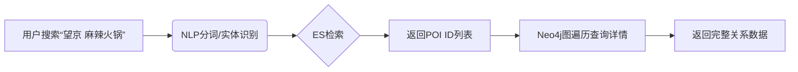
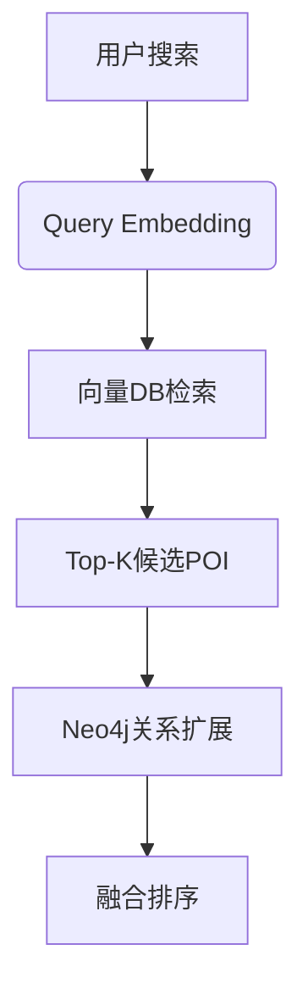
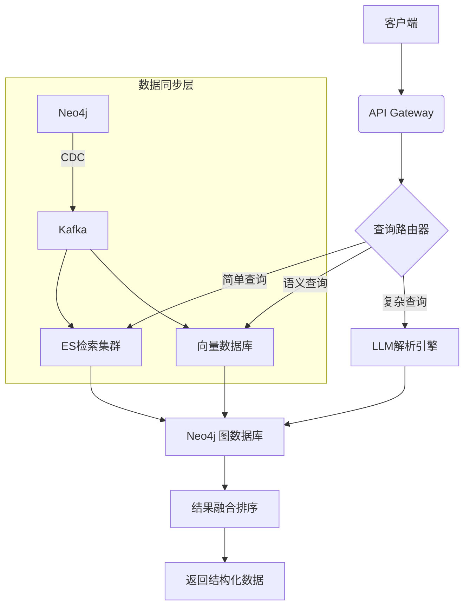

基于图数据库（Neo4j）的美食领域平台系统完整设计方案，结合多种技术路线实现高效检索，分阶段实施并细化关键技术方案：

---

### **一、核心数据模型设计（Neo4j图结构）**
#### **实体定义**
```cypher
// POI节点（商户）
(:POI {
  id: "poi_123",
  name: "望京新荟城海底捞",
  type: "restaurant",
  address: "朝阳区望京街9号",
  geohash: "wx4g0b8",
  rating: 4.8,
  price_level: 3
})

// 菜品节点
(:Dish {
  id: "dish_456",
  name: "麻辣牛油锅底",
  is_signature: true,
  calorie: 320,
  tags: ["麻辣", "招牌"]
})

// 品类节点
(:Category {
  id: "cat_789",
  name: "川渝火锅",
  level: "L2"  // L1:中餐, L2:火锅, L3:川渝火锅
})
```

#### **关系定义**
```cypher
// 基础关系
(POI)-[:SERVES]->(Dish)       // 商户提供菜品
(POI)-[:BELONGS_TO]->(Category) // 商户归属品类
(Dish)-[:CATEGORIZED_AS]->(Category) // 菜品分类

// 扩展关系
(POI)-[:NEAR]->(Transport {type: "地铁站", name: "望京南"})  // 地理位置关联
(User)-[:FAVORITED]->(POI)   // 用户收藏行为
```

---

### **二、分阶段实施方案**
#### **阶段1：ES前置引擎（快速上线）**
**架构图**


**实施步骤：**
1. **数据同步方案**  
   - 使用Neo4j→ES同步插件（如`neo4j-elasticsearch`）
   - 同步策略：
     ```python
     # 增量同步脚本示例
     from neo4j import GraphDatabase
     from elasticsearch import Elasticsearch

     def sync_poi_to_es(poi_id):
         neo4j_query = "MATCH (p:POI)-[r]->(e) WHERE p.id=$id RETURN p, r, e"
         es_doc = {
             "name": poi.name,
             "geohash": poi.geohash,
             "categories": [rel.end_node.name for rel in poi.BELONGS_TO],
             "dishes": [dish.name for dish in poi.SERVES]
         }
         es.index(index="food_poi", id=poi_id, body=es_doc)
     ```

2. **ES索引优化**  
   ```json
   // ES mapping设计
   {
     "settings": {
       "analysis": {
         "synonym_filter": {
           "synonyms_path": "synonyms.txt" // 火锅=hotpot,麻辣=spicy
         }
       }
     },
     "mappings": {
       "properties": {
         "name": { "type": "text_analyzed" },
         "geohash": { "type": "geo_point" },
         "categories": { "type": "keyword" }
       }
     }
   }
   ```

3. **查询示例**  
   ```json
   GET /food_poi/_search
   {
     "query": {
       "bool": {
         "must": [
           { "match": { "categories": "火锅" } },
           { "term": { "name": "望京" } }
         ],
         "filter": {
           "geo_distance": {
             "distance": "5km",
             "geohash": "wx4g0b8" // 用户当前位置
           }
         }
       }
     }
   }
   ```

#### **阶段2：向量数据库语义检索（增强语义理解）**
**架构图**


**实施要点：**
1. **向量化方案**  
   - 模型选型：`text2vec-base-chinese` (轻量级) 或 `bge-large-zh` (高精度)
   - 向量字段：
     ```python
     # 生成POI语义向量
     poi_text = f"{poi.name} {poi.address} {' '.join(poi.categories)}"
     vector = model.encode(poi_text)  # 768维向量
     ```

2. **向量数据库选型**  
   | 数据库    | 优势                  | 适用场景              |
   |----------|---------------------|---------------------|
   | Milvus   | 高性能分布式，支持GPU   | 千万级POI           |
   | Qdrant   | 轻量级，Rust开发       | 百万级数据快速部署    |
   | PGVector | 与PostgreSQL集成       | 已有PG生态场景       |

3. **混合查询示例**  
   ```python
   # 同时执行ES关键词检索和向量检索
   keyword_results = es_search("望京 川菜")
   vector_results = vector_db.search(query_vector, top_k=50)
   
   # 融合策略：加权分数 = 0.6*向量相似度 + 0.3*ES评分 + 0.1*POI热度
   ```

#### **阶段3：LLM智能解析（处理复杂查询）**
**处理流程：**
```
用户输入："望京南站附近适合聚餐的川菜馆，要有包间和招牌鱼"
LLM解析：
  {
    "intent": "poi_search",
    "filters": {
      "location": "望京南站附近",
      "category": "川菜",
      "scene": "聚餐",
      "features": ["包间", "招牌鱼"]
    }
  }
→ 生成Cypher查询：
  MATCH (p:POI)-[:BELONGS_TO]->(:Category {name:"川菜"})
  WHERE p.near_poi = "望京南站" AND p.has_private_room = true
  AND EXISTS ((p)-[:SERVES]->(:Dish {name:"招牌鱼"}))
```

**关键技术：**
1. **LLM选型**  
   - 轻量级：ChatGLM3-6B（本地部署）
   - 云端：GPT-4-Turbo（高精度）

2. **提示词设计**  
   ```text
   你是一个美食知识图谱查询生成器，请将用户query转换为JSON结构：
   - 提取核心实体：POI/菜品/品类/地理位置/特征需求
   - 忽略非关键描述词
   - 若地理位置缺失，使用[user_geo]占位符
   示例输入："国贸附近的粤式早茶"
   输出：{"location":"国贸", "category":"粤式早茶"}
   ```

#### **阶段4：图原生处理（终极优化）**
**Neo4j高级能力利用：**
1. **图神经网络(GNN)推荐**  
   ```cypher
   // 基于用户行为的相似推荐
   MATCH (u:User {id:$user_id})-[:FAVORITED]->(p:POI)
   WITH u, COLLECT(p) AS favs
   UNWIND favs AS p
   MATCH (p)-[:SIMILAR*0..2]-(rec:POI)
   WHERE NOT rec IN favs
   RETURN rec ORDER BY gds.alpha.similarity.cosine(favs, rec) DESC
   ```

2. **实时图遍历查询**  
   ```cypher
   // 查找提供特定菜品的附近商户
   MATCH (d:Dish {name:"毛血旺"})<-[:SERVES]-(p:POI)
   WHERE point.distance(p.location, $user_point) < 5000
   WITH p, COUNT { (p)-[:HAS]->(:Feature {name:"包间"}) } AS has_private_room
   WHERE has_private_room > 0
   RETURN p ORDER BY p.rating DESC
   ```

---

### **三、关键技术决策矩阵**
| **技术**         | **响应延迟** | **开发成本** | **语义理解** | **关系查询** | **适用阶段** |
|------------------|------------|------------|------------|------------|------------|
| ES前置           | 20-50ms     | 低 ★★☆      | 中 ★★☆      | 弱 ★☆☆      | 阶段1 MVP   |
| 向量DB混合检索   | 50-100ms    | 中 ★★★      | 高 ★★★      | 中 ★★☆      | 阶段2 核心  |
| LLM解析          | 200-500ms   | 高 ★★★      | 极高 ★★★★   | 强 ★★★☆     | 阶段3 进阶  |
| Neo4j原生GNN     | 100-300ms   | 极高 ★★★★   | 中 ★★☆      | 极强 ★★★★   | 阶段4 优化  |

---

### **四、完整系统架构**


**关键组件说明：**
1. **查询路由器**  
   - 基于规则决策路由策略：
     ```python
     def route_query(query: str):
         if len(query) < 6:  # 短文本走ES
             return "ES"
         elif has_geo_keywords(query):  # 含地理名词
             return "VectorDB"
         elif contains_complex_intent(query):  # 多条件查询
             return "LLM"
     ```

2. **数据同步保障**  
   - 采用 **双写+校验** 机制：
     ```python
     # Neo4j数据变更时同步写入ES和VectorDB
     def on_poi_update(poi_id):
         neo4j_tx.run("MATCH (p:POI) WHERE id=$id...")
         es_client.update(poi_id, extract_fields(poi))
         vector_db.upsert(poi_id, generate_vector(poi))
         # 校验三方数据一致性
     ```

3. **冷热数据分离**  
   - 热数据：近3个月活跃POI存ES+VectorDB
   - 冷数据：仅存Neo4j，按需加载

---

### **五、演进路线图**
1. **Month 1-2：基础能力建设**  
   - 完成Neo4j数据建模
   - 部署ES并实现数据同步
   - 支持基础关键词检索

2. **Month 3-4：语义能力升级**  
   - 接入向量数据库(Milvus/Qdrant)
   - 实现混合检索排序
   - 构建用户画像模块

3. **Month 5-6：智能解析进阶**  
   - 集成LLM查询解析
   - 实现复杂条件过滤
   - 开发GNN推荐系统

4. **Month 7+：持续优化**  
   - 图神经网络实时推荐
   - 多模态搜索（图片搜菜）
   - 查询效能优化（90%请求<100ms）

通过分阶段实施，可平衡效率与成本：初期用ES快速上线，中期引入向量检索提升体验，后期用图原生计算释放深度关系价值，LLM作为复杂查询的增强通道。