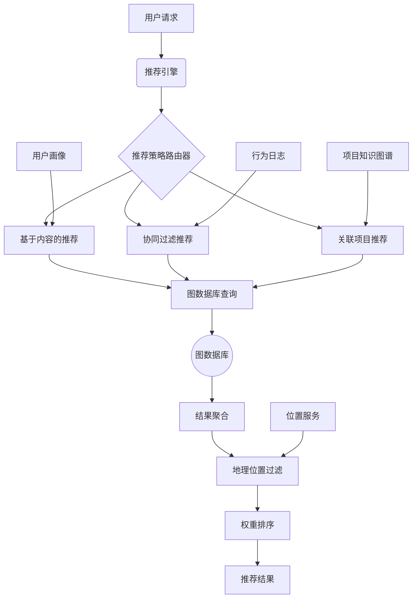
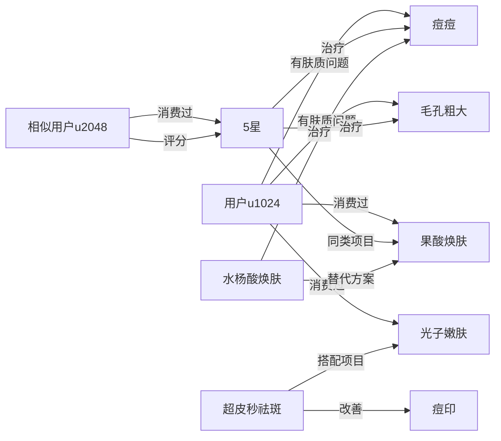

从架构设计、核心算法、图查询实现到可视化展示进行完整说明：

---
### **一、个性化推荐系统架构设计**


---
### **二、核心推荐策略**
#### 1. **基于内容的推荐**（用户画像匹配）
```cypher
// 根据用户肤质问题匹配项目
MATCH (u:User {id: $userId})-[:HAS_SKIN_ISSUE]->(issue)
MATCH (p:Procedure)-[:TREATS]->(issue)
WHERE p.riskLevel < $userRiskThreshold
RETURN p, 
       count(issue) AS matchScore 
ORDER BY matchScore DESC
LIMIT 10
```

#### 2. **协同过滤推荐**（相似用户行为）
```cypher
// 找到相似用户并推荐其高评分项目
MATCH (u:User {id: $userId})-[:HAS_SKIN_ISSUE]->(issue)<-[:HAS_SKIN_ISSUE]-(similar)
WITH similar, count(issue) AS similarity 
ORDER BY similarity DESC 
LIMIT 5

MATCH (similar)-[r:CONSUMED]->(p:Procedure)
WHERE r.rating >= 4.0 AND NOT exists((u)-[:CONSUMED]->(p))
RETURN p, 
       avg(r.rating) AS avgRating, 
       count(similar) AS userCount
ORDER BY userCount DESC, avgRating DESC
```

#### 3. **关联项目推荐**（项目知识图谱）
```cypher
// 基于历史消费的关联项目
MATCH (u:User {id: $userId})-[:CONSUMED]->(hist:Procedure)
MATCH (hist)-[:HAS_COMBO_WITH|:SAME_EFFECT]->(p:Procedure)
WHERE NOT exists((u)-[:CONSUMED]->(p))
RETURN p, 
       count(hist) AS linkStrength,
       CASE 
         WHEN type(r) = 'HAS_COMBO_WITH' THEN 1.5 
         ELSE 1.0 
       END AS weight
ORDER BY weight * linkStrength DESC
```

---
### **三、完整推荐流程实现**
```python
import neo4j
from geopy.distance import geodesic

class MedicalBeautyRecommender:
    def __init__(self, driver):
        self.driver = driver  # Neo4j数据库驱动
        
    def get_recommendations(self, user_id, location, max_results=10):
        # 步骤1：并行执行多策略推荐
        content_based = self._content_based(user_id)
        collaborative = self._collaborative_filtering(user_id)
        associative = self._associative_recommendation(user_id)
        
        # 步骤2：结果聚合与去重
        all_recs = self._aggregate_results(
            content_based, 
            collaborative, 
            associative
        )
        
        # 步骤3：地理位置过滤
        location_filtered = self._filter_by_location(all_recs, location)
        
        # 步骤4：加权排序
        sorted_recs = self._rank_recommendations(
            location_filtered,
            weights={
                'content': 0.4,
                'collab': 0.3,
                'assoc': 0.3
            }
        )
        
        return sorted_recs[:max_results]

    def _filter_by_location(self, recommendations, user_loc, max_km=20):
        """过滤距离用户过远的项目"""
        filtered = []
        for rec in recommendations:
            clinic_loc = (rec['clinic_lat'], rec['clinic_lng'])
            distance = geodesic(user_loc, clinic_loc).km
            if distance <= max_km:
                rec['distance'] = distance
                filtered.append(rec)
        return filtered

    def _rank_recommendations(self, recs, weights):
        """综合评分算法"""
        for rec in recs:
            # 计算加权总分（0-100分）
            content_score = rec.get('content_score', 0) * weights['content']
            collab_score = rec.get('collab_score', 0) * weights['collab']
            assoc_score = rec.get('assoc_score', 0) * weights['assoc']
            
            # 加入距离衰减因子
            distance_penalty = min(1, rec['distance']/20) * 0.2
            
            rec['composite_score'] = 100 * (
                content_score + 
                collab_score + 
                assoc_score
            ) * (1 - distance_penalty)
            
        return sorted(recs, key=lambda x: x['composite_score'], reverse=True)

    # 各策略具体实现（使用Cypher查询）...
```

---
### **四、Demo可视化输出**
#### 用户画像与推荐结果
```json
{
  "user_profile": {
    "id": "u1024",
    "skin_type": "混合肌",
    "issues": ["痘痘", "毛孔粗大"],
    "history": ["果酸焕肤", "光子嫩肤"],
    "location": [31.2304, 121.4737] // 上海坐标
  },
  "recommendations": [
    {
      "procedure_id": "p2048",
      "name": "黄金微针",
      "type": "微创",
      "effect": ["紧致毛孔", "控油祛痘"],
      "match_reason": "解决您的毛孔和痘痘问题",
      "content_score": 92,
      "clinic": "上海美丽人生医疗美容",
      "distance": "3.2km",
      "composite_score": 95.6,
      "price_range": "￥3800-5800"
    },
    {
      "procedure_id": "p3072",
      "name": "超皮秒祛斑",
      "type": "光电",
      "effect": ["祛除痘印", "美白嫩肤"],
      "match_reason": "与您做过的光子嫩肤协同增效",
      "assoc_score": 88,
      "clinic": "上海伊莱美医疗美容医院",
      "distance": "1.8km",
      "composite_score": 91.2,
      "price_range": "￥2800-4500"
    },
    {
      "procedure_id": "p4096",
      "name": "水杨酸焕肤",
      "type": "皮肤管理",
      "effect": ["控油祛痘", "角质调理"],
      "match_reason": "与您相似的客户满意度98%",
      "collab_score": 85,
      "clinic": "上海华美医疗美容",
      "distance": "0.9km",
      "composite_score": 89.3,
      "price_range": "￥880-1500"
    }
  ]
}
```

#### 可视化知识图谱关系


---
### **五、性能优化策略**
1. **实时+离线混合计算**：
   - 实时：用户画像匹配（<100ms）
   - 离线预计算：
     ```cypher
     // 每晚更新项目相似度矩阵
     MATCH (p1:Procedure)
     MATCH (p2:Procedure) WHERE id(p1) < id(p2)
     WITH p1, p2, 
          gds.alpha.similarity.jaccard(
            p1.effects, p2.effects
          ) AS similarity
     MERGE (p1)-[r:SIMILAR_TO]->(p2)
     SET r.score = similarity
     ```

2. **图数据库索引优化**：
   ```cypher
   CREATE INDEX user_skin_index FOR (u:User) ON (u.skinType, u.riskProfile)
   CREATE FULLTEXT INDEX procedure_effects_index FOR (p:Procedure) ON EACH [p.effects]
   ```

3. **缓存策略**：
   ```python
   # 使用Redis缓存热点项目
   def get_recommendations(user_id):
       cache_key = f"recs:{user_id}"
       if cached := redis.get(cache_key):
           return json.loads(cached)
       
       # ...计算推荐结果...
       redis.setex(cache_key, 3600, json.dumps(results))  # 缓存1小时
       return results
   ```

---
### **六、效果评估指标**
| 指标 | 目标值 | 测量方式 |
|------|--------|----------|
| 点击通过率 | >15% | 推荐曝光点击比 |
| 转化率 | >8% | 推荐→预约转化 |
| 多样性得分 | >0.7 | 香农熵指数 |
| 新颖性 | >30% | 用户未见过项目占比 |
| 响应时间 | <500ms | API延迟监控 |

---
**总结**：该推荐系统通过三层策略融合实现精准推荐：
1. **内容匹配**确保项目与用户肤质问题精准对应
2. **协同过滤**利用群体智慧发现新机会
3. **关联推荐**提升客单价和疗程完整性
4. **地理过滤**优化实际可及性

实际部署需结合AB测试持续优化权重参数，建议初始权重分配：
- 新用户：内容匹配(60%) + 地理(40%)
- 老用户：协同(40%) + 关联(30%) + 内容(20%) + 地理(10%)