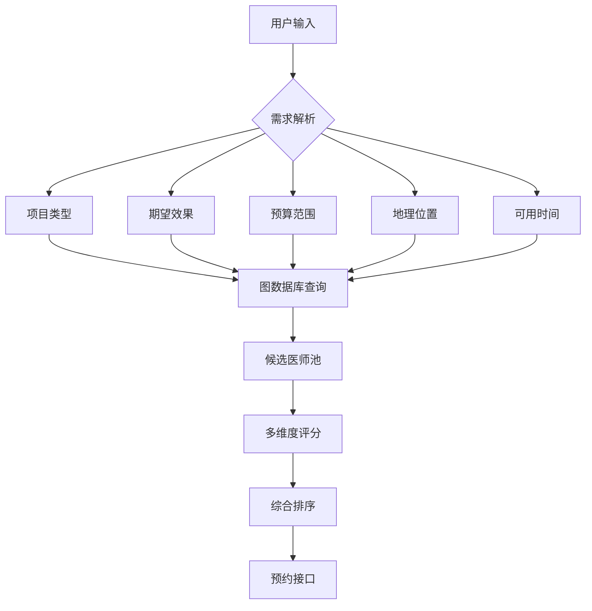
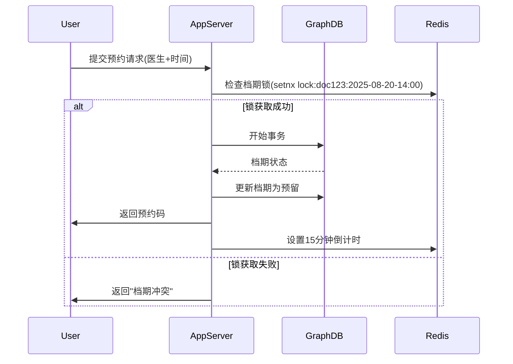
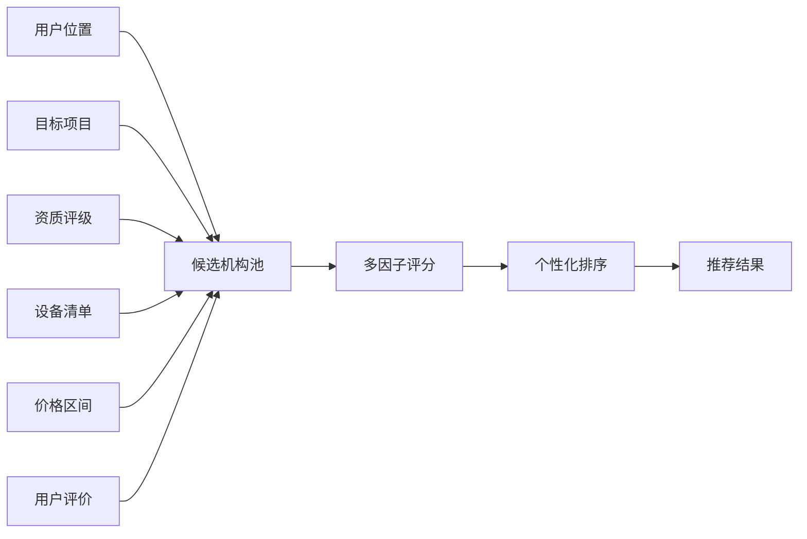
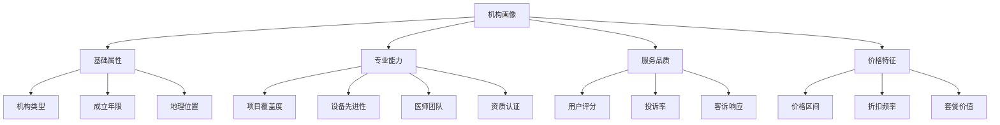

医美推荐系统中的**医师匹配**和**机构推荐**功能进行详细设计，包含算法逻辑、图查询实现、权重分配和实时调度策略：

---

### **一、医师智能匹配系统设计**
#### 目标：根据用户需求精准匹配最合适的医师


#### 核心匹配维度与权重分配：
| 维度 | 权重 | 计算逻辑 | 实时性 |
|------|------|----------|--------|
| 专业匹配度 | 35% | 医师擅长项目与用户需求的Jaccard相似度 | 实时 |
| 效果达成率 | 25% | 历史案例中达成相似效果的比例 | 每日更新 |
| 价格适配度 | 15% | 医师报价与用户预算的契合度 | 实时 |
| 地理位置 | 10% | 医师所在机构与用户的距离 | 实时 |
| 用户评价 | 10% | 加权评分（近期评价权重更高） | 每小时更新 |
| 档期可用性 | 5% | 请求时段的可预约状态 | 实时 |

#### 图数据库查询实现：
```cypher
// 步骤1：基础匹配（项目+效果）
MATCH (u:User {id: $userId})-[:WANTS]->(req:Request)
MATCH (d:Doctor)-[exp:EXPERT_AT]->(p:Procedure)
WHERE p.name = req.procedure 
  AND req.desiredEffect IN exp.achievableEffects
  AND exp.skillLevel >= 7 // 技能阈值

// 步骤2：关联机构位置
MATCH (d)-[:WORKS_AT]->(c:Clinic)-[:LOCATED_IN]->(loc:Location)
WITH d, c, loc, 
     point.distance(u.location, loc.coords) AS distance

// 步骤3：评价数据
OPTIONAL MATCH (d)<-[r:REVIEWED]-()
WITH d, c, distance,
     avg(r.rating) AS avgRating,
     count(r) AS reviewCount

// 步骤4：档期检查
OPTIONAL MATCH (d)-[s:SCHEDULE]->(t:TimeSlot)
WHERE t.startTime = $selectedTime AND t.status = 'available'

// 步骤5：价格适配计算
WITH d, c, distance, avgRating, reviewCount,
     CASE 
        WHEN $budgetMin <= d.basePrice <= $budgetMax THEN 1.0
        WHEN d.basePrice < $budgetMin THEN 0.8 * (1 - ($budgetMin - d.basePrice)/$budgetMin)
        ELSE 0.7 * (1 - (d.basePrice - $budgetMax)/$budgetMax)
     END AS priceFit,
     CASE WHEN t IS NOT NULL THEN 1 ELSE 0 END AS slotAvailable

// 步骤6：综合评分
RETURN d.id AS doctorId,
       d.name AS doctorName,
       c.name AS clinicName,
       distance,
       (0.35 * exp.skillLevel/10.0) +
       (0.25 * exp.successRate) +
       (0.15 * priceFit) +
       (0.10 * (1 - distance/50.0)) + // 50km最大距离
       (0.10 * (avgRating*0.2 + reviewCount*0.01)) +
       (0.05 * slotAvailable) AS matchScore
ORDER BY matchScore DESC
LIMIT 10
```

#### 动态权重调整策略：
```python
def adjust_weights(user_type, procedure_risk):
    """根据用户类型和项目风险动态调整权重"""
    base_weights = {
        'expertise': 0.35,
        'effect': 0.25,
        'price': 0.15,
        'location': 0.10,
        'reviews': 0.10,
        'schedule': 0.05
    }
    
    # 高风险项目侧重专业资质
    if procedure_risk > 7:  # 整形手术等高风险
        base_weights['expertise'] = min(0.55, base_weights['expertise'] * 1.6)
        base_weights['price'] *= 0.7
    
    # 新用户侧重评价和地理位置
    if user_type == 'new':
        base_weights['reviews'] = min(0.25, base_weights['reviews'] * 1.8)
        base_weights['location'] = min(0.20, base_weights['location'] * 1.5)
    
    # 老用户侧重效果达成率
    elif user_type == 'returning':
        base_weights['effect'] = min(0.40, base_weights['effect'] * 1.6)
    
    # 标准化权重
    total = sum(base_weights.values())
    return {k: v/total for k,v in base_weights.items()}
```

#### 实时档期管理架构：


---

### **二、机构智能推荐系统设计**
#### 目标：基于多维因素推荐最适合的医美机构


#### 推荐因子与数据源：
| 因子 | 权重 | 数据源 | 更新频率 |
|------|------|--------|----------|
| 项目匹配度 | 30% | 机构服务项目表 | 实时 |
| 资质认证 | 25% | 卫健委/卫生局 | 每月 |
| 设备先进性 | 20% | 设备管理系统 | 每日 |
| 价格竞争力 | 15% | 价格监测系统 | 实时 |
| 用户满意度 | 10% | 评价系统 | 每小时 |

#### 图查询实现（含路径分析）：
```cypher
// 路径1：项目执行能力
MATCH (c:Clinic)-[offers:OFFERS]->(p:Procedure {name: $targetProcedure})
WHERE offers.available = true

// 路径2：设备支持
OPTIONAL MATCH (c)-[:HAS_EQUIPMENT]->(e:Equipment)
WHERE e.requiredFor = $targetProcedure
WITH c, offers, 
     count(e) AS equipmentCount,
     avg(e.techLevel) AS avgTechLevel

// 路径3：医师资源
MATCH (c)<-[:WORKS_AT]-(d:Doctor)-[:EXPERT_AT]->(p)
WITH c, offers, equipmentCount, avgTechLevel,
     count(d) AS expertCount,
     avg(d.skillLevel) AS avgSkill

// 路径4：机构资质
MATCH (c)-[:CERTIFIED_BY]->(cert:Certification)
WITH c, offers, equipmentCount, avgTechLevel, expertCount, avgSkill,
     sum(cert.weight) AS certScore

// 路径5：用户评价（含情感分析）
MATCH (c)<-[r:REVIEWED]-()
WITH c, offers, equipmentCount, avgTechLevel, expertCount, avgSkill, certScore,
     avg(r.rating) AS avgRating,
     count(r) AS reviewCount,
     sum(CASE WHEN r.sentiment > 0.7 THEN 1 ELSE 0 END) AS positiveReviews

// 路径6：地理位置
MATCH (c)-[:LOCATED_IN]->(l:Location)
WITH c, offers, equipmentCount, avgTechLevel, expertCount, avgSkill, certScore,
     avgRating, reviewCount, positiveReviews,
     point.distance($userLocation, l.coords) AS distance

// 综合评分
RETURN c.id AS clinicId,
       c.name AS clinicName,
       offers.price AS procedurePrice,
       distance,
       (0.30 * (offers.capabilityScore/10.0)) + 
       (0.25 * (certScore/100.0)) +
       (0.20 * (0.6*(CASE WHEN equipmentCount>0 THEN 1 ELSE 0 END) + 
                0.4*(avgTechLevel/10.0))) +
       (0.15 * (1.0 - |offers.price - $avgMarketPrice|/$avgMarketPrice)) +
       (0.10 * (0.6*avgRating/5.0 + 0.4*(positiveReviews/reviewCount))) 
       AS recommendationScore
ORDER BY recommendationScore DESC
LIMIT 5
```

#### 价格竞争力算法：
```python
def calculate_price_score(clinic_price, market_data):
    """计算机构价格竞争力"""
    avg_market = market_data['avg']
    std_dev = market_data['std']
    
    # 基础分：与均价的偏离度
    base_score = max(0, 1 - abs(clinic_price - avg_market)/(3*std_dev))
    
    # 折扣加成：近期优惠活动
    discount_boost = 0
    if clinic_price < avg_market * 0.9:
        discount_boost = min(0.15, (avg_market - clinic_price)/avg_market)
    
    # 高端溢价惩罚：超出合理范围
    premium_penalty = 0
    if clinic_price > avg_market * 1.5:
        premium_penalty = min(0.3, (clinic_price - avg_market*1.5)/avg_market)
    
    return min(1.0, max(0, base_score + discount_boost - premium_penalty))
```

#### 机构画像标签体系：


---

### **三、系统Demo输出**
#### 医师匹配结果示例：
```json
{
  "request": {
    "procedure": "鼻综合整形",
    "desired_effect": "自然微翘",
    "budget": [28000, 45000],
    "location": [31.2304, 121.4737],
    "preferred_time": "2025-08-20 14:00"
  },
  "recommendations": [
    {
      "doctor_id": "DR-1028",
      "name": "王明阳",
      "title": "鼻整形首席专家",
      "hospital": "上海华美医疗美容医院",
      "distance_km": 3.2,
      "match_score": 94.5,
      "score_details": {
        "expertise": 98.2,
        "effect_success": 95.7,
        "price_fit": 92.0,
        "location": 93.8,
        "reviews": 90.4,
        "schedule": 100.0
      },
      "price_quote": 38800,
      "available_slots": ["2025-08-20 14:00", "2025-08-21 10:30"]
    },
    {
      "doctor_id": "DR-2043",
      "name": "陈立",
      "title": "副主任医师",
      "hospital": "上海伊莱美医疗美容",
      "distance_km": 1.8,
      "match_score": 89.7,
      "price_quote": 32800,
      "available_slots": ["2025-08-20 15:30"]
    }
  ]
}
```

#### 机构推荐结果示例：
```json
{
  "target_procedure": "热玛吉第五代",
  "user_location": [31.2304, 121.4737],
  "recommendations": [
    {
      "clinic_id": "CL-2056",
      "name": "上海薇琳医疗美容医院",
      "rating": 4.8,
      "price": 15800,
      "distance_km": 2.1,
      "recommend_score": 92.3,
      "strengths": [
        "正版Thermage FLX设备",
        "卫健委认证5A级机构",
        "三年零事故记录",
        "本月优惠价13800"
      ],
      "equipment": ["Thermage FLX 2025", "超声炮2.0"],
      "certifications": ["JCI认证", "5A医美机构"]
    },
    {
      "clinic_id": "CL-3097",
      "name": "上海玫瑰医疗美容",
      "rating": 4.6,
      "price": 12800,
      "distance_km": 4.3,
      "recommend_score": 87.4,
      "strengths": [
        "性价比套餐",
        "交通便利",
        "独立VIP治疗室"
      ]
    }
  ],
  "market_price_range": [12000, 19800]
}
```

---

### **四、性能优化策略**
1. **多级缓存体系**：
   ```mermaid
   graph LR
     A[请求] --> B[CDN缓存静态结果]
     B --> C[Redis缓存]
     C --> D[图数据库]
     D --> E[原始数据源]
   ```
   - L1：热点机构/医师数据缓存（TTL 5分钟）
   - L2：地理围栏预计算（城市级机构列表）
   - L3：个性化结果缓存（用户ID+请求参数签名）

2. **实时数据更新管道**：
   ```python
   # 档期变更监听器
   def schedule_change_listener():
       redis_pubsub.subscribe('schedule_updates')
       while True:
           message = redis_pubsub.get_message()
           if message:
               update_graphdb(message['doctor_id'], 
                             message['time_slot'],
                             message['new_status'])
               # 清除相关缓存
               redis.delete(f"doc_availability:{message['doctor_id']}")
   ```

3. **查询优化技术**：
   - 图遍历剪枝：限制最大路径长度（maxHops=3）
   - 并行查询：多维度评分独立计算
   - 预聚合：医师能力分每日预计算

---

### **五、安全与合规设计**
1. **隐私保护**：
   - 医师位置模糊处理（只显示机构坐标）
   - 用户敏感数据脱敏（OpenID代替用户ID）
   - 查询结果审计日志

2. **合规检查**：
   ```python
   def compliance_check(doctor_id, procedure):
       # 验证医师执业范围
       if not graph.run("""
           MATCH (d:Doctor {id: $id})-[:LICENSED_FOR]->(p:Procedure)
           WHERE p.name = $procedure RETURN count(*)
           """, id=doctor_id, procedure=procedure).single()[0] > 0:
           raise ComplianceException("医师未授权执行该项目")
       
       # 验证设备许可证
       if procedure in ['热玛吉','超声刀']:
           if not check_device_license(doctor_id, procedure):
               raise ComplianceException("设备未备案")
   ```

3. **敏感词过滤**：
   ```python
   def filter_review_content(text):
       with open('medical_blocked_terms.txt') as f:
           blocked_terms = [line.strip() for line in f]
       
       for term in blocked_terms:
           if term in text.lower():
               return False, "包含违规内容"
       return True, text
   ```

---

### **六、效果评估指标**
| 指标 | 计算方式 | 目标值 |
|------|----------|--------|
| 医师匹配点击率 | 推荐医师详情页点击/曝光 | >28% |
| 机构到店转化率 | 预约后实际到店数/推荐量 | >18% |
| 档期预约成功率 | 成功预约数/尝试预约数 | >85% |
| 推荐满意度 | 用户评分≥4星的比例 | >90% |
| 响应延迟 | P99查询延迟 | <300ms |

该设计通过多维度实时计算和动态权重调整，在确保医疗合规性的前提下，实现了个性化精准推荐，可有效提升用户转化率和医疗资源利用率。