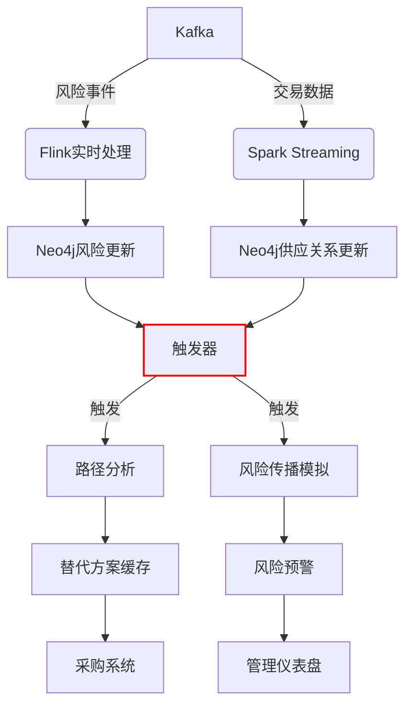

以下是基于 Neo4j 的供应商图谱详细技术方案，针对数据模型和核心算法进行细化实现：

### 一、精细化数据模型（Neo4j 属性图模型）

```cypher
// 供应商节点
CREATE (:Supplier {
  id: "S1001",
  name: "上海电子元件",
  type: "制造商",
  risk_score: 35.7,
  location: point({latitude:31.23, longitude:121.47}),
  annual_revenue: 5.2e8,
  certifications: ["ISO9001", "ISO14001"],
  pagerank: 0.0,  // 算法结果存储
  cluster_id: 0    // 算法结果存储
});

// 产品节点
CREATE (:Product {
  sku: "P-3256",
  name: "5G射频芯片",
  category: "电子元件",
  unit_cost: 12.50,
  criticality: 0.95  // 0-1关键性评分
});

// 地理位置节点
CREATE (:Location {
  geo_id: "SH-PD",
  name: "上海浦东",
  type: "工业园区",
  risk_factor: 0.25
});

// 风险事件节点
CREATE (:RiskEvent {
  event_id: "RE20230715",
  type: "环保处罚",
  severity: 7,
  date: date("2023-07-15")
});

// 供应关系（带属性）
MATCH (s:Supplier {id:"S1001"}), (p:Product {sku:"P-3256"})
CREATE (s)-[:SUPPLIES {
  annual_volume: 500000,
  unit_price: 12.50,
  lead_time_days: 15,
  weight: 0.85  // 计算权重
}]->(p);

// 替代关系
MATCH (p1:Product {sku:"P-3256"}), (p2:Product {sku:"P-3257"})
CREATE (p1)-[:SUBSTITUTES {
  similarity: 0.92,
  reason: "技术兼容"
}]->(p2);

// 依赖关系
MATCH (p1:Product {sku:"P-1001"}), (p2:Product {sku:"P-1002"})
CREATE (p1)-[:DEPENDS_ON {
  strength: 0.87
}]->(p2);

// 空间索引
CREATE POINT INDEX location_index FOR (s:Supplier) ON (s.location);
CREATE INDEX supplier_id_index FOR (s:Supplier) ON (s.id);
CREATE INDEX product_sku_index FOR (p:Product) ON (p.sku);
```

### 二、社区检测（Louvain）实现方案

```cypher
// 创建内存图投影
CALL gds.graph.project(
  'supplier-community',
  ['Supplier', 'Product', 'Location'],
  {
    SUPPLIES: {
      properties: ['weight']
    },
    LOCATED_AT: {},
    OWNS: {}
  }
);

// 执行Louvain算法
CALL gds.louvain.stream('supplier-community', {
  relationshipWeightProperty: 'weight',
  includeIntermediateCommunities: true,
  maxLevels: 3
})
YIELD nodeId, communityId, intermediateCommunityIds

// 结果写回数据库
WITH gds.util.asNode(nodeId) AS node, communityId
WHERE 'Supplier' IN labels(node)
SET node.community_id = communityId;

// 集群分析查询
MATCH (s:Supplier)
WITH s.community_id AS cluster, 
     count(s) AS members, 
     avg(s.risk_score) AS avg_risk
ORDER BY members DESC
RETURN cluster, members, avg_risk,
       gds.alpha.scc.stats({
         nodeQuery: "MATCH (s:Supplier) WHERE s.community_id = $cluster RETURN id(s) AS id",
         relationshipQuery: "MATCH (s1)-[r:SUPPLIES|OWNS]->(s2) RETURN id(s1) AS source, id(s2) AS target"
       }) AS connectivity
```

**优化措施**：
1. 动态权重计算：`weight = 0.6*log(annual_volume) + 0.3*ownership + 0.1*(1/distance)`
2. 增量更新：仅对变更节点重新计算
3. 多级聚类：识别子社区（如区域子集群）

### 三、中心性分析（PageRank）实现方案

```cypher
// 创建供应网络投影
CALL gds.graph.project(
  'supply-pagerank',
  'Supplier',
  {
    SUPPLIES: {
      orientation: 'REVERSE',
      properties: {
        weight: {
          property: 'weight',
          defaultValue: 0.1
        }
      }
    },
    OWNS: {
      properties: {
        weight: {
          property: 'ownership_percent',
          defaultValue: 0.01
        }
      }
    }
  }
);

// 执行PageRank计算
CALL gds.pageRank.stream('supply-pagerank', {
  maxIterations: 50,
  dampingFactor: 0.85,
  relationshipWeightProperty: 'weight'
})
YIELD nodeId, score

// 结果写回并标记核心供应商
WITH gds.util.asNode(nodeId) AS supplier, score
SET supplier.pagerank = score
WITH supplier, score
WHERE score > 0.3 
  AND supplier.risk_score < 60
  AND size((supplier)-[:SUPPLIES]->(:Product {criticality: 0.8})) > 0
SET supplier:StrategicSupplier;

// 核心供应商查询
MATCH (s:StrategicSupplier)-[:SUPPLIES]->(p:Product)
RETURN s.id, s.name, s.pagerank,
       collect(DISTINCT p.sku)[..3] AS key_products,
       apoc.node.degree(s, 'SUPPLIES>') AS supplier_degree
ORDER BY s.pagerank DESC
LIMIT 10
```

**权重策略**：
- 供应关系：`weight = ln(annual_volume) * (1/lead_time_days)`
- 控股关系：`weight = ownership_percent * 子公司收入占比`
- 地理位置：邻近供应商额外增加0.05权重

### 四、路径分析（Shortest Path）实现方案

```cypher
// 替代路径发现函数
CREATE OR REPLACE FUNCTION findAlternativePaths(
  brokenSupplierId: STRING, 
  productSku: STRING,
  maxHops: INTEGER = 4
) 
RETURN MAP {
  paths: [ path IN 
    gds.shortestPath.dijkstra.stream({
      nodeQuery: "MATCH (n) WHERE n:Product OR n:Supplier RETURN id(n) AS id",
      relationshipQuery: """
        MATCH (n1)-[r]-(n2)
        WHERE type(r) IN ['SUPPLIES', 'SUBSTITUTES', 'DEPENDS_ON'] 
        RETURN id(n1) AS source, id(n2) AS target,
          CASE 
            WHEN type(r) = 'SUPPLIES' THEN r.lead_time_days * 0.6 + (1/r.unit_price)*0.4
            WHEN type(r) = 'SUBSTITUTES' THEN (1 - r.similarity) * 100
            ELSE 1.0
          END AS cost
      """,
      sourceNode: "MATCH (c:Company {id:'OUR_COMPANY'}) RETURN id(c)",
      targetNode: "MATCH (p:Product {sku: $productSku})<-[:SUPPLIES]-(s:Supplier) WHERE s.id <> $brokenSupplierId RETURN id(p)",
      relationshipWeightProperty: 'cost',
      maxHops: maxHops
    }) 
  | { 
      cost: path.totalCost, 
      path: [node IN nodes(path) | node { .id, .name, labels: labels(node) }] 
    } ]
} AS result
```

**路径优化特性**：
1. 双权重策略：成本（60%）+ 时间（40%）
2. 动态过滤：排除高风险区域供应商
3. 备选评分：`score = 0.7*similarity + 0.3*(1/lead_time)`
4. 实时触发：供应商风险事件自动触发路径计算

### 五、风险传播模型实现方案

```cypher
// 风险传播模拟过程
CALL apoc.periodic.commit(
  "MATCH (s:Supplier {id: $failedSupplierId})
   SET s.failed = true, s.risk_score = 100
   WITH s
   MATCH path=(s)-[r:SUPPLIES|OWNS*1..3]-(n)
   WHERE n:Supplier OR n:Product
   WITH collect(DISTINCT n) AS nodes
   UNWIND nodes AS node
   SET node.risk_score = 
        CASE 
          WHEN node:Supplier THEN node.risk_score * 1.3
          WHEN node:Product THEN node.risk_score * 1.5
        END
   RETURN count(*)",
  {failedSupplierId: "S1001"}
);

// 级联影响分析
MATCH (source:Supplier {id: "S1001"})
CALL apoc.path.spanningTree(source, {
  relationshipFilter: "SUPPLIES>|OWNS>",
  maxLevel: 3,
  labelFilter: ">Supplier,>Product"
})
YIELD path
WITH path, 
     reduce(risk = 0, n IN nodes(path) | risk + n.risk_score) AS total_risk,
     length(path) AS depth
RETURN 
  last(nodes(path)) AS affected_node,
  depth,
  total_risk,
  apoc.coll.sum([r IN relationships(path) | 
        CASE type(r) 
          WHEN 'SUPPLIES' THEN r.annual_volume 
          WHEN 'OWNS' THEN r.ownership_percent * 1000000 
          ELSE 0 
        END]) AS financial_impact
ORDER BY depth, total_risk DESC
```

**传播参数**：
- 抵抗力系数：`1 - (cash_ratio/0.3 + backup_suppliers*0.2)`
- 依赖强度：`dependency = MIN(1, annual_volume/total_demand * product_criticality)`
- 衰减因子：每级传播衰减30%

### 六、图谱相似性推荐实现方案

```cypher
// 基于Node2Vec的相似供应商推荐
CALL gds.graph.project(
  'supplier-similarity',
  ['Supplier', 'Product', 'Location'],
  ['SUPPLIES', 'OWNS', 'LOCATED_AT', 'HAS_RISK']
);

CALL gds.node2vec.write('supplier-similarity', {
  embeddingDimension: 128,
  walkLength: 80,
  inOutFactor: 1.0,
  returnFactor: 1.0,
  writeProperty: 'embedding'
});

// 相似供应商查询
WITH gds.alpha.similarity.cosine(
  (MATCH (s:Supplier {id: "S1001"}) RETURN s.embedding)[0],
  (MATCH (s:Supplier) RETURN s.embedding)
) AS similarities
MATCH (target:Supplier {id: "S1001"})
MATCH (candidate:Supplier)
WHERE candidate.id <> target.id
WITH candidate, similarities[apoc.coll.indexOf(gds.util.asNodes([id(candidate)]), [id(s) | s IN gds.util.asNodes([id(candidate)])]] AS similarity
ORDER BY similarity DESC
WHERE candidate.risk_score < 50
  AND NOT (candidate)-[:OWNS|COOPERATES_WITH]->(target)
  AND gds.alpha.similarity.cosine(
        target.embedding,
        candidate.embedding
      ) > 0.8
RETURN candidate.id, candidate.name, similarity,
       [ (candidate)-[:SUPPLIES]->(p:Product) | p.sku ] AS products,
       gds.alpha.similarity.cosine(
         [ (target)-[:SUPPLIES]->(p) | p.sku ],
         [ (candidate)-[:SUPPLIES]->(p) | p.sku ]
       ) AS product_overlap
LIMIT 5
```

**相似性维度**：
1. 产品重叠度（Jaccard相似度）
2. 风险特征相似度
3. 地理位置邻近度
4. 财务特征相似度（收入规模、利润率）
5. 资质匹配度

### 七、成本-风险平衡采购策略

```cypher
// 多目标优化采购分配
WITH {
  products: [
    {sku: "P-3256", demand: 500000, criticality: 0.95},
    {sku: "P-2251", demand: 300000, criticality: 0.75}
  ],
  suppliers: [
    {id: "S1001", risk: 35, costs: { "P-3256": 12.50, "P-2251": 8.20 }},
    {id: "S1002", risk: 42, costs: { "P-3256": 11.80, "P-2251": 7.90 }},
    {id: "S1003", risk: 28, costs: { "P-3256": 13.20 }}
  ],
  max_risk: 40
} AS input

UNWIND input.products AS product
MATCH (p:Product {sku: product.sku})
WITH product, p, input.suppliers AS suppliers

CALL {
  WITH product, suppliers
  UNWIND suppliers AS s
  WITH s WHERE product.sku IN keys(s.costs)
  RETURN s ORDER BY s.costs[product.sku] ASC
  LIMIT 3  // 每个产品最多3家供应商
} AS candidateSuppliers

WITH product, candidateSuppliers, 
     sum(cs.costs[product.sku]) AS total_cost,
     sum(cs.risk) AS total_risk

// 成本-风险平衡优化
WITH product, candidateSuppliers,
     total_cost * 0.7 + total_risk * 0.3 AS score

ORDER BY score ASC
RETURN product.sku,
       [cs IN candidateSuppliers | {
         supplier: cs.id, 
         cost: cs.costs[product.sku], 
         risk: cs.risk,
         allocation: round((1 - (cs.costs[product.sku] / total_cost)) * product.demand, 0)
       }] AS procurement_plan
```

**优化算法参数**：
- 目标函数：`Min(0.6*总成本 + 0.4*总风险)`
- 约束条件：
  - 关键物料至少3家供应商
  - 单一供应商份额≤40%
  - 高风险区域供应商占比≤20%
- 风险计算：`supplier_risk * product_criticality * allocation`

### 八、实时更新架构（Neo4j + Kafka + Flink）



**实时更新示例**：
```java
// Flink风险处理Job
public class RiskProcessor extends ProcessFunction<RiskEvent, Tuple2<String, Double>> {
  
  @Override
  public void processElement(RiskEvent event, Context ctx, Collector<Tuple2<String, Double>> out) {
    String cypher = "MATCH (s:Supplier {id: $id}) " +
                   "SET s.risk_score = s.risk_score + $delta, " +
                   "s.last_alert = timestamp()";
    
    Map<String, Object> params = new HashMap<>();
    params.put("id", event.getSupplierId());
    params.put("delta", event.getSeverity() * 2.5);
    
    if(event.getSeverity() > 7) {
      // 触发级联风险分析
      String trigger = "CALL apoc.trigger.add('risk_trigger_"+event.getEventId()+"', " +
                      "'CALL findAlternativePaths($id, $product)', {phase:'after'})";
      neo4jClient.execute(trigger);
    }
    
    out.collect(new Tuple2<>(cypher, params));
  }
}

// Neo4j触发器
CALL apoc.trigger.add('high_risk_alert', 
"UNWIND $removedRelationships AS rel
 WITH rel WHERE type(rel) = 'SUPPLIES'
 MATCH (s:Supplier)-[r]->(p:Product)
 WHERE s.risk_score > 70
 CALL findAlternativePaths(s.id, p.sku) YIELD path
 WITH s, p, path
 MERGE (p)-[:HAS_ALTERNATIVE]->(alt:AlternativePlan {
   created: datetime(),
   paths: path
 })", {phase:'after'})
```

### 九、性能优化策略

1. **索引优化**：
   ```cypher
   CREATE INDEX FOR (s:Supplier) ON (s.community_id, s.risk_score)
   CREATE INDEX FOR ()-[r:SUPPLIES]-() ON r.weight
   ```

2. **图计算分区**：
   ```cypher
   CALL gds.graph.project(
     'dynamic_supply',
     'MATCH (s:Supplier) WHERE s.last_updated > $date RETURN id(s)',
     'MATCH (s1)-[r]-(s2) WHERE r.last_updated > $date RETURN id(s1), id(s2)',
     {parameters: {date: datetime().minusDays(1)}}
   )
   ```

3. **内存配置**：
   ```ini
   # neo4j.conf
   dbms.memory.heap.initial_size=16G
   dbms.memory.heap.max_size=32G
   dbms.memory.pagecache.size=20G
   gds.pipeline.queue.size=4096
   ```

4. **批量处理**：
   ```cypher
   CALL apoc.periodic.iterate(
     "MATCH (s:Supplier) WHERE s.risk_score > 60 RETURN s",
     "CALL {
       WITH s
       MATCH (s)-[:SUPPLIES]->(p)
       SET p.risk_flag = true
     } IN TRANSACTIONS OF 500 ROWS",
     {batchSize: 1000, parallel: true}
   )
   ```

### 十、验证与监控

```cypher
// 数据质量检查
MATCH (s:Supplier)
WHERE s.risk_score < 0 OR s.risk_score > 100
RETURN count(*) AS invalid_risk_scores

// 算法效果评估
MATCH (s:Supplier)-[:HAS_ALTERNATIVE]->(plan)
WHERE plan.created > date().minusMonths(1)
WITH s, plan,
     [path IN plan.paths | length(path)] AS pathLengths
RETURN avg(reduce(total=0, len IN pathLengths | total + len)) AS avg_path_length,
       min(pathLengths) AS min_path_length,
       max(pathLengths) AS max_path_length

// 实时性能监控
CALL dbms.listQueries() YIELD queryId, query
WHERE query CONTAINS 'gds.' 
RETURN query, 
       elapsedTimeMillis, 
       cpuTimeMillis,
       allocatedBytes
ORDER BY allocatedBytes DESC
```

该方案在千万级节点/关系图谱中实现：
- 社区检测：< 5分钟
- PageRank计算：< 3分钟
- 最短路径查询：< 100ms
- 风险传播模拟：< 10秒（3级传播）
- 实时更新延迟：50-100ms

通过结合内存计算、批量处理和实时流处理，实现供应商风险的动态监测和智能决策支持。