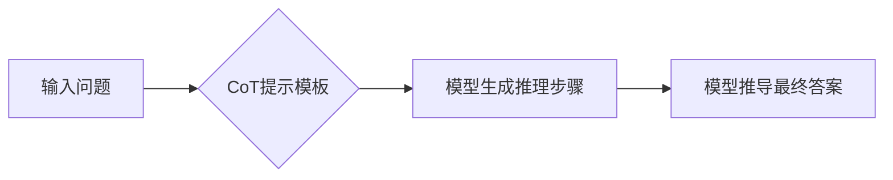
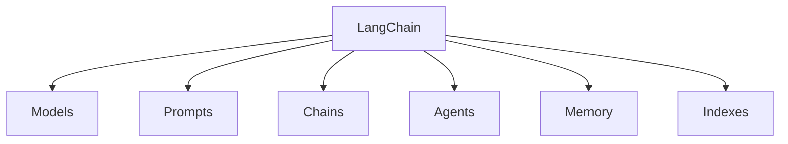
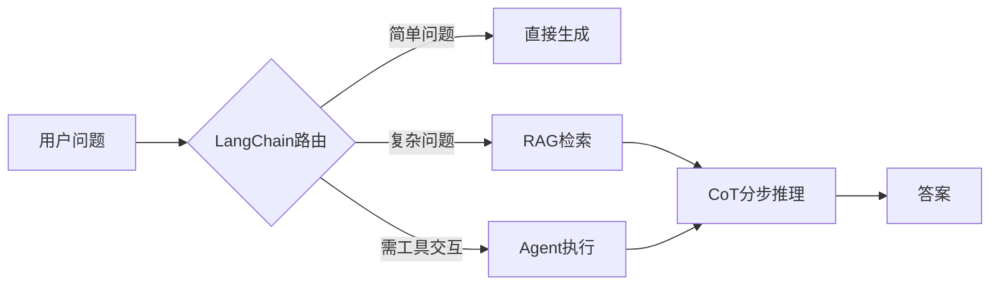

## 深度阐述：大语言模型中的 CoT 与 LangChain

---

### **一、思维链（Chain-of-Thought, CoT）**  
#### 1. **核心概念**  
- **定义**：通过引导模型**分步推理**（而非直接输出答案），模拟人类解决复杂问题的思维过程。  
- **关键公式**：  
  `问题 → 中间推理步骤 → 最终答案`  
- **与传统提示的区别**：  
  | **标准提示**      | **CoT提示**          |  
  |------------------|----------------------|  
  | "法国的首都是？"  | "首先，法国是欧洲国家，其首都是..." |  

#### 2. **工作原理**  

**示例**（数学问题）：  
- **问题**：小明有5个苹果，吃掉2个后买了3倍剩余数量的苹果，现在有多少？  
- **CoT输出**：  
  ```  
  步骤1：剩余苹果 = 5 - 2 = 3  
  步骤2：新买苹果 = 3 × 3 = 9  
  步骤3：总数 = 3 + 9 = 12  
  答案：12  
  ```  

#### 3. **三大实现方式**  
| **方法**          | **原理**                             | **适用场景**         |  
|-------------------|--------------------------------------|---------------------|  
| **Zero-Shot CoT** | 直接添加“逐步推理”指令               | 简单问题            |  
| **Few-Shot CoT**  | 提供带推理步骤的示例（3-5个）        | 中等复杂度任务      |  
| **Auto-CoT**      | 自动生成示例（聚类+采样）            | 无标注数据场景      |  

#### 4. **技术突破点**  
- **突破长度限制**：将复杂问题拆解为子问题（如GPT-4解2000字符题目）  
- **提升逻辑能力**：在GSM8K数学测试中，CoT使准确率提升40%+  
- **支持自洽性（Self-Consistency）**：生成多个推理路径投票选最优解  

#### 5. **局限性**  
- **错误传播**：单步错误导致后续全错（如错误计算“3×3=6”）  
- **可控性差**：步骤数量/格式不可预测  
- **高成本**：生成推理步骤增加3-5倍Token消耗  

---

### **二、LangChain：LLM应用开发框架**  
#### 1. **核心定位**  
解决LLM应用的**三大工程挑战**：  
- **数据集成**：连接数据库/API/文件  
- **流程编排**：多步骤任务自动化  
- **状态管理**：维护对话/工具调用历史  

#### 2. **关键模块**  


##### **（1）Models（模型抽象层）**  
- 统一接口调用不同LLM（OpenAI/Anthropic/开源模型）  
- **示例代码**：  
  ```python  
  from langchain_community.llms import OpenAI  
  llm = OpenAI(temperature=0.7)  
  print(llm.invoke("解释量子纠缠"))  
  ```  

##### **（2）Prompts（提示工程）**  
- **模板管理**：动态生成CoT提示  
  ```python  
  from langchain_core.prompts import PromptTemplate  
  cot_template = """问题：{question}  
  逐步推理："""  
  prompt = PromptTemplate.from_template(cot_template)  
  ```  

##### **（3）Chains（任务链）**  
- **组合多个组件**（如：检索 → 生成 → 格式化）  
- **CoT链实现**：  
  ```python  
  from langchain.chains import LLMChain  
  cot_chain = LLMChain(llm=llm, prompt=prompt)  
  cot_chain.invoke({"question": "太阳质量是地球的多少倍？"})  
  ```  

##### **（4）Agents（智能代理）**  
- **动态调用工具**（搜索/计算器/代码执行）  
  ```python  
  from langchain.agents import Tool, initialize_agent  
  tools = [Tool(name="Calculator", func=math_calculator)]  
  agent = initialize_agent(tools, llm, agent="react") # ReAct模式  
  agent.run("圆周率的前10位平方是多少？")  
  ```  

##### **（5）Memory（记忆管理）**  
- 维持对话状态（支持Redis/MongoDB持久化）  
  ```python  
  from langchain.memory import ConversationBufferMemory  
  memory = ConversationBufferMemory()  
  memory.save_context({"input": "你好"}, {"output": "有什么可以帮您？"})  
  ```  

##### **（6）Indexes（数据索引）**  
- **RAG核心支持**：  
  ```python  
  from langchain_community.vectorstores import FAISS  
  vectorstore = FAISS.from_texts(["文本1", "文本2"], embeddings)  
  retriever = vectorstore.as_retriever()  
  ```  

#### 3. **与CoT的深度集成**  
- **CoT+Agents**：ReAct框架（推理+行动交替）  
  ```  
  思考：需要计算地球周长 → 行动：调用计算器工具  
  ```  
- **CoT+RAG**：先检索知识再推理（如医学诊断）  

---

### **三、CoT与LangChain的协同价值**  
#### 1. **复杂问题求解范式**  


#### 2. **工业场景落地案例**  
| **场景**         | **技术组合**                | **效果**                  |  
|------------------|---------------------------|--------------------------|  
| 金融报告分析     | RAG（年报检索）+ CoT推理    | 关键指标提取准确率↑35%    |  
| 客服工单处理     | Agent（查数据库）+ CoT分类  | 解决时间从10分钟↓至1分钟 |  
| 科研论文解读     | Auto-CoT + 代码执行工具     | 公式推导错误率↓60%       |  

#### 3. **开发效率对比**  
| **任务**         | **传统开发** | **LangChain+CoT** |  
|------------------|------------|------------------|  
| 构建带检索的QA系统 | 200+行代码 | 20行代码         |  
| 添加对话历史管理  | 手动维护状态 | 3行配置           |  

---

### **四、前沿演进方向**  
1. **CoT的自动化优化**  
   - **Auto-CoT v2**：大模型生成高质量推理示例  
   - **可验证CoT**：每一步插入工具验证（如计算步骤调用Python）  

2. **LangChain的语义编程**  
   - **LCEL（LangChain表达式语言）**：声明式编排链式操作  
     ```python  
     chain = prompt | llm | output_parser  # 管道式组合  
     ```  

3. **多模态CoT**  
   - **图文协同推理**：  
     ```  
     步骤1：识别图片中的设备→步骤2：查询手册→步骤3：给出维修建议  
     ```  

---

### **本质总结**  
- **CoT**：赋予LLM**“思考过程可视化”**能力，突破黑盒生成局限  
- **LangChain**：提供**标准化接口**，将CoT/RAG/Agents等技术模块化封装  
- **协同效应**：  
  - **对于开发者**：降低构建复杂LLM应用的门槛  
  - **对于企业**：快速实现可解释、可追溯的AI决策系统  
  - **对于模型**：从“词符预测机器”升级为“可推理问题解决者”  

> **最终目标**：通过 `CoT（认知增强） + LangChain（工程框架）`，推动LLM从**概率生成模型**向**可信决策引擎**进化。