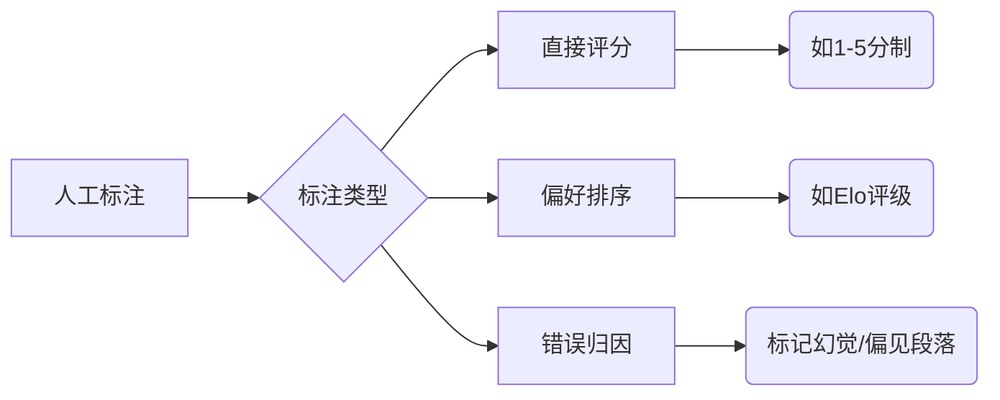
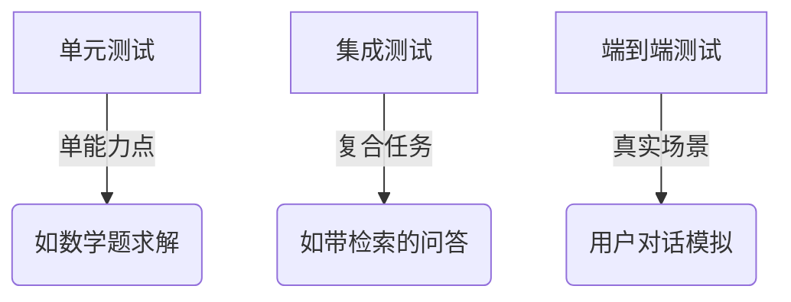
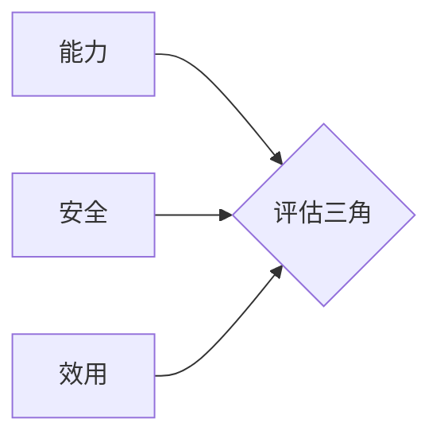

## 大语言模型评估的深度阐述

大语言模型（LLM）的评估是确保其可靠性、安全性和实用性的核心环节。与传统NLP模型不同，LLM的评估面临**多维度、多场景、动态性**三大挑战，需要构建系统化的评估体系。

---

### **一、评估的四大核心维度**
#### 1. **基础能力评估**
- **语言生成质量**
  - **流畅性**：困惑度（PPL）、语法错误率
  - **连贯性**：句子间逻辑衔接（如BERTScore）
  - **多样性**：Distinct-n指标（检测重复模式）

- **知识掌握度**
  - **事实准确性**：在TruthfulQA、FActScore等数据集测试
  - **知识覆盖**：MMLU（57个学科测试）、Natural Questions

#### 2. **任务性能评估**
| **任务类型**       | **代表性数据集**       | **关键指标**         |
|--------------------|------------------------|---------------------|
| 文本分类           | GLUE, SuperGLUE        | Accuracy, F1       |
| 问答               | SQuAD, HotpotQA        | EM, F1, ROUGE-L    |
| 摘要生成           | CNN/DailyMail, XSum    | ROUGE, BERTScore   |
| 代码生成           | HumanEval, MBPP        | Pass@k             |
| 数学推理           | GSM8K, MATH            | 准确率             |

#### 3. **对齐能力评估**
- **人类偏好对齐**
  - **有用性**：帮助用户解决实际问题的能力（如Chatbot Arena）
  - **无害性**：检测歧视/暴力内容（ToxiGen数据集）
  - **诚实性**：避免虚构事实（TruthfulQA）
  
- **价值观对齐**
  - 政治倾向测试（如Political Compass Test）
  - 文化敏感性评估（如BOLD数据集）

#### 4. **系统特性评估**
- **鲁棒性**：输入扰动下的稳定性（TextFlood攻击测试）
- **效率**：推理延迟/吞吐量（Token/s）
- **可解释性**：注意力可视化、归因分析（SHAP值）
- **公平性**：不同群体表现差异（如WinoBias）

---

### **二、前沿评估方法论**
#### 1. **动态评估框架**
- **持续评估（Continuous Eval）**
  - 自动监控生产环境中的模型表现
  - 反馈闭环：用户打分→触发模型更新
- **对抗评估**
  - 红队测试（Red Teaming）：人工设计陷阱问题
  - 自动对抗攻击（如GCG算法生成对抗样本）

#### 2. **人类中心评估**

#### 3. **LLM作为评估器（LLM-as-a-Judge）**
- **原理**：用GPT-4等强模型评估其他LLM输出
- **优势**：低成本、可扩展（替代30%人工评估）
- **风险**：评估者模型自身的偏见
- **实践**：Vicuna的80个问题评估集

---

### **三、关键挑战与解决方案**
#### 1. **评估指标局限性**
| **问题**                  | **改进方案**                          |
|---------------------------|--------------------------------------|
| BLEU/ROUGE忽略语义        | 语义相似度指标（BERTScore, BLEURT） |
| 人工评估成本高            | 混合评估（AI筛选+人工复核）         |
| 静态数据集过时            | 动态数据集（如FreshQA）             |

#### 2. **长尾场景覆盖不足**
- **解决方案**：
  - 构建领域专属测试集（如医学：MedMCQA）
  - 合成数据增强（用LLM生成边缘案例）

#### 3. **多模态评估缺口**
- **新兴方向**：
  - 图文一致性（如COCO图像描述测试）
  - 跨模态推理（ScienceQA）

---

### **四、工业界最佳实践**
#### 1. **层级化评估体系**

#### 2. **开源评估工具链**
- **综合平台**：LM Evaluation Harness, OpenCompass
- **专项工具**：
  - 代码评估：HumanEval
  - 安全评估：ToxiGen
  - 效率评估：DeepSpeed Inference

#### 3. **评估驱动开发（EDD）**
- **流程**：  
  预训练 → **基础评估** → 微调 → **任务评估** → RLHF → **对齐评估** → 部署 → **在线评估**

---

### **五、未来发展方向**
1. **认知能力评估**  
   - 构建心智理论（Theory of Mind）测试集
   - 因果推理评估（如CausalBench）

2. **价值观动态校准**  
   - 基于用户群体的实时偏好映射
   - 文化自适应评估框架

3. **生态化评估社区**  
   - 开源评估数据集（如HuggingFace Open LLM Leaderboard）
   - 第三方认证体系（类似MLPerf）

---

### **总结：评估的三角模型**

- **能力**：解决“能不能做” → 基础性能指标  
- **安全**：解决“敢不敢用” → 对齐度/鲁棒性  
- **效用**：解决“值不值得” → 成本/场景适配度  

**终极目标**：建立**可量化、可解释、可迭代**的评估体系，推动LLM从实验室技术转化为可信赖的生产力工具。随着多模态Agent发展，评估重点将从**静态输出质量**转向**动态交互效能**，开启下一代评估范式革命。