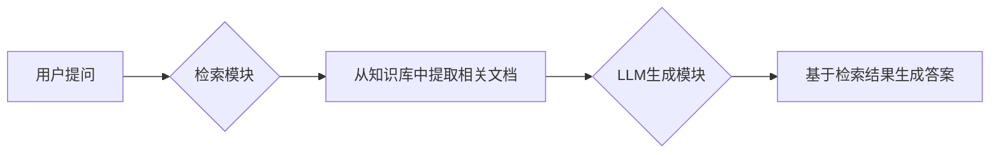

### **大语言模型中的检索增强（RAG）详解**  
检索增强生成（**Retrieval-Augmented Generation, RAG**）是一种将**外部知识检索**与**大语言模型生成能力**结合的技术，旨在解决LLM的三大痛点：**知识滞后**、**幻觉生成**和**缺乏可解释性**。其核心思想是：  
> **“先检索，再生成”——通过实时检索外部知识库，为LLM提供事实依据，确保输出内容准确、可追溯。**

---

### **一、RAG 的核心原理**
#### **1. 工作流程（两步协作）**

#### **2. 关键组件**
| **组件**          | **作用**                                                                 | **常用技术**                              |
|--------------------|--------------------------------------------------------------------------|------------------------------------------|
| **检索器（Retriever）** | 从海量数据中筛选与问题相关的片段                                        | BM25（关键词匹配）、 稠密向量检索（DPR、Sentence-BERT） |
| **知识库**         | 存储结构化/非结构化数据（如维基百科、企业文档）                         | 向量数据库（FAISS、Milvus、Pinecone）    |
| **生成器（Generator）** | 将检索结果融入提示词，生成自然语言回答                                  | GPT、Llama、Claude 等LLM                 |

---

### **二、RAG 的典型应用场景**
| **场景**               | **案例**                                                                | **RAG的价值**                             |
|------------------------|-------------------------------------------------------------------------|------------------------------------------|
| **事实性问答**         | 医疗咨询、法律条款解读                                                  | 避免模型虚构法律条款或药物剂量            |
| **企业知识助手**       | 内部文档查询（如员工手册、技术文档）                                    | 解决模型无法访问私有数据的问题            |
| **实时信息查询**       | 最新赛事比分、股票价格                                                  | 突破LLM训练数据的时间限制                 |
| **学术研究**           | 论文综述生成（基于检索的相关文献）                                      | 确保引用来源可验证                        |

---

### **三、RAG 的四大优势**
1. **降低幻觉**  
   - 生成答案锚定检索到的真实文本，减少“编造”风险。
   - *示例*：问“2025年世界杯冠军是谁？”→ 检索到无结果 → LLM回答“尚无信息”，而非虚构答案。

2. **知识可更新**  
   - 修改知识库即可更新模型知识，无需重新训练LLM（成本降低90%+）。

3. **可解释性强**  
   - 返回答案时附带**检索来源**（如文档链接），方便用户验证可信度。

4. **保护隐私**  
   - 敏感数据存于本地知识库，避免上传至云端LLM（符合GDPR等法规）。

---

### **四、RAG 的挑战与优化方案**
| **挑战**                | **原因**                          | **解决方案**                              |
|-------------------------|-----------------------------------|------------------------------------------|
| **检索精度不足**        | 关键词匹配失败/语义理解偏差       | 混合检索（BM25+向量检索）+ 查询重写      |
| **上下文长度限制**      | LLM无法处理长检索结果（如10篇文档） | 结果重排序（Re-Rank）+ 摘要压缩          |
| **生成与检索结果矛盾**  | LLM忽略检索内容，自行编造         | 提示工程强化约束（如“仅根据检索内容回答”）|
| **知识库更新延迟**      | 新数据未及时入库                  | 增量索引（如每天自动更新向量库）          |

---

### **五、RAG vs 传统微调（Fine-tuning）**
| **维度**         | **RAG**                          | **Fine-tuning**                  |
|------------------|----------------------------------|----------------------------------|
| **知识更新速度** | 分钟级（修改知识库）             | 天/周级（需重新训练）            |
| **计算成本**     | 低（仅需检索+推理）              | 极高（全模型训练）               |
| **可解释性**     | ✅ 答案关联检索来源               | ❌ 黑盒生成                       |
| **适用场景**     | 动态知识、私有数据               | 固定技能（如写作风格迁移）       |

---

### **六、前沿进展**
1. **自检索RAG（Self-RAG）**  
   - LLM主动判断是否需要检索（如问题需事实支持时），平衡效率与准确性。
2. **多跳检索（Multi-hop）**  
   - 迭代检索：用首次结果生成新查询，解决复杂问题（如“爱因斯坦的导师的著作”）。
3. **生成式检索**  
   - 直接用LLM生成知识ID（如“知识片段1”），替代向量匹配（Google的REALM框架）。

---

### **七、实践工具推荐**
- **向量数据库**：Chroma（轻量级）、Pinecone（云端服务）、Milvus（高性能）
- **检索框架**：LangChain（Python库）、LlamaIndex（专注LLM数据连接）
- **开源模型**：Facebook的RAG模型、ColBERT检索器

---

### **总结**  
RAG 将LLM从“封闭的知识库”转化为“开放的推理引擎”，通过：  
1. **检索**：精准锚定事实依据 → **解决“不知道”**  
2. **增强**：动态扩展知识边界 → **解决“过时”**  
3. **生成**：自然语言整合信息 → **解决“不友好”**  
随着多模态发展，RAG正从文本扩展至图像、音视频检索（如GPT-4V），成为可信AI的核心支柱。