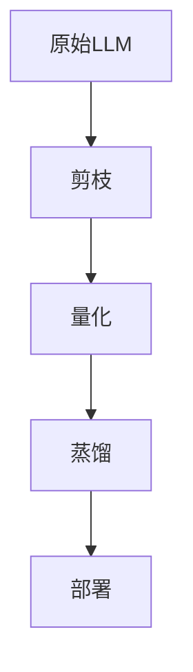

## 深度阐述：大语言模型的高效微调与模型压缩

---

### **一、高效微调（Parameter-Efficient Fine-Tuning, PEFT）**  
#### **1. 核心目标**  
在**极低参数量调整**（通常 <1%）的前提下，使预训练大模型适配下游任务，解决传统全参数微调的三大瓶颈：  
- 🔋 **显存消耗大**：175B 模型全微调需 1.2TB+ 显存  
- ⏳ **训练时间长**：需反向传播更新万亿级参数  
- 📚 **灾难性遗忘**：过度调整破坏预训练知识  

#### **2. 主流技术路线**  
##### **(1) 提示微调（Prompt Tuning）**  
- **原理**：冻结模型权重，仅优化输入端的**软提示向量**（Soft Prompts）  
- **结构**：  
  ```python  
  # 伪代码示例  
  soft_prompt = nn.Embedding(10, hidden_size)  # 10个可学习token  
  input_embeds = concat(soft_prompt, input_embeds)  
  ```  
- **优势**：单任务仅需 0.01% 参数量  
- **局限**：任务复杂时效果受限  

##### **(2) LoRA（Low-Rank Adaptation）**  
- **核心思想**：用**低秩分解矩阵**近似权重更新量 ΔW  
  \[
  \Delta W = B \cdot A, \quad A \in \mathbb{R}^{r \times d}, B \in \mathbb{R}^{d \times r}, r \ll d
  \]  
  <div align=center>  
    
  </div>  

- **实现**：  
  ```python  
  class LoRALayer(nn.Module):  
      def __init__(self, r=8):  
          self.A = nn.Parameter(torch.randn(r, d))  # 低秩矩阵A  
          self.B = nn.Parameter(torch.zeros(d, r))  # 低秩矩阵B  
      def forward(x):  
          return x @ (W_0 + self.B @ self.A)  # W_0为冻结的原权重  
  ```  
- **优势**：  
  - 训练参数量减少 100-1000 倍  
  - 多任务共享基础模型，部署时合并 ΔW 实现零延迟  

##### **(3) Adapter 模块**  
- **结构**：在 Transformer 层间插入**小型全连接层**  
  <div align=center>  
    
  </div>  
- **公式**：  
  \[
  h \leftarrow h + f(\text{LayerNorm}(h) \cdot W_{\text{down}}) \cdot W_{\text{up}}  
  \]  
- **特点**：  
  - 每层增加约 0.5% 参数  
  - 性能接近全微调，但引入额外推理延迟  

#### **3. 技术对比**  
| **方法**       | 可训练参数量 | 推理延迟 | 多任务支持 | 典型应用场景       |  
|----------------|------------|---------|-----------|------------------|  
| **全参数微调** | 100%       | 无增加  | ❌         | 单一高价值任务    |  
| **LoRA**       | 0.1%-0.5%  | 可消除  | ✅         | 多任务在线服务    |  
| **Adapter**    | 0.5%-2%    | 增加8%-15% | ✅       | 边缘设备部署      |  
| **Prompt Tuning** | 0.01%     | 无增加  | ✅         | 超轻量级场景      |  

---

### **二、模型压缩（Model Compression）**  
#### **1. 核心目标**  
降低模型部署成本，实现 **“三高两低”**：  
- 🚀 高推理速度  
- 📱 高设备兼容性（移动端/边缘计算）  
- 💡 高能效比  
- 💾 低内存占用  
- ⏱️ 低计算延迟  

#### **2. 关键技术**  
##### **(1) 量化（Quantization）**  
- **原理**：将 FP32 权重/激活值映射到低精度表示（INT8/FP16）  
- **分类**：  
  | **类型**         | 精度            | 压缩率 | 精度损失 |  
  |------------------|----------------|-------|---------|  
  | 动态量化（DQ）   | 权重INT8，激活FP16 | 4x    | 低       |  
  | 静态量化（SQ）   | 权重&激活 INT8   | 4x    | 中       |  
  | 二值化（BNN）    | 权重±1          | 32x   | 高       |  

- **实现**（以静态量化为例）：  
  ```python  
  model = quantize(model,  
                   calibration_data,  
                   qconfig=torch.quantization.get_default_qconfig('fbgemm'))  
  ```

##### **(2) 知识蒸馏（Knowledge Distillation）**  
- **框架**：  
  ```mermaid  
  graph LR  
  A[教师模型] --软标签--> B[学生模型]  
  C[原始数据] --> B  
  ```  
- **损失函数**：  
  \[
  \mathcal{L} = \alpha \cdot \mathcal{L}_{\text{CE}}(y_{\text{hard}}, y_{\text{stud}}) + \beta \cdot \text{KL}(T(\mathbf{z}_{\text{tea}}), T(\mathbf{z}_{\text{stud}}))  
  \]  
  其中 \(T\) 为温度参数控制分布平滑度  

##### **(3) 剪枝（Pruning）**  
- **结构化剪枝**：移除整神经元/注意力头  
  - **方法**：基于权重范数、梯度重要性  
  - **效果**：模型缩小 40-60%，FLOPs 减少 30-50%  
- **非结构化剪枝**：移除单个权重（需稀疏计算支持）  
  - **极限压缩**：LLM 稀疏度可达 90%+  

##### **(4) 权重共享（Weight Sharing）**  
- **核心**：相似权重聚类为中心值，存储索引 + 码本  
  <div align=center>  
    
  </div>  
- **压缩率**：  
  \[
  \text{CR} = \frac{n \cdot b_w}{n \cdot \log_2 k + k \cdot b_w}  
  \]  
  其中 \(n\)=参数量，\(k\)=聚类中心数，\(b_w\)=原权重比特数  

#### **3. 技术组合策略**  

- **典型效果**（以 LLaMA-7B 为例）：  
  | **技术**          | 模型大小 | 内存占用 | 推理速度 |  
  |-------------------|---------|---------|---------|  
  | 原始模型          | 13GB    | 14GB    | 1x      |  
  | + INT4量化        | 3.9GB   | 4.5GB   | 2.3x    |  
  | + 50%稀疏剪枝     | 2.0GB   | 2.8GB   | 3.1x    |  
  | + 蒸馏（TinyLLaMA）| 0.5GB   | 1.1GB   | 5.8x    |  

---

### **三、前沿融合方向**  
#### 1. **PEFT + 压缩协同优化**  
- **LoRA + 量化**：  
  - 训练：FP16 LoRA 适配器  
  - 部署：INT4 基础模型 + FP16 LoRA  
- **Adapter 蒸馏**：  
  - 教师模型 Adapter → 指导学生模型全参数  

#### 2. **硬件感知压缩**  
- **芯片定制化**：  
  - NVIDIA H100 支持 FP8 稀疏计算  
  - 手机 NPU（如骁龙 8 Gen3）加速 INT4 模型  

#### 3. **动态压缩推理**  
- **MoE（Mixture of Experts）**：  
  - 仅激活部分专家（如 2/8），减少 70% 计算量  
- **早退机制（Early Exit）**：  
  - 简单样本在浅层输出，跳过深层计算  

---

### **四、工业级实践方案**  
#### **部署架构对比**  
| **场景**         | 推荐方案                | 性能指标               | 工具链              |  
|------------------|-----------------------|----------------------|-------------------|  
| 云端推理         | LoRA + INT4量化        | 吞吐量 >1000 token/s | vLLM + AWQ        |  
| 边缘设备         | 蒸馏模型 + INT8量化     | 延迟 <200ms          | TensorRT-LLM      |  
| 浏览器环境       | 二值化 + 权重共享       | 模型 <100MB          | WebLLM + ONNX     |  

#### **开源解决方案**  
- **高效微调**：HuggingFace PEFT 库（支持 LoRA/Adapter）  
- **模型压缩**：  
  - 量化：GGML（CPU优化）、AWQ（GPU优化）  
  - 蒸馏：DistilBERT、TinyLLaMA  
  - 剪枝：Torch-Pruning  

---

### **本质总结**  
1. **高效微调**：通过**结构创新**（LoRA/Adapter）实现“小改动大效果”，本质是**参数空间重映射**  
2. **模型压缩**：通过**信息约简**（量化/剪枝/蒸馏）逼近硬件极限，本质是**计算精度与效率的帕累托优化**  
3. **技术融合趋势**：  
   - 训练阶段：PEFT 降低适配成本  
   - 部署阶段：压缩技术扩展落地场景  
   - 硬件协同：稀疏计算 + 低精度指令集释放终极性能  

> **终局展望**：未来 LLM 将形成 **“预训练大模型（云端）- 高效适配器（任务层）- 压缩运行时（边缘端）”** 的三级架构，实现 AI 能力的无处不在。