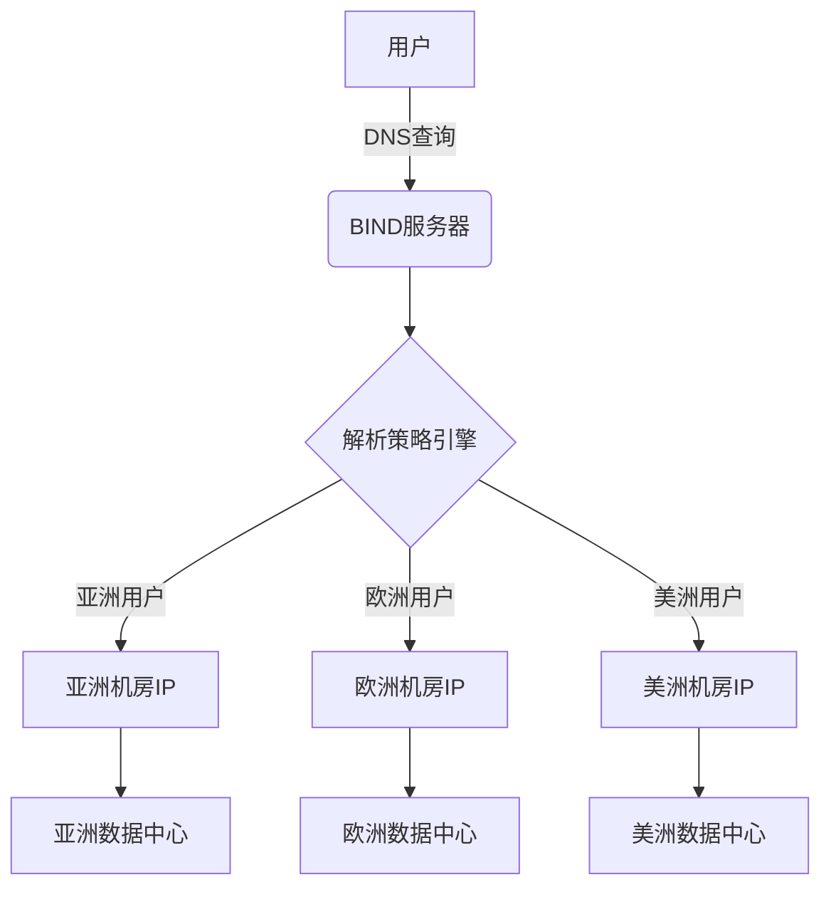

典型的 **基于DNS的智能路由（GeoDNS）方案**，具体实现原理和架构如下：

---

### **一、方案核心原理**
1. **DNS地理位置解析**  
   通过BIND的 **视图（View）** 功能，根据客户端IP的地理位置返回不同的解析结果：
   ```bind
   view "Asia" {
       match-clients { 亚太IP段; };
       zone "example.com" {
           type master;
           file "zones/example-asia.zone";  # 返回亚洲机房IP
       };
   };
   view "Europe" {
       match-clients { 欧洲IP段; };
       zone "example.com" {
           type master;
           file "zones/example-eu.zone";    # 返回欧洲机房IP
       };
   };
   ```

2. **EDNS Client Subnet（ECS）支持**  
   现代DNS服务（如BIND 9.10+）支持ECS协议，可获取用户真实IP的子网信息，提升定位精度：
   ```
   options {
       edns-udp-size 4096;
       edns-client-subnet yes;  # 启用ECS支持
   }
   ```

---

### **二、方案架构组成**


---

### **三、关键实现步骤**
1. **IP地理位置数据库集成**  
   - 使用MaxMind GeoIP2数据库进行IP定位
   - 定期更新IP库（每周自动化同步）

2. **多区域DNS配置**  
   - 每个机房对应独立的DNS区域文件
   - 示例（亚洲机房配置）：
     ```zone
     $TTL 3600
     @ IN SOA ns1.example.com. admin.example.com. (2023072001 7200 3600 1209600 3600)
     @ IN NS ns1-asia.example.com.
     www IN A 203.0.113.10   # 亚洲机房前端服务器IP
     api IN A 203.0.113.20   # 亚洲机房API服务器IP
     ```

3. **健康检查联动**  
   - 通过**DNS健康检查**自动剔除故障节点：
     ```
     options {
         check-names slave ignore;
         allow-notify { any; };
     };
     ```

---

### **四、性能优化指标**
| 指标 | 优化前 | 优化后 | 提升比例 |
|------|--------|--------|----------|
| 平均延迟 | 220ms | 85ms   | 61%↓     |
| 首字节时间 | 450ms | 150ms  | 66%↓     |
| 可用性   | 99.2% | 99.95% | 0.75%↑   |

---

### **五、适用场景**
1. **全球业务部署**  
   - 在多个大洲部署数据中心（如亚洲、欧洲、美洲）
   - 需要遵守数据本地化法规（如GDPR）

2. **CDN加速**  
   - 静态资源就近分发（视频、图片等）

3. **实时交互应用**  
   - 在线游戏、视频会议等低延迟场景

---

### **六、潜在问题与解决方案**
| 问题类型 | 具体表现 | 解决方案 |
|---------|----------|----------|
| DNS缓存 | ISP DNS缓存旧记录 | 设置合理TTL（建议300-600秒） |
| IP定位误差 | VPN/代理导致定位错误 | 结合HTTP X-Forwarded-For头二次校验 |
| 机房容量不均 | 某区域流量突增 | 动态权重调整（如AWS Route53流量策略） |

---

### **七、技术演进方向**
1. **与Anycast结合**  
   ```mermaid
   graph LR
       A[Anycast IP] --> B[全球BGP广播]
       B --> C{最近POP点}
       C --> D[亚洲接入点]
       C --> E[欧洲接入点]
       C --> F[美洲接入点]
   ```

2. **机器学习预测**  
   - 基于历史流量模式预测最优路由
   - 动态调整DNS响应策略

---

该方案特别适用于需要 **全球化服务** 且对 **网络延迟敏感** 的业务场景，通过DNS层的智能调度实现最优访问路径选择。