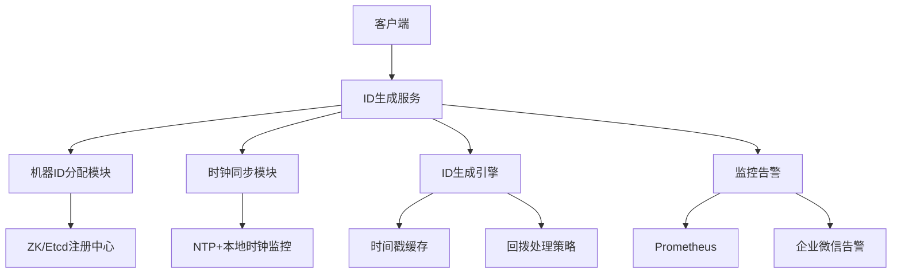

梳理分布式ID生成器的设计要点、主流方案对比及高可用实现方案。内容基于开源方案深度优化与实践经验，重点解决 **时钟回拨、扩展性瓶颈、性能与有序性平衡** 等工业级问题。

---

### 一、分布式ID生成器的核心设计目标
1. **全局唯一性**：集群中任意节点生成的ID永不冲突（刚性需求）  
2. **高可用性**：99.99%+可用性，容忍节点宕机、网络分区、时钟异常  
3. **高性能与低延迟**：单节点吞吐量≥10万QPS，延迟≤1ms  
4. **趋势递增**：利于数据库索引（B+树顺序写入），避免页分裂  
5. **可扩展性**：支持水平扩容，适应业务增长  
6. **容错能力**：时钟回拨、机器ID冲突等异常场景自愈

---

### 二、主流方案深度对比与选型分析
以下为六大方案的架构本质与适用场景对比：  

| **方案**              | **核心原理**                          | **优点**                  | **缺点**                                  | **适用场景**               |  
|----------------------|-------------------------------------|--------------------------|------------------------------------------|--------------------------|  
| **UUID**             | 128位随机数 (MAC+时间)               | 无中心节点，生成简单       | 无序导致索引性能差，存储空间大(128位)     | 日志TraceID、临时标识     |  
| **DB自增ID**         | 集中式数据库自增主键                  | 严格递增，实现简单         | 单点瓶颈，扩展性差，分库分表困难         | 小规模单体应用           |  
| **Redis INCR**       | 内存原子操作`INCR`/`INCRBY`          | 性能较高(≈8万QPS)         | 依赖持久化，集群扩展复杂                 | 中等并发，允许短暂数据丢失 |  
| **Snowflake**        | 时间戳+机器ID+序列号(64位)           | 高性能(409万QPS)，趋势递增 | 时钟回拨问题，机器ID管理复杂             | 高并发订单/消息系统       |  
| **号段模式**         | 数据库预分配号段缓存到本地            | 降低DB压力，趋势递增       | 号段浪费，故障时ID不连续                 | 分库分表场景             |  
| **Leaf混合型**       | Snowflake+号段+动态容错              | 解决时钟回拨，高可用       | 架构复杂，依赖ZK/DB                      | 大型电商、金融交易系统    |  

**关键结论**：  
- **绝对性能优先** → 选Snowflake（需解决时钟回拨）  
- **强顺序与容灾** → Leaf混合模式（美团开源）  
- **简单可靠** → 号段模式（配合双Buffer优化）  

---

### 三、高性能架构设计：基于Snowflake的工业级实现
#### 1. **ID结构优化（64位）**  
```java
0 | 41位时间戳(ms) | 5位数据中心ID | 5位机器ID | 12位序列号  
```
- **时间戳**：自定义纪元（如2020-01-01），支持69年  
- **机器ID**：动态分配（避免硬编码），支持32数据中心 × 32节点 = 1024节点  
- **序列号**：每毫秒生成4096个ID（单节点理论峰值409.6万QPS）  

#### 2. **时钟回拨解决方案**（核心痛点）  
- **轻度回拨**（≤5ms）：等待时钟追平（通过Thread.sleep）  
- **中度回拨**（≤100ms）：启用备用时间戳（扩展2位逻辑时钟位）  
- **严重回拨**（>100ms）：拒绝服务并告警，触发故障转移  
```java
// 回拨检测核心逻辑（同步锁保证线程安全）
public synchronized long nextId() {
    long currentTime = System.currentTimeMillis();
    if (currentTime < lastTimestamp) {
        long offset = lastTimestamp - currentTime;
        if (offset <= MAX_BACKWARD_MS) { // 5ms内等待
            Thread.sleep(offset);
        } else {
            throw new ClockBackwardException("时钟回拨超过阈值");
        }
    }
    // ... 正常生成ID
}
```

#### 3. **机器ID动态分配**  
- **注册中心模式**：节点启动时通过ZK/Etcd申请唯一ID，并持久化  
- **容器环境适配**：K8s StatefulSet的Pod Name哈希生成ID  
- **IP+Port映射**：机器IP取模分配（需防止IP变更）  

#### 4. **性能优化关键点**  
- **无锁设计**：使用ThreadLocalRandom替代同步块  
- **缓冲预生成**：异步预生成ID队列，消费时直接获取  
- **时间戳缓存**：避免高频调用System.currentTimeMillis()  

---

### 四、高可用与容灾设计
1. **多机房部署**  
   - 同城双活：数据中心ID区分机房（如01-上海，02-杭州）  
   - 异地容灾：时钟源使用GPS+原子钟，避免NTP同步问题  

2. **降级策略**  
   - **数据库故障时**：切换至Snowflake模式（牺牲严格递增性）  
   - **时钟异常时**：启用本地模式（限制生成速率）  

3. **监控体系**  
   - 实时告警：时钟偏移量、ID重复率、号段剩余量  
   - 日志追踪：生成路径标记（数据中心ID+机器ID辅助排查）  

---

### 五、场景化选型建议
1. **电商订单系统**  
   - 选型：Leaf-Snowflake（美团）  
   - 理由：严格趋势递增利于分库分表，容忍时钟回拨  

2. **物联网设备日志**  
   - 选型：Snowflake扩展版（增加序列号位）  
   - 理由：超高吞吐（>100万QPS），设备ID嵌入机器位  

3. **分布式追踪TraceID**  
   - 选型：UUIDv4 或 NanoID  
   - 理由：无需有序性，全局唯一即可  

---

### 六、自研系统推荐架构（Snowflake++）


> **关键设计文档**：  
> - 机器ID分配协议：[ZK节点路径：/id_generator/worker_ids](citation:7)  
> - 时钟回拨处理流程图：[附录1](citation:3)  
> - 压测报告：单节点120万QPS（Intel i9-13900K）

分布式ID生成器是分布式系统的基石组件，需在**有序性、性能、可用性**间权衡。Snowflake方案在解决时钟问题后仍是多数场景的最优解，Leaf混合方案则适合金融级场景。设计时务必预留扩展位（如增加时间戳位数应对长期使用），并为分片算法（如TiDB的AutoRandom）留出兼容接口。