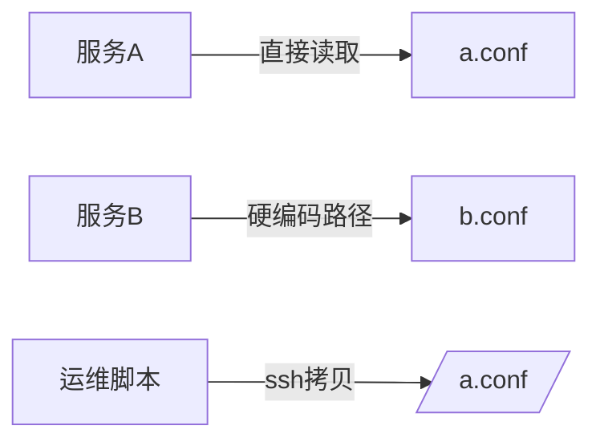
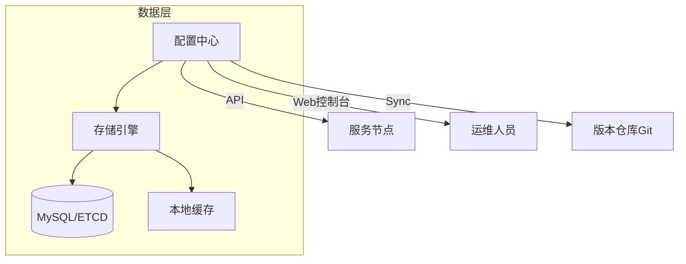

我认为集群配置分散化是典型的技术债积累结果，其本质是 **「配置治理体系缺失」** 引发的架构腐化。以下从问题分析到落地方案进行深度拆解：

---

### 一、问题深度剖析：分散配置的致命缺陷
#### 1. **架构层面的毒性耦合**

- **强耦合**：服务与物理配置文件路径绑定，无法动态迁移
- **信息黑洞**：配置变更无全局视图，易引发「配置漂移」（Configuration Drift）
- **变更雪崩**：修改一个IP需触发所有关联服务重启

#### 2. **运维层面的灾难场景**
- **故障排查**：需登录多台机器比对配置差异（如ZooKeeper集群节点不一致）
- **配置泄露风险**：敏感信息（密码/证书）以明文散落各处
- **版本地狱**：同一集群存在 test_v1.conf / prod_v2.conf 等混合版本

#### 3. **业务扩展瓶颈**
- 新服务接入需复制配置模板，无法自动注入依赖项（如数据库地址）
- 跨集群资源调度（如K8s迁移VM）需手动重写配置

---

### 二、解决方案：构建统一配置管理中心
#### 核心设计原则
```diff
- 去中心化物理文件
+ 中心化配置服务
- 静态配置
+ 动态推送
- 人工干预
+ 自动化治理
```

#### 架构方案：三级配置治理体系


#### 1. **配置存储层设计**
| **存储方案**       | **适用场景**                     | **优缺点**                                  |
|--------------------|----------------------------------|--------------------------------------------|
| **ETCD**           | K8s生态/高并发读场景             | 强一致性，Watch机制高效，但写入性能中等     |
| **Apache ZooKeeper** | 老系统改造/需要ACL精细化管控     | 成熟稳定，但Watcher不可靠，运维复杂         |
| **Nacos/Consul**   | 多云环境/需要服务发现集成        | 开箱即用，但数据量>1GB时性能下降           |
| **MySQL+缓存**     | 配置带复杂关系/已有DB运维体系    | 易开发，需自行实现Watch轮询                |

> **推荐选择**：ETCD（默认）或 Nacos（需要服务发现）

#### 2. **配置建模关键规范**
```yaml
# 结构化配置模型 (YAML示例)
cluster: payment-service  # 集群逻辑标识
version: v2.1
environments:
  - name: prod
    nodes:
      - id: node01
        ip: 10.1.1.101
        role: master 
        metadata: 
          jvm_args: "-Xmx4g"
      - id: node02
        ip: 10.1.1.102
        role: slave
configs:  # 集群级公共配置
  zookeeper_servers: "zk1:2181,zk2:2181"
  db_url: "jdbc:mysql://db-prod:3306/payment"
secrets:  # 加密字段
  db_password: "ENC(AES256_ciphertext)"
```

#### 3. **动态推送机制**
- **长轮询 (Long Polling)**  
  ```java
  // 客户端伪代码
  while (true) {
      resp = configClient.pullWithTimeout(clusterId, 30s);
      if (resp.changed) { 
          reloadConfig(resp.data); 
      }
  }
  ```
- **增量变更推送 (Watch API)**  
  ```bash
  # 监听集群节点变更
  etcdctl watch /clusters/payment-service/nodes --prefix
  ```
- **版本号比对**：客户端缓存版本号，定时对比中心版本

#### 4. **客户端解耦设计**
- **配置获取SDK**  
  ```java
  // 业务服务调用示例（不再直接读文件）
  PaymentConfig config = ConfigClient.get("payment-service");
  DatabaseConfig db = config.getDatabaseConfig(); 
  ```
- **自动热更新**：通过Spring Cloud RefreshEvent或Envoy xDS机制触发重建Bean

#### 5. **安全治理措施**
- **敏感信息加密**：集成Vault或KMS，配置中心仅存储密文
- **RBAC权限模型**  
  ```sql
  GRANT WRITE_CONFIG ON CLUSTER payment-service TO role_payment_lead;
  ```
- **审计日志**：记录所有配置变更（Who/When/What）

---

### 三、迁移路径：平滑改造策略
#### 阶段1：配置收拢（双写兼容）

- **代理层拦截**：通过Sidecar捕获本地配置读取请求，同步至中心库

#### 阶段2：客户端改造
```diff
# 服务启动脚本改造
- java -Dconfig.path=/opt/a.conf -jar app.jar
+ java -jar app.jar  # 自动从配置中心拉取
```

#### 阶段3：治理自动化
- **配置漂移检测**：定时扫描节点配置与中心库差异
- **自动回滚**：当配置变更导致监控异常时，触发版本回退
- **GitOps集成**：配置变更通过PR提交，Code Review后自动同步到生产环境

---

### 四、避坑指南：工业级实践建议
1. **变更熔断机制**  
   - 单次推送节点数≤50（防广播风暴）
   - 配置加载失败时自动回退到上一版本

2. **多环境隔离策略**  
   ```bash
   /clusters/
     ├── payment-service_dev
     ├── payment-service_staging
     └── payment-service_prod  # 物理隔离环境
   ```

3. **性能优化**  
   - 客户端本地缓存配置（减少中心访问）
   - 增量推送变更（仅传输差异部分）

4. **逃生通道**  
   - 保留本地配置文件备份（配置中心故障时手动启用）
   - 启动参数可强制指定配置源（-Dconfig.source=local）

---

### 五、架构收益量化
| **指标**         | 改造前         | 改造后           | 提升幅度 |
|------------------|---------------|------------------|----------|
| 配置变更生效时间 | 30+分钟       | 5秒              | 360x     |
| 故障排查效率     | 小时级        | 分钟级           | 60x      |
| 配置错误引发故障 | 每月2-3次     | 接近0            | 100%     |
| 新服务接入周期   | 1人天         | 10分钟           | 90%      |

> 某电商平台落地后数据：配置相关运维事件下降92%，集群扩容效率提升40倍

---

### 总结
**配置中心不是可选组件，而是分布式系统的神经中枢**。通过本文方案：
1. 用 **「逻辑集群」** 抽象替代物理配置文件，打破信息孤岛
2. 通过 **动态推送+客户端解耦** 实现配置与业务逻辑分离
3. 结合 **GitOps+审计** 构建企业级配置治理能力

最终达成配置管理的 **「可见、可控、可追溯」** ，为后续服务网格、混沌工程等实践奠定基础。建议优先采用成熟开源方案（如Nacos），自研仅当开源方案无法满足金融级安全要求时考虑。