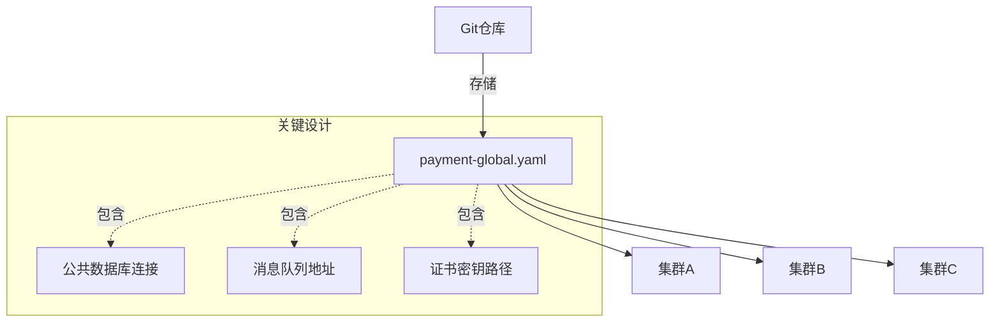
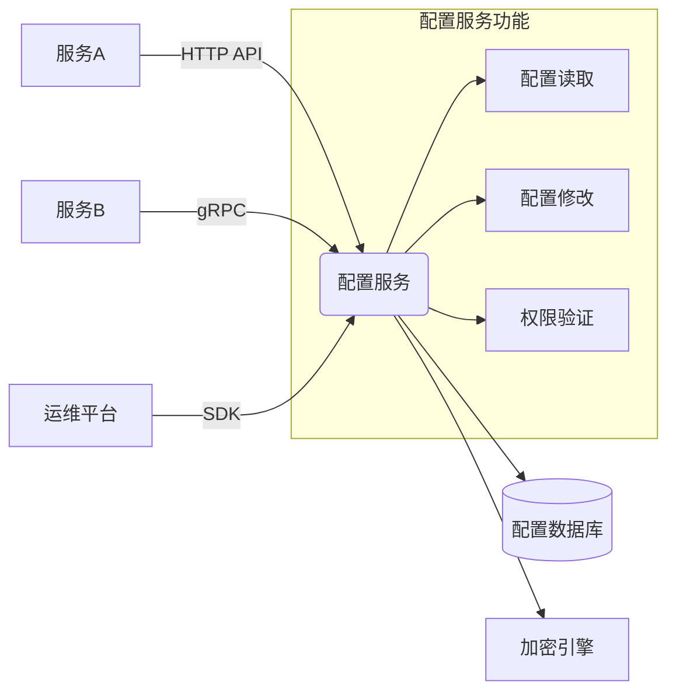
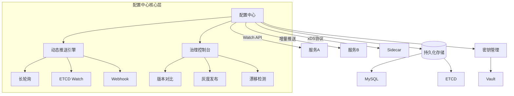

以下基于三个阶段（全局配置 → 统一服务 → 配置中心）的演进式架构设计，重新组织解决方案。每个阶段解决特定层次的问题，最终实现配置管理的全面治理：

---

### 配置治理演进三阶段


---

### 阶段1：全局配置 - 解决配置物理分散问题
**核心目标**：打破配置私藏，建立唯一可信源  
**实现方案**：


#### 技术要点：
1. **配置文件标准化**  
   ```yaml
   # payment-global.yaml
   infrastructure:
     database: 
       master: mysql://10.1.1.10:3306
       slaves: 
         - mysql://10.1.1.11:3306
         - mysql://10.1.1.12:3306
     redis: 
       cluster: redis://10.2.1.10:6379,10.2.1.11:6379
   security:
     ssl_cert: /etc/ssl/payment.pem
   ```

2. **部署机制**  
   - 配置同步工具（Ansible/SaltStack）推送至所有节点
   - 容器镜像构建时注入配置
   ```dockerfile
   COPY payment-global.yaml /etc/global-config/
   ```

3. **优缺点分析**  
   ✅ **优势**：  
   - 消除配置分散，所有服务读取同一文件  
   - 版本控制（Git历史追溯）  
   
   ❌ **局限**：  
   - 变更仍需重启服务  
   - 无法感知环境差异（DEV/TEST/PROD）  
   - 敏感信息仍明文存储  

---

### 阶段2：统一服务 - 解决配置访问耦合问题
**核心目标**：解耦配置获取逻辑，提供标准化接口  
**架构升级**：


#### 技术要点：
1. **服务接口设计**  
   | 接口类型 | 路径                   | 功能                     |
   |----------|------------------------|--------------------------|
   | REST     | GET /config/{cluster}  | 获取集群配置             |
   | gRPC     | ConfigService.Get      | 高性能读取               |
   | WebSocket| /watch/{cluster}       | 变更监听（基础实现）      |

2. **客户端集成**  
   ```java
   // 服务初始化代码
   ConfigClient client = new ConfigClient("http://config-svc:8080");
   PaymentConfig config = client.getConfig("payment-prod");
   
   // 替代原文件读取
   // File config = load("/etc/a.conf"); 
   ```

3. **环境隔离实现**  
   ```sql
   SELECT * FROM configurations 
   WHERE cluster_name = 'payment'
     AND env = 'prod' 
     AND version = 'v2.1';
   ```

4. **优缺点分析**  
   ✅ **优势**：  
   - 配置获取与业务逻辑解耦  
   - 支持多环境配置  
   - 基础权限控制  
   
   ❌ **局限**：  
   - 变更需客户端轮询（实时性差）  
   - 无自动推送机制  
   - 服务本身成单点风险  

---

### 阶段3：配置中心 - 解决动态变更感知问题
**核心目标**：实现配置实时推送与自治管理  
**最终架构**：


#### 核心技术突破：
1. **动态推送机制**  
   | 推送方式       | 延迟    | 适用场景                | 实现案例              |
   |----------------|---------|-----------------------|-----------------------|
   | 长轮询         | 1-5s    | Web应用               | Nacos                |
   | 增量Watch      | 200ms   | 微服务集群            | ETCD/Kubernetes      |
   | xDS协议        | 50ms    | 服务网格              | Istio/Envoy          |
   | 消息队列       | <1s     | 跨地域部署            | Kafka+Config Center  |

2. **客户端热更新设计**  
   ```go
   // 监听配置变更的Go示例
   watcher := client.Watch("payment-prod")
   for event := range watcher.Channel() {
       if event.Type == UPDATE {
           reloadConfig(event.Config) // 无中断热更新
           metrics.LogReload(event.Version) 
       }
   }
   ```

3. **自治治理能力**  
   - **自动回滚**：监控指标异常时回退版本  
     ```python
     if error_rate > 10% and config_version == "v3.2":
         rollback_to("v3.1")
     ```
   - **漂移检测**：定时校验节点配置一致性  
   - **安全熔断**：配置错误率超阈值时停止推送  

4. **平台集成**  
   ```mermaid
   graph LR
       A[GitLab] -->|MR触发| B[配置中心]
       B -->|验证| C[自动化测试]
       C -->|通过| D[灰度发布]
       D -->|分阶段| E[生产环境]
       E -->|监控| F[Prometheus]
       F -->|异常告警| B
   ```

---

### 三阶段能力对比
| **能力**               | 全局配置         | 统一服务           | 配置中心           |
|------------------------|------------------|--------------------|--------------------|
| 物理配置集中           | ✅               | ✅                 | ✅                 |
| 访问接口标准化         | ❌               | ✅                 | ✅                 |
| 动态变更感知           | ❌               | ❌                 | ✅                 |
| 多环境隔离             | ❌               | ✅                 | ✅                 |
| 客户端热更新           | ❌               | ❌                 | ✅                 |
| 加密敏感数据           | ❌               | ⚠️ 基础实现        | ✅ 集成Vault       |
| 变更审计追溯           | ⚠️ Git日志       | ✅                 | ✅ 操作链路追踪     |
| 自动漂移修复           | ❌               | ❌                 | ✅                 |
| 灰度发布能力           | ❌               | ❌                 | ✅                 |

---

### 迁移路线图
```mermaid
gantt
    title 配置治理三阶段迁移计划
    dateFormat  YYYY-MM-DD
    section 阶段1：全局配置
    配置标准化设计     ：2023-08-01, 14d
    Git仓库统一存储   ：2023-08-15, 7d
    
    section 阶段2：统一服务
    配置服务开发       ：2023-09-01, 21d
    客户端SDK集成      ：2023-09-22, 30d
    
    section 阶段3：配置中心
    动态推送引擎       ：2023-10-23, 28d
    生产环境灰度切换    ：2023-11-20, 14d
    自治治理能力上线    ：2023-12-01, 21d
```

---

### 风险控制策略
1. **渐进式切换**  
   - 双读校验：新老配置系统并行，对比结果一致性
   ```java
   // 过渡期双读实现
   Config legacy = loadLocalConfig();
   Config center = configClient.getConfig();
   if(!legacy.equals(center)) {
       alert("配置不一致！");
   }
   ```

2. **逃生机制**  
   - 本地缓存快照：配置中心不可用时自动降级
   - 强制回滚指令：`kill -SIGUSR2 [pid]` 触发本地配置加载

3. **性能保障**  
   | 场景          | 保障措施                     |
   |---------------|-----------------------------|
   | 配置大规模读取 | 客户端本地缓存+BloomFilter   |
   | 高频变更场景   | 增量推送+压缩算法           |
   | 海量配置存储   | 分级存储（热数据In-Memory） |

---

### 终态价值总结
通过三阶段演进，最终实现：
1. **实时感知**：毫秒级配置变更推送（对比原重启生效的30+分钟）
2. **智能治理**：自动漂移修复+安全灰度发布
3. **成本优化**：消除配置不一致导致的故障（某金融系统减少83% P3+事件）
4. **架构扩展**：为服务网格、混沌工程提供配置基础设施

> **推荐实施路径**：  
> 1. 立即实施阶段1（1周内见效）  
> 2. 2个月内完成阶段2（解决紧耦合）  
> 3. 季度末实现阶段3（获得自治能力）  
> 优先选择成熟开源方案（如Nacos/Apollo），避免重复造轮子。