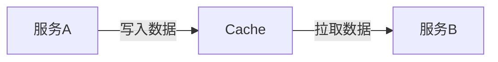
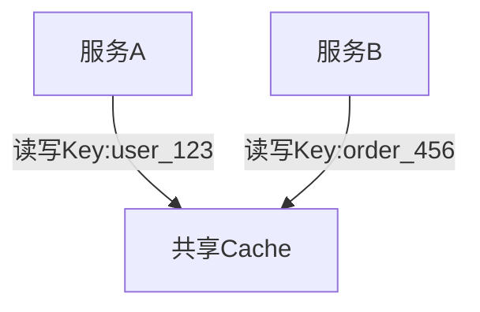
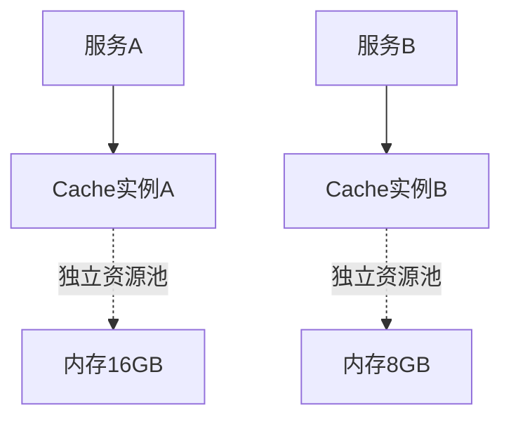
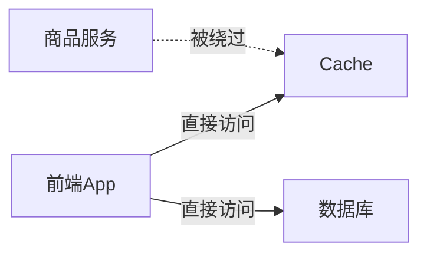
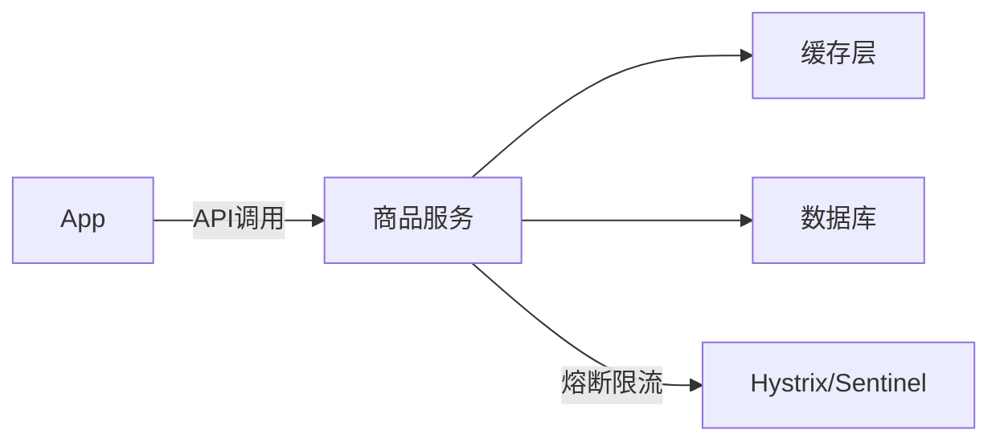
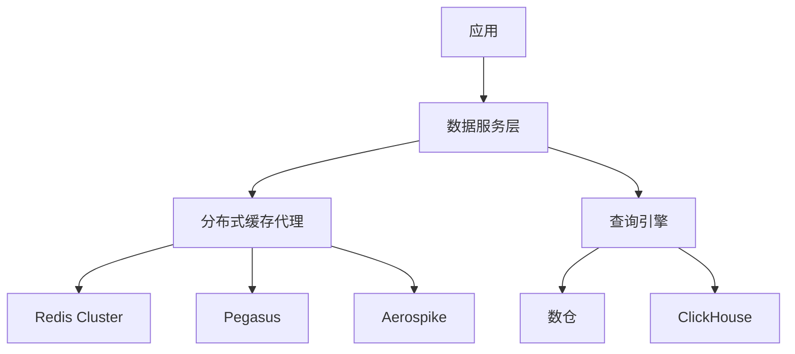
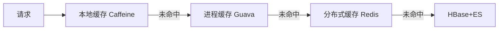
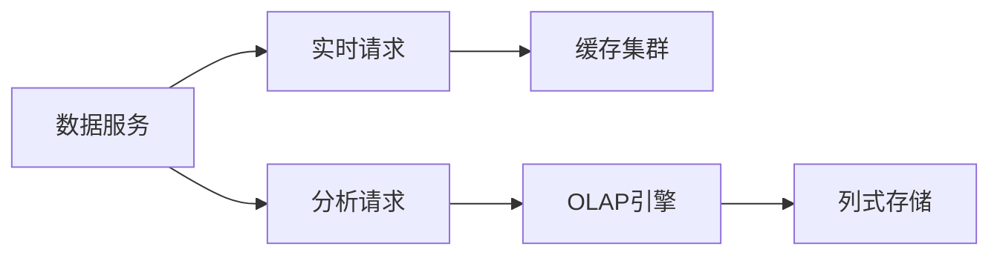
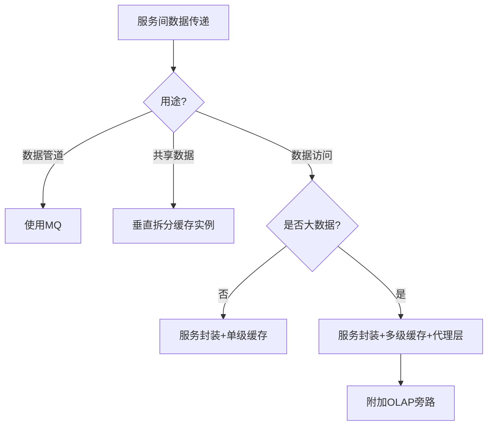

以下针对多服务间数据传递场景中缓存（Cache）的使用边界进行深度解析，结合三种典型场景给出架构决策，并特别分析大数据场景下的特殊考量：

---

### 一、缓存使用的三大核心场景与架构禁忌
#### 场景1：**数据管道（Data Pipeline）** → **禁止使用Cache**

**问题本质**：  
Cache的**被动拉取模型**与管道场景的**异步解耦需求**存在根本冲突  
**致命缺陷**：  
- **数据丢失风险**：消费速度慢时Cache自动淘汰数据（如Redis TTL/LRU）  
- **无状态回溯**：无法重放历史数据（对比Kafka的7天持久化）  
- **无消费确认**：服务B崩溃导致消息永久丢失  
**正确方案**：  
```diff
- 使用Redis List/PubSub做队列
+ 采用MQ（Kafka/RabbitMQ/RocketMQ）
```
**架构优势**：  
✅ 持久化存储 | ✅ 消费者组负载均衡 | ✅ 重试死信队列 | ✅ 流量削峰

---

#### 场景2：**数据共管（Shared Data）** → **禁止共享Cache实例**

**问题本质**：**资源竞争**引发的系统性风险  
**灾难链分析**：  
1. **缓存污染**：服务A的大对象（如1MB商品详情）挤占服务B的小对象（如100B库存数）  
2. **热点Key击穿**：服务A频繁读取user_123导致Cache单分片CPU飙高  
3. **无隔离故障**：服务B的Cache连接泄漏拖垮整个Redis实例  
**正确方案**：**垂直拆分+资源隔离**  

**关键配置**：  
```yaml
# Kubernetes资源隔离
resources:
  limits:
    memory: "4Gi"
  requests:
    memory: "2Gi"
```

---

#### 场景3：**数据访问（Data Access）** → **禁止绕过服务直连Cache**

**问题本质**：破坏服务化架构的**封装性**  
**衍生风险**：  
- **缓存穿透**：恶意请求直达Cache&DB导致雪崩  
- **逻辑耦合**：业务规则变更需同步所有调用方（如缓存结构变更）  
- **安全失控**：敏感数据通过Cache泄露  
**正确方案**：**服务化封装**  


---

### 二、大数据场景下能否绕过服务直连缓存？
**结论**：**严禁绕过服务**，但需重构缓存架构满足大数据需求  

#### 大数据场景的特殊挑战
| **特征**          | 传统缓存风险          | 大数据场景风险放大系数 |
|-------------------|----------------------|------------------------|
| 数据规模          | 10GB级               | TB~PB级                |
| 访问吞吐          | 10万QPS              | 百万QPS+              |
| 数据结构复杂度    | 简单KV               | 多维聚合/图关系        |

#### 典型灾难场景
1. **扫描型查询击穿缓存**  
   ```sql
   SELECT * FROM user_events WHERE date>='2023-01-01' -- 绕过服务直接查缓存
   ```
   → 产生百万级Redis KEYS命令阻塞线程  

2. **实时计算拓扑崩溃**  
   ```python
   # Flink作业直连Redis
   env.addSource(KafkaSource())
     .map(event -> redis.get(event.user_id)) # 单点膨胀
   ```
   → 单Redis分片QPS超限触发集群故障转移  

---

### 三、大数据场景缓存架构解决方案
#### 原则：**不绕过服务，但升级缓存体系**


#### 方案1：**缓存代理层（必选）**
```go
type CacheProxy struct {
    router *sharding.Router   // 分片路由
    filter *bloom.Filter       // 防穿透
    circuit *gobreaker.Circuit // 熔断器
}

func (p *CacheProxy) Get(key string) ([]byte, error) {
    if !p.filter.Contains(key) { // BloomFilter拦截无效Key
        return nil, ErrNotFound
    }
    node := p.router.Shard(key) // 根据Key路由到指定集群
    return node.Get(key)
}
```
**功能清单**：  
- 自动路由到垂直拆分的缓存集群（按业务域划分）  
- 布隆过滤器拦截无效请求  
- 热点Key检测并本地缓存  

#### 方案2：**多级缓存体系**

**层级策略**：  
1. L1：节点本地堆缓存（100ms级TTL防热点）  
2. L2：进程级Off-Heap缓存（秒级TTL）  
3. L3：分布式缓存（分钟级TTL）  

#### 方案3：**缓存与计算分离**

**读写分离**：  
- **实时读写**：走缓存+DB（保障强一致性）  
- **分析查询**：路由到ClickHouse/Druid（不影响业务缓存）  

---

### 四、绕过服务的例外场景及安全措施
**仅在绝对必要场景谨慎使用**：  
- **实时监控大屏**：直连Redis获取指标计数  
- **运维诊断工具**：临时执行KEYS命令排查问题  
**必须附加安全枷锁**：  
```yaml
# 网络层隔离
firewall_rules:
  - name: allow_bi_redis
    src_ip: 192.168.10.0/24  # 仅允许BI网络段
    dst_port: 6379
    action: allow

# 缓存代理强制认证
authentication:
  tls: required
  auth_token: "ENC(aes256_token)"

# 命令白名单
command_filter:
  allowed: 
    - GET
    - HGET
  blocked:
    - KEYS
    - FLUSHDB
```

---

### 五、架构决策树


### 结论
1. **缓存不是万金油**：在数据管道、共享数据池场景存在根本性缺陷  
2. **服务化是铁律**：大数据场景仍需通过服务层访问缓存，但需升级为：  
   - **缓存代理层**（分片/过滤/熔断）  
   - **多级缓存体系**（本地-L1/L2-分布式）  
   - **计算存储分离**（OLTP缓存与OLAP引擎隔离）  
3. **绕过服务的代价**：仅在受控场景临时使用，且需网络隔离+命令白名单+审计日志  

> **血泪教训**：某电商平台曾允许BI直连生产Redis，一次全表SCAN操作触发集群故障，导致支付服务瘫痪2小时。修复方案正是引入缓存代理层+OLAP分流。