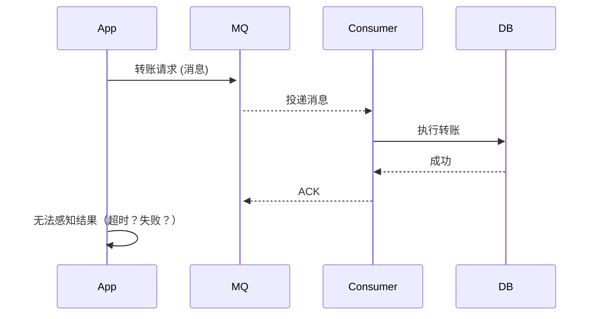
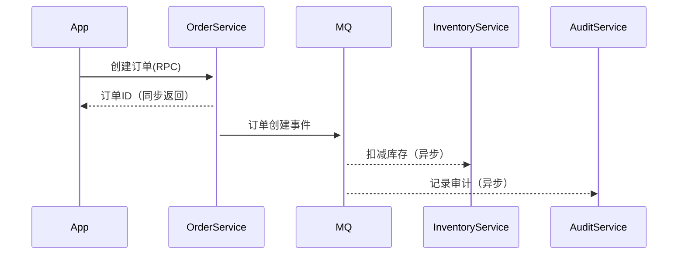
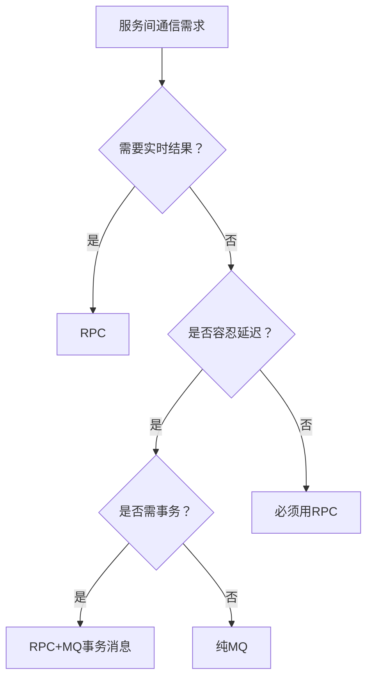

以下从资深架构师视角，针对「能否用MQ替代所有RPC调用」进行多维度深度分析，结合核心场景与工业实践给出结论：

---

### 一、MQ的核心用途与本质局限
| **维度**         | **MQ特性**                                                                 | **RPC特性**                                  |
|------------------|----------------------------------------------------------------------------|---------------------------------------------|
| **通信模式**     | 异步解耦（生产者-消费者模型）                                               | 同步/异步请求-响应模型                       |
| **数据传递**     | 消息持久化+重试（至少一次交付）                                             | 内存级传输（通常无持久化）                   |
| **核心价值**     | 流量削峰、系统解耦、最终一致性                                              | 实时结果获取、强一致性事务                   |
| **典型场景**     | 订单支付后通知物流、用户行为日志收集                                        | 账户余额查询、库存扣减操作                   |

**本质差异**：  
MQ是**事件驱动**的**单向通告**机制，而RPC是**命令驱动**的**双向交互**机制。

---

### 二、MQ替代RPC的致命缺陷分析
#### 1. **结果不可知性**（用户核心痛点）

- **业务中断风险**：  
  用户发起支付后，若用MQ通知支付系统：  
  - 前端无法实时显示扣款结果（需轮询/长连接）  
  - 网络超时无法区分「消息未处理」还是「处理失败」  

#### 2. **复杂性反噬**
- **补偿机制地狱**  
  ```java
  // MQ实现转账的伪代码（需自行实现所有容错）
  void transfer(String msg) {
    try {
        TransferCmd cmd = decode(msg);
        accountService.transfer(cmd); // 可能失败
        sendResultQueue("SUCCESS"); // 需额外结果队列
    } catch (Exception e) {
        // 重试3次后进死信队列
        // 人工介入补偿对账...
    }
  }
  ```
  对比RPC方案：  
  ```java
  // RPC调用天然包含状态返回
  TransferResult res = accountService.transfer(cmd);
  if (res.isSuccess()) { /* 更新UI */ }
  ```

#### 3. **消息丢失与重复的治理成本**
| **故障类型**    | MQ方案应对措施                     | RPC方案应对措施               |
|----------------|-----------------------------------|-----------------------------|
| 请求丢失        | 生产者回调+本地事务表             | TCP重传+应用层重试          |
| 结果丢失        | 消费者ACK+结果持久化              | 调用方异常捕获               |
| 重复消费        | 业务幂等设计（高成本）            | 天然幂等（如GET请求）        |

> **案例**：某金融系统用MQ替代转账RPC，因网络抖动导致20%重复转账，事后需人工介入退款，损失远超开发成本。

---

### 三、补充关键维度：其他不可替代性
#### 1. **协议效率与性能**
- **头开销对比**  
  ```bash
  # RabbitMQ消息头（约200字节）
  | AMQP Header | Properties | Payload |
  
  # gRPC消息头（约20字节）
  | HTTP2 Header | Protobuf Payload |
  ```
  - **延迟对比**：MQ（ms~s级） vs gRPC（μs~ms级）  
  - **吞吐对比**：MQ（万级QPS） vs gRPC（百万级QPS）

#### 2. **事务一致性**
- **分布式事务场景**  
  ```mermaid
  graph TB
      TCC[Try-Confirm-Cancel] -->|RPC调用| A[服务A]
      TCC -->|RPC调用| B[服务B]
      TCC -->|RPC调用| C[服务C]
  ```
  - MQ无法实现TCC/Saga等事务协调  
  - 基于MQ的事务消息（如RocketMQ）仍需回调RPC接口确认  

#### 3. **系统可观测性**
| **能力**       | MQ方案                          | RPC方案                     |
|----------------|--------------------------------|----------------------------|
| 调用链追踪      | 需手动传递MsgID跨服务关联        | 自动透传TraceID（OpenTelemetry） |
| 实时状态监控    | 仅知消息堆积，不知业务状态        | 精准监控成功率/延迟百分位       |
| 调试定位        | 需捞消息日志+消费者日志合并       | 单次调用全链路日志聚合          |

---

### 四、正确使用MQ替代RPC的**极少数场景**
#### 1. **异步结果通知**（符合事件驱动本质）

- **关键特征**：  
  - 主流程结果可通过RPC同步返回（如订单ID）  
  - 后续操作无需实时反馈（如库存扣减延迟200ms可接受）  

#### 2. **广播类操作**
```python
# 用MQ替代RPC广播
def disable_user(user_id):
    # 传统RPC需遍历所有服务
    for service in [A, B, C]:
        service.disable_user(user_id) 
        
    # MQ方案
    mq.publish("user:disabled", user_id)
    # 各服务自行订阅处理
```

---

### 五、架构决策树


### 结论：MQ无法替代RPC的核心原因
1. **结果不可知性**：业务需要即时反馈时（如支付/登录），MQ无法返回结果  
2. **复杂性倒置**：用MQ模拟RPC需自实现超时控制、重试、结果回调，复杂度远超成熟RPC框架  
3. **性能损耗**：消息序列化/持久化/投递使延迟增加10-100倍  
4. **可观测性塌陷**：调用链断裂导致故障排查成本剧增  

> **黄金法则**：  
> - 需要**执行命令并获取结果** → RPC  
> - 需要**通知事件且不关心结果** → MQ  
>  
> **混合架构示例**：  
> 京东订单系统：  
> - 订单创建（RPC保证实时返回订单号）  
> - 支付成功事件（MQ触发积分/消息推送等异步操作）