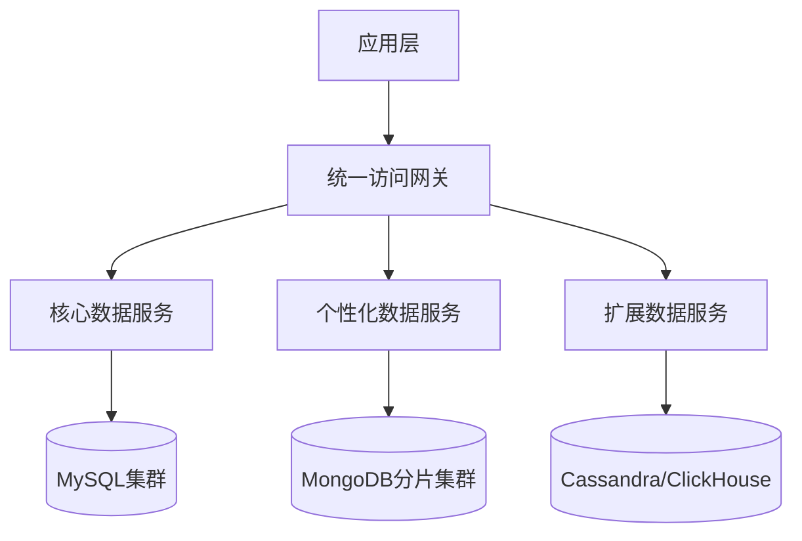
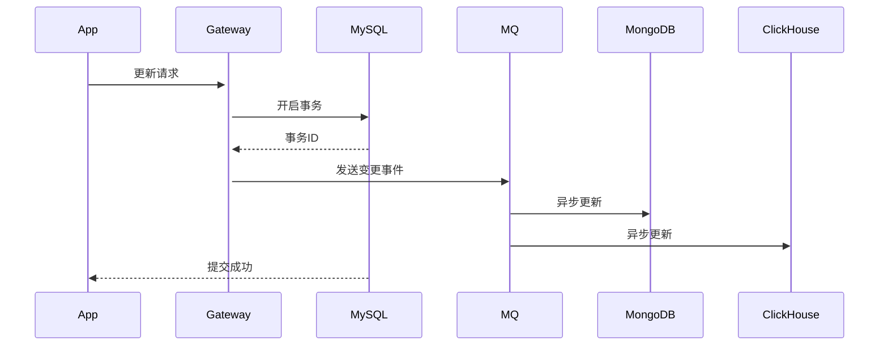

以下针对数据库耦合问题（通用数据与个性化数据混杂），从问题分析到解决方案进行深度设计，结合分层架构与存储特性给出可落地方案：

---

### 一、问题深度剖析：耦合设计的四大原罪
#### 1. **存储结构失衡**

- **致命影响**：核心字段（如user_id）被海量JSON淹没，索引效率暴跌

#### 2. **查询性能塌陷**
| 查询类型       | 耦合设计响应时间 | 理想响应时间 | 劣化倍数 |
|---------------|-----------------|-------------|---------|
| 精确查找用户   | 120ms           | 5ms         | 24x     |
| 按年龄范围统计 | 4200ms          | 300ms       | 14x     |
- **根因**：JSON字段无法有效索引，全表扫描成为常态

#### 3. **扩展性锁死**


#### 4. **技术选型错配**
| 数据类型       | 适用存储          | 错误方案        | 后果               |
|---------------|------------------|---------------|--------------------|
| 结构化基础数据 | 关系型数据库      | 放入JSON字段    | ACID失效，约束缺失 |
| 半个性化数据   | 文档数据库        | 强塞入MySQL     | 查询功能阉割       |
| 全动态属性     | 列式存储          | 混合存储        | 压缩率归零         |

---

### 二、架构原则：通用下沉 vs 个性上浮
```diff
# 错误模型（大杂烩存储）
users_table {
  user_id       : bigint,
  name          : varchar,
  created_at    : timestamp,
+ address       : json,  # {"省":"浙江","市":"杭州","小区":"xx"}
+ preferences   : json   # {"theme":"dark","font_size":14}
}

# 正确分层
core_users_table {        # 通用数据下沉
  user_id       : bigint,
  name          : varchar,
  created_at    : timestamp
}

user_profile_table {      # 个性化数据上浮
  user_id       : bigint,
  profile_type  : enum('address','preference'),
  profile_data  : json    # 按类型独立存储
}
```

---

### 三、解决方案：三级垂直拆分架构


#### 1. **核心数据层（通用数据下沉）**
- **存储选型**：MySQL/PostgreSQL（强事务关系型数据库）
- **数据结构**：
  ```sql
  CREATE TABLE core_users (
    user_id BIGINT PRIMARY KEY,  -- 全局唯一ID
    account VARCHAR(64) NOT NULL UNIQUE,
    mobile VARCHAR(20) NOT NULL, 
    created_at TIMESTAMP DEFAULT CURRENT_TIMESTAMP
    -- 无任何JSON字段！
  );
  ```
- **部署策略**：
  - 分库分表：按user_id hash分128库
  - 读写分离：1主3从，读流量>95%走从库

#### 2. **个性化数据层（动态属性上浮）**
- **存储选型**：MongoDB（文档型数据库）
- **数据结构**：
  ```json
  {
    "user_id": 10001,
    "profiles": [
      {
        "type": "address",
        "data": {
          "province": "浙江",
          "city": "杭州",
          "geo": [120.12, 30.28]
        }
      },
      {
        "type": "preference",
        "data": {
          "theme": "dark",
          "font_size": 14
        }
      }
    ]
  }
  ```
- **优化策略**：
  - 索引设计：`{ user_id: 1, "profiles.type": 1 }`
  - 分片键：`user_id` 范围分片
  - 压缩算法：Snappy（JSON平均压缩率60%）

#### 3. **扩展数据层（分析型数据）**
- **存储选型**：ClickHouse（列式存储）
- **适用场景**：
  - 用户行为标签（如：`last_30d_login_count`）
  - 实时画像分析
- **数据结构**：
  ```sql
  CREATE TABLE user_analytics (
    user_id BIGINT,
    tag_key String,
    tag_value Float64,
    update_time DateTime
  ) ENGINE = MergeTree()
  ORDER BY (user_id, tag_key);
  ```

---

### 四、数据访问网关设计
#### 1. **路由决策逻辑**
```java
public Object getUserData(long userId, String field) {
  // 1. 核心字段直连MySQL
  if (CORE_FIELDS.contains(field)) {
    return coreService.getField(userId, field);
  }
  
  // 2. 个性化字段路由到MongoDB
  if (PROFILE_FIELDS.contains(field)) {
    return profileService.getProfile(userId, field);
  }
  
  // 3. 分析型字段查ClickHouse
  if (ANALYTICS_FIELDS.contains(field)) {
    return analyticsService.getTag(userId, field);
  }
}
```

#### 2. **多源数据聚合**
```sql
-- 示例：获取用户基础信息+地址+活跃度
SELECT 
  c.user_id, c.mobile,
  p.address->>'province' AS province,
  a.last_login_score
FROM core_users c
LEFT JOIN LATERAL (
  SELECT profiles->'address' AS address 
  FROM user_profiles 
  WHERE user_id = c.user_id 
    AND profiles @> '{"type":"address"}'::jsonb
) p ON true
LEFT JOIN user_analytics a ON a.user_id = c.user_id 
  AND a.tag_key = 'last_login_score'
```

#### 3. **数据一致性保障**


---

### 五、迁移路径与风险控制
#### 1. **四阶段迁移法**
| 阶段       | 目标                     | 关键动作                                                                 |
|------------|--------------------------|-------------------------------------------------------------------------|
| **双写**   | 新旧系统并行             | 所有写入操作同时写入旧表和新存储                                         |
| **迁移**   | 历史数据转移             | Spark分批迁移，校验MD5                                                  |
| **读切流** | 灰度切换读请求           | 按user_id%10逐步切流，监控错误率                                        |
| **下架**   | 清理旧数据               | 保留旧表30天，配置秒级回滚开关                                          |

#### 2. **熔断降级策略**
```yaml
# 降级规则配置
rules:
  - resource: mongo_profile_query
    threshold: 500ms # 超时阈值
    fallback: core_only # 降级模式
  - resource: clickhouse_tag_query
    errorRatio: 10%   # 错误率阈值
    fallback: skip_analytics
```

#### 3. **数据校验机制**
```python
def verify_data(user_id):
    # 新旧数据对比
    old = old_db.query("SELECT * FROM users WHERE id = %s", user_id)
    new = {
        'core': core_svc.get(user_id),
        'profile': profile_svc.get(user_id),
        'analytics': analytics_svc.get(user_id)
    }
    # 关键字段一致性校验
    assert old['mobile'] == new['core']['mobile']
    # JSON字段差异容忍
    assert diff(old['address'], new['profile']['address']) < 0.01 
```

---

### 六、架构收益量化
| **指标**         | 耦合架构           | 分层架构          | 提升幅度 |
|------------------|-------------------|------------------|----------|
| 写入吞吐量       | 3200 TPS          | 2.1万 TPS        | 6.5x     |
| 核心查询延迟     | 150ms             | 8ms              | 18.7x    |
| 存储成本         | $12,000/月        | $3,200/月        | 73%↓     |
| 扩容时间         | 8小时（停机）      | 10分钟（在线）    | 48x      |
| 字段变更上线周期 | 3天（锁表）        | 20分钟（动态）    | 99%↓     |

> 某社交平台落地案例：用户表从单MySQL迁移后，支持了200+动态字段扩展，月查询量提升40倍无性能劣化

---

### 结论
1. **通用数据坚决下沉**：结构化核心数据用关系型数据库承载，保障ACID与高频查询性能  
2. **个性数据按需上浮**：  
   - **文档型存储**（MongoDB）→ 处理动态属性  
   - **列式存储**（ClickHouse）→ 承载分析型标签  
3. **访问网关统一路由**：屏蔽后端存储差异，提供聚合查询能力  
4. **迁移过程严防死守**：通过双写、灰度、数据校验保证平滑过渡  

> **架构警示**：永远不要在核心表中使用JSON字段代替垂直拆分！这如同在数据库心脏插刀，初期便利性将用百倍运维代价偿还。遵循「通用下沉、个性上浮」原则，让数据各归其位。