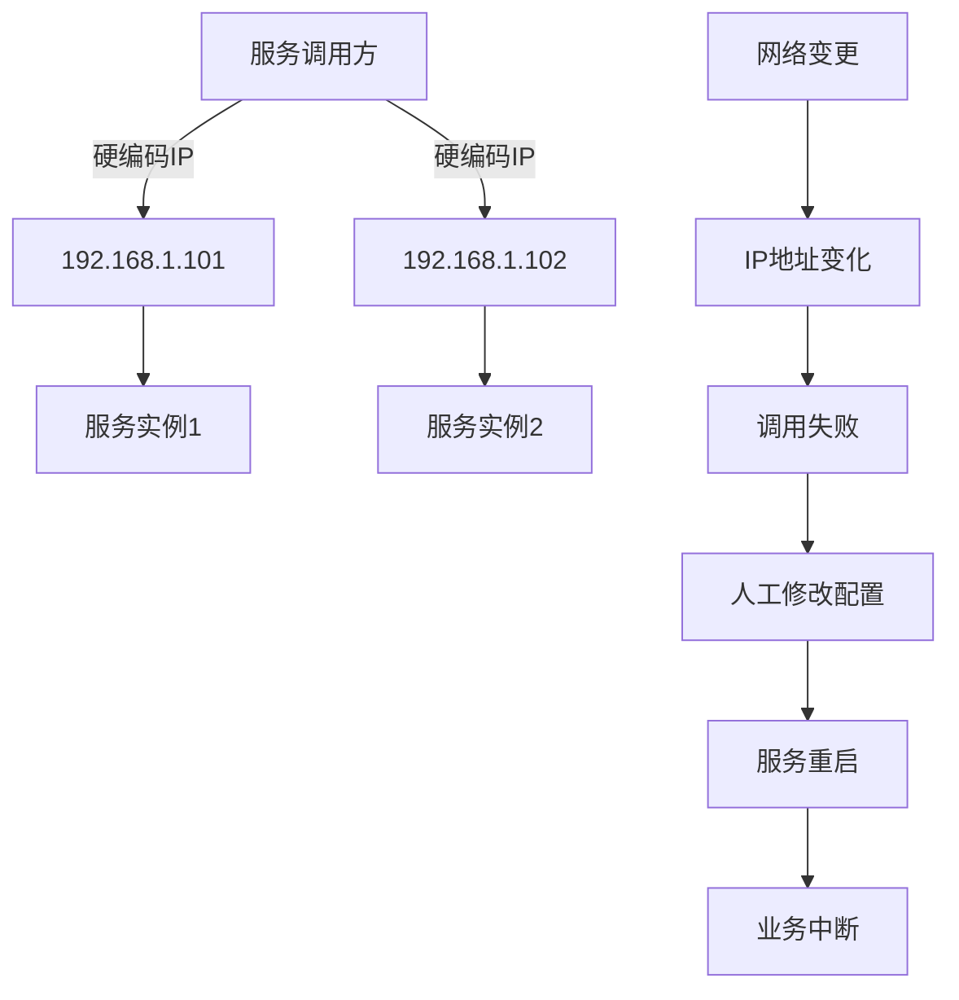
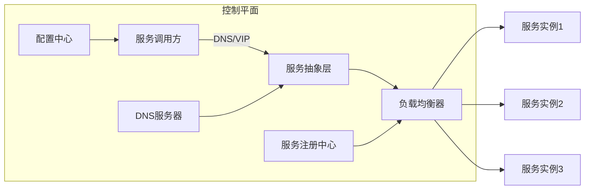
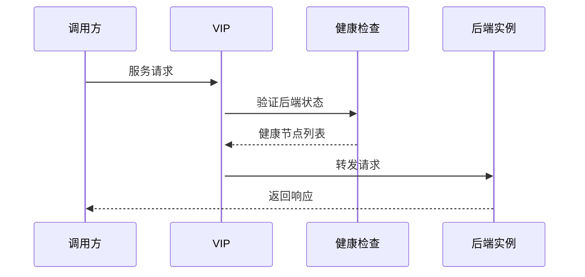
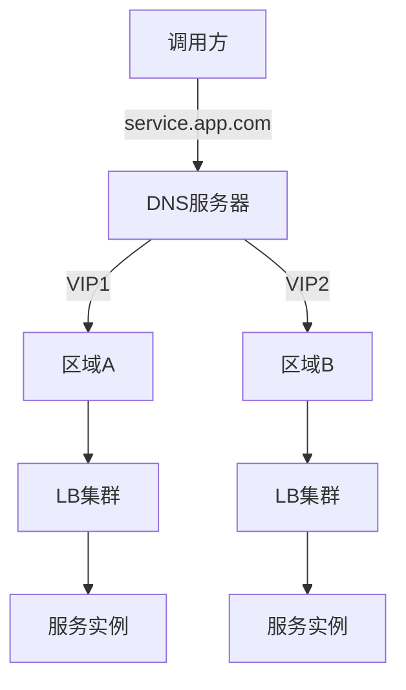
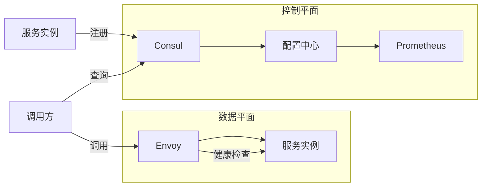
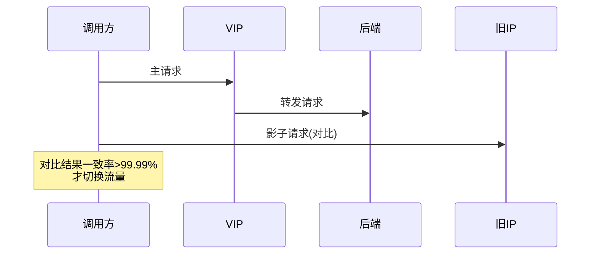
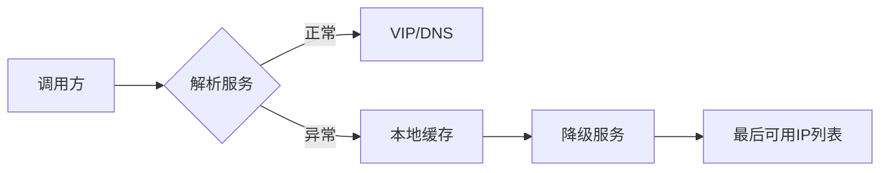
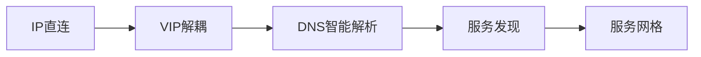
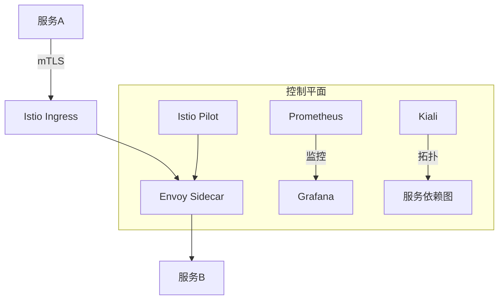

# 基于DNS/VIP的服务地址解耦方案设计与实施

## 问题深度剖析：IP硬编码的七宗罪

### 1. **架构脆弱性分析**


### 2. 具体痛点表现：
- **变更灾难**：IP变更需全量服务重启，平均影响时间>30分钟
- **扩容困难**：新增节点需手动配置所有调用方
- **故障转移延迟**：实例故障时无法自动切换
- **环境混乱**：开发/测试/生产环境IP混用风险
- **安全脆弱**：IP暴露增加攻击面

## 解决方案：三级解耦架构

### 整体架构设计


### 阶段1：VIP基础解耦（快速见效）

#### 技术方案：


#### 实施步骤：
1. **VIP部署**：
   - 使用Keepalived+LVS实现高可用VIP
   ```bash
   # Keepalived 配置示例
   vrrp_instance VI_1 {
       state MASTER
       interface eth0
       virtual_router_id 51
       priority 100
       virtual_ipaddress {
           192.168.100.100  # VIP地址
       }
   }
   ```

2. **服务迁移**：
   | 服务类型       | 迁移方案                     |
   |----------------|----------------------------|
   | HTTP服务       | Nginx反向代理              |
   | TCP服务        | HAProxy/LVS负载均衡        |
   | 数据库         | MySQL Router/MaxScale      |

3. **客户端改造**：
   ```diff
   # 原配置
   - db.host=192.168.1.101
   + db.host=192.168.100.100
   ```

### 阶段2：DNS智能解析（中级方案）

#### 架构升级：


#### 核心组件：
1. **DNS服务器选择**：
   | 类型             | 适用场景                  | 推荐方案          |
   |------------------|-------------------------|------------------|
   | 云服务商DNS       | 公有云环境              | AWS Route53      |
   | 自建DNS          | 私有化部署              | Bind9+DLZ        |
   | 混合方案          | 多云/混合云            | NS1+Consul       |

2. **智能解析策略**：
   ```bash
   # Bind9 视图配置示例
   view "internal" {
       match-clients { 10.0.0.0/8; };
       zone "service.app.com" {
           type master;
           file "internal-service.zone";
       };
   }
   
   view "external" {
       match-clients { any; };
       zone "service.app.com" {
           type master;
           file "external-service.zone";
       };
   }
   ```

### 阶段3：服务发现集成（终极方案）

#### 现代架构：


#### 核心组件实现：
1. **服务注册**：
   ```go
   // 服务注册示例
   func registerService() {
       config := api.DefaultConfig()
       client, _ := api.NewClient(config)
       
       registration := &api.AgentServiceRegistration{
           ID:   "redis-01",
           Name: "redis",
           Address: "10.5.2.1",
           Port: 6379,
           Check: &api.AgentServiceCheck{
               TCP:      "10.5.2.1:6379",
               Interval: "10s",
               Timeout:  "1s",
           },
       }
       client.Agent().ServiceRegister(registration)
   }
   ```

2. **客户端解析**：
   ```java
   // Spring Cloud Consul 示例
   @FeignClient(name = "inventory-service")
   public interface InventoryClient {
       @GetMapping("/stock/{itemId}")
       StockInfo getStock(@PathVariable String itemId);
   }
   ```

## 迁移路径：四步平稳过渡

### 迁移路线图
```mermaid
gantt
    title 服务解耦迁移计划
    dateFormat  YYYY-MM-DD
    section 准备工作
    资产梳理       ：2023-08-01, 7d
    环境隔离       ：2023-08-08, 3d
    
    section 阶段实施
    VIP部署       ：2023-08-11, 5d
    DNS切换       ：2023-08-16, 7d
    服务发现集成   ：2023-08-23, 10d
    
    section 验证优化
    监控验证       ：2023-09-02, 5d
    性能调优       ：2023-09-07, 5d
```

### 双轨运行机制


## 核心优势与收益

### 架构能力对比
| **能力**         | IP直连 | VIP方案 | DNS方案 | 服务发现 |
|------------------|--------|---------|---------|----------|
| 变更影响范围     | 全系统 | LB节点  | DNS缓存 | 无感知   |
| 故障恢复时间     | >30min | <5s     | <60s    | <1s      |
| 扩容复杂度       | 极高   | 中等    | 低      | 全自动   |
| 跨区域支持       | 不支持 | 有限    | 完善    | 完善     |
| 技术债务         | 100%   | 40%     | 20%     | <5%      |

### 量化收益


## 风险控制策略

### 熔断机制设计


### 应急预案
1. **DNS故障**：
   ```bash
   # 临时hosts覆盖
   echo "192.168.100.100 service.app.com" >> /etc/hosts
   ```
   
2. **VIP漂移失败**：
   ```bash
   # 手动绑定VIP
   ip addr add 192.168.100.100/24 dev eth0
   ```

3. **服务注册中心宕机**：
   - 启用本地缓存快照
   - 切换静态配置文件模式

## 演进路线建议

### 技术演进路径


### 服务网格终局架构


## 实施总结

### 核心原则
1. **渐进式改造**：
   - 从VIP基础解耦开始，逐步升级到服务网格
   - 每个阶段确保可回退

2. **环境隔离**：
   ```yaml
   # 多环境DNS配置
   environments:
     dev: service-dev.app.com
     test: service-test.app.com
     prod: service.app.com
   ```

3. **监控三要素**：
   - 解析成功率（DNS/VIP）
   - 端点健康状态
   - 请求延迟百分位

### 关键决策点
1. **何时选择VIP**：
   - 遗留系统改造预算有限
   - 服务规模<50节点
   - 无多云部署需求

2. **何时选择服务发现**：
   - 微服务架构
   - 动态扩缩容需求
   - 多区域部署

> **架构警示**：IP直连如同在代码中埋设定时炸弹，而DNS/VIP方案是拆除引信的第一步。拒绝"还能用就不改"的妥协思维，今日的改造投入将避免未来的灾难性故障。