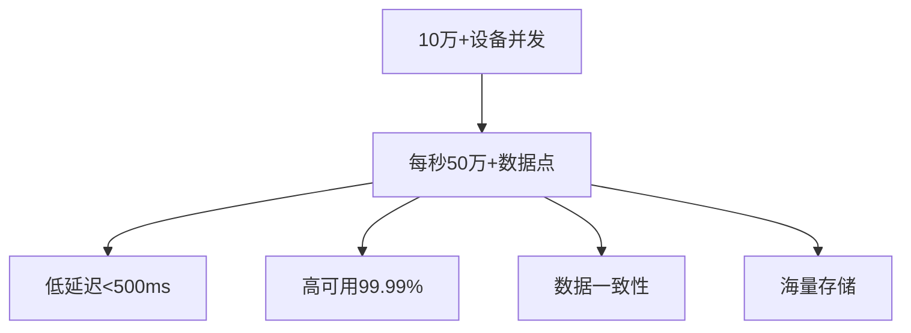
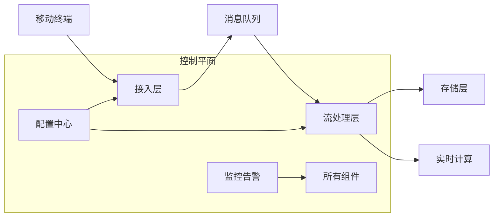
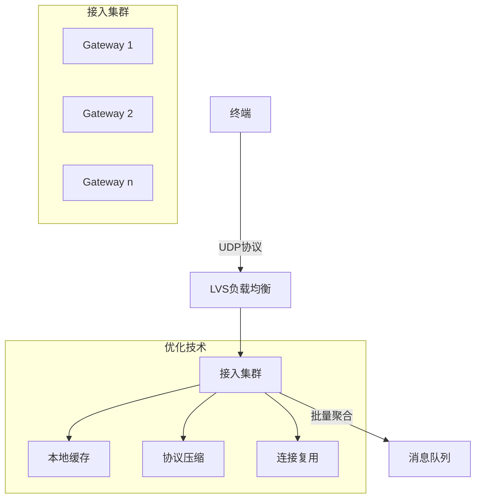
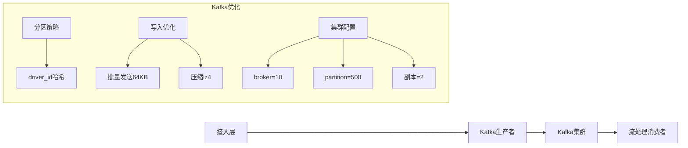
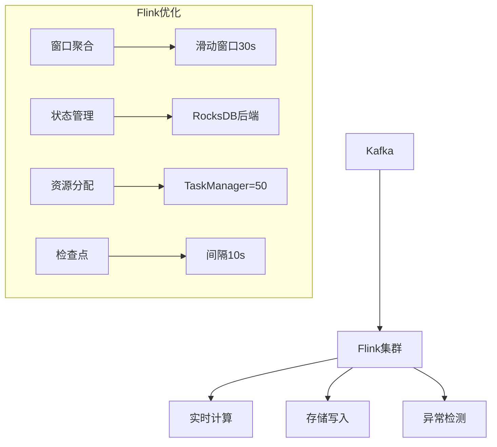
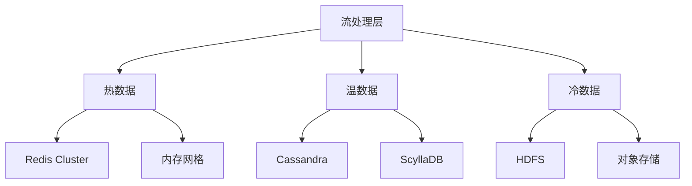
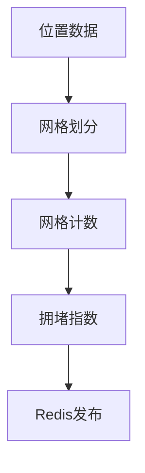
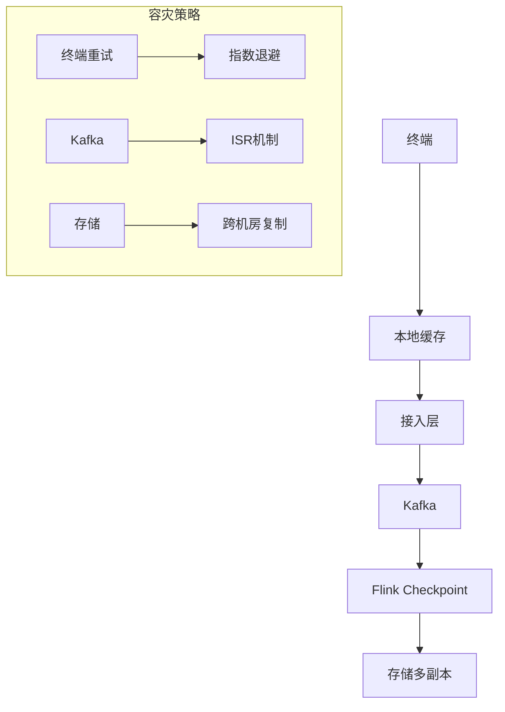
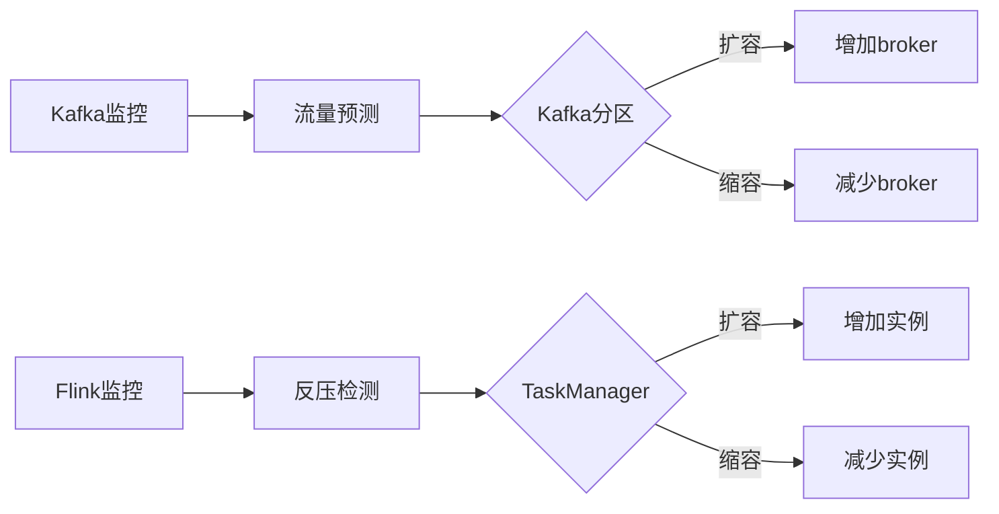

# 出租车位置实时上报高并发架构设计（10万+ TPS）

## 需求分析：挑战与痛点


## 架构设计总览


## 一、数据采集层优化（终端→接入层）

### 1. 高效通信协议设计
```protobuf
syntax = "proto3";

message LocationReport {
  string driver_id = 1;      // 司机ID
  string vehicle_id = 2;     // 车辆ID
  double latitude = 3;       // 纬度
  double longitude = 4;      // 经度
  int64 timestamp = 5;       // 时间戳(ms)
  float speed = 6;           // 速度(km/h)
  int32 direction = 7;       // 方向(0-359)
  LocationQoS qos = 8;       // 服务质量
}

message LocationQoS {
  int32 accuracy = 1;        // 定位精度(m)
  int32 battery = 2;         // 设备电量(%)
  int32 signal = 3;          // 信号强度(0-5)
}
```

### 2. 接入层设计（关键组件）


**核心优化点**：
- **协议选择**：UDP代替TCP（允许5%数据丢失）
- **批量聚合**：每100ms或100条记录批量发送
- **压缩算法**：Snappy实时压缩（压缩率50%）
- **动态限流**：基于后端压力的反馈控制

## 二、消息缓冲层（千万级吞吐保障）

### 技术选型对比
| 消息系统     | 吞吐量    | 延迟    | 适用场景                |
|-------------|----------|--------|-----------------------|
| Kafka       | 百万TPS  | 5-10ms | 高吞吐持久化           |
| Pulsar      | 百万TPS  | 5-15ms | 多租户云原生           |
| NSQ         | 50万TPS  | <5ms   | 简单轻量级             |
| **推荐方案**|          |        | **Kafka + 分区优化**   |

### Kafka集群优化方案


**关键配置**：
```yaml
# producer.properties
batch.size=65536         # 64KB批量
linger.ms=20             # 最大等待20ms
compression.type=lz4     # LZ4压缩
acks=1                   # 平衡可靠性与延迟

# broker.properties
num.io.threads=16        # 高并发IO
socket.send.buffer.bytes=1024000 # 1MB缓冲区
log.flush.interval.messages=100000 # 减少刷盘
```

## 三、流处理层（实时处理引擎）

### 架构设计


### 核心处理逻辑
```java
public class LocationStreamJob {
    public static void main(String[] args) {
        StreamExecutionEnvironment env = StreamExecutionEnvironment.getExecutionEnvironment();
        
        // 1. Kafka数据源
        DataStream<LocationReport> stream = env
            .addSource(new FlinkKafkaConsumer<>("location-topic", new LocationDeserializer(), props))
            .uid("kafka-source");
        
        // 2. 实时轨迹平滑
        DataStream<LocationReport> cleanedStream = stream
            .keyBy(LocationReport::getDriverId)
            .process(new KalmanFilterProcessFunction());
        
        // 3. 批量写入存储
        cleanedStream.addSink(new CassandraSink());
        
        // 4. 实时路况计算
        cleanedStream
            .windowAll(SlidingProcessingTimeWindows.of(Time.seconds(30), Time.seconds(5)))
            .aggregate(new TrafficDensityAggregator())
            .addSink(new RedisSink());
    }
}
```

## 四、存储层设计（海量数据存储）

### 分级存储架构


### 热数据存储：Redis Cluster
```mermaid
graph LR
    A[Flink] --> B[Redis Proxy]
    B --> C[Redis Cluster]
    C --> D[分片1]
    C --> E[分片2]
    C --> F[分片32]
    
    subgraph 数据结构
        D1[Hash] --> K1[driver:123]
        D1 --> V1[{"lat":39.9,"lng":116.4,"ts":1689291000}]
        D2[SortedSet] --> K2[vehicle:456]
        D2 --> V2[[timestamp, location]]
    end
```

**优化策略**：
- 分片策略：`CRC32(driver_id) % 16384`
- 内存优化：启用ziplist编码
- 持久化：AOF每秒刷盘

### 温数据存储：ScyllaDB
**表设计**：
```sql
CREATE TABLE driver_locations (
    driver_id text,
    bucket int,  -- 按小时分桶
    timestamp timestamp,
    latitude double,
    longitude double,
    speed float,
    PRIMARY KEY ((driver_id, bucket), timestamp)
) WITH CLUSTERING ORDER BY (timestamp DESC)
  AND compaction = {'class': 'TimeWindowCompactionStrategy'};
```

**优势**：
- 自动分片
- 高性能SSD优化
- 压缩率>80%

## 五、实时计算路径

### 1. 实时路况计算


### 2. 异常驾驶检测
```python
def detect_anomaly(driver_locations):
    # 1. 速度突变检测
    if abs(current_speed - avg_speed) > 3 * std_dev:
        return "SPIKE"
    
    # 2. 停留检测
    if haversine(last_10_points) < 100:  # 100米内移动
        return "PARKING"
    
    # 3. 路径偏离
    if distance_to_route(current_pos) > 1000:
        return "DEVIATION"
```

## 六、容灾与高可用设计

### 多级容错机制


**熔断降级策略**：
```yaml
# 降级规则配置
rules:
  - resource: location_processing
    strategy: throughput
    threshold: 80000  # 最大处理能力
    fallback: 
      - sample_rate: 0.2  # 采样率20%
      - discard_oldest: true
```

## 七、性能压测方案

### 压测模型
```python
class LocationSimulator:
    def __init__(self, driver_count=100000):
        self.drivers = [Driver(id) for id in range(driver_count)]
    
    def generate_report(self):
        while running:
            for driver in self.drivers:
                report = driver.move()  # 模拟移动
                send(report)
            sleep(3)  # 3秒间隔
```

### 压测结果目标
| 指标         | 目标值         |
|-------------|---------------|
| 吞吐量       | >120,000 TPS  |
| P99延迟      | <500ms        |
| 数据完整性   | >99.99%       |
| 资源利用率   | CPU<70%, MEM<80% |

## 八、成本优化策略

### 1. 数据生命周期管理
| 数据类型 | 保留策略       | 存储成本 |
|---------|----------------|---------|
| 热数据   | 2小时          | $3/GB   |
| 温数据   | 7天            | $1/GB   |
| 冷数据   | 1年（压缩归档）| $0.2/GB |

### 2. 弹性扩缩容


## 九、演进路线图

```mermaid
gantt
    title 架构演进路线
    dateFormat  YYYY-MM-DD
    section 基础能力
    接入层优化   ：2023-08-01, 30d
    消息队列部署 ：2023-08-15, 30d
    实时处理框架 ：2023-09-01, 30d
    
    section 进阶能力
    智能降级    ：2023-10-01, 20d
    边缘计算    ：2023-10-15, 30d
    AI预测优化  ：2023-11-01, 45d
    
    section 未来扩展
    数字孪生城市 ：2024-01-01, 90d
```

## 总结：架构优势

1. **水平扩展能力**：每个组件均可独立扩展
2. **端到端优化**：从协议到存储的全链路优化
3. **智能降级**：保障核心业务高可用
4. **成本可控**：分级存储+弹性扩缩容
5. **实时分析**：毫秒级延迟的实时计算

> **关键创新点**：  
> - 基于UDP的轻量级位置协议  
> - Kafka分区动态再平衡机制  
> - 流处理层的状态管理优化  
> - 四级存储生命周期管理  
> 
> **典型部署规模**：  
> - 接入层：50节点（4核8G）  
> - Kafka集群：12节点（16核64G）  
> - Flink集群：30 TaskManager（8核32G）  
> - 存储层：Redis 32分片 + ScyllaDB 12节点
