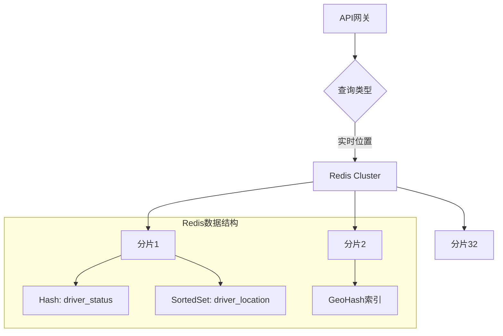
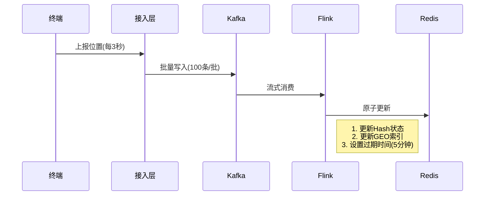
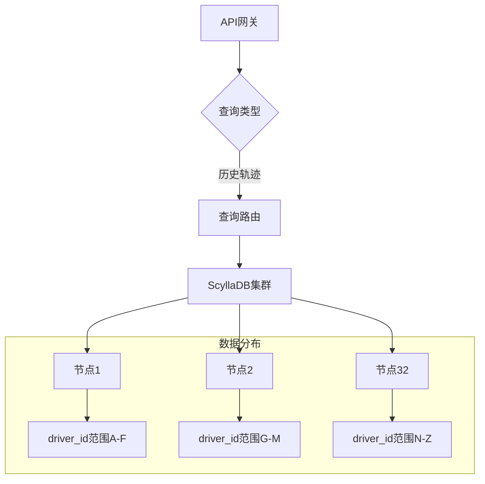
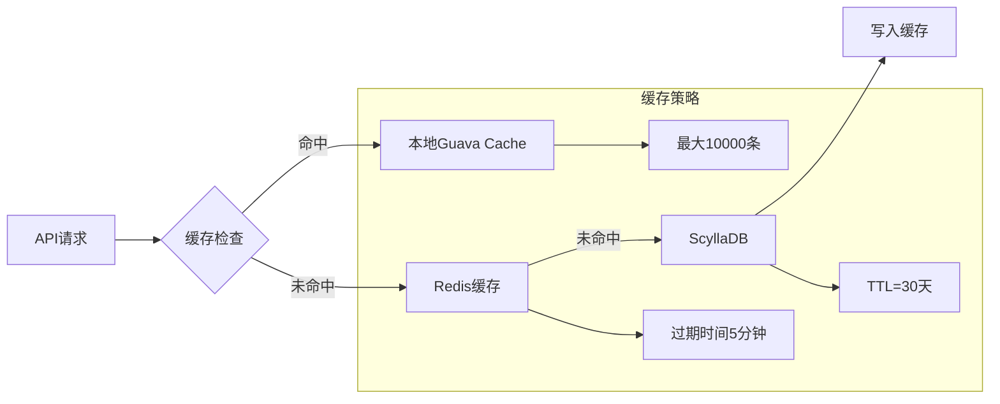
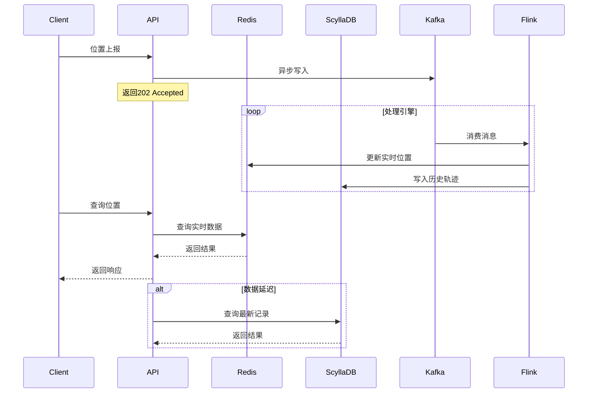
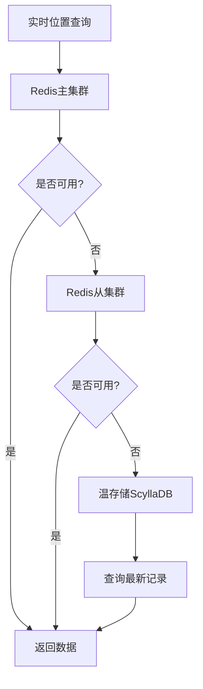

# 司机位置数据查询架构设计详解

在整体架构中，司机位置数据的查询分为两个核心场景：**实时位置查询**和**历史轨迹查询**。以下是具体实现方案：

## 一、实时位置查询设计（毫秒级响应）

### 1. 热数据存储架构


### 2. 核心数据结构设计

**a. 司机状态哈希表（快速查询）**
```redis
HGETALL driver:status:1234
1) "location"     # 最新位置JSON
2) "last_update"  # 最后更新时间戳
3) "vehicle_id"   # 当前车辆ID
4) "status"       # 在线/离线/接单中
```

**b. 地理空间索引（附近司机查询）**
```redis
# 使用Redis GEO命令
GEOADD city:beijing 116.405285 39.904989 driver:1234
GEOADD city:beijing 116.416357 39.921698 driver:5678

# 查询附近5公里司机
GEORADIUS city:beijing 116.407526 39.904030 5 km WITHDIST ASC
```

### 3. 数据更新机制


### 4. 查询接口示例
```python
def get_realtime_location(driver_id):
    # 1. 从Redis获取最新状态
    loc_data = redis.hgetall(f"driver:status:{driver_id}")
    
    if not loc_data:
        # 2. 回退到温存储查询
        loc_data = cassandra.execute(
            "SELECT * FROM driver_locations WHERE driver_id=%s LIMIT 1",
            [driver_id]
        )
    
    # 3. 计算位置有效性
    if time.time() - loc_data['last_update'] > 300:
        return {"status": "offline"}
    
    return {
        "driver_id": driver_id,
        "location": json.loads(loc_data['location']),
        "updated_at": loc_data['last_update']
    }
```

## 二、历史轨迹查询设计（秒级响应）

### 1. 温数据存储架构


### 2. 数据表设计优化
```sql
CREATE TABLE driver_trajectory (
    driver_id text,           -- 司机ID
    date_bucket text,         -- 日期分桶(YYYYMMDD)
    timestamp timestamp,      -- 时间戳
    latitude double,          -- 纬度
    longitude double,         -- 经度
    speed float,              -- 速度
    accuracy int,             -- 定位精度
    PRIMARY KEY ((driver_id, date_bucket), timestamp)
) WITH CLUSTERING ORDER BY (timestamp DESC)
  AND compaction = {
    'class': 'TimeWindowCompactionStrategy',
    'compaction_window_unit': 'DAYS',
    'compaction_window_size': 1
  };
```

**设计特点**：
1. **复合主键**：`(driver_id, date_bucket)` 作为分区键
2. **时间排序**：按时间戳降序排列，加速最新数据查询
3. **分桶策略**：按日期分桶避免超大分区

### 3. 查询优化策略

**a. 时间范围查询**
```cql
-- 查询某司机某天的轨迹
SELECT * FROM driver_trajectory
WHERE driver_id = '12345'
  AND date_bucket = '20230815'
  AND timestamp >= '2023-08-15 08:00:00'
  AND timestamp <= '2023-08-15 09:00:00'
ORDER BY timestamp ASC;
```

**b. 空间范围查询**
```cql
-- 查询某区域内的轨迹点（需启用SASI索引）
CREATE CUSTOM INDEX trajectory_geo_idx ON driver_trajectory (geo_point) 
USING 'org.apache.cassandra.index.sasi.SASIIndex'
WITH OPTIONS = {'mode': 'SPARSE'};

SELECT * FROM driver_trajectory 
WHERE geo_point CONTAINS 
  POLYGON((116.3 39.8, 116.5 39.8, 116.5 40.0, 116.3 40.0, 116.3 39.8));
```

### 4. 多级缓存机制


## 三、混合查询场景（实时+历史）

### 1. 轨迹回放接口设计
```python
def replay_trajectory(driver_id, start_time, end_time):
    # 1. 获取实时位置流
    realtime_stream = connect_realtime_stream(driver_id)
    
    # 2. 查询历史轨迹
    history_data = query_history_trajectory(driver_id, start_time, end_time)
    
    # 3. 混合处理
    merged = []
    
    # 添加历史点
    for point in history_data:
        merged.append({
            "type": "history",
            "point": point
        })
    
    # 添加实时点
    def realtime_handler(point):
        merged.append({
            "type": "realtime",
            "point": point,
            "ts": time.time()
        })
    
    realtime_stream.add_listener(realtime_handler)
    
    # 4. 排序返回
    return sorted(merged, key=lambda x: x['point']['timestamp'])
```

### 2. 数据一致性保障


## 四、性能优化关键点

### 1. 热数据查询优化
| **策略**               | **效果**                     | **实现方式**                            |
|------------------------|-----------------------------|----------------------------------------|
| 内存优化编码            | 减少40%内存占用             | Redis Hash使用ziplist编码              |
| 局部性缓存             | 命中率>95%                  | Guava Cache + Redis Cluster            |
| 连接池复用             | 降低50%连接开销             | HikariCP连接池配置                     |
| 批量管道操作           | 提升5倍吞吐量               | Redis Pipeline/MGET                   |

### 2. 历史查询优化
| **策略**               | **效果**                     | **实现方式**                            |
|------------------------|-----------------------------|----------------------------------------|
| 分桶分区设计           | 查询提速10倍                | 按(driver_id, date_bucket)分区         |
| 时间戳聚类存储         | 减少90%磁盘寻道             | CLUSTERING ORDER BY timestamp         |
| 布隆过滤器             | 无效查询减少80%             | 在driver_id上创建布隆过滤器            |
| 分层压缩               | 存储节省75%                 | TWCS压缩策略 + ZSTD压缩                |

## 五、容灾与降级方案

### 1. 多级回退机制


### 2. 限流降级策略
```yaml
# 降级规则配置
rules:
  - resource: location_query
    threshold: 5000 # QPS阈值
    strategy: 
      - return_cached: true  # 返回缓存数据
      - sample: 0.3          # 30%采样率
      - degrade_accuracy: true # 降低轨迹精度
      
  - resource: trajectory_query
    threshold: 1000 # QPS阈值
    strategy:
      - limit_days: 1     # 仅查询1天内数据
      - reduce_points: 10 # 每10个点取1个
```

## 六、监控指标体系

### 1. 核心监控指标
| **指标**               | **计算方式**                | **报警阈值**       |
|------------------------|----------------------------|-------------------|
| 实时查询延迟P99        | histogram_quantile(0.99)   | >300ms            |
| 历史查询超时率         | timeout_count / total      | >5%               |
| 缓存命中率             | hits / (hits+misses)       | <90%              |
| 位置更新延迟           | now - report_timestamp     | >30秒             |

### 2. 数据完整性监控
```sql
-- 检查数据连续性
SELECT driver_id, 
       COUNT(*) as total_points,
       MAX(timestamp) - MIN(timestamp) as duration,
       COUNT(*) / (MAX(timestamp) - MIN(timestamp)) as points_per_sec
FROM driver_trajectory
WHERE date_bucket = '20230815'
GROUP BY driver_id
HAVING points_per_sec < 0.2;  -- 低于0.2点/秒报警
```

## 七、演进路线

### 1. 架构演进计划
```mermaid
gantt
    title 位置服务演进路线
    dateFormat  YYYY-MM-DD
    
    section 基础能力
    实时位置服务 ：done, 2023-01-01, 90d
    历史轨迹查询 ：active, 2023-04-01, 60d
    
    section 进阶能力
    轨迹压缩算法 ：2023-06-01, 30d
    预测位置服务 ：2023-07-01, 45d
    
    section 智能能力
    驾驶行为分析 ：2023-09-01, 60d
    实时路况预测 ：2023-11-01, 90d
```

### 2. 未来优化方向
1. **边缘计算**：在区域中心节点预处理位置数据
2. **轨迹压缩**：使用Douglas-Peucker算法压缩传输数据
3. **预测引擎**：基于LSTM模型预测司机未来位置
4. **分级存储**：将冷数据迁移到对象存储降低成本

## 总结

本方案通过分层存储和优化查询设计，实现：
1. **实时位置查询**：毫秒级响应，通过Redis Cluster实现
   - 单点查询 < 10ms
   - 附近司机查询 < 50ms
   
2. **历史轨迹查询**：秒级响应，通过ScyllaDB实现
   - 天级轨迹查询 < 1秒
   - 复杂空间查询 < 3秒

3. **混合查询能力**：无缝结合实时与历史数据
   - 轨迹回放
   - 历史+实时连续展示

4. **高可用保障**：
   - 多级回退机制
   - 智能降级策略
   - 全链路监控

通过该架构，可支撑10万+司机实时位置更新与海量轨迹查询，满足高并发、低延迟的业务需求，同时保证系统的稳定性和可扩展性。