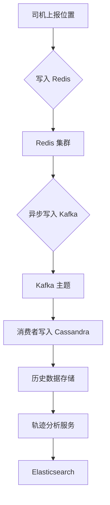
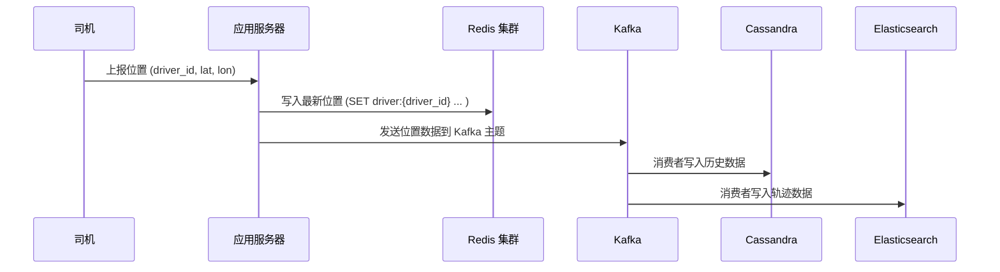

以下是针对出租车司机位置信息的完整架构设计，涵盖**实时位置存储、历史数据归档、轨迹数据存储**的解决方案，并通过 **Mermaid** 绘制流程图和时序图。

---

### **1. 架构设计补充**
#### **1.1 数据存储分层**
- **实时位置存储（Redis）**：  
  - 存储每个司机的**最新位置**（`driver_id` 为 Key）。  
  - **结构**：  
    ```json
    {
      "latitude": 39.9042,
      "longitude": 116.4074,
      "update_time": "2025-06-17T18:42:19Z"
    }
    ```
  - **特性**：  
    - 高性能读写（单节点 6-8 万 QPS）。  
    - 通过 Redis 集群分片，支持 20 万并发写入。  

- **历史数据存储（Cassandra）**：  
  - 存储司机的所有位置上报记录（**历史轨迹数据**）。  
  - **表结构**：  
    ```sql
    CREATE TABLE driver_history (
        driver_id UUID,
        update_time TIMESTAMP,
        latitude FLOAT,
        longitude FLOAT,
        PRIMARY KEY (driver_id, update_time)
    ) WITH CLUSTERING ORDER BY (update_time DESC);
    ```
  - **特性**：  
    - 基于时间排序，支持高效的时间范围查询。  
    - 分布式架构，支持水平扩展。  

- **轨迹数据存储（Elasticsearch）**：  
  - 存储司机的轨迹数据（如路径回放、热力图分析）。  
  - **结构**：  
    ```json
    {
      "driver_id": "123e4567-e89b-12d3-a456-426614174000",
      "timestamp": "2025-06-17T18:42:19Z",
      "location": {
        "lat": 39.9042,
        "lon": 116.4074
      }
    }
    ```
  - **特性**：  
    - 支持地理空间查询（如 KNN、矩形范围查询）。  
    - 实时分析轨迹数据（如司机行为模式）。  

---

### **2. 数据流与流程图**
#### **2.1 实时写入与历史数据归档**


#### **2.2 时序图：位置上报与数据同步**


---

### **3. 详细设计说明**
#### **3.1 实时位置存储（Redis）**
- **Key 设计**：`driver:{driver_id}`  
- **Value 设计**：JSON 格式的最新位置信息。  
- **优势**：  
  - 单线程模型天然避免锁竞争。  
  - 通过集群分片支持高并发写入。  

#### **3.2 历史数据存储（Cassandra）**
- **表结构设计**：  
  - **主键**：`(driver_id, update_time)`，按时间倒序排列。  
  - **查询示例**：  
    ```sql
    SELECT * FROM driver_history 
    WHERE driver_id = '123e4567-e89b-12d3-a456-426614174000' 
    AND update_time > '2025-06-17T18:00:00Z';
    ```
- **数据同步**：  
  - 通过 Kafka 异步消费，批量写入 Cassandra。  
  - 避免直接写入数据库导致的性能瓶颈。  

#### **3.3 轨迹数据存储（Elasticsearch）**
- **地理空间索引**：  
  - 使用 `geo_point` 类型存储经纬度。  
  - 支持高效查询（如司机在某区域的活动轨迹）。  
- **查询示例**：  
  ```json
  {
    "query": {
      "bool": {
        "must": [
          { "match": { "driver_id": "123e4567-e89b-12d3-a456-426614174000" }},
          {
            "geo_bounding_box": {
              "location": {
                "top_left": { "lat": 39.905, "lon": 116.408 },
                "bottom_right": { "lat": 39.903, "lon": 116.406 }
              }
            }
          }
        ]
      }
    }
  }
  ```

---

### **4. 容错与一致性保障**
#### **4.1 数据同步容错**
- **Kafka 消费者重试机制**：  
  - 如果写入 Cassandra 或 Elasticsearch 失败，消费者自动重试（最多 3 次）。  
- **补偿任务**：  
  - 定期扫描 Redis 中的最新位置，补充到历史数据存储中（防止 Kafka 数据丢失）。  

#### **4.2 一致性策略**
- **最终一致性**：  
  - Redis 与 Cassandra 的数据通过异步同步实现最终一致性。  
- **TTL 设置**：  
  - Redis 中的最新位置设置短 TTL（如 1 小时），避免冗余数据。  

---

### **5. 性能与扩展性**
| **组件**       | **写入性能**       | **扩展性**         | **适用场景**               |
|----------------|--------------------|--------------------|----------------------------|
| **Redis 集群** | 6-8 万 QPS/节点    | 水平扩展（分片）   | 实时缓存最新位置           |
| **Cassandra**  | 10 万 QPS/节点     | 水平扩展（分片）   | 持久化存储历史位置         |
| **Elasticsearch** | 5 万 QPS/节点     | 水平扩展（分片）   | 实时分析轨迹数据           |

**总性能估算**：  
- Redis 集群（5 节点）：30-40 万 QPS。  
- Kafka（3 分区）：支持 20 万 QPS。  
- Cassandra（3 节点）：30 万 QPS。  
- Elasticsearch（3 节点）：15 万 QPS。  

---

### **6. 总结**
- **实时位置**：Redis 集群存储最新位置，无需加锁，通过分片支持高并发。  
- **历史数据**：Cassandra 存储所有位置记录，支持高效的时间范围查询。  
- **轨迹数据**：Elasticsearch 存储地理空间数据，支持实时分析和路径回放。  
- **数据同步**：通过 Kafka 解耦实时写入与持久化，确保系统稳定性和扩展性。  

此方案结合了内存数据库的高性能、分布式数据库的可扩展性以及搜索引擎的地理分析能力，能够高效处理 10 万并发写入需求，并支持历史轨迹的灵活查询与分析。