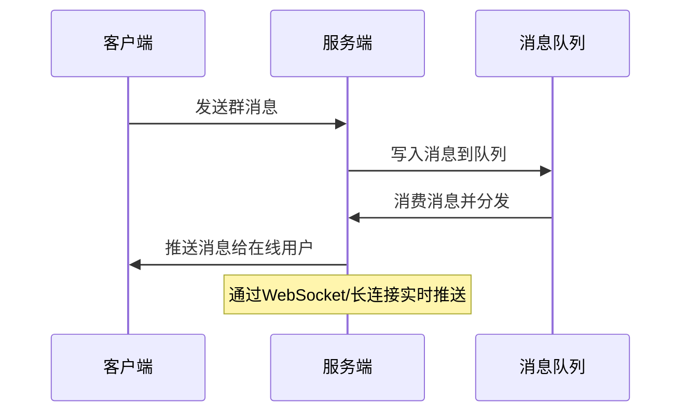
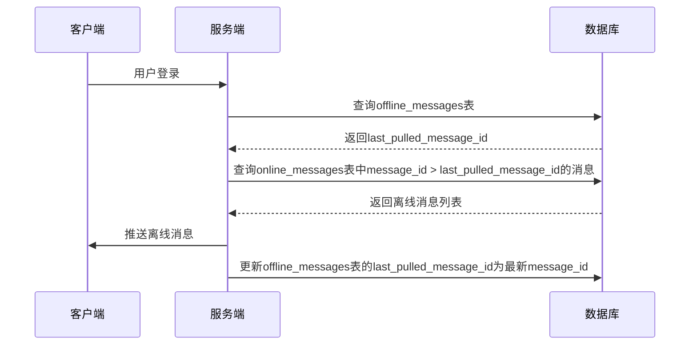
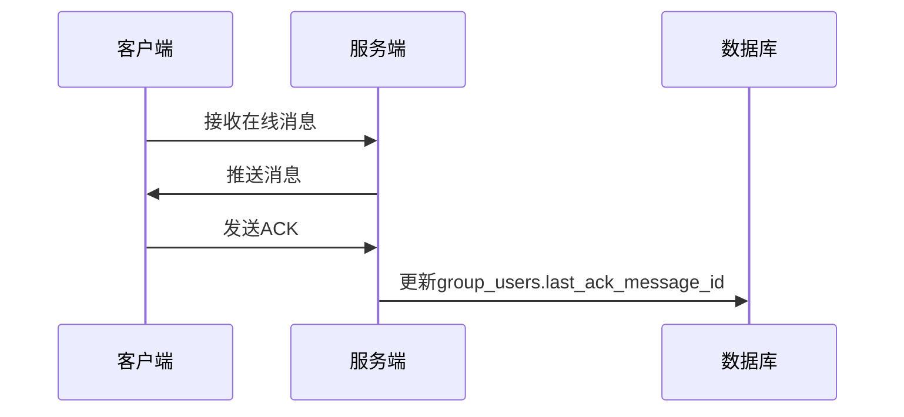

以下是针对IM群消息的详细技术设计方案，重点解决**实时性**与**可达性**，并结合离线消息的存储优化和ACK机制：

---

### **一、核心设计目标**
1. **实时性**：在线消息需实时推送，延迟控制在毫秒级。
2. **可达性**：离线消息需保证用户登录后可完整拉取，且不丢失。
3. **存储优化**：减少冗余数据，避免离线消息表频繁更新。
4. **ACK机制**：通过`last_ack_message_id`优化离线消息拉取流程。

---

### **二、数据表设计**
#### **1. 在线消息表（`online_messages`）**
- **用途**：实时分发群消息，供在线用户直接拉取。
- **字段设计**：
  ```sql
  CREATE TABLE online_messages (
      message_id UUID PRIMARY KEY,          -- 消息唯一ID
      group_id TEXT NOT NULL,               -- 群ID
      content TEXT,                         -- 消息内容
      sender_uid TEXT NOT NULL,             -- 发送者ID
      timestamp TIMESTAMP NOT NULL,         -- 消息时间戳
      msg_type INT,                         -- 消息类型（文本/图片等）
      media_url TEXT                        -- 媒体文件URL（可选）
  );
  ```
- **索引**：按`group_id`和`timestamp`建立索引，支持按群ID快速查询最新消息。

#### **2. 离线消息表（`offline_messages`）**
- **用途**：存储用户离线时的群消息，仅记录用户未拉取的消息范围。
- **字段设计**：
  ```sql
  CREATE TABLE offline_messages (
      user_id TEXT NOT NULL,                -- 用户ID
      group_id TEXT NOT NULL,               -- 群ID
      last_pulled_message_id UUID,          -- 用户最后一次拉取的message_id
      PRIMARY KEY (user_id, group_id)
  );
  ```
- **特点**：
  - **无需存储完整消息**，仅记录用户未拉取的消息起始ID。
  - 用户登录后，根据`last_pulled_message_id`拉取该ID之后的所有群消息。

#### **3. 用户群关系表（`group_users`）**
- **用途**：维护用户与群组的关系，并记录ACK状态。
- **字段设计**：
  ```sql
  CREATE TABLE group_users (
      user_id TEXT NOT NULL,                -- 用户ID
      group_id TEXT NOT NULL,               -- 群ID
      join_time TIMESTAMP NOT NULL,         -- 加入群时间
      last_ack_message_id UUID,             -- 用户最后确认的消息ID
      is_online BOOLEAN DEFAULT FALSE,      -- 用户是否在线
      PRIMARY KEY (user_id, group_id)
  );
  ```
- **作用**：
  - `last_ack_message_id`：记录用户已确认接收的最新消息ID。
  - `is_online`：标记用户当前在线状态，用于消息路由。

---

### **三、消息处理流程**
#### **1. 在线消息处理**

- **流程说明**：
  1. 用户发送群消息后，服务端将消息写入`online_messages`表。
  2. 消息通过Kafka广播到所有群成员。
  3. 在线用户通过WebSocket或长连接实时接收消息。
  4. 接收方客户端收到消息后，向服务端发送ACK，更新`group_users.last_ack_message_id`。

#### **2. 离线消息处理**

- **流程说明**：
  1. 用户登录时，服务端从`offline_messages`表获取其最后一次拉取的`last_pulled_message_id`。
  2. 根据该ID，从`online_messages`表查询该群ID下所有未拉取的消息。
  3. 将离线消息推送给用户，并更新`offline_messages`表的`last_pulled_message_id`为最新消息ID。
  4. **无需更新`online_messages`表**，因为消息已持久化。

---

### **四、ACK机制优化**
#### **1. ACK流程**

- **作用**：
  - 客户端收到消息后，向服务端发送ACK。
  - 服务端更新`group_users.last_ack_message_id`，标记该消息已确认。
  - **离线消息表无需更新**，仅通过`last_pulled_message_id`和`last_ack_message_id`的差值判断未读消息。

#### **2. 优势**
- **减少数据库操作**：ACK仅更新用户状态表，无需频繁修改离线消息表。
- **轻量化流程**：离线消息表仅存储用户拉取进度，而非完整消息。

---

### **五、离线消息管理**
#### **1. 消息拉取逻辑**
- **分页拉取**：用户登录后，按`last_pulled_message_id`分页拉取消息（如每次拉取200条）。
- **SQL示例**：
  ```sql
  SELECT * FROM online_messages
  WHERE group_id = 'group_123'
    AND message_id > 'last_pulled_message_id'
  ORDER BY timestamp ASC
  LIMIT 200;
  ```

#### **2. 消息清理策略**
- **自动过期**：离线消息在用户登录后保留7天，超过时间自动删除。
- **SQL示例**：
  ```sql
  DELETE FROM online_messages
  WHERE timestamp < NOW() - INTERVAL '7 days';
  ```

#### **3. 未读消息计数**
- **计算逻辑**：
  ```sql
  SELECT COUNT(*) FROM online_messages
  WHERE group_id = 'group_123'
    AND message_id > 'last_ack_message_id';
  ```
- **缓存优化**：使用Redis缓存每个用户的未读消息数，减少数据库查询压力。

---

### **六、容灾与降级**
1. **消息重试**：Kafka消费者失败时，自动重试3次。
2. **限流降级**：
   - 高并发时，限制单群消息推送速率。
   - 用户离线消息过多时，仅保留最近1000条。
3. **数据一致性**：
   - 使用事务保证`offline_messages`和`group_users`的更新原子性。
   - 定期校验`last_pulled_message_id`与`last_ack_message_id`的一致性。

---

### **七、性能优化**
1. **分片策略**：
   - `online_messages`按`group_id`分片，支持水平扩展。
   - `offline_messages`按`user_id`分片，避免热点。
2. **缓存加速**：
   - 使用Redis缓存用户在线状态和未读消息数。
   - 对`online_messages`的热点群消息启用本地缓存。
3. **压缩传输**：
   - 离线消息批量拉取时，使用GZIP压缩减少带宽占用。

---

### **八、总结**
| **模块**           | **设计要点**                                                                 |
|--------------------|----------------------------------------------------------------------------|
| **实时消息**       | 通过Kafka+WebSocket实现毫秒级推送，ACK机制确保消息确认                     |
| **离线消息**       | 仅存储用户拉取进度，减少冗余；通过`last_ack_message_id`优化拉取流程         |
| **数据表**         | `online_messages`存储消息内容，`offline_messages`记录拉取进度，`group_users`维护ACK状态 |
| **性能优化**       | 分片、缓存、压缩传输                                                         |
| **容灾降级**       | 消息重试、限流、数据一致性校验                                             |

该方案通过**读扩散模式**（消息按群存储一次）和**ACK机制**，平衡了实时性与存储效率，同时避免了离线消息表的频繁更新。