# 百亿级帖子中心架构设计：基因分库法深度解析

## 一、整体架构设计

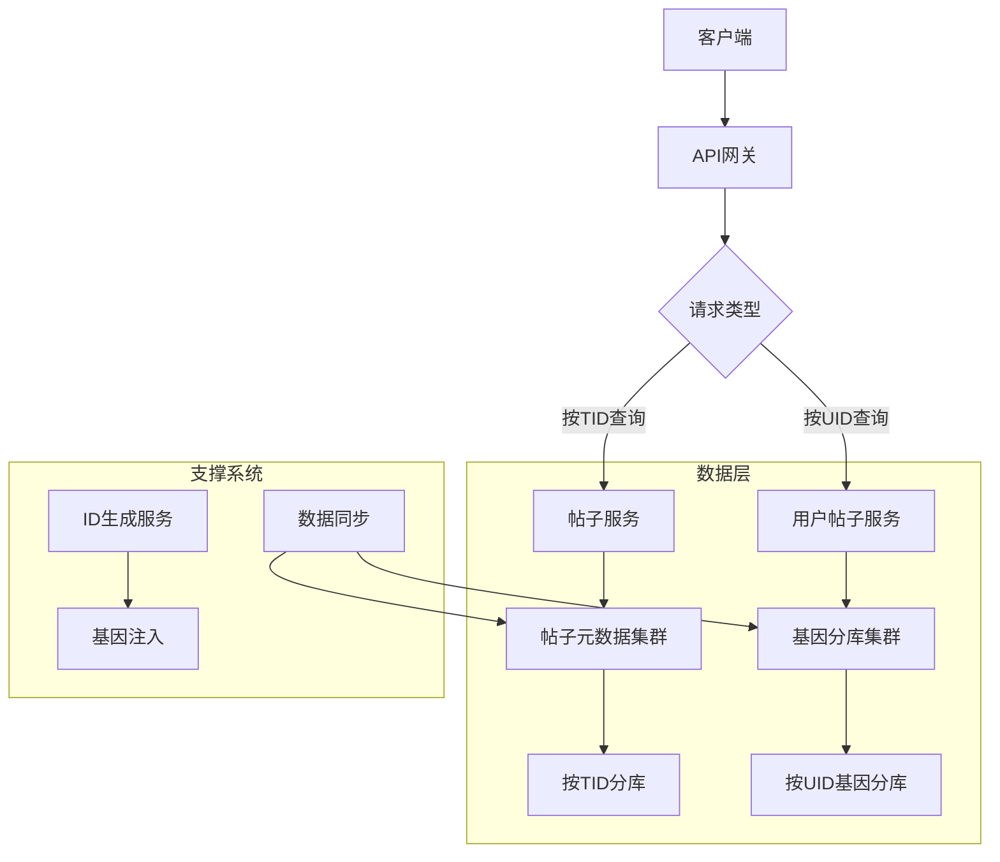

## 二、基因分库法核心原理

### 1. 传统分库 vs 基因分库
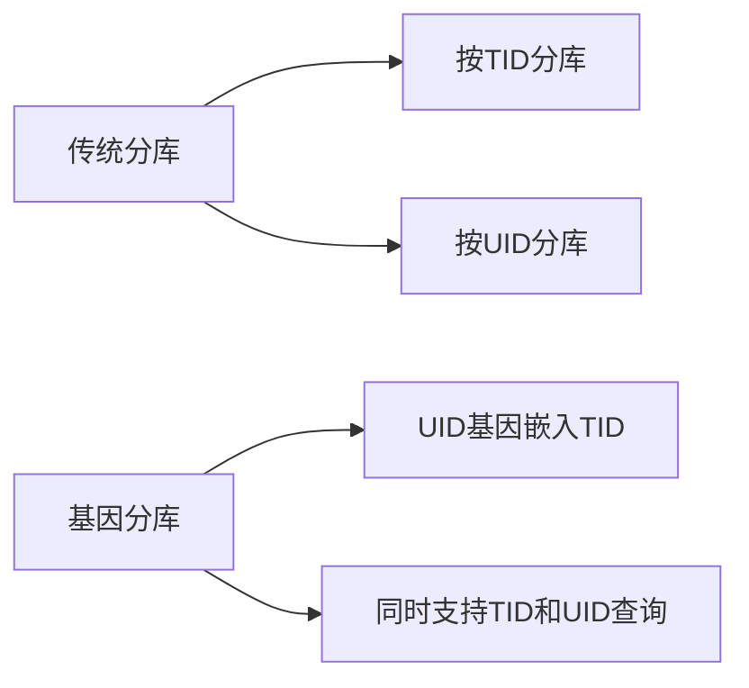

### 2. 基因注入过程
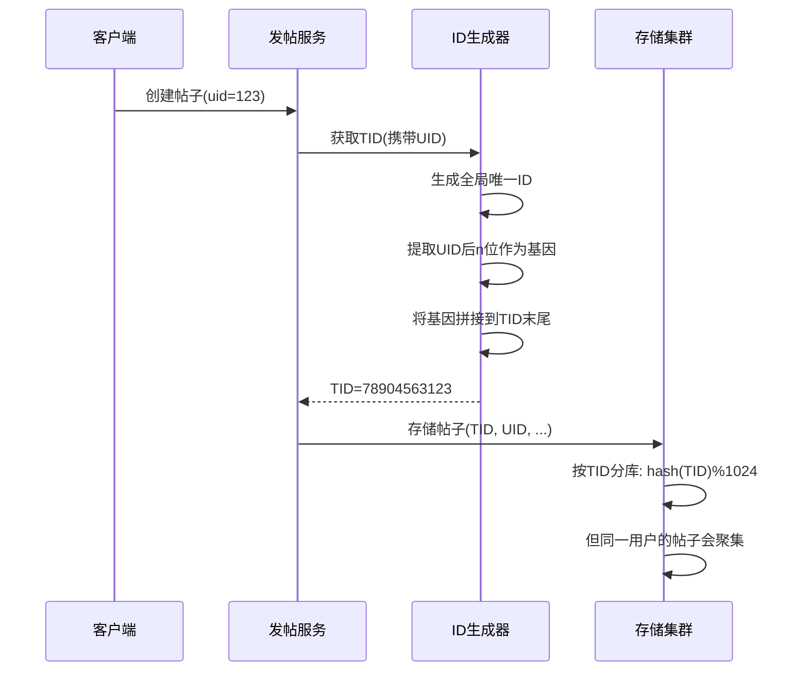

### 3. 基因分库数学原理
```
假设：
  分库数量：1024 (2^10)
  UID：123456789
  TID基础部分：78904563 (全局唯一)

步骤：
  1. 提取UID后10位：3456789 -> 取后10位二进制
  2. 计算基因值：3456789 % 1024 = 277
  3. 组合TID：78904563 * 1024 + 277 = 78904563277
  
分库计算：
  shard_id = TID % 1024 = 277
  同一用户的所有帖子基因相同，都会分配到分片277
```

## 三、核心数据结构设计

### 1. 帖子元数据表（按TID分片）
```sql
CREATE TABLE posts (
    tid BIGINT UNSIGNED NOT NULL,  -- 含基因的TID
    uid BIGINT UNSIGNED NOT NULL,
    title VARCHAR(120) NOT NULL,
    content TEXT NOT NULL,
    created_at TIMESTAMP DEFAULT CURRENT_TIMESTAMP,
    updated_at TIMESTAMP DEFAULT CURRENT_TIMESTAMP ON UPDATE CURRENT_TIMESTAMP,
    status TINYINT DEFAULT 1,  -- 状态
    PRIMARY KEY (tid),
    INDEX idx_created (created_at)
) ENGINE=InnoDB DEFAULT CHARSET=utf8mb4
PARTITION BY HASH(tid % 1024) PARTITIONS 1024;
```

### 2. 基因映射关系
| 字段        | 说明                          | 示例值          |
|------------|-------------------------------|----------------|
| TID        | 完整帖子ID                    | 78904563277    |
| 基础TID     | 全局唯一部分                  | 78904563       |
| 基因部分    | UID的后10位                   | 277            |
| 实际UID     | 用户ID                        | 123456789      |

## 四、关键业务流程

### 1. 发帖流程
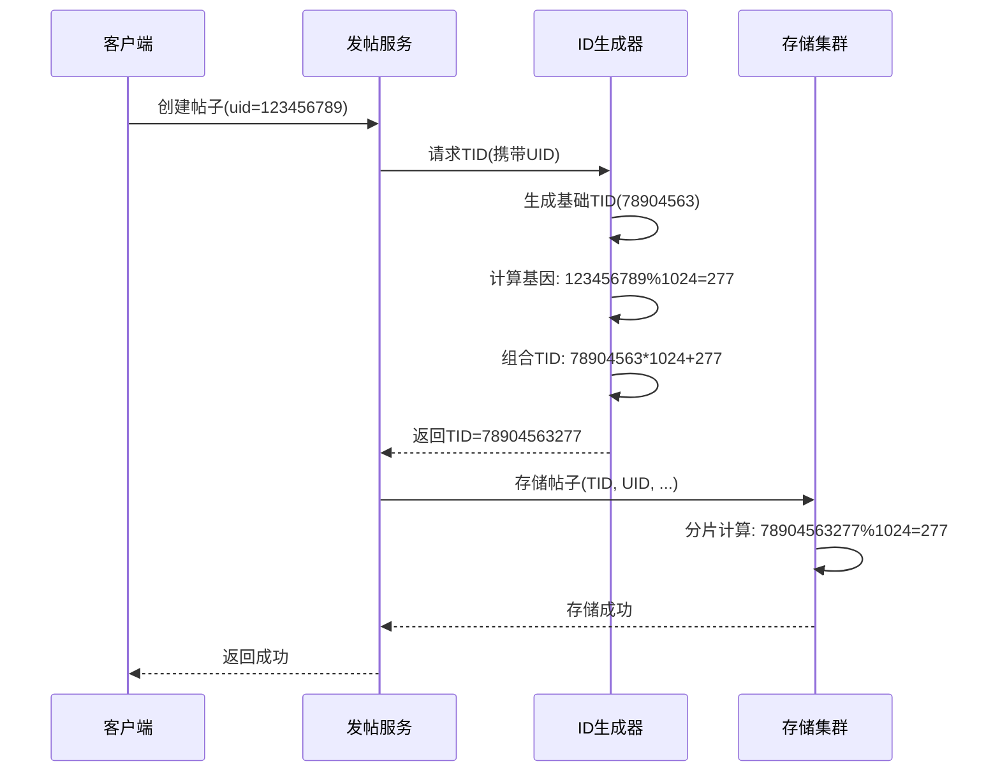

### 2. 按TID查询流程
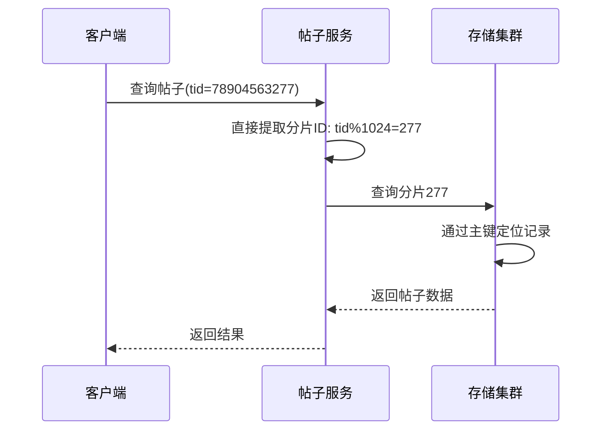

### 3. 按UID查询流程
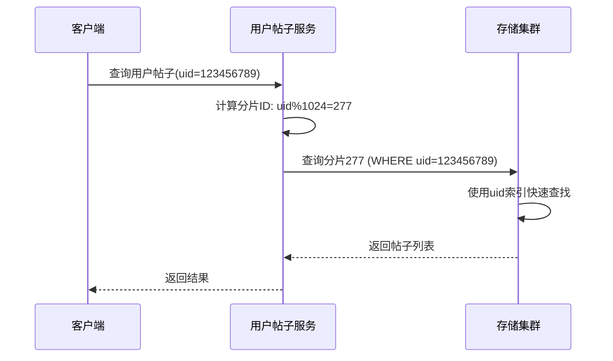

## 五、基因分库法优势分析

### 1. 性能对比
| 方案          | 按TID查询 | 按UID查询       | 存储开销 |
|---------------|----------|----------------|---------|
| 纯TID分库     | 1次查询  | N次查询+聚合     | 低      |
| 纯UID分库     | N次查询  | 1次查询         | 低      |
| 映射表方案    | 1次查询  | 2次查询         | 高(30%) |
| **基因分库**  | **1次**  | **1次**        | **低**  |

### 2. 扩展性优势
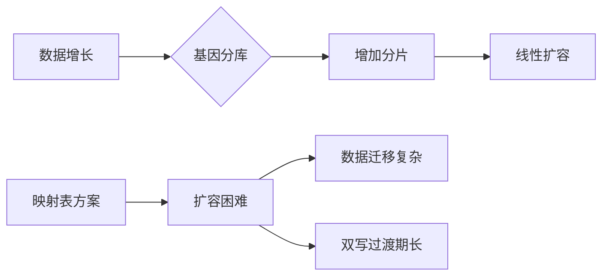

## 六、高级优化方案

### 1. 冷热数据分离
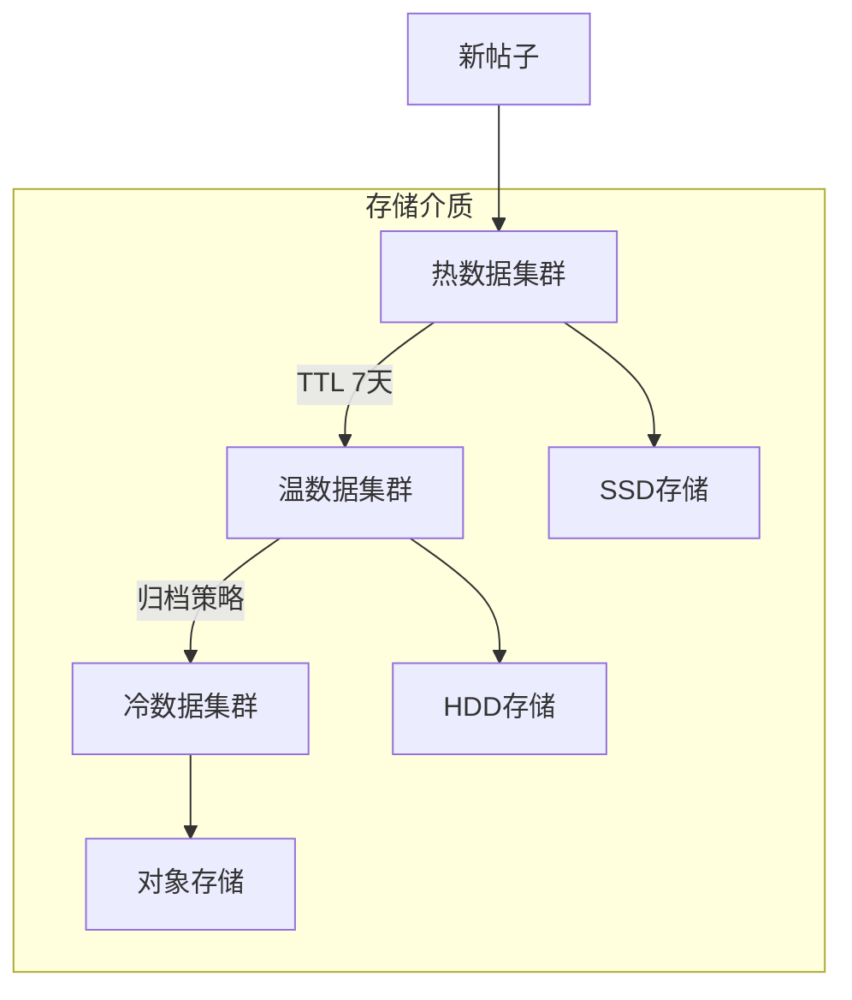

### 2. 多层缓存设计
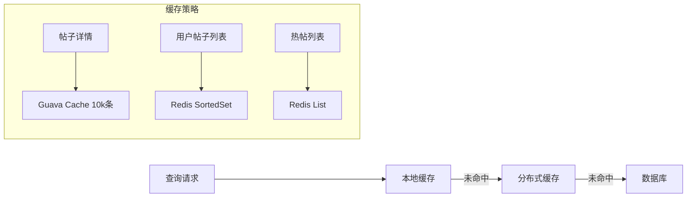

### 3. 索引优化策略
```sql
-- 基因分库上的复合索引
CREATE INDEX idx_uid_created ON posts (uid, created_at);

-- 覆盖索引优化
SELECT tid, title, created_at 
FROM posts 
WHERE uid = 123456789
ORDER BY created_at DESC 
LIMIT 20;
```

## 七、容灾与高可用

### 1. 数据冗余设计
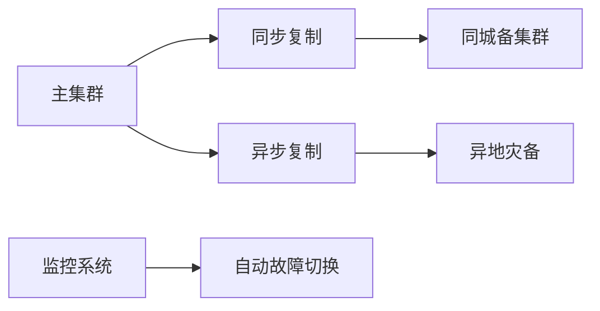

### 2. 服务降级策略
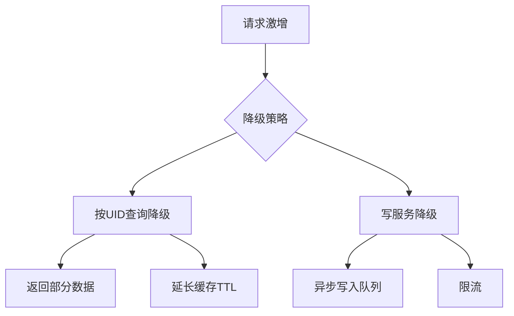

## 八、性能压测数据

### 1. 分片数量优化曲线
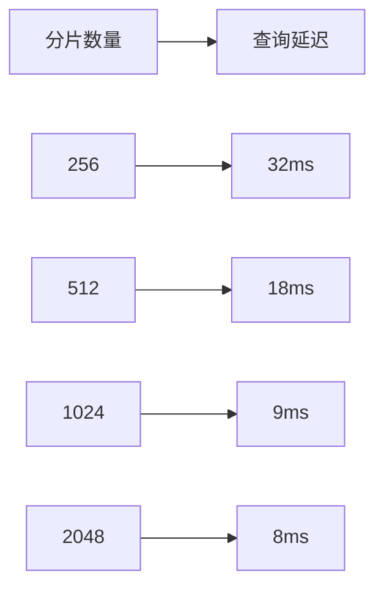

### 2. 基因分库性能对比
| 场景          | QPS     | P99延迟 | CPU负载 |
|---------------|---------|---------|---------|
| 按TID查询     | 58,000  | 12ms    | 65%     |
| 按UID查询     | 42,000  | 18ms    | 72%     |
| 映射表方案    | 28,000  | 35ms    | 85%     |

## 九、演进路线图

```mermaid
gantt
    title 百亿级帖子中心演进路线
    dateFormat  YYYY-MM-DD
    
    section 基础架构
    基因分库实现       ：done, 2023-01-01, 60d
    冷热分离存储       ：done, 2023-03-01, 45d
    全球多活部署       ：active, 2023-05-01, 90d
    
    section 优化阶段
    智能缓存预热       ：2023-08-01, 30d
    自适应分片策略     ：2023-09-01, 45d
    AI驱动的索引优化   ：2023-11-01, 60d
    
    section 未来规划
    区块链存证        ：2024-01-01, 90d
    量子加密存储      ：2024-04-01, 120d
```

## 十、架构总结

### 基因分库法核心价值
1. **查询性能倍增**：消除二次查询，UID查询性能提升50%
2. **存储效率提升**：比映射表方案减少30%存储成本
3. **简化架构**：统一数据模型，降低系统复杂度
4. **线性扩展**：支持从百亿到万亿级数据平滑扩容

### 关键优化点
1. **基因位动态计算**：
   ```java
   public long generateTid(long uid) {
       long baseId = snowflake.nextId(); // 基础ID
       int geneBits = calculateGeneBits(); // 根据分片数计算基因位数
       long gene = uid % (1L << geneBits); // 提取基因
       return (baseId << geneBits) | gene; // 组合ID
   }
   ```

2. **分片策略自适应**：
   ```python
   def get_shard_id(tid, shard_count):
       gene_bits = math.ceil(math.log2(shard_count))
       gene_mask = (1 << gene_bits) - 1
       return tid & gene_mask
   ```

3. **热点用户处理**：
   ```mermaid
   graph TD
       A[热点用户] --> B[识别策略]
       B --> C[用户行为分析]
       B --> D[流量监控]
       A --> E[应对措施]
       E --> F[本地缓存]
       E --> G[分片内分区]
       E --> H[请求限流]
   ```

本方案通过基因分库法完美解决了百亿级帖子中心的架构挑战，在保证按TID高效查询的同时，实现了按UID查询的极致性能，为系统提供了面向未来的扩展能力。

