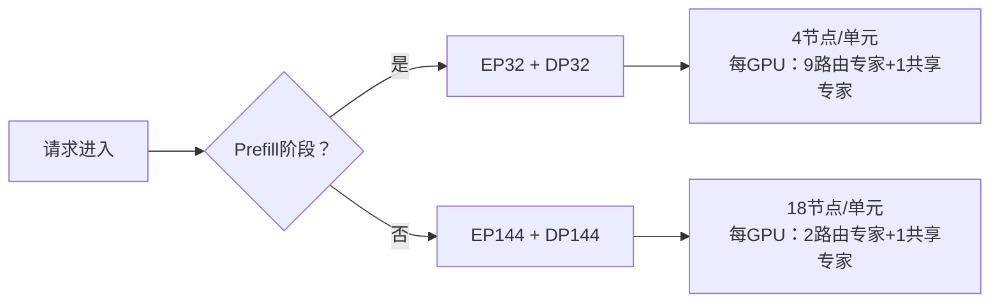
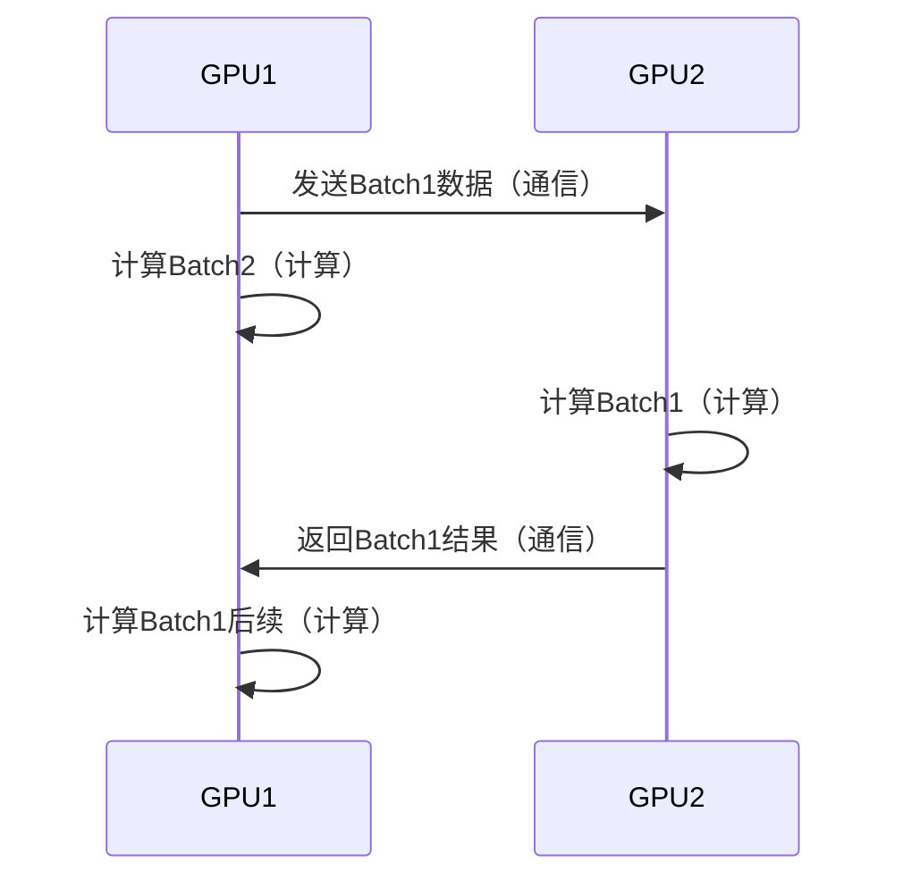

DeepSeek-V3/R1 推理系统的架构设计，是国产大模型在GPU资源受限背景下的一次突破性软件创新。其核心目标直指 **“更高吞吐量 + 更低延迟”**，通过跨节点专家并行（Expert Parallelism，EP）为核心的系统级优化，实现了理论545%的成本利润率。以下从设计动因、架构原理、关键技术三个维度展开解析：

---

### 一、设计动因：被“卡脖子”逼出的第三条路  
当算力成为瓶颈时，传统方案有二：  
- **水平扩展（Scale Out）** → 堆更多GPU（但国产囤卡受限）  
- **垂直扩展（Scale Up）** → 升级GPU（但先进制程被禁）  

DeepSeek 被迫选择 **“第三条路”**：  
> **通过软件架构创新，最大化单卡效率，实现“算力贫困下的超车”**   

目标很明确：  
✅ 吞吐量（Throughput）↑ → 单位成本服务更多请求  
✅ 延迟（Latency）↓ → 提升用户体验  

---

### 二、核心架构：跨节点专家并行（Expert Parallelism, EP）  
#### ▍ 为什么必须用 EP？  
- V3/R1 是 **稀疏MoE模型**（每层256专家 → 仅激活8个）  
- 若用传统数据并行（DP），单个GPU需加载全量专家 → 显存爆炸 ❌  
- **EP 将专家拆解分布到多GPU**：  
  - 每GPU只负责少量专家 → **显存压力骤降**  
  - 扩大 Batch Size → **GPU矩阵计算效率提升**   

#### ▍ EP 的挑战与破解  
| **挑战**                | **解决方案**                     | **技术实现**                                                                 |
|-------------------------|----------------------------------|-----------------------------------------------------------------------------|
| 跨节点通信开销大        | 计算-通信重叠                   | 双Batch流水线：一个Batch计算时，另一个Batch通信        |
| 多节点负载不均         | 动态三级负载均衡                | 预填充均衡器 + 解码均衡器 + EP专家均衡器              |
| 预填充/解码阶段需求差异 | 阶段感知的弹性并行策略          | 预填充用 EP32+DP32 → 解码切 EP144+DP144               |

---

### 三、关键技术详解  
#### 1. **双阶段自适应并行策略**  
针对预填充（Prefill）和解码（Decode）的不同计算特征，动态调整并行度：  


- **预填充**：短时高计算密度 → **小规模EP+大规模DP**  
- **解码**：长时低计算密度 → **大规模EP+小规模DP**   

#### 2. **计算-通信重叠（Dual-Batch Overlap）**  
通过“双微批次流水线”隐藏通信延迟：  


- 预填充：**计算 ↔ 通信交替执行**  
- 解码：**5级流水线拆分Attention层**，实现细粒度重叠   

#### 3. **三级负载均衡器**  
防止单GPU过载拖垮集群：  

| **负载均衡器**       | 核心问题                          | 优化目标                                                                 |
|----------------------|-----------------------------------|-------------------------------------------------------------------------|
| 预填充均衡器         | 请求长度差异导致计算量不均        | 各GPU输入Token数均衡 + Attention计算量均衡                 |
| 解码均衡器           | KVCache占用不均引发长尾延迟       | 各GPU请求数均衡 + KVCache内存占用量均衡                     |
| EP专家均衡器         | 某些专家负载天然更高（如数学专家）| 动态路由分配 → 最小化所有GPU的最大负载          |

#### 4. **混合精度与硬件协同优化**  
- **FP8**：用于矩阵乘法/数据分发 → 节省带宽，加速传输  
- **BF16**：用于核心MLA注意力计算 → 保障数值精度   
- **磁盘KV缓存**：56.3%请求命中缓存 → 减少显存压力，加速响应  

#### 5. **昼夜弹性资源调度**  
- 白天高负载：**所有节点部署在线推理**  
- 夜间低负载：**部分节点切换至训练/研究任务**  
```python
def schedule_resources(load):
    if load > THRESHOLD_HIGH:
        deploy_all_nodes_for_inference()
    else: 
        release_50%_nodes_for_training()
```

---

### 四、性能成果：软件定义算力的典范  
| **指标**               | 数值                          | 业界对比优势               |
|------------------------|-------------------------------|--------------------------|
| 单H800节点输入吞吐     | 73.7k tokens/s (预填充)       | 较传统DP高3倍+            |
| 单H800节点输出吞吐     | 14.8k tokens/s (解码)         | 延迟降低40%+              |
| 日均节点利用率         | 226.75节点（峰值278）         | 资源闲置率<10%            |
| 理论成本利润率         | 545%                          | 碾压同业（OpenAI等亏损） |

> 💡 **关键洞察**：545%利润率不是靠商业策略，而是 **“每一行代码都在对抗算力枷锁”** —— 通过架构设计将GPU利用率压榨到极致。

---

### 五、开源生态：6大核心项目支撑  
为落地该架构，DeepSeek 配套开源了6大基础设施项目：  

1. **FlashMLA**：GPU高速解码器 → 加速Attention计算  
2. **DeepEP**：MoE专家并行通信库 → 优化跨节点传输  
3. **DeepGEMM**：FP8矩阵乘法库 → 释放Tensor Core潜力  
4. **DualPipe**：双向管道并行算法 → 实现计算-通信重叠  
5. **EPLB**：EP动态负载均衡算法 → 自动规避热点GPU  
6. **3FS**：高性能分布式文件系统 → 支撑KV缓存池化  

> 这不仅是技术架构，更是一套 **“穷且益坚，不坠青云之志”的工程哲学** —— 在封锁中靠算法和软件杀出一条血路。

---

### 结语：架构启示录  
DeepSeek-V3/R1 的推理架构证明：**当硬件被“卡脖子”，软件创新就是最锋利的矛**。其价值不仅在于545%的利润率，更在于给国产AI的启示：

- ✅ **EP并行范式** → 为万亿级MoE模型推理铺路  
- ✅ **计算-通信解耦** → 突破冯·诺依曼瓶颈的尝试  
- ✅ **负载感知调度** → 面向非均匀负载的普适方案  

正如其团队所言：  
> “这条路是被逼出来的，但走通了，就是通天大道。” —— DeepSeek 开源宣言