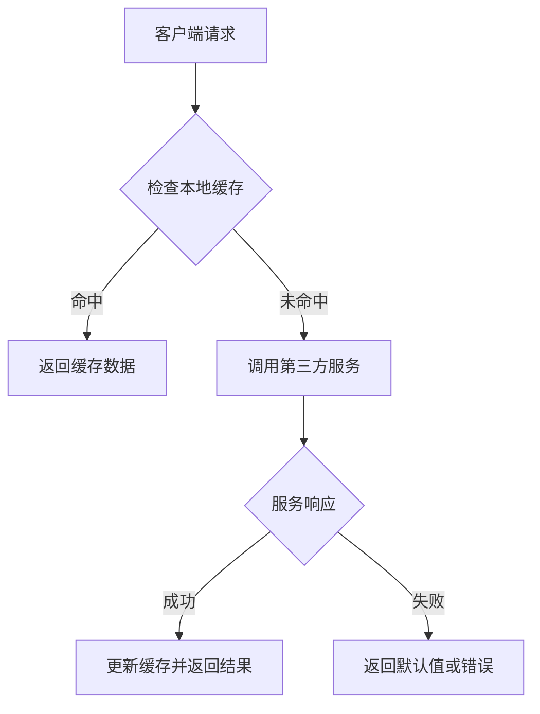
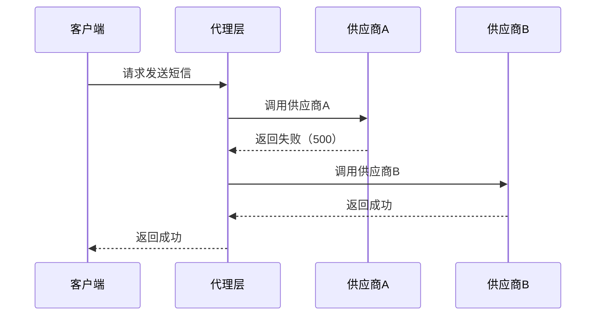

# **第三方服务接口调用技术方案文档**

---

## **一、方案背景**
随着系统复杂度提升，第三方服务调用成为关键环节。为保障系统高可用性、性能与安全性，需设计一套完整的调用方案，涵盖 **代理模式**、**主备切换**、**异步调用** 等核心模式，并结合 **本地缓存**、**多供应商切换** 等场景扩展，解决实际业务中的并发、容错、性能等问题。

---

## **二、设计目标**
1. **高可用性**：通过主备切换与冗余设计，确保第三方服务不可用时系统仍能运行。
2. **高性能**：通过代理层缓存、异步调用和负载均衡，降低延迟并提升吞吐量。
3. **安全性**：通过鉴权、签名、限流等机制，保障接口调用的安全性。
4. **可扩展性**：支持动态添加第三方服务节点，适应业务增长需求。
5. **可观测性**：通过日志、监控和告警，实时追踪调用状态和性能瓶颈。

---

## **三、核心方案设计**

### **1. 代理模式（Proxy Pattern）**
#### **1.1 本地缓存 + 定时拉取**
**目标**：减少对第三方服务的实时调用压力，提升响应速度，降低网络抖动影响。

**实现步骤**：
1. **本地缓存设计**  
   - 使用 **Redis/Memcached** 缓存高频读取的第三方服务数据（如商品价格、用户信息）。  
   - **缓存策略**：  
     - **TTL（Time to Live）**：设置合理的过期时间（如 5 分钟）。  
     - **版本控制**：通过 `cache_key = hash_key + version` 管理数据版本（如 `user:1001:v2`）。  

2. **后台定时拉取（预热/同步）**  
   - 通过 **定时任务（Cron Job）** 或 **消息队列触发器**，定期从第三方服务拉取数据并更新缓存。  
   - **示例代码（Python + Celery）**：
     ```python
     @app.task
     def sync_third_party_data():
         data = fetch_from_third_party()  # 调用第三方接口
         redis_conn.setex("third_party_cache", 300, json.dumps(data))  # 缓存5分钟
     ```

3. **容错机制**  
   - **降级策略**：当缓存失效或第三方服务不可用时，返回默认值或空数据（如 `{"error": "Service unavailable"}`）。  
   - **熔断限流**：通过 **Sentinel/Hystrix** 监控调用成功率，超过阈值时熔断，防止雪崩。

#### **1.2 Mermaid 流程图：代理模式中的缓存与容错**


---

### **2. 主备模式（Failover & Switchover）**
#### **2.1 多供应商切换场景**
**目标**：在第三方服务故障时，自动切换到备用供应商，保障业务连续性。

**实现步骤**：
1. **服务注册与发现**  
   - 使用 **Nacos/Eureka** 注册多个供应商实例（如短信服务的供应商A、B、C）。  
   - **示例配置**：
     ```yaml
     third_party:
       sms:
         providers:
           - name: provider_a
             url: "https://api.smsa.com"
             weight: 60
           - name: provider_b
             url: "https://api.smsb.com"
             weight: 40
     ```

2. **动态切换策略**  
   - **负载均衡**：按权重分配流量（如加权轮询）。  
   - **健康检查**：定期检测供应商可用性（如 HTTP 200 OK）。  
   - **自动降级**：当主供应商故障时，切换到备用供应商（如 `provider_a` 失效 → 使用 `provider_b`）。

3. **多供应商示例（短信服务）**
   - **场景**：发送验证码时，优先使用供应商A，若失败则尝试供应商B。  
   - **代码逻辑**：
     ```java
     public void sendSms(String phone, String code) {
         List<Supplier> suppliers = getSuppliers("sms");
         for (Supplier supplier : suppliers) {
             if (supplier.isHealthy()) {
                 boolean success = supplier.send(phone, code);
                 if (success) break;
             }
         }
     }
     ```

#### **2.2 Mermaid 时序图：多供应商切换流程**


---

### **3. 异步调用（Asynchronous Invocation）**
#### **3.1 消息队列解耦**
**目标**：解耦系统间依赖，避免阻塞主线程，提升系统吞吐量。

**实现方案**：
1. **消息队列（Kafka/RabbitMQ）**  
   - 对非实时性要求的接口（如日志上报、通知推送），通过 **Kafka/RabbitMQ** 异步处理。  
   - **生产者**：将请求写入队列，立即返回成功响应。  
   - **消费者**：异步消费队列中的任务，调用第三方服务并处理结果。  
   - **示例（Kafka）**：
     ```java
     // 生产者
     Producer<String, String> producer = new KafkaProducer<>(props);
     producer.send(new ProducerRecord<>("third_party_requests", requestJson));

     // 消费者
     Consumer<String, String> consumer = new KafkaConsumer<>(props);
     while (true) {
         ConsumerRecords<String, String> records = consumer.poll(Duration.ofMillis(100));
         for (ConsumerRecord<String, String> record : records) {
             // 调用第三方服务
             callThirdPartyService(record.value());
         }
     }
     ```

2. **回调机制（Callback）**  
   - 对异步结果需要反馈的场景（如支付回调），第三方服务通过 **HTTP 回调地址** 通知调用方。  
   - **回调地址安全**：  
     - 使用 HTTPS 加密传输。  
     - 验证回调来源（如校验 `X-Callback-Token`）。  
     - 限制回调频率（防刷）。

3. **异步 API 设计**  
   - **开始异步调用**：客户端调用 `Begin_Method`，服务端返回任务 ID。  
   - **查询结果**：客户端轮询 `Finish_Method` 获取结果。  
   - **示例（REST API）**：
     ```http
     POST /api/startTask
     Content-Type: application/json
     {
         "taskType": "payment",
         "params": { ... }
     }

     Response:
     {
         "taskId": "123456",
         "status": "PROCESSING"
     }

     GET /api/checkTask?taskId=123456
     Response:
     {
         "taskId": "123456",
         "result": "SUCCESS"
     }
     ```

---

## **四、方案对比与适用场景**

| **方案**               | **优点**                                 | **局限性**                                | **适用场景**                     |
|------------------------|------------------------------------------|-------------------------------------------|----------------------------------|
| **本地缓存 + 定时拉取** | 降低实时调用压力，提升响应速度            | 数据可能存在延迟，无法满足强一致性        | 查询类接口（如商品价格、用户信息） |
| **多供应商主备切换**    | 高可用性，自动故障转移                    | 需维护多个供应商配置，复杂度较高          | 关键业务接口（如支付、短信验证）   |
| **异步调用 + 消息队列** | 解耦依赖，提升吞吐量                      | 实时性差，需额外处理结果回调              | 日志上报、通知推送等非实时场景     |
| **代理层 + 限流熔断**    | 防止雪崩，保障核心服务稳定性              | 可能误判流量，需精细配置阈值              | 高并发场景（如秒杀、促销）         |

---

## **五、总结建议**

1. **代理模式**：  
   - **优先使用本地缓存 + 定时拉取**，适用于查询类接口。  
   - **结合熔断机制**，避免第三方服务故障导致雪崩。  

2. **主备模式**：  
   - **多供应商切换** 是高可用的核心，需动态健康检查与负载均衡。  
   - **优先级策略**（如按权重分配流量）可平衡成本与性能。  

3. **业务适配性**：  
   - **强一致性场景**（如支付）：需实时调用 + 数据库事务。  
   - **弱一致性场景**（如推荐系统）：可完全依赖缓存 + 异步更新。  

通过灵活组合上述方案，可构建一个 **高可用、高性能、低耦合** 的第三方服务调用体系，适应复杂业务需求。