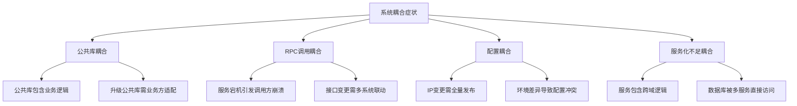
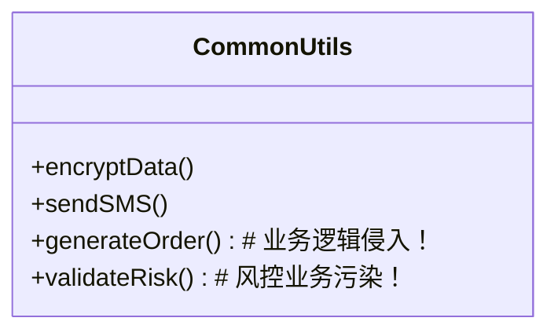
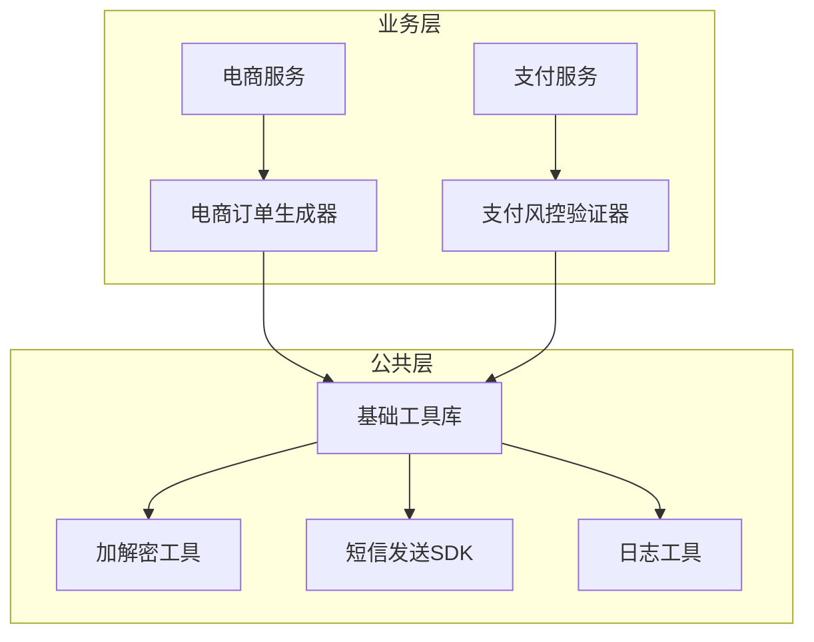
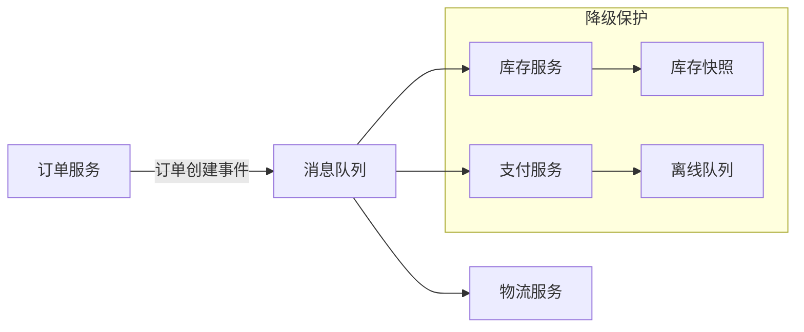
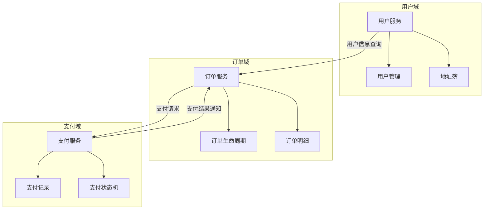

# 系统耦合问题深度剖析与解耦方案设计  

## 一、耦合症状诊断标准  
**核心判据**：**被动修改率**（PMR = 被他人修改触发的变更次数 / 总变更次数）  
当PMR > 30%时，系统已进入耦合危险区  

### 耦合四大典型症状  


## 二、四大耦合场景深度解耦方案  

### 场景1：公共库耦合 - 业务逻辑污染  
#### 问题解剖  

**致命影响**：  
- 公共库升级被迫进行业务回归测试  
- 电商业务修改风控规则影响金融业务  

#### 解耦手术方案  
**分层治理策略**：  


**实施步骤**：  
1. **代码扫描**：  
   ```bash  
   # 检测公共库中的业务关键词  
   grep -r "Order|Payment|Risk" common-lib/src  
   ```  
2. **逻辑抽离**：  
   - 将`generateOrder`迁移至电商服务模块  
   - 将`validateRisk`迁移至支付风控模块  
3. **依赖管控**：  
   ```xml  
   <!-- 公共库纯净依赖 -->  
   <dependency>  
     <groupId>com.company</groupId>  
     <artifactId>pure-common</artifactId>  
     <version>1.0.0</version>  
   </dependency>  
   ```  

### 场景2：RPC调用耦合 - 紧同步依赖  
#### 问题解剖  
```mermaid  
sequenceDiagram  
    订单服务->>库存服务： 同步扣减库存（强依赖）  
    库存服务-->>订单服务： 响应结果  
    订单服务->>支付服务： 同步调用支付（强依赖）  
    支付服务-->>订单服务： 支付结果  
    
    Note right of 库存服务： 库存服务宕机导致订单服务不可用  
```  

**系统毒性**：  
- 服务可用性 = 所有依赖服务可用性的乘积  
- 调用链越长，系统可用性呈指数级下降  

#### 解耦手术方案  
**消息驱动架构**：  


**核心组件设计**：  
```java  
public class OrderEventPublisher {  
    // 事件发布代替直接调用  
    public void createOrder(Order order) {  
        orderRepo.save(order);  
        eventBus.publish(new OrderCreatedEvent(order.getId()));  
    }  
}  

// 库存消费者  
@Service  
public class InventoryConsumer {  
    @RabbitListener(queues = "order_created")  
    public void handleEvent(OrderCreatedEvent event) {  
        // 异步减库存  
        inventoryService.deduct(event.getOrderId());  
    }  
}  
```  

### 场景3：配置耦合 - 硬编码IP依赖  
#### 问题解剖  
```properties  
# 中毒的配置示例  
payment.service.ip=192.168.1.100:8080  
notify.service.ip=10.0.0.2:9090  
```  

**灾难场景**：  
- 网络调整需全服务重启  
- 生产环境误用测试配置  

#### 解耦手术方案  
**三阶治理策略**：  
```mermaid  
gantt  
    title 配置解耦路线图  
    dateFormat  YYYY-MM-DD  
    section 初级阶段  
    DNS化改造 ：done, 2023-01-01, 30d  
    section 中级阶段  
    配置中心接入 ：active, 2023-02-01, 45d  
    section 高级阶段  
    服务网格治理 ：2023-03-20, 60d  
```  

**实施详解**：  
1. **DNS化改造**  
   ```properties  
   # 改造后配置  
   payment.service.url=payment-svc.prod.svc.cluster.local  
   ```  
   - 通过K8S Service实现负载均衡  
   - 运维人员调整Endpoint无需研发介入  

2. **配置中心接入**  
   ```mermaid  
   graph LR  
       微服务 --> 配置中心  
       配置中心 --> 数据库  
       配置中心 --> Git仓库  
       配置中心 --> 加密存储  
       
       subgraph 动态生效  
         微服务 --> 监听配置变更  
         配置变更 --> 微服务热更新  
       end  
   ```  

3. **服务网格治理**  
   ```yaml  
   apiVersion: networking.istio.io/v1alpha3  
   kind: VirtualService  
   metadata:  
     name: payment-route  
   spec:  
     hosts:  
     - payment-svc.prod.svc.cluster.local  
     http:  
     - route:  
       - destination:  
           host: payment-svc  
           subset: v1  
         weight: 90  
       - destination:  
           host: payment-svc  
           subset: v2  
         weight: 10  
   ```  

### 场景4：服务化不足耦合 - 领域边界模糊  
#### 问题解剖  
```mermaid  
erDiagram  
    USER ||--o{ ORDER : places  
    USER ||--o{ PAYMENT : "makes"  
    ORDER ||--|{ ORDER_ITEM : contains  
    PAYMENT }|--|| ORDER : covers  
    
    %% 中毒设计 %%  
    ORDER_SERVICE {  
        int userId  
        string paymentStatus  # 支付状态侵入订单服务  
        string address        # 用户地址冗余  
    }  
```  

**系统腐化表现**：  
- 订单服务包含支付状态管理  
- 用户服务直接操作库存表  

#### 解耦手术方案  
**领域驱动设计(DDD)重构**：  


**关键解耦操作**：  
1. **数据库拆分**  
   ```sql  
   -- 订单服务独占数据库  
   CREATE DATABASE order_db OWNER order_service;  
   
   -- 支付服务独立数据库  
   CREATE DATABASE payment_db OWNER payment_service;  
   ```  

2. **领域事件驱动**  
   ```java  
   // 支付完成后发布事件  
   public class PaymentCompletedEvent {  
       private String orderId;  
       private BigDecimal amount;  
       // 不含用户领域信息！  
   }  
   
   // 订单服务订阅处理  
   @EventListener  
   public void handlePaymentEvent(PaymentCompletedEvent event) {  
       orderService.markPaid(event.getOrderId());  
   }  
   ```  

3. **防腐层设计**  
   ```mermaid  
   classDiagram  
       class OrderService {  
           +placeOrder()  
           -paymentAdapter: PaymentAdapter  
       }  
       
       class PaymentAdapter {  
           +requestPayment() : PaymentResponse  
           -convertOrderToPaymentRequest()  
       }  
       
       class PaymentService {  
           +createPayment()  
       }  
       
       OrderService --> PaymentAdapter  
       PaymentAdapter --> PaymentService  
   ```  

## 三、解耦效果评估模型  

### 健康度指标体系  
| **指标**           | 耦合系统           | 解耦后系统       | 测量方式                     |  
|--------------------|-------------------|----------------|----------------------------|  
| 变更影响范围       | >5个服务          | <=2个服务       | 代码关联分析                |  
| 部署耦合度         | 必须同步部署      | 独立部署        | 部署记录分析                |  
| 故障爆炸半径       | 全链路崩溃        | 局部故障        | 混沌工程测试                |  
| 资源利用率         | 高峰60%，谷值15%  | 高峰80%，谷值40%| 监控系统采集                |  

### 解耦收益量化  


## 四、防耦合治理规范  

### 架构设计红线  
1. **公共库三不原则**：  
   - 不包含业务逻辑  
   - 不持有状态  
   - 不依赖具体框架  

2. **服务交互三准则**：  
   ```mermaid  
   graph LR  
       A[服务A] -->|准则1：异步消息| B[服务B]  
       A -->|准则2：领域事件| C[服务C]  
       A -->|准则3：RESTful API| D[服务D]  
       
       style B stroke:#f66  
       style C stroke:#66f  
       style D stroke:#6f6  
   ```  

3. **配置管理铁律**：  
   | **配置类型**   | **存储位置**       | **访问方式**       |  
   |---------------|-------------------|-------------------|  
   | 环境相关       | K8s ConfigMap     | 环境变量注入       |  
   | 业务参数       | 配置中心          | SDK动态获取        |  
   | 敏感信息       | 密钥管理系统      | 运行时动态解密     |  

### 技术债务雷达图  
```mermaid  
radarChart  
    title 耦合技术债务评估  
    axis “公共库” “服务调用” “配置管理” “领域边界” “数据耦合”  
    “当前系统” [8， 7, 9, 6, 8]  
    “健康阈值” [3, 3, 2, 2, 3]  
    step 1  
```  

## 五、解耦演进路线  

### 三阶段改造计划  
```mermaid  
journey  
    title 系统解耦演进之路  
    section 紧急止血阶段  
      识别核心耦合点 ： 2周  
      建立防腐层 ： 1周  
      配置DNS化 ： 1周  
      
    section 结构重塑阶段  
      拆分公共库 ： 4周  
      领域重构 ： 8周  
      消息驱动改造 ： 6周  
      
    section 体系巩固阶段  
      服务网格部署 ： 4周  
      混沌工程验证 ： 持续  
      健康度监控 ： 持续  
```  
