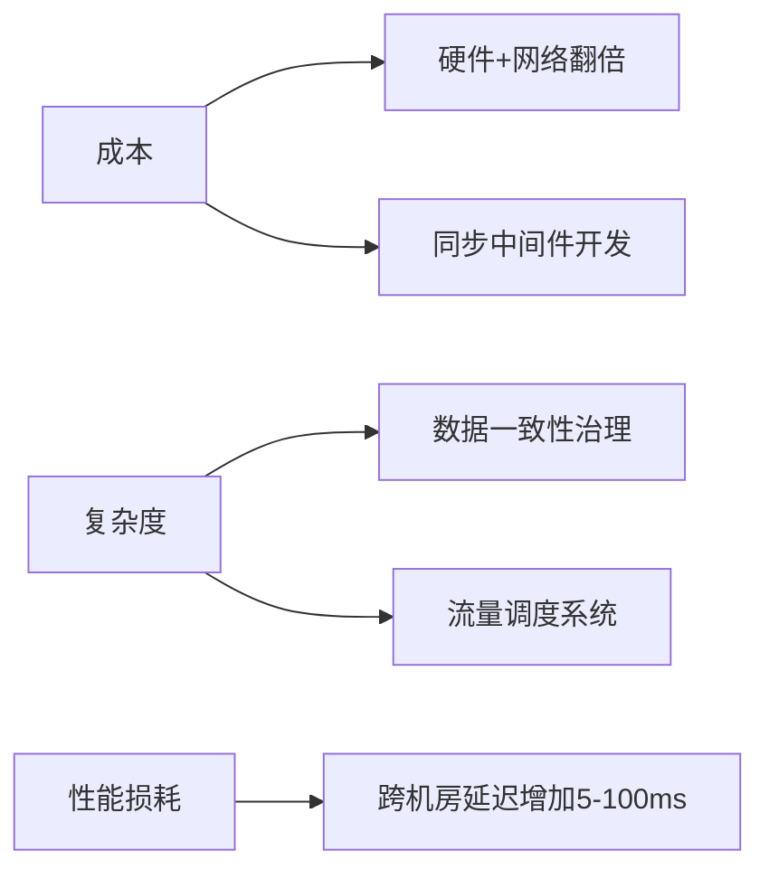
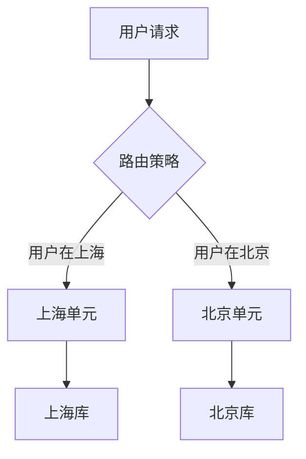
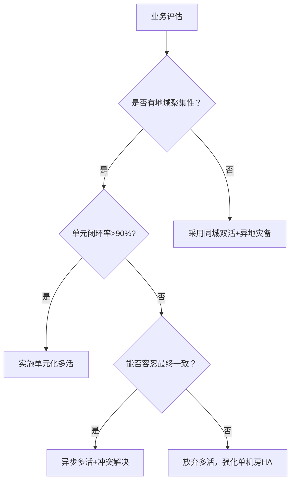
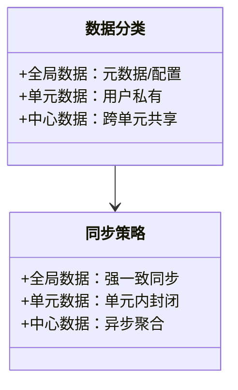

作为长期深耕分布式系统的架构师，我将从**业务适配性、成本效益和架构可行性**三个维度，结合典型场景与工业实践，为你剖析多机房多活架构的决策逻辑。以下分析框架已在多个大型系统中验证，可直接用于企业技术评审。

---

### 一、多机房多活的本质与代价
#### 1. **核心目标：业务连续性** 
- **“活”的定义**：不同地理位置的系统**实时对外提供服务**（非灾备模式的冷 standby） 
- **关键指标**： 
  - **RTO（恢复时间）**：故障切换时间 ≤ 30秒 
  - **RPO（数据丢失量）**：金融级要求=0，普通业务允许分钟级 

#### 2. **必须承担的代价** 

**量化影响**：  
- 成本提升40%-300%（异地专线+冗余资源）  
- 研发周期延长6-12个月（数据同步/冲突解决）  
- 平均延迟上升20ms（同城）至200ms（跨省）

> **架构师洞察**：多活是“用空间换可用性”的极端方案，90%的企业实际需要的是**同城双活+异地灾备**而非全量多活。

---

### 二、适合多机房多活的业务场景（黄金用例）
#### 1. **强地域聚集型业务** 

**典型场景**：  
- **出行服务**（滴滴、Uber）：司机/乘客/订单**完全按城市划分**，跨单元交互＜1%  
- **本地生活**（美团、饿了么）：商家/用户数据以**商圈为单元隔离**  
- **游戏分区服**：玩家数据按服务器物理隔离  

**数据特征**：  
- 单元内闭环率＞95%  
- 跨单元操作可异步化（如跨区转账）  

#### 2. **弱一致性容忍业务** 
| **业务类型**       | 一致性要求      | 多活适配性 |  
|--------------------|---------------|-----------|  
| 资讯浏览           | 最终一致        | ⭐⭐⭐⭐⭐     |  
| 商品库存           | 准实时一致      | ⭐⭐⭐⭐      |  
| 支付余额           | 强一致          | ⭐ (仅同城) |   

**成功案例**：  
- 淘宝商品详情页：允许跨区域库存差异（秒级同步）  
- YouTube视频分发：全球只读副本+本地化写入  

#### 3. **全球服务型业务** 
**架构要求**：  
- **用户分区路由**：DNS Anycast + GSLB 就近调度  
- **数据分级同步**：  
  ```mermaid
  graph LR
      Master[主中心] -->|实时同步| Replica1[亚洲副本]
      Master -->|异步同步| Replica2[欧洲副本]
      Master -->|离线同步| Replica3[美洲副本]
  ``` 
**典型场景**：  
- 跨国企业AD认证（宁盾方案）：身份数据**中心机房→区域机房分级同步**  
- AWS DynamoDB Global Table：跨区域毫秒级同步

---

### 三、**不适合多活**的预警场景（成本＞收益）
#### 1. **数据强一致依赖型系统** 
- **致命问题**：跨机房网络延迟破坏ACID  
- **典型案例**：  
  - 银行核心交易系统：CAP定理下无法实现跨城多活  
  - 实时竞价广告（RTB）：10ms超时要求与多活延迟冲突  

#### 2. **低价值长尾业务** 
**决策公式**：  
```math
多活收益 = \frac{故障损失 \times 故障概率}{多活年化成本}
```
当**收益＜1**时否决（如内部OA系统）  

#### 3. **无状态服务集群** 
**更优解**：  
- 同城AZ多副本 + 异地灾备冷存储  
- 如Kafka集群：依赖ISR机制而非多活  

---

### 四、多活架构的落地决策树 


---

### 五、工业级多活架构设计原则 
#### 1. **流量调度三原则** 
| 策略          | 实现方式                      | 案例                     |
|---------------|-----------------------------|--------------------------|
| 用户亲和       | UserID → 单元映射            | 阿里买家路由 |
| 地理位置优先   | IP定位 → 最近单元            | 腾讯游戏分区 |
| 降级兜底       | 本地单元故障时透传到中心单元  | 金融支付备链 |

#### 2. **数据同步分层治理** 

- **禁忌**：避免跨单元直接写库（用CDC+MQ解耦）  

#### 3. **容灾演进的性价比路径** 
```mermaid
gantt
    title 容灾能力演进路线
    dateFormat  YYYY-MM-DD
    section 基础能力
    同城AZ高可用 ：done， 2023-01-01， 60d
    数据热备份 ：done， 2023-03-01， 30d
    
    section 中级能力
    异地灾备中心 ：active， 2023-04-01， 90d
    关键业务双活 ：2023-07-01， 120d
    
    section 高级能力
    单元化多活 ：2024-01-01， 180d
    全球多活 ：2024-07-01， 365d
```

> **血泪教训**：某电商盲目推进多活后发现——30%的跨单元调用导致延迟飙升，最终被迫回退为**按大区划分**的伪多活架构。

---

### 总结：多活不是目标，而是手段 
1. **黄金场景**：地域强隔离业务（出行/本地生活）、全球服务、弱一致性业务  
2. **谨慎评估**：强一致系统、低价值业务、无状态服务  
3. **实施铁律**：  
   - **先单元化，后多活**  
   - **业务收敛优于数据同步**  
   - **容忍不一致才能拥抱多活**  

**单元化是多活的唯一可行路径**，没有单元封闭的多活都是灾难”。 建议从同城双活验证基础能力，再按业务价值逐步推进异地多活。