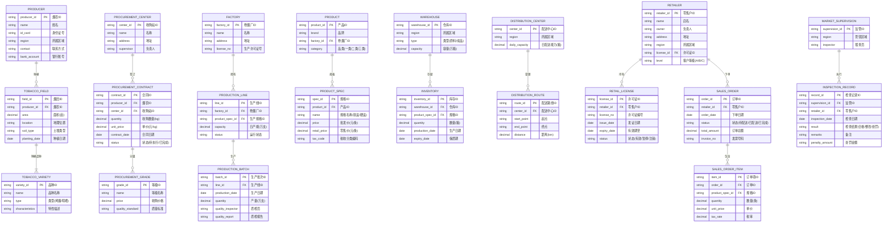

```mermaid
erDiagram
    PRODUCER ||--o{ TOBACCO_FIELD : "种植"
    TOBACCO_FIELD ||--|{ TOBACCO_VARIETY : "种植品种"
    PROCUREMENT_CENTER ||--o{ PROCUREMENT_CONTRACT : "签订"
    PROCUREMENT_CONTRACT ||--o{ PROCUREMENT_GRADE : "分级"
    FACTORY ||--o{ PRODUCTION_LINE : "拥有"
    PRODUCTION_LINE ||--o{ PRODUCTION_BATCH : "生产"
    PRODUCT ||--o{ PRODUCT_SPEC : "规格"
    WAREHOUSE ||--o{ INVENTORY : "存储"
    DISTRIBUTION_CENTER ||--o{ DISTRIBUTION_ROUTE : "管理"
    RETAILER ||--o{ RETAIL_LICENSE : "持有"
    RETAILER ||--o{ SALES_ORDER : "下单"
    SALES_ORDER ||--o{ SALES_ORDER_ITEM : "包含"
    MARKET_SUPERVISION ||--o{ INSPECTION_RECORD : "执行"
    
    PRODUCER {
        string producer_id PK "烟农ID"
        string name "姓名"
        string id_card "身份证号"
        string region "所属区域"
        string contact "联系方式"
        string bank_account "银行账号"
    }
    
    TOBACCO_FIELD {
        string field_id PK "烟田ID"
        string producer_id FK "烟农ID"
        decimal area "面积(亩)"
        string location "地理位置"
        string soil_type "土壤类型"
        date planting_date "种植日期"
    }
    
    TOBACCO_VARIETY {
        string variety_id PK "品种ID"
        string name "品种名称"
        string type "类型(烤烟/晾晒)"
        string characteristics "特性描述"
    }
    
    PROCUREMENT_CENTER {
        string center_id PK "收购站ID"
        string name "名称"
        string address "地址"
        string supervisor "负责人"
    }
    
    PROCUREMENT_CONTRACT {
        string contract_id PK "合同ID"
        string producer_id FK "烟农ID"
        string center_id FK "收购站ID"
        decimal quantity "收购数量(kg)"
        decimal unit_price "单价(元/kg)"
        date contract_date "合同日期"
        string status "状态(待执行/已完成)"
    }
    
    PROCUREMENT_GRADE {
        string grade_id PK "等级ID"
        string name "等级名称"
        decimal price "收购价格"
        string quality_standard "质量标准"
    }
    
    FACTORY {
        string factory_id PK "卷烟厂ID"
        string name "名称"
        string address "地址"
        string license_no "生产许可证号"
    }
    
    PRODUCTION_LINE {
        string line_id PK "生产线ID"
        string factory_id FK "卷烟厂ID"
        string product_spec_id FK "生产规格ID"
        decimal capacity "日产能(万支)"
        string status "运行状态"
    }
    
    PRODUCTION_BATCH {
        string batch_id PK "生产批次ID"
        string line_id FK "生产线ID"
        date production_date "生产日期"
        decimal quantity "产量(万支)"
        string quality_inspector "质检员"
        string quality_report "质检报告"
    }
    
    PRODUCT {
        string product_id PK "产品ID"
        string brand "品牌"
        string factory_id FK "卷烟厂ID"
        string category "品类(一类/二类/三类)"
    }
    
    PRODUCT_SPEC {
        string spec_id PK "规格ID"
        string product_id FK "产品ID"
        string name "规格名称(软盒/硬盒)"
        decimal price "批发价(元/条)"
        decimal retail_price "零售价(元/条)"
        string tax_code "税收分类编码"
    }
    
    WAREHOUSE {
        string warehouse_id PK "仓库ID"
        string region "所属区域"
        string type "类型(原料/成品)"
        decimal capacity "容量(万箱)"
    }
    
    INVENTORY {
        string inventory_id PK "库存ID"
        string warehouse_id FK "仓库ID"
        string product_spec_id FK "规格ID"
        decimal quantity "数量(箱)"
        date production_date "生产日期"
        date expiry_date "保质期"
    }
    
    DISTRIBUTION_CENTER {
        string center_id PK "配送中心ID"
        string region "所属区域"
        decimal daily_capacity "日配送能力(箱)"
    }
    
    DISTRIBUTION_ROUTE {
        string route_id PK "配送路线ID"
        string center_id FK "配送中心ID"
        string start_point "起点"
        string end_point "终点"
        decimal distance "距离(km)"
    }
    
    RETAILER {
        string retailer_id PK "零售户ID"
        string name "店名"
        string owner "负责人"
        string address "地址"
        string region "所属区域"
        string license_id FK "许可证ID"
        string level "客户等级(A/B/C)"
    }
    
    RETAIL_LICENSE {
        string license_id PK "许可证ID"
        string retailer_id FK "零售户ID"
        string license_no "许可证编号"
        date issue_date "发证日期"
        date expiry_date "有效期至"
        string status "状态(有效/暂停/注销)"
    }
    
    SALES_ORDER {
        string order_id PK "订单ID"
        string retailer_id FK "零售户ID"
        date order_date "下单日期"
        string status "状态(待配送/已配送/已完成)"
        decimal total_amount "订单总额"
        string invoice_no "发票号码"
    }
    
    SALES_ORDER_ITEM {
        string item_id PK "订单项ID"
        string order_id FK "订单ID"
        string product_spec_id FK "规格ID"
        decimal quantity "数量(条)"
        decimal unit_price "单价"
        decimal tax_rate "税率"
    }
    
    MARKET_SUPERVISION {
        string supervision_id PK "监管ID"
        string region "管辖区域"
        string inspector "稽查员"
    }
    
    INSPECTION_RECORD {
        string record_id PK "检查记录ID"
        string supervision_id FK "监管ID"
        string retailer_id FK "零售户ID"
        date inspection_date "检查日期"
        string result "检查结果(合格/整改/处罚)"
        string remarks "备注"
        string penalty_amount "处罚金额"
    }
```