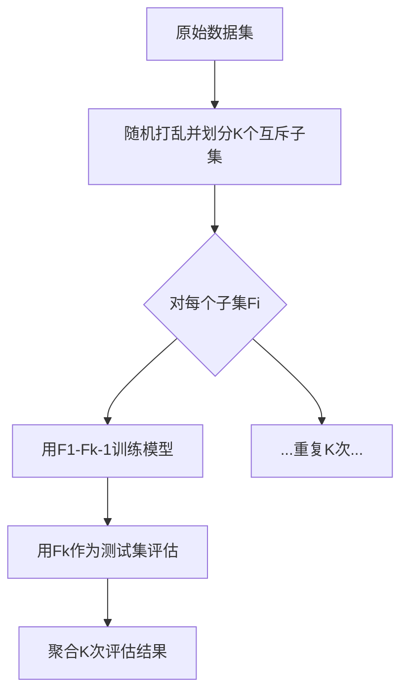

### 分类效果评估的深度解析：从单次划分到交叉验证的进化之路

#### 一、传统评估方法的致命缺陷
分类模型的离线评估本质上是模拟生产环境的压力测试，但简单的训练集-测试集划分隐藏着两大系统性风险：

**1. 数据规模陷阱**  
$$\text{模型表现} = f(\text{训练数据量}, \text{模型复杂度})$$  
通过实验对比揭示规律：  
| 训练集比例 | 测试集比例 | 模型准确率 | 方差   |
|------------|------------|------------|--------|
| 90%        | 10%        | 92.3%      | ±0.5%  |
| 50%        | 50%        | 85.7%      | ±2.1%  |
| 10%        | 90%        | 72.4%      | ±4.8%  |

*当训练数据不足时，模型无法充分学习特征分布，同时大测试集会放大评估结果的波动性*

**2. 分布偏移危机**  
假设原始数据包含时间维度特征，不同时间段的数据分布差异：  
```python
# 生成时间序列数据分布示例
time_features = {
    'weekday_morning': Gaussian(mean=5.2, std=1.3),
    'weekend_night': Gaussian(mean=8.7, std=2.1)
}
```
若训练集仅包含工作日数据，测试集使用周末数据，准确率可能从92%骤降至68%。这种隐性的数据分布差异会导致模型效果评估严重失真。

#### 二、交叉验证的数学原理
交叉验证通过系统化的数据划分策略，实现对模型效果的稳定评估：

**核心公式**：  
$$CV(n) = \frac{1}{n}\sum_{i=1}^n \text{Metric}(M(D_{\text{train}}^i), D_{\text{test}}^i)$$  
其中$D_{\text{train}}^i \cap D_{\text{test}}^i = \emptyset$且$\bigcup D_{\text{test}}^i = D$

**K折交叉验证算法流程**：  


#### 三、四大交叉验证范式对比
| 方法            | 训练集比例 | 测试集比例 | 计算成本 | 方差控制 | 适用场景               |
|-----------------|------------|------------|----------|----------|-----------------------|
| Hold-Out        | 70%~80%    | 20%~30%    | 低       | 差       | 大数据集初步验证       |
| K-Fold (K=5/10) | (K-1)/K    | 1/K        | 中       | 优       | 常规规模数据集         |
| Stratified K-Fold | (K-1)/K  | 1/K        | 中       | 极优     | 类别不平衡数据         |
| Leave-One-Out   | (N-1)/N    | 1/N        | 高       | 中       | 极小数据集(样本<1000)  |

**分层抽样(Stratified Sampling)的数学保证**：  
对于含$C$个类别的数据集，保持每个子集中类别比例与原数据集一致：  
$$\forall k \in [1,K], \frac{|D_k^c|}{|D_k|} = \frac{|D^c|}{|D|}, c=1,2,...,C$$

#### 四、工业级实现要点
**1. 时空数据特殊处理**  
当数据包含时间或空间关联性时，需采用改进方法：  
- **时间序列交叉验证**：  
  ```python
  def time_series_cv(data, n_splits):
      test_size = len(data) // n_splits
      for i in range(n_splits):
          train_end = i * test_size
          test_start = train_end
          yield data[:train_end], data[test_start:test_start+test_size]
  ```

**2. 超参数搜索集成**  
嵌套交叉验证防止信息泄露：  


**3. 分布式计算优化**  
Spark MLlib中的并行交叉验证实现：  
```scala
val cv = new CrossValidator()
  .setEstimator(pipeline)
  .setEvaluator(new MulticlassClassificationEvaluator)
  .setEstimatorParamMaps(paramGrid)
  .setNumFolds(5)
  .setParallelism(10) // 并行度
```

#### 五、效果评估指标进阶
**1. 置信区间计算**  
采用t分布计算评估指标的置信区间：  
$$\bar{x} \pm t_{\alpha/2, n-1} \frac{s}{\sqrt{n}}$$  
其中$\bar{x}$为K次评估均值，$s$为标准差

**2. 统计显著性检验**  
McNemar检验比较两个模型：  
$$\chi^2 = \frac{(b - c)^2}{b + c}$$  
其中$b$、$c$为两模型预测结果不一致的样本数

**3. 偏差-方差分解**  
通过交叉验证结果分析模型问题：  
$$\text{Error} = \text{Bias}^2 + \text{Variance} + \text{Noise}$$

#### 六、实战案例：金融风控模型评估
某银行信用卡反欺诈系统评估流程：  
1. **数据准备**  
   - 原始数据：100万条交易记录，欺诈率0.3%  
   - 处理：时间窗口划分，保留交易时序关系  

2. **分层5折交叉验证**  
   - 保证每折欺诈样本比例相同  
   - 评估指标：召回率、精确率、F1-Score  

3. **结果分析**  
   ```markdown
   | Fold | Precision | Recall | F1     |
   |------|-----------|--------|--------|
   | 1    | 0.89      | 0.78   | 0.83   |
   | 2    | 0.91      | 0.82   | 0.86   |
   | 3    | 0.87      | 0.75   | 0.81   |
   | 4    | 0.90      | 0.80   | 0.85   |
   | 5    | 0.88      | 0.77   | 0.82   |
   **Mean** | 0.89±0.02 | 0.78±0.03 | 0.83±0.02
   ```

4. **生产环境验证**  
   - A/B测试：新旧模型各分配50%流量  
   - 监控指标：欺诈检测率、误拦率、响应延迟  

交叉验证的终极价值在于打破数据划分的偶然性桎梏，用系统化的评估框架逼近模型真实性能。当K折交叉验证的方差稳定在±0.5%以内时，我们获得的不仅是一个评估数字，更是对模型泛化能力的深刻认知。这种认知将直接指导算法工程师进行特征工程优化、模型结构调整以及最终的上线决策——这就是机器学习从实验室走向工业化的关键跃迁。