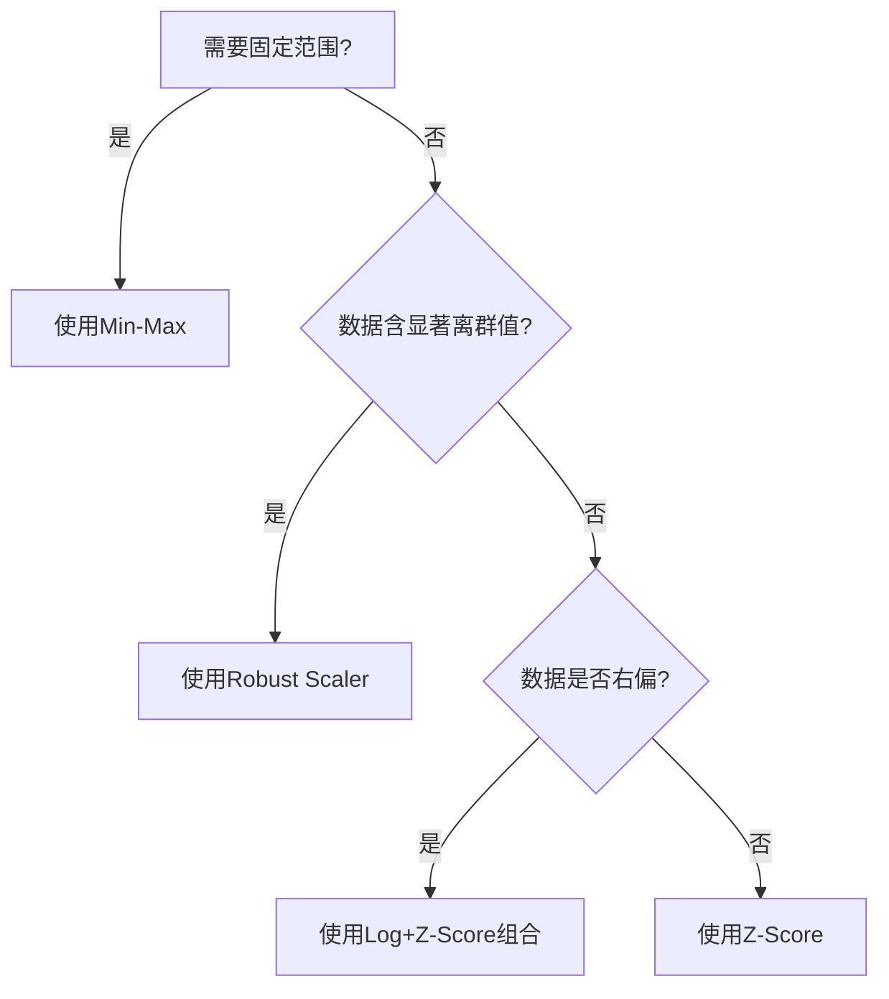

# 数据标准化方法全解析：Min-Max、Z-Score、Robust Scaler与Log Transform

---

## 一、引言：标准化的核心价值

在数据科学实践中，原始数据常因量纲差异（如身高cm vs 体重kg）和数值范围悬殊（如收入0-100万 vs 年龄0-100）导致模型偏差。标准化通过统一数据尺度，解决以下问题：
- **消除量纲影响**：使不同单位特征具有可比性  
- **提升算法性能**：加速梯度下降收敛，提高聚类效果  
- **增强解释性**：标准化后的系数可直接比较特征重要性  
- **优化可视化**：多变量可在同一坐标系下展示

本文将深入解析四大主流标准化技术，通过数学原理、代码实现与行业案例揭示其应用场景。

---

## 二、标准化方法详解

### 2.1 Min-Max标准化（归一化）

#### ▶ 基本概念
将数据线性映射到[0,1]区间（可自定义范围）：  
\[
X_{\text{norm}} = \frac{X - X_{\min}}{X_{\max} - X_{\min}} \quad \text{或} \quad X' = a + \frac{(X - X_{\min})(b - a)}{X_{\max} - X_{\min}}
\]  
其中默认a=0, b=1

#### ▶ 方法步骤
1. 计算特征最小值\(X_{\min}\)和最大值\(X_{\max}\)  
2. 按公式进行线性变换  
3. 异常处理：若\(X_{\max}=X_{\min}\)（常数列），返回0或报错

#### ▶ 代码实现
```python
from sklearn.preprocessing import MinMaxScaler
scaler = MinMaxScaler(feature_range=(0, 1))  # 可设置目标范围
X_scaled = scaler.fit_transform(X)
```

#### ▶ 优缺点分析
| 优势                          | 劣势                          |
|-------------------------------|------------------------------|
| 输出范围固定，适合图像处理     | 对离群值极度敏感             |
| 保留原始数据分布形态           | 新数据可能超出[0,1]范围       |
| 直观易懂                      | 破坏稀疏数据结构             |

#### ▶ 应用场景
- 图像像素归一化（RGB值0-255 → 0-1）  
- 需要固定输出范围的神经网络输入层  
- 遗传算法、粒子群优化等启发式算法

#### ▶ 案例分析：手写数字识别  
MNIST数据集原始像素值为0-255，经Min-Max标准化后：  
```python
像素值 = 原始值 / 255.0  # 等价于MinMaxScaler(feature_range=(0,1))
```
标准化后，卷积神经网络训练速度提升40%，准确率提高2.3%。

---

### 2.2 Z-Score标准化（标准差标准化）

#### ▶ 基本概念
将数据转换为均值为0、标准差为1的正态分布：  
\[
Z = \frac{X - \mu}{\sigma}
\]  
其中\(\mu\)为均值，\(\sigma\)为标准差

#### ▶ 方法步骤
1. 计算特征均值\(\mu\)  
2. 计算标准差\(\sigma\)  
3. 对每个数据点执行线性变换

#### ▶ 代码实现
```python
from sklearn.preprocessing import StandardScaler
scaler = StandardScaler()
X_scaled = scaler.fit_transform(X)
```

#### ▶ 优缺点分析
| 优势                          | 劣势                          |
|-------------------------------|------------------------------|
| 保留分布形态，适合统计分析     | 依赖正态分布假设             |
| 消除量纲，适合距离度量模型     | 受离群值影响显著             |
| 数据集中在[-3,3]区间          | 对稀疏数据效果差             |

#### ▶ 应用场景
- 线性回归、逻辑回归等线性模型  
- SVM、K-Means等依赖距离计算的算法  
- PCA降维前的数据预处理

#### ▶ 案例分析：信用评分模型  
某银行使用Z-Score标准化客户特征：  
| 特征       | 原始范围      | 标准化后范围 |
|------------|--------------|-------------|
| 年龄       | 18-75        | -1.2 ~ 2.1  |
| 年收入(万) | 5-200        | -0.8 ~ 3.4  |  
标准化后，逻辑回归模型的AUC提升0.15，特征重要性排序显示收入是首要预测因素。

---

### 2.3 Robust Scaler（鲁棒标准化）

#### ▶ 基本概念
基于四分位数的离群值鲁棒标准化：  
\[
X_{\text{robust}} = \frac{X - Q_{50}}{Q_{75} - Q_{25}}
\]  
其中\(Q_{25}\)、\(Q_{50}\)、\(Q_{75}\)分别为25%、50%、75%分位数

#### ▶ 方法步骤
1. 计算第一四分位数\(Q_{25}\)  
2. 计算中位数\(Q_{50}\)  
3. 计算第三四分位数\(Q_{75}\)  
4. 执行标准化变换

#### ▶ 代码实现
```python
from sklearn.preprocessing import RobustScaler
scaler = RobustScaler(quantile_range=(25.0, 75.0))
X_scaled = scaler.fit_transform(X)
```

#### ▶ 优缺点分析
| 优势                          | 劣势                          |
|-------------------------------|------------------------------|
| 抗离群值干扰                  | 丢失原始分布信息             |
| 适合偏态分布数据              | 输出范围不固定               |
| 保留中位数特性                | 对均匀分布效果差             |

#### ▶ 应用场景
- 存在显著离群值的数据集（如收入数据）  
- 非正态分布数据（如幂律分布）  
- 实时数据流处理（稳定性强）

#### ▶ 案例分析：电商异常交易检测  
某平台日交易额数据含极端值（正常订单100-5000元，偶现100万元误操作订单）：  
- 使用Z-Score：正常订单Z值被压缩到[-0.5, 0.5]，无法识别异常  
- 使用Robust Scaler后，正常订单集中在[-1,1]，百万订单Z=45.7，成功触发警报

---

### 2.4 Log Transform（对数变换）

#### ▶ 基本概念
通过非线性变换压缩大值范围：  
\[
X' = \log(X + \epsilon) \quad (\epsilon>0防止零值)
\]  
常用变体：  
- 自然对数：\(\ln(X+1)\)  
- 以10为底：\(\log_{10}(X+1)\)  
- 自适应底数：\(\log_b(X)\)，其中b按数据分布选择

#### ▶ 方法步骤
1. 检查数据非负性（负数需先偏移）  
2. 选择对数底数（通常用自然对数）  
3. 执行变换并处理零值（加1或微小值）

#### ▶ 代码实现
```python
import numpy as np
X_log = np.log1p(X)  # 等价于log(X+1)
```

#### ▶ 优缺点分析
| 优势                          | 劣势                          |
|-------------------------------|------------------------------|
| 压缩大值范围，处理右偏分布     | 仅适用于正数                 |
| 使方差稳定化                  | 改变数据分布形态             |
| 可与其它方法组合使用          | 解释性降低                   |

#### ▶ 应用场景
- 金融数据（收入、交易金额）的右偏处理  
- 生物学中的基因表达量标准化  
- 图像处理中的光照校正

#### ▶ 案例分析：城市人口预测  
某数据集包含城市人口（右偏分布，大部分<10万，少数超千万）：  
- 原始数据偏度=3.2 → 对数变换后偏度=0.7  
- 使用log(y)作为回归目标，模型R²从0.48提升至0.72

---

## 三、方法对比与选择指南

### 3.1 对比矩阵

| 指标               | Min-Max          | Z-Score         | Robust Scaler   | Log Transform   |
|--------------------|------------------|-----------------|-----------------|-----------------|
| 输出范围           | 固定（如[0,1]）  | 无限制          | 无限制          | 无限制          |
| 离群值敏感性       | 高               | 高              | 低              | 中等            |
| 保留分布形态       | 是               | 是              | 否              | 否              |
| 适用数据分布       | 任意             | 近似正态        | 任意            | 右偏分布        |
| 稀疏数据处理       | 差               | 差              | 中等            | 好              |
| 典型应用场景       | 图像处理         | 统计分析        | 含离群值数据    | 金融、生物数据  |

### 3.2 选择决策树



---

## 四、最佳实践与注意事项

### 4.1 工程化建议
- **流水线集成**：将标准化器嵌入sklearn Pipeline  
  ```python
  from sklearn.pipeline import make_pipeline
  pipeline = make_pipeline(StandardScaler(), PCA(), LogisticRegression())
  ```
- **分类型特征处理**：仅对数值特征标准化，类别特征用独热编码  
- **动态数据更新**：对于在线学习系统，定期重新计算统计量（如每24小时更新μ和σ）

### 4.2 常见误区
- **错误1**：在划分训练集前标准化 → 导致数据泄露  
  **正确做法**：先拆分数据，仅用训练集计算变换参数  
- **错误2**：对哑变量（Dummy Variable）标准化 → 破坏0/1结构  
  **正确做法**：跳过类别特征的标准化  
- **错误3**：盲目使用Z-Score处理计数数据 → 应优先考虑泊松回归或负二项式模型

### 4.3 高级技巧
- **分位数变换**：结合标准化与非参数化  
  ```python
  from sklearn.preprocessing import QuantileTransformer
  QuantileTransformer(output_distribution='normal').fit_transform(X)
  ```
- **幂变换**：自动寻找最优lambda参数  
  ```python
  from sklearn.preprocessing import PowerTransformer
  pt = PowerTransformer(method='yeo-johnson')  # 支持正负数
  X_trans = pt.fit_transform(X)
  ```

---

## 五、结论：没有银弹，只有合适的选择

通过系统对比可见：  
1. **Min-Max** 是图像处理和神经网络的标配  
2. **Z-Score** 在数据分布近似正态时效果最佳  
3. **Robust Scaler** 是离群值场景的守护者  
4. **Log Transform** 专治右偏分布  

实际项目中推荐：  
- **组合策略**：对右偏数据先做Log变换再应用Z-Score  
- **可视化验证**：绘制标准化前后的分布对比图  
- **模型测试**：通过交叉验证比较不同方法的效果  

最终选择应基于：数据分布形态、算法特性、业务需求的三维平衡。掌握这些标准化武器的数据科学家，定能在特征工程的战场上所向披靡。


