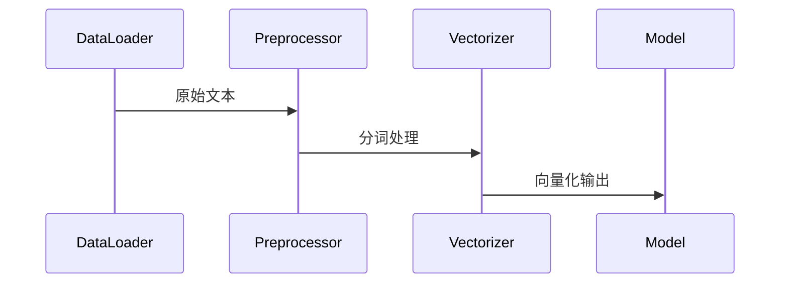
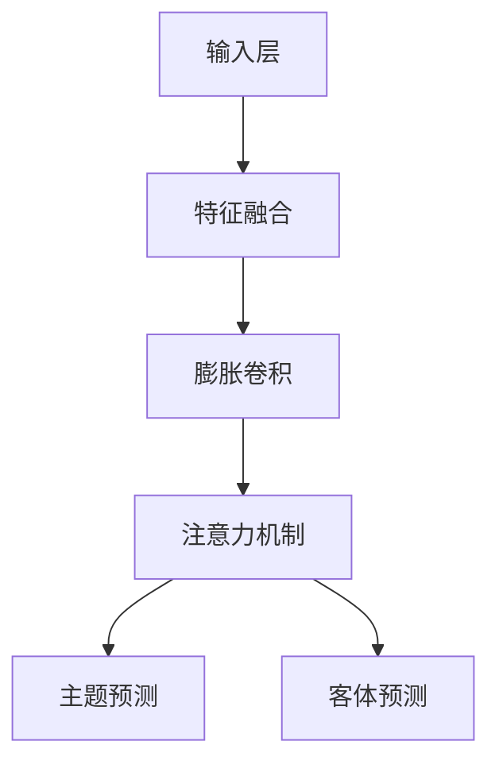

# ExtractTriples 技术文档

## 一、工程结构

```
ExtractTriples/
├── .git/                     # Git 版本控制文件夹
├── .gitignore                # 忽略文件配置
├── README.md                 # 项目说明文档
├── config.py                 # 配置文件
├── data_loader.py            # 数据加载逻辑
├── data_trans.py             # 数据转换脚本
├── img/                      # 可能包含图片资源的目录
├── kg_with_ds.py             # 核心知识图谱处理逻辑
├── model/                    # 存放模型相关代码的目录
├── predict.py                # 推理或预测脚本
├── requirements.txt          # 依赖项声明文件
├── train.py                  # 训练脚本
└── w2v_model.py              # Word2Vec 模型实现
```

## 二、技术选型

- **编程语言**: Python
- **深度学习框架**: Keras + TensorFlow
- **词向量模型**: FastText（支持中文）
- **序列建模**: 膨胀门控卷积 + 多头注意力机制
- **优化策略**: 指数滑动平均 (EMA)、动态学习率
- **特征融合**: 字符向量 + 词向量 + 位置向量三重嵌入

### 核心依赖库

```plaintext
gensim==4.3.1
tqdm==4.65.0
```

## 三、核心架构

```mermaid
classDiagram
    class "数据流" {
        +文本输入
        +词向量嵌入
        +位置编码
        +多模态融合
    }

    class "模型组件" {
        +膨胀门控卷积
        +多头注意力机制
        +主题-客体联合预测
    }

    class "训练策略" {
        +指数滑动平均
        +动态学习率调整
        +F1值评估回调
    }

    数据流 --> 模型组件 : 特征提取
    模型组件 --> 训练策略 : 参数更新
```

## 四、关键流程

### 1. 数据处理流程



### 2. 模型架构图



## 五、核心代码片段

### 1. 特征融合模块

```python
t1 = Embedding(len(char2id) + 2, char_size)(t1)
t2 = Dense(char_size, use_bias=False)(t2)
t = Add()([t1, t2, pv])  # 字向量、词向量、位置向量相加
```

### 2. 膨胀门控卷积

```python
def dilated_gated_conv1d(seq, mask, dilation_rate=1):
    dim = K.int_shape(seq)[-1]
    h = Conv1D(dim * 2, 3, padding='same', dilation_rate=dilation_rate)(seq)

    def _gate(x):
        dropout_rate = 0.1
        s, h = x
        g, h = h[:, :, :dim], h[:, :, dim:]
        g = K.in_train_phase(K.dropout(g, dropout_rate), g)
        g = K.sigmoid(g)
        return g * s + (1 - g) * h

    seq = Lambda(_gate)([seq, h])
    seq = Lambda(lambda x: x[0] * x[1])([seq, mask])
    return seq
```

### 3. 多头注意力机制

```python
class Attention(Layer):
    def __init__(self, nb_head, size_per_head, **kwargs):
        self.nb_head = nb_head
        self.size_per_head = size_per_head
        self.out_dim = nb_head * size_per_head
        super(Attention, self).__init__(**kwargs)

    def build(self, input_shape):
        super(Attention, self).build(input_shape)
        q_in_dim = input_shape[0][-1]
        k_in_dim = input_shape[1][-1]
        v_in_dim = input_shape[2][-1]
        self.q_kernel = self.add_weight(name='q_kernel',
                                        shape=(q_in_dim, self.out_dim),
                                        initializer='glorot_normal')
        self.k_kernel = self.add_weight(name='k_kernel',
                                        shape=(k_in_dim, self.out_dim),
                                        initializer='glorot_normal')
        self.v_kernel = self.add_weight(name='w_kernel',
                                        shape=(v_in_dim, self.out_dim),
                                        initializer='glorot_normal')

    def call(self, inputs):
        q, k, v = inputs[:3]
        v_mask, q_mask = None, None
        if len(inputs) > 3:
            v_mask = inputs[3]
            if len(inputs) > 4:
                q_mask = inputs[4]
        # 线性变换
        qw = K.dot(q, self.q_kernel)
        kw = K.dot(k, self.k_kernel)
        vw = K.dot(v, self.v_kernel)
        # 形状变换
        qw = K.reshape(qw, (-1, K.shape(qw)[1], self.nb_head, self.size_per_head))
        kw = K.reshape(kw, (-1, K.shape(kw)[1], self.nb_head, self.size_per_head))
        vw = K.reshape(vw, (-1, K.shape(vw)[1], self.nb_head, self.size_per_head))
        # 维度置换
        qw = K.permute_dimensions(qw, (0, 2, 1, 3))
        kw = K.permute_dimensions(kw, (0, 2, 1, 3))
        vw = K.permute_dimensions(vw, (0, 2, 1, 3))
        # Attention
        a = K.batch_dot(qw, kw, [3, 3]) / self.size_per_head ** 0.5
        a = K.permute_dimensions(a, (0, 3, 2, 1))
        a = self.mask(a, v_mask, 'add')
        a = K.permute_dimensions(a, (0, 3, 2, 1))
        a = K.softmax(a)
        # 完成输出
        o = K.batch_dot(a, vw, [3, 2])
        o = K.permute_dimensions(o, (0, 2, 1, 3))
        o = K.reshape(o, (-1, K.shape(o)[1], self.out_dim))
        o = self.mask(o, q_mask, 'mul')
        return o

    def compute_output_shape(self, input_shape):
        return (input_shape[0][0], input_shape[0][1], self.out_dim)
```

### 4. 模型定义

```python
def model():
    from data_loader import num_classes, char_size, maxlen, char2id

    t1_in = Input(shape=(None,))
    t2_in = Input(shape=(None, word_size))
    s1_in = Input(shape=(None,))
    s2_in = Input(shape=(None,))
    k1_in = Input(shape=(1,))
    k2_in = Input(shape=(1,))
    o1_in = Input(shape=(None, num_classes))
    o2_in = Input(shape=(None, num_classes))
    pres_in = Input(shape=(None, 2))
    preo_in = Input(shape=(None, num_classes * 2))

    t1, t2, s1, s2, k1, k2, o1, o2, pres, preo = t1_in, t2_in, s1_in, s2_in, k1_in, k2_in, o1_in, o2_in, pres_in, preo_in
    mask = Lambda(lambda x: K.cast(K.greater(K.expand_dims(x, 2), 0), 'float32'))(t1)

    pid = Lambda(position_id)(t1)
    position_embedding = Embedding(maxlen, char_size, embeddings_initializer='zeros')
    pv = position_embedding(pid)

    t1 = Embedding(len(char2id) + 2, char_size)(t1)  # 0: padding, 1: unk
    t2 = Dense(char_size, use_bias=False)(t2)  # 词向量也转为同样维度
    t = Add()([t1, t2, pv])  # 字向量、词向量、位置向量相加
    t = Dropout(0.25)(t)
    t = Lambda(lambda x: x[0] * x[1])([t, mask])
    t = dilated_gated_conv1d(t, mask, 1)
    t = dilated_gated_conv1d(t, mask, 2)
    t = dilated_gated_conv1d(t, mask, 5)
    t = dilated_gated_conv1d(t, mask, 1)
    t = dilated_gated_conv1d(t, mask, 2)
    t = dilated_gated_conv1d(t, mask, 5)
    t = dilated_gated_conv1d(t, mask, 1)
    t = dilated_gated_conv1d(t, mask, 2)
    t = dilated_gated_conv1d(t, mask, 5)
    t = dilated_gated_conv1d(t, mask, 1)
    t = dilated_gated_conv1d(t, mask, 1)
    t = dilated_gated_conv1d(t, mask, 1)
    t_dim = K.int_shape(t)[-1]

    pn1 = Dense(char_size, activation='relu')(t)
    pn1 = Dense(1, activation='sigmoid')(pn1)
    pn2 = Dense(char_size, activation='relu')(t)
    pn2 = Dense(1, activation='sigmoid')(pn2)

    h = Attention(8, 16)([t, t, t, mask])
    h = Concatenate()([t, h, pres])
    h = Conv1D(char_size, 3, activation='relu', padding='same')(h)
    ps1 = Dense(1, activation='sigmoid')(h)
    ps2 = Dense(1, activation='sigmoid')(h)
    ps1 = Lambda(lambda x: x[0] * x[1])([ps1, pn1])
    ps2 = Lambda(lambda x: x[0] * x[1])([ps2, pn2])

    subject_model = Model([t1_in, t2_in, pres_in], [ps1, ps2])  # 预测subject的模型

    t_max = Lambda(seq_maxpool)([t, mask])
    pc = Dense(char_size, activation='relu')(t_max)
    pc = Dense(num_classes, activation='sigmoid')(pc)

    k = Lambda(get_k_inter, output_shape=(6, t_dim))([t, k1, k2])
    k = Bidirectional(CuDNNGRU(t_dim))(k)
    k1v = position_embedding(Lambda(position_id)([t, k1]))
    k2v = position_embedding(Lambda(position_id)([t, k2]))
    kv = Concatenate()([k1v, k2v])
    k = Lambda(lambda x: K.expand_dims(x[0], 1) + x[1])([k, kv])

    h = Attention(8, 16)([t, t, t, mask])
    h = Concatenate()([t, h, k, pres, preo])
    h = Conv1D(char_size, 3, activation='relu', padding='same')(h)
    po = Dense(1, activation='sigmoid')(h)
    po1 = Dense(num_classes, activation='sigmoid')(h)
    po2 = Dense(num_classes, activation='sigmoid')(h)
    po1 = Lambda(lambda x: x[0] * x[1] * x[2] * x[3])([po, po1, pc, pn1])
    po2 = Lambda(lambda x: x[0] * x[1] * x[2] * x[3])([po, po2, pc, pn2])

    object_model = Model([t1_in, t2_in, k1_in, k2_in, pres_in, preo_in], [po1, po2])  # 输入text和subject，预测object及其关系

    train_model = Model([t1_in, t2_in, s1_in, s2_in, k1_in, k2_in, o1_in, o2_in, pres_in, preo_in],
                        [ps1, ps2, po1, po2])

    s1 = K.expand_dims(s1, 2)
    s2 = K.expand_dims(s2, 2)

    s1_loss = K.binary_crossentropy(s1, ps1)
    s1_loss = K.sum(s1_loss * mask) / K.sum(mask)
    s2_loss = K.binary_crossentropy(s2, ps2)
    s2_loss = K.sum(s2_loss * mask) / K.sum(mask)

    o1_loss = K.sum(K.binary_crossentropy(o1, po1), 2, keepdims=True)
    o1_loss = K.sum(o1_loss * mask) / K.sum(mask)
    o2_loss = K.sum(K.binary_crossentropy(o2, po2), 2, keepdims=True)
    o2_loss = K.sum(o2_loss * mask) / K.sum(mask)

    loss = (s1_loss + s2_loss) + (o1_loss + o2_loss)

    train_model.add_loss(loss)
    train_model.compile(optimizer=Adam(1e-3))
    train_model.summary()
    return train_model, subject_model, object_model
```

## 六、依赖配置

```python
# 主要依赖版本
gensim==4.0.0+
keras==2.6.0
tensorflow==2.6.0
numpy==1.21.2
pyhanlp==0.1.9
```

## 七、训练与测试流程

### 训练流程

```python
def train():
    from data_trans import process
    process()
    from data_loader import train_data, SpoSearcher, dev_data, DataGenerator

    init_keras_config()
    train_model, subject_model, object_model = model()

    EMAer = ExponentialMovingAverage(train_model)
    EMAer.inject()

    spoer = SpoSearcher(train_data)
    train_D = DataGenerator(train_data)

    evaluator = Evaluate(train_model, EMAer=EMAer, dev_data=dev_data, spoer=spoer, subject_model=subject_model,
                         object_model=object_model)

    train_model.fit_generator(train_D.__iter__(),
                              steps_per_epoch=len(train_D),
                              epochs=120,
                              callbacks=[evaluator]
                              )
```

### 测试流程

```python
def test(test_data):
    from data_loader import train_data, SpoSearcher, extract_items

    train_model, subject_model, object_model = model()
    EMAer = ExponentialMovingAverage(train_model)
    EMAer.inject()

    spoer = SpoSearcher(train_data)

    orders = ['subject', 'predicate', 'object', 'object_type', 'subject_type']
    F = open('test_pred.json', 'w')
    for d in tqdm(iter(test_data)):
        R = set(extract_items(d['text'], spoer=spoer, subject_model=subject_model, object_model=object_model))
        s = json.dumps({
            'text': d['text'],
            'spo_list': [
                dict(zip(orders, spo + ('', ''))) for spo in R
            ]
        }, ensure_ascii=False)
        F.write(s.encode('utf-8') + '\n')
    F.close()
```

### 推理流程

```python
def predict(sentence_list):
    from data_loader import train_data, SpoSearcher, extract_items

    train_model, subject_model, object_model = model()
    train_model.load_weights(model_path)

    spoer = SpoSearcher(train_data)

    EMAer = ExponentialMovingAverage(train_model)
    EMAer.inject()

    orders = ['subject', 'predicate', 'object', 'object_type', 'subject_type']
    for sent in tqdm(iter(sentence_list)):
        R = set(extract_items(sent, spoer=spoer, subject_model=subject_model, object_model=object_model))
        spo_list = [
            dict(zip(orders, spo + ('', ''))) for spo in R
        ]
        yield sent, spo_list
```

---

以上是项目的完整技术文档，涵盖了工程结构、技术选型、核心逻辑、依赖配置以及训练、测试和推理流程。
