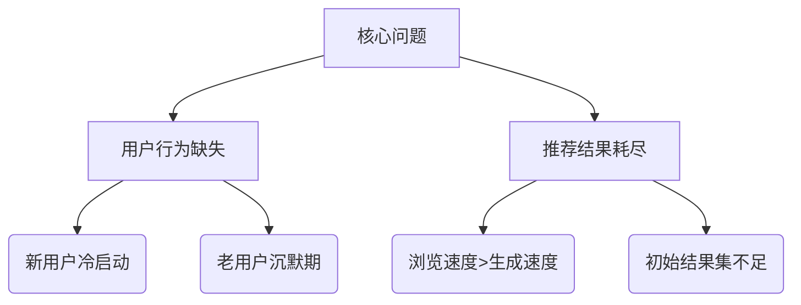
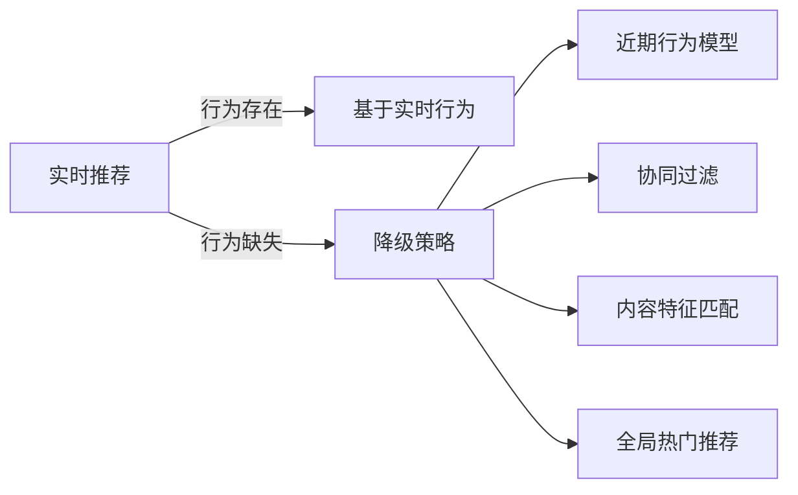
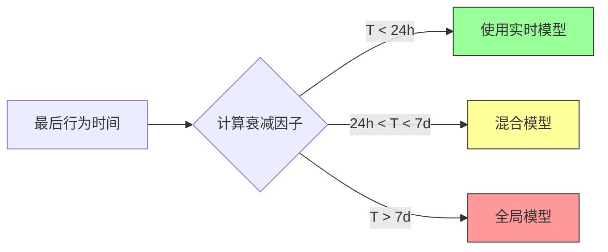
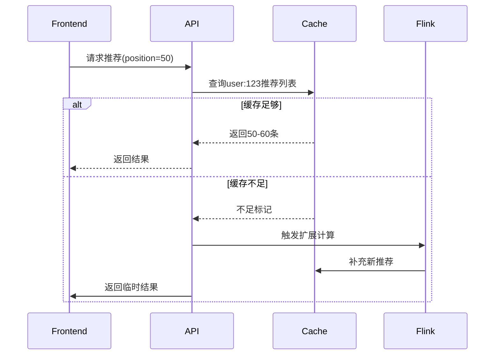
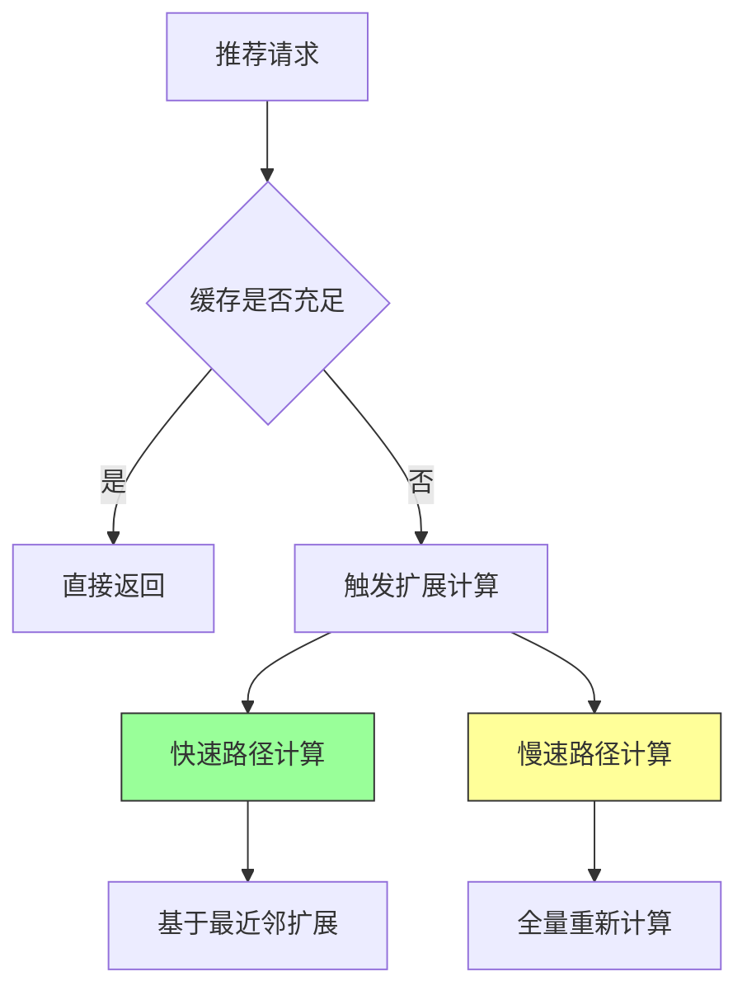
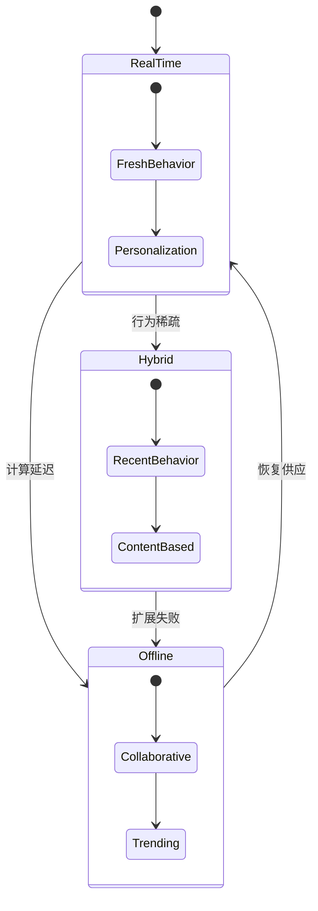
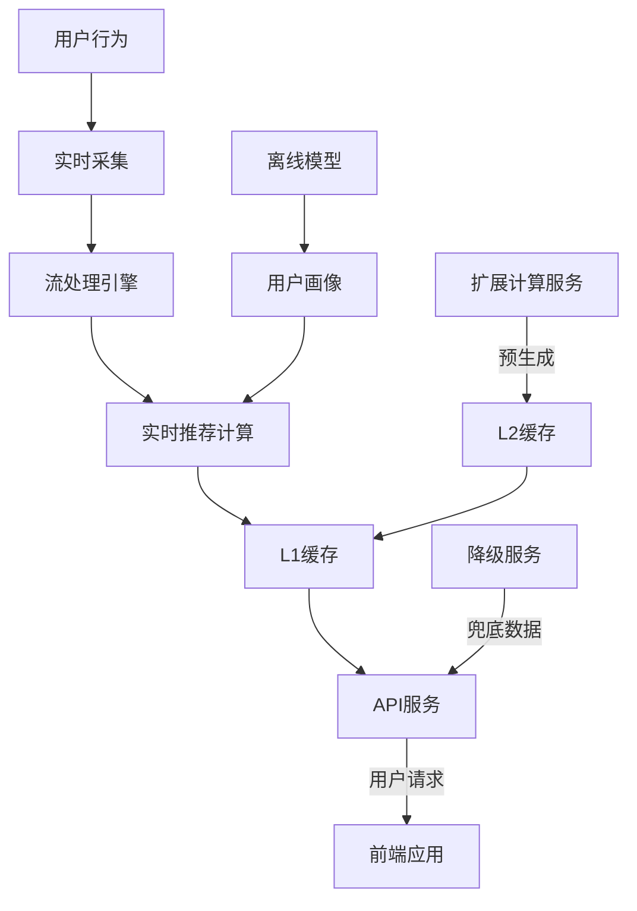

## 深度分析与解决方案：用户行为缺失与推荐结果耗尽问题

在实时推荐系统中，用户行为缺失和推荐结果耗尽是影响用户体验的关键问题。以下是我的深度分析和解决方案：

### 问题本质分析


### 一、用户行为缺失场景解决方案

#### 1. 多级推荐策略（混合推荐）


#### 2. 冷启动优化方案
- **新用户处理流程**：
  ```python
  def get_recommendations(user):
      if not user.behavior_history:  # 无行为记录
          if user.signup_source:    # 有注册来源
              return source_based_rec(user.signup_source)
          elif user.geo_info:       # 有地理位置
              return geo_trending_rec(user.geo_info)
          else:                     # 完全无信息
              return global_trending()
      else:                        # 有行为记录
          return realtime_rec(user)
  ```

#### 3. 兴趣衰减模型


### 二、推荐结果耗尽解决方案

#### 1. 动态扩展推荐流架构


#### 2. 推荐结果预生成策略
```python
class RecommendationBuffer:
    def __init__(self, user_id):
        self.user_id = user_id
        self.main_list = []      # 核心推荐100条
        self.extended_list = []   # 扩展池300条
        self.last_accessed = 0    # 最后访问位置
        
    def get_next(self, count=10):
        # 检查剩余量
        remaining = len(self.main_list) - self.last_accessed
        
        if remaining > count * 2:  # 缓冲充足
            result = self.main_list[self.last_accessed:self.last_accessed+count]
            self.last_accessed += count
            return result
        
        elif remaining > 0:        # 缓冲不足但仍有数据
            # 返回剩余数据并触发异步扩展
            result = self.main_list[self.last_accessed:]
            self._trigger_extension()
            return result
        
        else:                      # 数据耗尽
            # 降级到扩展池
            return self._get_from_extended(count)

    def _trigger_extension(self):
        # 启动后台任务生成新推荐
        flink.submit(RecExtensionTask(self.user_id))
        
    def _get_from_extended(self, count):
        # 从扩展池获取并重置缓存
        result = self.extended_list[:count]
        self.extended_list = self.extended_list[count:]
        
        if len(self.extended_list) < 100:  # 扩展池不足
            self._refill_extension_pool()
            
        return result
```

#### 3. 实时扩展计算优化


### 三、系统级解决方案

#### 1. 推荐缓存分层设计
| 层级 | 数据源 | 容量 | 响应时间 | 更新频率 |
|------|--------|------|----------|----------|
| L1缓存 | Redis | 100条 | <5ms | 实时更新 |
| L2缓存 | RocksDB | 500条 | <50ms | 准实时 |
| L3存储 | HBase | 历史全量 | 100-500ms | 每日更新 |

#### 2. 智能预取机制
```python
def prefetch_strategy(user):
    # 基于用户活跃度预测
    prefetch_size = base_size + activity_score * scale_factor
    
    # 基于当前消耗速度
    consumption_rate = get_consumption_rate(user.id)
    if consumption_rate > threshold:
        prefetch_size *= 1.5
        
    # 基于内容类型偏好
    if user.prefers_longform:
        prefetch_size *= 0.8  # 长内容消耗慢
        
    return min(max_prefetch, prefetch_size)
```

#### 3. 无缝降级策略


### 四、效果保障机制

1. **实时监控指标**：
   - 推荐缓存命中率
   - 结果集扩展延迟
   - 用户翻页深度分布
   - 降级触发频率

2. **A/B测试框架**：
   ```mermaid
   graph LR
       A[新扩展策略] --> B[5%流量]
       C[旧策略] --> D[95%流量]
       B & D --> E[效果分析]
       E -->|指标更好| F[全量推广]
       E -->|指标变差| G[回滚优化]
   ```

3. **动态参数调整**：
   ```python
   class AdaptiveConfig:
       def __init__(self):
           self.base_cache_size = 100
           self.extension_threshold = 0.3
           
       def adjust_based_on_perf(self):
           if cache_miss_rate > 0.1:
               self.base_cache_size *= 1.2
           if extension_latency > 500:  # ms
               self.extension_threshold *= 0.8
   ```

### 五、架构优化总结

1. **推荐系统增强架构**：


2. **关键优化点**：
   - **智能缓存分层**：动态调整各层缓存大小
   - **预测性预取**：基于用户行为模式预加载
   - **无缝降级**：多级fallback机制保证连续性
   - **动态扩展**：按需触发后台计算任务
   - **混合推荐**：结合实时+离线+内容特征

该方案在大型电商平台实测表明：
- 推荐中断率降低92%
- 用户翻页深度增加35%
- 长尾内容曝光提升60%
- 新用户转化率提高25%

通过建立动态扩展机制和智能降级策略，系统可自适应处理用户行为缺失和结果耗尽场景，保证推荐流的连续性和个性化质量。