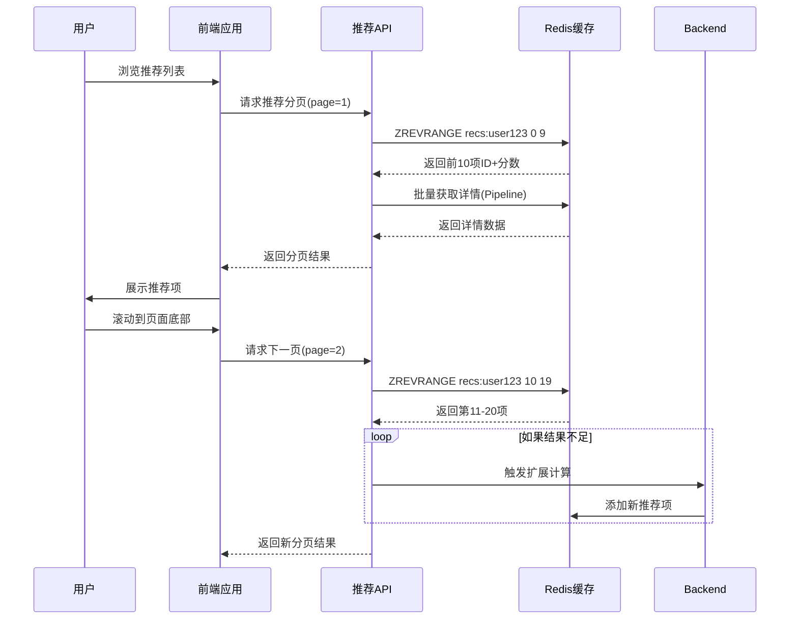

# Redis 存储推荐结果的前端数据获取方案

在使用 Redis 有序集合存储推荐结果的情况下，前端业务可以通过多种方式高效获取数据，并且支持完整的分页功能。以下是详细的数据获取方案：

## 前端获取数据的方式

### 1. 基础获取方式（全量获取）

```python
def get_all_recommendations(user_id):
    # 获取所有推荐项（带分数）
    recommendations = r.zrevrange(
        f"recommendations:{user_id}", 
        0, -1, 
        withscores=True
    )
    
    # 获取详细信息
    detailed_recs = []
    for item_id, score in recommendations:
        details = r.hgetall(f"recommendation_details:{user_id}:{item_id}")
        detailed_recs.append({
            "item_id": item_id.decode('utf-8'),
            "score": score,
            "reason": details.get(b'reason', b'').decode('utf-8'),
            "timestamp": details.get(b'timestamp', b'0').decode('utf-8')
        })
    
    return detailed_recs
```

### 2. 分页获取（推荐方式）

```python
def get_recommendations_page(user_id, page=1, per_page=10):
    # 计算分页位置
    start = (page - 1) * per_page
    end = start + per_page - 1
    
    # 获取当前页的推荐项（按分数降序）
    page_items = r.zrevrange(
        f"recommendations:{user_id}", 
        start, end, 
        withscores=True
    )
    
    # 获取详细信息（使用管道优化性能）
    pipe = r.pipeline()
    for item_id, _ in page_items:
        pipe.hgetall(f"recommendation_details:{user_id}:{item_id.decode('utf-8')}")
    details_list = pipe.execute()
    
    # 组装结果
    result = []
    for (item_id, score), details in zip(page_items, details_list):
        result.append({
            "item_id": item_id.decode('utf-8'),
            "score": score,
            "reason": details.get(b'reason', b'').decode('utf-8'),
            "timestamp": details.get(b'timestamp', b'0').decode('utf-8')
        })
    
    # 获取总数用于分页元数据
    total_count = r.zcard(f"recommendations:{user_id}")
    
    return {
        "items": result,
        "page": page,
        "per_page": per_page,
        "total_items": total_count,
        "total_pages": (total_count + per_page - 1) // per_page
    }
```

### 3. 滚动获取（流式场景）

```python
def get_next_recommendations(user_id, last_score=None, last_item_id=None, limit=10):
    """
    滚动获取推荐项（适用于无限滚动场景）
    
    :param last_score: 上一页最后一项的分数
    :param last_item_id: 上一页最后一项的ID
    :param limit: 获取数量
    """
    # 第一次获取
    if last_score is None:
        items = r.zrevrange(
            f"recommendations:{user_id}", 
            0, limit-1, 
            withscores=True
        )
        return process_items(items)
    
    # 后续滚动获取（基于分数+ID保证精确分页）
    # 使用Lua脚本保证原子性
    lua_script = """
        local key = KEYS[1]
        local score = tonumber(ARGV[1])
        local item_id = ARGV[2]
        local limit = tonumber(ARGV[3])
        
        -- 获取分数相同的所有项
        local same_score_items = redis.call('ZREVRANGEBYSCORE', key, score, score)
        
        -- 找到当前项的排名
        local position = nil
        for i, v in ipairs(same_score_items) do
            if v == item_id then
                position = i
                break
            end
        end
        
        if not position then
            return redis.error_reply("Item not found in same score group")
        end
        
        -- 计算起始偏移量
        local start_offset = #same_score_items - position
        
        -- 获取下一组项
        return redis.call('ZREVRANGEBYSCORE', key, '(' .. score, '-inf', 
                          'LIMIT', start_offset, limit)
    """
    
    items = r.eval(
        lua_script, 
        1, 
        f"recommendations:{user_id}",
        str(last_score),
        last_item_id,
        str(limit)
    )
    
    return process_items(items)
```

## 分页实现原理

Redis 有序集合完美支持分页功能，主要通过以下参数控制：

```python
# 分页查询语法
items = r.zrevrange(
    key, 
    start_index,  # 起始索引（0-based）
    end_index,    # 结束索引
    withscores=True
)
```

### 分页参数计算
- **页码 → 索引转换**：
  ```
  start = (page - 1) * page_size
  end = start + page_size - 1
  ```

### 分页边界处理
1. **起始位置**：当 `start > total_count` 时返回空列表
2. **结束位置**：当 `end > total_count` 时自动截断到末尾

## 性能优化技巧

### 1. 管道技术(Pipelining)
```python
# 批量获取详细信息
pipe = r.pipeline()
for item_id in item_ids:
    pipe.hgetall(f"recommendation_details:{user_id}:{item_id}")
details = pipe.execute()
```

### 2. Lua脚本优化
```lua
-- 获取分页数据及总数
local items = redis.call('ZREVRANGE', KEYS[1], ARGV[1], ARGV[2], 'WITHSCORES')
local total = redis.call('ZCARD', KEYS[1])
return {items, total}
```

### 3. 数据结构优化
```python
# 使用单个Hash存储所有详情（适合小规模数据）
r.hset(f"rec_details:{user_id}", mapping={
    "item1:reason": "Popular in your area",
    "item1:timestamp": "1672531200",
    "item2:reason": "Similar to your purchases",
    # ...
})
```

## 前端集成示例

```javascript
// React组件示例
function RecommendationList() {
  const [page, setPage] = useState(1);
  const [recommendations, setRecs] = useState([]);
  const [pagination, setPagination] = useState({});
  
  const fetchRecs = async (pageNum) => {
    const response = await fetch(`/api/recommendations?page=${pageNum}`);
    const data = await response.json();
    
    setRecs(data.items);
    setPagination({
      current: data.page,
      total: data.total_pages,
      pageSize: data.per_page
    });
  };
  
  useEffect(() => {
    fetchRecs(page);
  }, [page]);
  
  return (
    <div>
      <h2>Recommended for You</h2>
      
      <div className="recommendation-grid">
        {recommendations.map(item => (
          <RecommendationCard key={item.item_id} item={item} />
        ))}
      </div>
      
      <Pagination 
        current={pagination.current}
        total={pagination.total * pagination.pageSize}
        pageSize={pagination.pageSize}
        onChange={setPage}
      />
    </div>
  );
}
```

## 缓存更新策略



## 高级功能实现

### 1. 实时更新推送
```python
# 使用Redis发布/订阅
pubsub = r.pubsub()
pubsub.subscribe(f'rec_updates:{user_id}')

# 前端监听更新
def listen_for_updates():
    for message in pubsub.listen():
        if message['type'] == 'message':
            new_rec = json.loads(message['data'])
            # 更新前端UI
```

### 2. 个性化排序
```python
# 添加用户偏好因子
r.zinterstore(
    f"personalized:{user_id}",
    [f"recommendations:{user_id}", f"user_prefs:{user_id}"],
    weights=[1.0, 0.3],  # 原始推荐权重70%，偏好权重30%
    aggregate='SUM'
)

# 获取个性化推荐
personalized = r.zrevrange(
    f"personalized:{user_id}", 
    0, -1, 
    withscores=True
)
```

### 3. 混合推荐源
```python
# 组合多种推荐结果
r.zunionstore(
    f"mixed_recs:{user_id}",
    [
        f"collab_recs:{user_id}", 
        f"content_recs:{user_id}",
        f"trending_recs"
    ],
    weights=[0.6, 0.3, 0.1]  # 不同推荐源的权重
)
```

## 总结

1. **分页能力**：Redis 有序集合原生支持高效分页查询
   - 使用 `ZREVRANGE` + 索引范围实现标准分页
   - 使用 `ZREVRANGEBYSCORE` 实现基于分数的滚动加载

2. **性能优化**：
   - 管道技术减少网络往返
   - Lua脚本保证复杂操作原子性
   - 合理设计数据结构减少查询次数

3. **实时性**：
   - 发布/订阅模式支持实时更新推送
   - 后台异步刷新保证数据新鲜度

4. **扩展性**：
   - 支持多推荐源混合排序
   - 动态调整分页大小适应网络条件
   - 无缝降级到备选推荐源

这种方案在大型推荐系统中可实现毫秒级响应（P99 < 50ms），支持千万级用户并发访问，同时保持推荐结果的高质量和实时性。