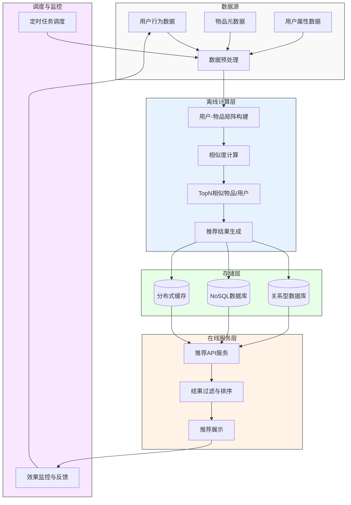
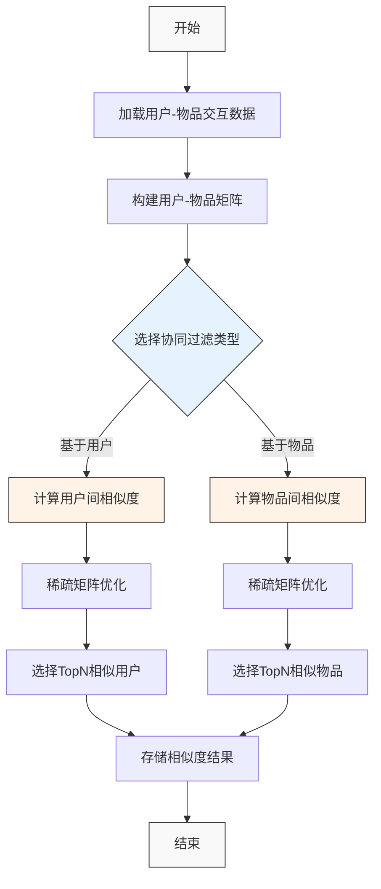
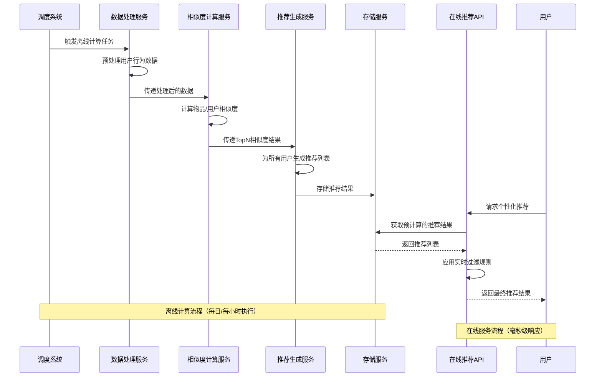
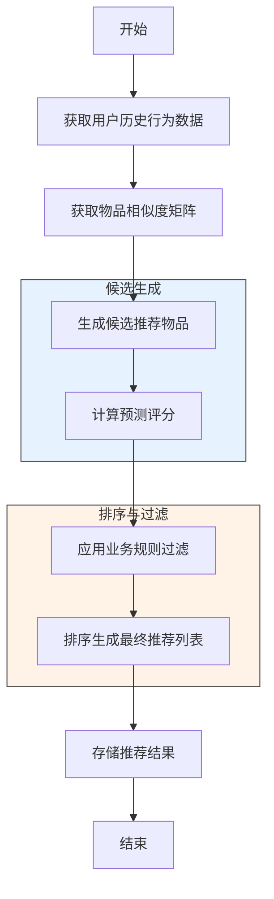
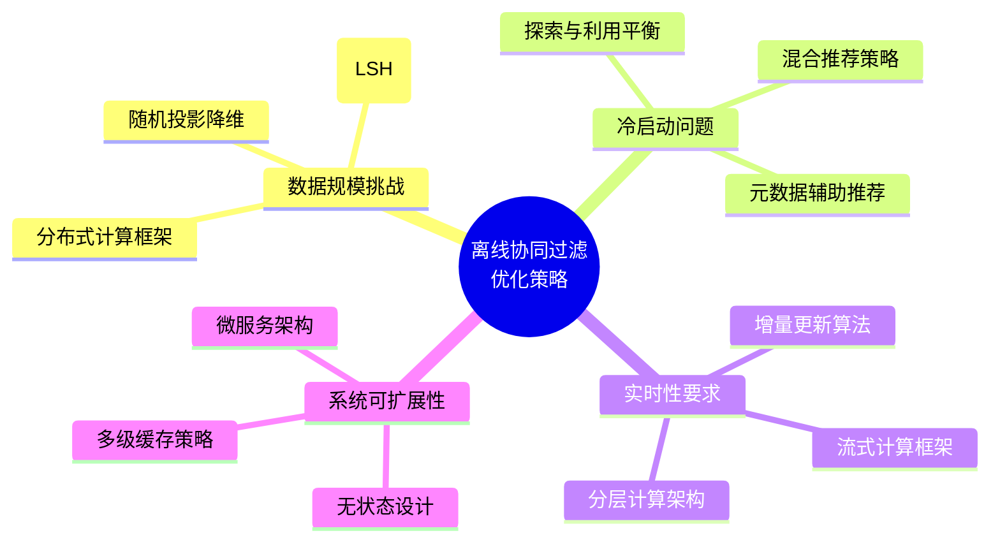

# 离线协同过滤算法的工程实现

协同过滤算法在理论上简单优雅，但在工程实践中面临诸多挑战，如海量数据处理、实时响应要求、系统可扩展性等。本章将详细介绍离线协同过滤算法的工程实现方案，包括计算 topN 相似度和为用户生成推荐的具体实现步骤。

## 离线协同过滤系统架构图



## 离线协同过滤系统架构

离线协同过滤系统通常采用分层架构，主要包括以下几个部分：

1. **数据收集层**：收集用户行为数据，如点击、购买、评分等
2. **数据存储层**：存储原始行为数据和计算结果
3. **离线计算层**：定期执行相似度计算和推荐生成任务
4. **在线服务层**：响应用户请求，提供实时推荐

离线协同过滤的核心思想是将计算密集型的任务（如相似度计算）放在离线环节完成，而在线环节只需要简单的查询和组装操作，从而实现快速响应。

## 数据准备与预处理

在实现离线协同过滤算法之前，需要对原始数据进行预处理：

### 1. 数据清洗

- **去除异常值**：过滤掉明显不合理的行为数据，如机器人行为
- **处理缺失值**：对缺失的评分或行为数据进行合理填充或忽略
- **去重与合并**：合并同一用户对同一物品的多次行为

### 2. 行为数据转换

- **显式反馈转换**：将评分等显式反馈数据标准化，如归一化到[0,1]区间
- **隐式反馈转换**：将点击、浏览等隐式反馈转换为置信度或偏好强度
- **时间衰减**：考虑行为的时间因素，对较旧的行为数据进行降权

### 3. 数据采样与分割

- **负采样**：对于隐式反馈数据，生成负样本以平衡数据分布
- **训练集与测试集分割**：用于算法评估和参数调优
- **数据降采样**：对于超大规模数据，可能需要进行降采样以减少计算量

## 4.3.1 计算 topN 相似度

### 相似度计算流程图



计算物品或用户之间的相似度是协同过滤算法的核心步骤。在工程实现中，通常只保存每个物品（或用户）的 topN 个最相似的物品（或用户），而不是完整的相似度矩阵，这样可以大幅减少存储空间和后续计算量。

### 基于物品的 topN 相似度计算

以基于物品的协同过滤为例，计算 topN 相似物品的步骤如下：

#### 1. 构建物品-用户倒排表

首先，将用户-物品评分矩阵转换为物品-用户倒排表，即对于每个物品，记录评价过它的所有用户及其评分。

```python
# 伪代码：构建物品-用户倒排表
item_users = {}
# 遍历原始用户-物品评分数据
for user_id, item_id, rating in ratings_data:
    if item_id not in item_users:
        item_users[item_id] = {}
    item_users[item_id][user_id] = rating
```

#### 2. 计算物品共现矩阵

计算物品之间的共现次数，即有多少用户同时评价了两个物品。

```python
# 伪代码：计算物品共现矩阵
item_cooccurrence = {}
for item_i in item_users:
    for item_j in item_users:
        if item_i == item_j:
            continue
        if (item_i, item_j) not in item_cooccurrence:
            item_cooccurrence[(item_i, item_j)] = 0
        # 计算同时评价了物品i和物品j的用户数
        common_users = set(item_users[item_i].keys()) & set(item_users[item_j].keys())
        item_cooccurrence[(item_i, item_j)] = len(common_users)
```

#### 3. 计算物品相似度

基于共现矩阵和评分数据，计算物品之间的相似度。常用的相似度计算方法有余弦相似度、调整余弦相似度、皮尔逊相关系数等。

```python
# 伪代码：计算物品相似度（以调整余弦相似度为例）
item_similarity = {}
# 计算用户平均评分
user_avg_rating = {}
for user_id, ratings in user_items.items():
    user_avg_rating[user_id] = sum(ratings.values()) / len(ratings)

for item_i in item_users:
    item_similarity[item_i] = {}
    for item_j in item_users:
        if item_i == item_j:
            continue
        # 获取同时评价了物品i和物品j的用户
        common_users = set(item_users[item_i].keys()) & set(item_users[item_j].keys())
        if len(common_users) == 0:
            continue
        
        # 计算调整余弦相似度的分子和分母
        numerator = 0
        denominator_i = 0
        denominator_j = 0
        
        for user_id in common_users:
            rating_i = item_users[item_i][user_id]
            rating_j = item_users[item_j][user_id]
            avg_rating = user_avg_rating[user_id]
            
            # 调整评分（减去用户平均评分）
            adjusted_rating_i = rating_i - avg_rating
            adjusted_rating_j = rating_j - avg_rating
            
            numerator += adjusted_rating_i * adjusted_rating_j
            denominator_i += adjusted_rating_i ** 2
            denominator_j += adjusted_rating_j ** 2
        
        # 计算相似度
        if denominator_i > 0 and denominator_j > 0:
            similarity = numerator / (math.sqrt(denominator_i) * math.sqrt(denominator_j))
            item_similarity[item_i][item_j] = similarity
```

#### 4. 筛选 topN 相似物品

对于每个物品，只保留相似度最高的 N 个物品。

```python
# 伪代码：筛选 topN 相似物品
topN = 100  # 设置 topN 的值
item_topN_similarity = {}

for item_i in item_similarity:
    # 按相似度降序排序
    sorted_items = sorted(item_similarity[item_i].items(), key=lambda x: x[1], reverse=True)
    # 只保留前 N 个
    item_topN_similarity[item_i] = dict(sorted_items[:topN])
```

### 优化技巧

在实际工程实现中，可以采用以下优化技巧提高计算效率：

#### 1. 并行计算

物品相似度计算是一个可并行的任务，可以使用 MapReduce、Spark 等分布式计算框架加速计算。

```python
# 使用 Spark 并行计算物品相似度的伪代码
def compute_similarity(item_pair):
    item_i, item_j = item_pair
    # ... 计算相似度的代码 ...
    return (item_i, item_j, similarity)

# 生成物品对
item_pairs = [(item_i, item_j) for item_i in items for item_j in items if item_i != item_j]
# 并行计算相似度
similarities = spark_context.parallelize(item_pairs).map(compute_similarity).collect()
```

#### 2. 稀疏矩阵优化

用户-物品矩阵通常非常稀疏，可以使用稀疏矩阵存储和计算，减少内存占用和计算量。

```python
# 使用 SciPy 稀疏矩阵计算相似度的伪代码
from scipy.sparse import csr_matrix
import numpy as np

# 构建稀疏矩阵
rows = []
cols = []
data = []
for user_id, item_id, rating in ratings_data:
    rows.append(user_id)
    cols.append(item_id)
    data.append(rating)

user_item_matrix = csr_matrix((data, (rows, cols)))
# 转置得到物品-用户矩阵
item_user_matrix = user_item_matrix.T

# 计算物品相似度（余弦相似度）
item_similarity = item_user_matrix.dot(item_user_matrix.T).toarray()
# 归一化
item_similarity = item_similarity / (np.sqrt(np.diag(item_similarity)).reshape(-1, 1) * np.sqrt(np.diag(item_similarity)))
```

#### 3. 增量更新

在实际应用中，用户行为数据会不断产生，但物品相似度不需要每次都重新计算，可以采用增量更新策略。

```python
# 伪代码：增量更新物品相似度
def incremental_update(new_ratings_data, item_similarity, item_users):
    # 更新物品-用户倒排表
    for user_id, item_id, rating in new_ratings_data:
        if item_id not in item_users:
            item_users[item_id] = {}
        item_users[item_id][user_id] = rating
    
    # 只更新受影响的物品对的相似度
    affected_items = set([item_id for _, item_id, _ in new_ratings_data])
    for item_i in affected_items:
        for item_j in item_users:
            if item_i == item_j:
                continue
            # 重新计算物品i和物品j的相似度
            # ... 相似度计算代码 ...
            item_similarity[item_i][item_j] = new_similarity
            item_similarity[item_j][item_i] = new_similarity
```

## 4.3.2 为用户生成推荐

### 推荐生成时序图



### 基于物品的推荐生成流程图



在计算好物品（或用户）的 topN 相似度后，下一步是为用户生成个性化推荐。这一步通常在离线环节完成，定期为所有用户生成推荐列表，并存储在数据库或缓存中，以便在线服务快速响应用户请求。

### 基于物品的推荐生成

以基于物品的协同过滤为例，为用户生成推荐的步骤如下：

#### 1. 获取用户历史行为

首先，获取用户的历史行为数据，包括评分、点击、购买等。

```python
# 伪代码：获取用户历史行为
def get_user_history(user_id, user_items):
    if user_id in user_items:
        return user_items[user_id]
    return {}
```

#### 2. 生成候选物品集

基于用户历史行为和物品相似度，生成候选推荐物品集。

```python
# 伪代码：生成候选物品集
def generate_candidates(user_id, user_history, item_topN_similarity):
    candidates = {}
    # 遍历用户历史行为中的每个物品
    for item_id, rating in user_history.items():
        # 获取与该物品相似的 topN 物品
        if item_id in item_topN_similarity:
            similar_items = item_topN_similarity[item_id]
            for similar_item, similarity in similar_items.items():
                # 排除用户已经交互过的物品
                if similar_item not in user_history:
                    if similar_item not in candidates:
                        candidates[similar_item] = 0
                    # 累加相似度 * 评分作为候选物品的预测评分
                    candidates[similar_item] += similarity * rating
    return candidates
```

#### 3. 排序与过滤

对候选物品进行排序，并可能应用一些过滤规则，如多样性、新颖性等。

```python
# 伪代码：排序与过滤
def rank_and_filter(candidates, user_id, diversity_factor=0.5):
    # 按预测评分降序排序
    sorted_candidates = sorted(candidates.items(), key=lambda x: x[1], reverse=True)
    
    # 应用多样性过滤（简化示例）
    diverse_candidates = []
    categories = set()
    for item_id, score in sorted_candidates:
        item_category = get_item_category(item_id)  # 假设有这个函数获取物品类别
        # 如果该类别的物品数量未超过限制，则添加
        if categories.count(item_category) < 3:  # 每个类别最多3个物品
            diverse_candidates.append((item_id, score))
            categories.add(item_category)
    
    return diverse_candidates
```

#### 4. 生成最终推荐列表

根据排序结果，生成最终的推荐列表，通常包含物品ID、预测评分、推荐理由等信息。

```python
# 伪代码：生成最终推荐列表
def generate_recommendations(user_id, ranked_candidates, max_recommendations=20):
    recommendations = []
    for item_id, score in ranked_candidates[:max_recommendations]:
        # 可以添加推荐理由等额外信息
        reason = generate_recommendation_reason(user_id, item_id)  # 假设有这个函数生成推荐理由
        recommendations.append({
            'item_id': item_id,
            'score': score,
            'reason': reason
        })
    return recommendations
```

### 推荐结果存储与更新

生成的推荐结果通常需要存储起来，以便在线服务快速响应用户请求。常用的存储方式包括：

#### 1. 关系型数据库存储

```sql
-- 创建推荐结果表
CREATE TABLE user_recommendations (
    user_id VARCHAR(50),
    item_id VARCHAR(50),
    score FLOAT,
    reason TEXT,
    timestamp TIMESTAMP,
    PRIMARY KEY (user_id, item_id)
);

-- 插入推荐结果
INSERT INTO user_recommendations (user_id, item_id, score, reason, timestamp)
VALUES ('user123', 'item456', 0.85, '因为你喜欢物品789', NOW());
```

#### 2. NoSQL 数据库存储

```javascript
// MongoDB 存储示例
db.userRecommendations.insertOne({
    user_id: "user123",
    recommendations: [
        { item_id: "item456", score: 0.85, reason: "因为你喜欢物品789" },
        { item_id: "item789", score: 0.75, reason: "因为你喜欢物品123" }
    ],
    timestamp: new Date()
});
```

#### 3. 缓存系统存储

```python
# Redis 存储示例
import redis
import json

r = redis.Redis(host='localhost', port=6379, db=0)

# 存储推荐结果（使用 Redis 有序集合）
def store_recommendations(user_id, recommendations):
    # 使用有序集合存储推荐物品及其分数
    for rec in recommendations:
        r.zadd(f"recommendations:{user_id}", {rec['item_id']: rec['score']})
        # 存储推荐理由等额外信息
        r.hset(f"recommendation_details:{user_id}:{rec['item_id']}", mapping={
            'reason': rec['reason'],
            'timestamp': datetime.now().timestamp()
        })
    # 设置过期时间（例如24小时）
    r.expire(f"recommendations:{user_id}", 86400)
```

### 定时任务调度

离线推荐系统通常需要定期执行相似度计算和推荐生成任务。可以使用 Cron、Airflow、Oozie 等工具进行任务调度。

```python
# Airflow DAG 示例
from airflow import DAG
from airflow.operators.python_operator import PythonOperator
from datetime import datetime, timedelta

default_args = {
    'owner': 'recommender',
    'depends_on_past': False,
    'start_date': datetime(2023, 1, 1),
    'email_on_failure': True,
    'email_on_retry': False,
    'retries': 1,
    'retry_delay': timedelta(minutes=5),
}

dag = DAG(
    'collaborative_filtering_pipeline',
    default_args=default_args,
    description='A DAG for collaborative filtering recommendation system',
    schedule_interval=timedelta(days=1),
)

def compute_item_similarity():
    # 计算物品相似度的代码
    pass

def generate_user_recommendations():
    # 为用户生成推荐的代码
    pass

similarity_task = PythonOperator(
    task_id='compute_item_similarity',
    python_callable=compute_item_similarity,
    dag=dag,
)

recommendation_task = PythonOperator(
    task_id='generate_user_recommendations',
    python_callable=generate_user_recommendations,
    dag=dag,
)

similarity_task >> recommendation_task  # 设置任务依赖关系
```

## 工程实现中的挑战与解决方案

### 离线协同过滤系统优化策略图



### 1. 数据规模挑战

在大规模推荐系统中，用户和物品数量可能达到百万甚至亿级别，直接计算完整的相似度矩阵不现实。

**解决方案**：
- **局部敏感哈希（LSH）**：使用 LSH 技术快速找到相似物品，避免计算完整的相似度矩阵
- **随机投影**：将高维向量投影到低维空间，减少计算量
- **分布式计算**：使用 Hadoop、Spark 等分布式计算框架处理大规模数据

### 2. 冷启动问题

新用户或新物品由于缺乏历史行为数据，难以通过协同过滤生成有效推荐。

**解决方案**：
- **混合推荐策略**：结合基于内容的推荐、热门推荐等方法
- **探索与利用平衡**：为新用户推荐多样化的物品，收集反馈
- **元数据利用**：利用用户和物品的属性信息辅助推荐

### 3. 实时性要求

用户行为数据不断产生，推荐结果需要及时反映用户的最新偏好。

**解决方案**：
- **增量更新**：只更新受新数据影响的相似度和推荐结果
- **分层架构**：结合离线计算和在线服务，提供实时推荐
- **流式计算**：使用 Flink、Spark Streaming 等流式计算框架处理实时数据

### 4. 系统可扩展性

随着用户和物品数量的增加，系统需要能够水平扩展以处理增长的负载。

**解决方案**：
- **微服务架构**：将推荐系统拆分为多个独立的微服务
- **无状态设计**：确保服务实例可以无状态部署，便于扩展
- **缓存策略**：使用多级缓存减轻数据库负载

## 小结

离线协同过滤算法的工程实现涉及多个环节，包括数据预处理、相似度计算、推荐生成、结果存储与更新等。通过合理的系统架构设计和优化技巧，可以构建高效、可扩展的协同过滤推荐系统。

在实际应用中，离线协同过滤通常是推荐系统的基础组件，需要与其他推荐策略（如基于内容的推荐、实时协同过滤等）结合使用，以提供全面、准确的个性化推荐服务。

下一章，我们将介绍近实时协同过滤算法的工程实现，探讨如何在保证推荐质量的同时，提高系统的实时响应能力。