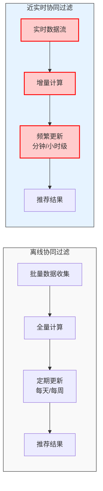
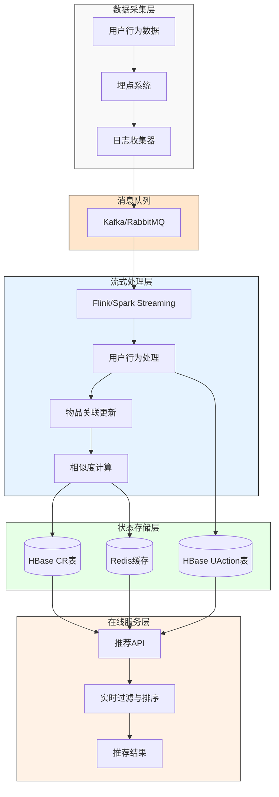
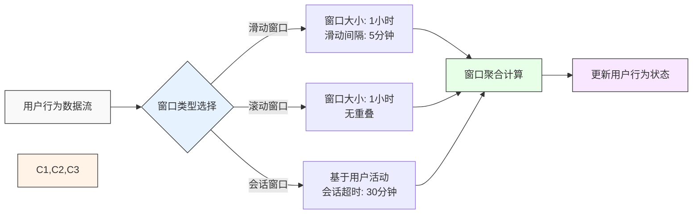
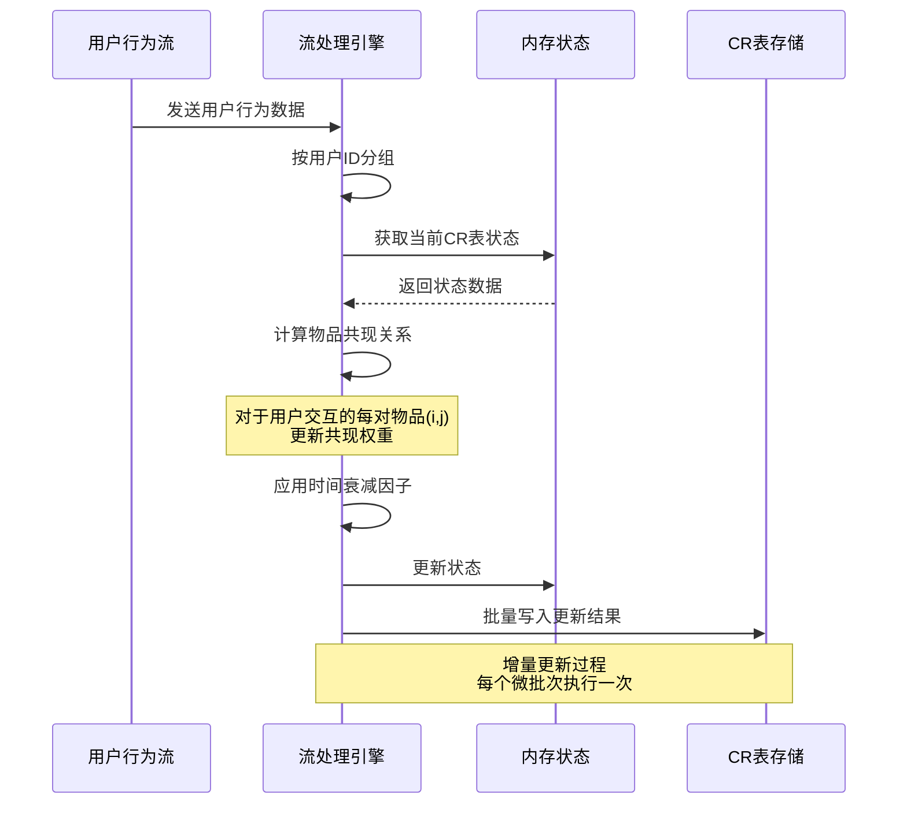
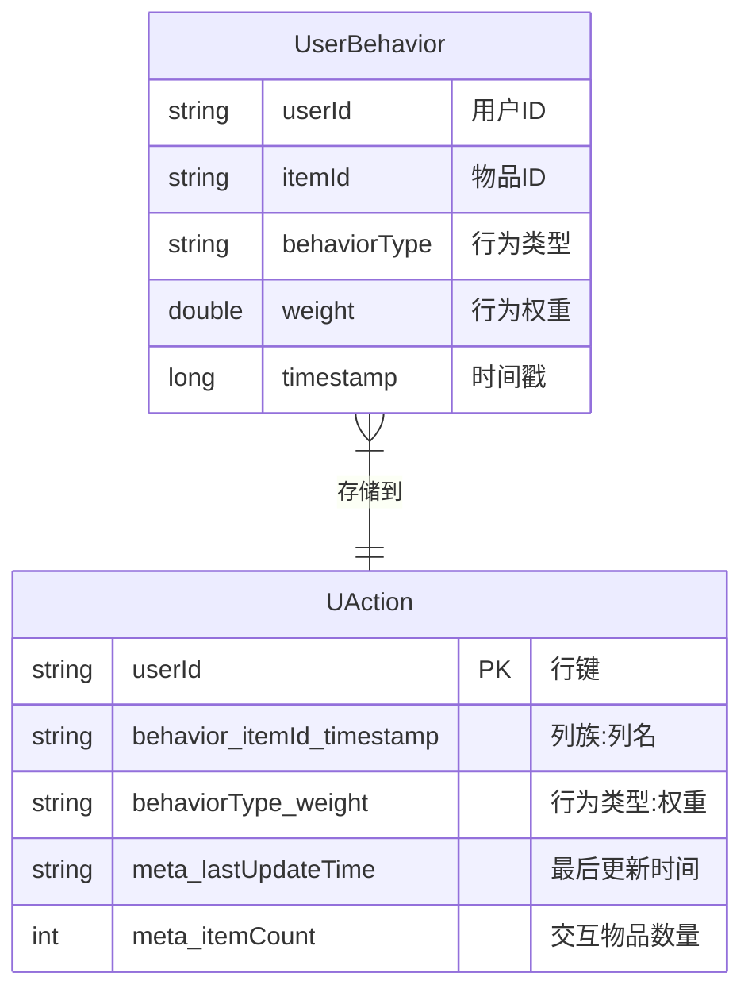
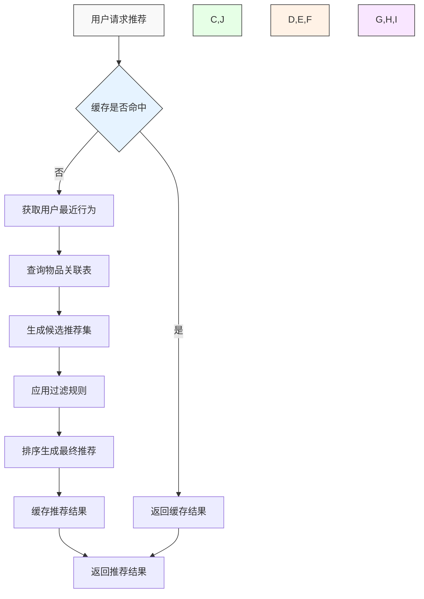
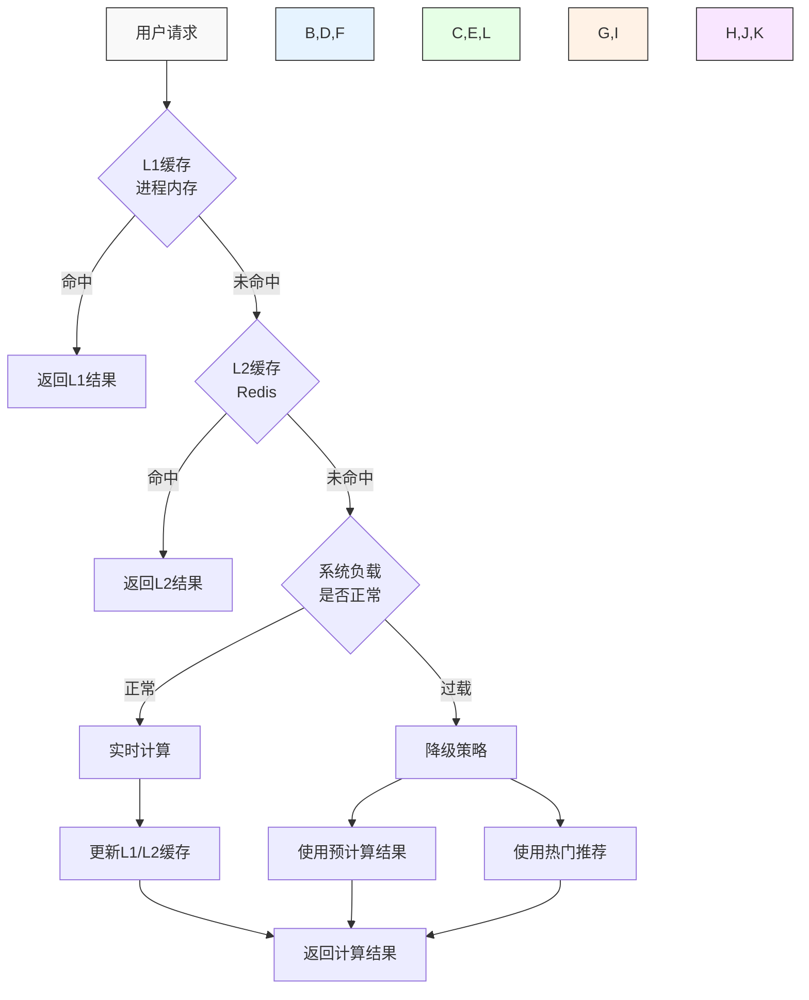

# 1.4 近实时协同过滤算法的工程实现

在现代推荐系统中，用户行为数据不断产生，用户兴趣也在持续变化。传统的离线协同过滤算法虽然能够处理大规模数据，但更新周期较长（通常是每天或每周），难以及时反映用户的最新偏好。近实时协同过滤算法旨在解决这一问题，通过增量更新和流式处理技术，实现对推荐结果的快速更新，提高推荐的时效性和准确性。

## 离线与近实时协同过滤对比图



## 近实时协同过滤系统架构



近实时协同过滤系统通常采用以下架构：

1. **数据采集层**：实时捕获用户行为数据，如点击、浏览、购买等
2. **消息队列**：使用 Kafka、RabbitMQ 等消息队列系统缓冲和传输实时数据
3. **流式处理层**：使用 Flink、Spark Streaming 等流式计算框架处理实时数据
4. **状态存储层**：使用 HBase、Redis 等分布式存储系统存储中间状态和计算结果
5. **在线服务层**：响应用户请求，提供实时推荐

与离线系统相比，近实时系统的主要区别在于：

- **增量更新**：只处理新产生的数据，而不是全量重新计算
- **时间窗口**：基于滑动时间窗口处理数据，保持推荐的时效性
- **状态管理**：维护计算状态，支持连续的增量计算

## 4.4.1 获取用户在一个时间窗口内的行为

### 时间窗口处理流程图



近实时协同过滤的第一步是获取用户在特定时间窗口内的行为数据。这些行为数据是后续计算的基础。

### 行为数据采集

用户行为数据通常通过前端埋点、服务端日志等方式采集，主要包括以下几类：

1. **显式行为**：评分、点赞、收藏等明确表达偏好的行为
2. **隐式行为**：点击、浏览、停留时间等间接反映偏好的行为
3. **上下文信息**：设备类型、地理位置、时间等环境因素

### 实时数据流处理

采集的行为数据通过消息队列进入流式处理系统，在这里进行初步的过滤、转换和聚合。

```java
// Flink 流式处理示例（Java）
public class UserBehaviorProcessor {
    public static void main(String[] args) throws Exception {
        StreamExecutionEnvironment env = StreamExecutionEnvironment.getExecutionEnvironment();
        
        // 设置检查点，确保数据处理的可靠性
        env.enableCheckpointing(60000); // 每60秒做一次检查点
        
        // 从 Kafka 读取用户行为数据
        Properties properties = new Properties();
        properties.setProperty("bootstrap.servers", "kafka:9092");
        properties.setProperty("group.id", "user-behavior-processor");
        
        FlinkKafkaConsumer<String> consumer = new FlinkKafkaConsumer<>(
            "user-behaviors", // Kafka 主题
            new SimpleStringSchema(), // 反序列化模式
            properties);
        
        // 设置从最新数据开始消费
        consumer.setStartFromLatest();
        
        // 创建数据流
        DataStream<String> stream = env.addSource(consumer);
        
        // 解析 JSON 数据并转换为 UserBehavior 对象
        DataStream<UserBehavior> behaviorStream = stream
            .map(new MapFunction<String, UserBehavior>() {
                @Override
                public UserBehavior map(String value) throws Exception {
                    // 解析 JSON 字符串为 UserBehavior 对象
                    JSONObject json = JSON.parseObject(value);
                    return new UserBehavior(
                        json.getString("userId"),
                        json.getString("itemId"),
                        json.getString("behaviorType"),
                        json.getDouble("weight"),
                        json.getLong("timestamp")
                    );
                }
            });
        
        // 按时间窗口聚合用户行为
        DataStream<UserBehaviorWindow> windowedBehaviors = behaviorStream
            .keyBy(behavior -> behavior.getUserId()) // 按用户 ID 分组
            .window(SlidingEventTimeWindows.of(Time.hours(24), Time.minutes(30))) // 24小时窗口，每30分钟滑动一次
            .aggregate(new UserBehaviorAggregator()); // 自定义聚合函数
        
        // 将聚合结果写入 HBase
        windowedBehaviors.addSink(new HBaseSink<>("user_behaviors"));
        
        env.execute("User Behavior Processor");
    }
}

// 用户行为类
class UserBehavior {
    private String userId;
    private String itemId;
    private String behaviorType; // 如 click, view, buy 等
    private double weight; // 行为权重
    private long timestamp;
    
    // 构造函数、getter 和 setter 方法省略
}

// 窗口聚合结果类
class UserBehaviorWindow {
    private String userId;
    private Map<String, Double> itemWeights; // 物品ID -> 权重
    private long windowStart;
    private long windowEnd;
    
    // 构造函数、getter 和 setter 方法省略
}

// 自定义聚合函数
class UserBehaviorAggregator implements AggregateFunction<UserBehavior, Map<String, Double>, UserBehaviorWindow> {
    @Override
    public Map<String, Double> createAccumulator() {
        return new HashMap<>();
    }
    
    @Override
    public Map<String, Double> add(UserBehavior behavior, Map<String, Double> accumulator) {
        // 累加物品权重
        String itemId = behavior.getItemId();
        double weight = behavior.getWeight();
        accumulator.put(itemId, accumulator.getOrDefault(itemId, 0.0) + weight);
        return accumulator;
    }
    
    @Override
    public UserBehaviorWindow getResult(Map<String, Double> accumulator) {
        UserBehaviorWindow result = new UserBehaviorWindow();
        result.setItemWeights(accumulator);
        // 设置其他字段
        return result;
    }
    
    @Override
    public Map<String, Double> merge(Map<String, Double> a, Map<String, Double> b) {
        // 合并两个累加器
        Map<String, Double> merged = new HashMap<>(a);
        for (Map.Entry<String, Double> entry : b.entrySet()) {
            merged.put(entry.getKey(), merged.getOrDefault(entry.getKey(), 0.0) + entry.getValue());
        }
        return merged;
    }
}
```

### 时间窗口设计

时间窗口是近实时协同过滤的关键概念，它决定了系统对用户行为变化的敏感度和计算负载。常见的时间窗口类型包括：

1. **滑动窗口**：窗口以固定间隔滑动，每次滑动都会触发一次计算，如每5分钟计算过去1小时的数据
2. **滚动窗口**：窗口之间没有重叠，如每小时计算一次过去1小时的数据
3. **会话窗口**：基于用户活动会话划分窗口，如用户连续活动的时间段

在实际应用中，窗口大小和滑动间隔需要根据业务需求和系统资源进行权衡：

- **较大的窗口**：包含更多历史数据，推荐结果更稳定，但对用户兴趣变化的反应较慢
- **较小的窗口**：对用户兴趣变化反应更敏感，但可能导致推荐结果波动较大
- **较短的滑动间隔**：更新频率更高，推荐更及时，但计算负载更大
- **较长的滑动间隔**：计算负载较小，但推荐更新不够及时

## 4.4.2 基于用户行为记录更新标的物关联表 CR

### CR表更新流程图



在获取用户行为数据后，下一步是更新物品关联表（Item-Item Co-occurrence Matrix），也称为 CR 表（Co-occurrence Relation）。CR 表记录了物品之间的共现关系，是计算物品相似度的基础。

### CR 表的数据结构

CR 表通常采用以下结构：

```
CR[item_i][item_j] = 共现次数或权重
```

其中，共现次数或权重表示物品 i 和物品 j 被同一用户在同一时间窗口内交互的频率或强度。

### 增量更新算法

近实时系统中，CR 表的更新采用增量方式，只处理新产生的用户行为数据。

```python
# 伪代码：增量更新 CR 表
def update_cr_table(user_behaviors, cr_table):
    # 按用户分组
    user_items = {}
    for behavior in user_behaviors:
        user_id = behavior['user_id']
        item_id = behavior['item_id']
        weight = behavior['weight']
        
        if user_id not in user_items:
            user_items[user_id] = {}
        user_items[user_id][item_id] = weight
    
    # 更新 CR 表
    for user_id, items in user_items.items():
        # 对于用户交互的每对物品，更新共现关系
        for item_i in items:
            for item_j in items:
                if item_i == item_j:
                    continue
                
                # 计算共现权重（可以是简单的计数，也可以考虑行为权重）
                weight_i = items[item_i]
                weight_j = items[item_j]
                co_weight = weight_i * weight_j  # 或其他权重计算方式
                
                # 更新 CR 表
                if item_i not in cr_table:
                    cr_table[item_i] = {}
                if item_j not in cr_table[item_i]:
                    cr_table[item_i][item_j] = 0
                
                cr_table[item_i][item_j] += co_weight
    
    return cr_table
```

### 分布式实现

在大规模系统中，CR 表可能非常大，需要分布式存储和计算。HBase 是一个常用的分布式存储系统，适合存储大规模的 CR 表。

```java
// 使用 HBase 存储 CR 表的示例（Java）
public class CRTableUpdater {
    private Connection connection;
    private Table crTable;
    
    public CRTableUpdater() throws IOException {
        // 初始化 HBase 连接
        Configuration config = HBaseConfiguration.create();
        connection = ConnectionFactory.createConnection(config);
        crTable = connection.getTable(TableName.valueOf("cr_table"));
    }
    
    public void updateCRTable(List<UserBehaviorWindow> userBehaviors) throws IOException {
        // 按用户分组处理
        Map<String, Map<String, Double>> userItems = new HashMap<>();
        for (UserBehaviorWindow behavior : userBehaviors) {
            userItems.put(behavior.getUserId(), behavior.getItemWeights());
        }
        
        // 批量更新 CR 表
        List<Put> puts = new ArrayList<>();
        
        for (Map<String, Double> items : userItems.values()) {
            // 对于用户交互的每对物品，更新共现关系
            for (Map.Entry<String, Double> entryI : items.entrySet()) {
                String itemI = entryI.getKey();
                double weightI = entryI.getValue();
                
                for (Map.Entry<String, Double> entryJ : items.entrySet()) {
                    String itemJ = entryJ.getKey();
                    if (itemI.equals(itemJ)) {
                        continue;
                    }
                    
                    double weightJ = entryJ.getValue();
                    double coWeight = weightI * weightJ;  // 共现权重
                    
                    // 创建 HBase Put 操作
                    Put put = new Put(Bytes.toBytes(itemI));
                    put.addColumn(
                        Bytes.toBytes("cf"),  // 列族
                        Bytes.toBytes(itemJ),  // 列名（物品J的ID）
                        Bytes.toBytes(coWeight)  // 值（共现权重）
                    );
                    puts.add(put);
                    
                    // 当累积一定数量的 Put 操作时，批量提交
                    if (puts.size() >= 1000) {
                        crTable.put(puts);
                        puts.clear();
                    }
                }
            }
        }
        
        // 提交剩余的 Put 操作
        if (!puts.isEmpty()) {
            crTable.put(puts);
        }
    }
    
    public void close() throws IOException {
        if (crTable != null) {
            crTable.close();
        }
        if (connection != null) {
            connection.close();
        }
    }
}
```

### 时间衰减机制

为了使推荐结果更好地反映用户的最新兴趣，可以引入时间衰减机制，对较旧的共现关系进行降权。

```python
# 伪代码：带时间衰减的 CR 表更新
def update_cr_table_with_decay(user_behaviors, cr_table, decay_factor=0.95):
    # 首先对现有 CR 表应用衰减因子
    for item_i in cr_table:
        for item_j in cr_table[item_i]:
            cr_table[item_i][item_j] *= decay_factor
    
    # 然后使用新的用户行为更新 CR 表
    # ... 更新逻辑同前 ...
    
    return cr_table
```

## 4.4.3 更新用户的行为记录

### 用户行为记录存储结构图



除了更新物品关联表，近实时系统还需要维护用户的行为记录，用于后续生成个性化推荐。用户行为记录通常存储在分布式数据库中，如 HBase。

### HBase 表：UAction

UAction（User Action）表用于存储用户的行为记录，其结构设计如下：

#### 表设计

- **行键（Row Key）**：`userId`
- **列族（Column Family）**：
  - `behavior`：存储用户行为数据
  - `meta`：存储元数据，如最后更新时间

#### 列设计

- `behavior:itemId_timestamp`：存储用户对物品的行为，值为行为类型和权重
- `meta:lastUpdateTime`：最后更新时间
- `meta:itemCount`：用户交互过的物品数量

### 更新用户行为记录

当捕获到新的用户行为时，需要更新 UAction 表。

```java
// 使用 HBase 更新用户行为记录的示例（Java）
public class UActionUpdater {
    private Connection connection;
    private Table uactionTable;
    
    public UActionUpdater() throws IOException {
        // 初始化 HBase 连接
        Configuration config = HBaseConfiguration.create();
        connection = ConnectionFactory.createConnection(config);
        uactionTable = connection.getTable(TableName.valueOf("uaction"));
    }
    
    public void updateUserActions(List<UserBehavior> behaviors) throws IOException {
        // 按用户分组
        Map<String, List<UserBehavior>> userBehaviors = new HashMap<>();
        for (UserBehavior behavior : behaviors) {
            String userId = behavior.getUserId();
            if (!userBehaviors.containsKey(userId)) {
                userBehaviors.put(userId, new ArrayList<>());
            }
            userBehaviors.get(userId).add(behavior);
        }
        
        // 批量更新用户行为记录
        List<Put> puts = new ArrayList<>();
        
        for (Map.Entry<String, List<UserBehavior>> entry : userBehaviors.entrySet()) {
            String userId = entry.getKey();
            List<UserBehavior> userActions = entry.getValue();
            
            // 创建 Put 操作
            Put put = new Put(Bytes.toBytes(userId));
            
            // 添加行为数据
            for (UserBehavior action : userActions) {
                String columnQualifier = action.getItemId() + "_" + action.getTimestamp();
                String value = action.getBehaviorType() + ":" + action.getWeight();
                
                put.addColumn(
                    Bytes.toBytes("behavior"),  // 列族
                    Bytes.toBytes(columnQualifier),  // 列名
                    Bytes.toBytes(value)  // 值
                );
            }
            
            // 更新元数据
            long currentTime = System.currentTimeMillis();
            put.addColumn(
                Bytes.toBytes("meta"),  // 列族
                Bytes.toBytes("lastUpdateTime"),  // 列名
                Bytes.toBytes(String.valueOf(currentTime))  // 值
            );
            
            puts.add(put);
            
            // 当累积一定数量的 Put 操作时，批量提交
            if (puts.size() >= 1000) {
                uactionTable.put(puts);
                puts.clear();
            }
        }
        
        // 提交剩余的 Put 操作
        if (!puts.isEmpty()) {
            uactionTable.put(puts);
        }
    }
    
    public void close() throws IOException {
        if (uactionTable != null) {
            uactionTable.close();
        }
        if (connection != null) {
            connection.close();
        }
    }
}
```

### 行为数据清理策略

为了控制存储空间和提高查询效率，需要定期清理过期的用户行为数据。常见的清理策略包括：

1. **基于时间的清理**：删除超过一定时间（如30天）的行为数据
2. **基于数量的清理**：每个用户只保留最近的N条行为记录
3. **基于权重的清理**：保留权重较高的行为，删除权重较低的行为

```java
// 伪代码：清理过期的用户行为数据
public void cleanupUserActions(int retentionDays) throws IOException {
    long cutoffTime = System.currentTimeMillis() - (retentionDays * 24 * 60 * 60 * 1000L);
    
    // 扫描所有用户
    Scan scan = new Scan();
    scan.addFamily(Bytes.toBytes("behavior"));
    
    ResultScanner scanner = uactionTable.getScanner(scan);
    for (Result result : scanner) {
        byte[] rowKey = result.getRow();
        Delete delete = new Delete(rowKey);
        
        // 检查每个行为列，删除过期的数据
        for (Cell cell : result.listCells()) {
            String columnQualifier = Bytes.toString(CellUtil.cloneQualifier(cell));
            String[] parts = columnQualifier.split("_");
            if (parts.length == 2) {
                long timestamp = Long.parseLong(parts[1]);
                if (timestamp < cutoffTime) {
                    delete.addColumn(
                        CellUtil.cloneFamily(cell),
                        CellUtil.cloneQualifier(cell)
                    );
                }
            }
        }
        
        // 执行删除操作
        if (!delete.isEmpty()) {
            uactionTable.delete(delete);
        }
    }
    scanner.close();
}
```

## 4.4.4 为用户生成个性化推荐

### 近实时推荐生成流程图



在更新了物品关联表和用户行为记录后，最后一步是为用户生成个性化推荐。近实时系统的推荐生成过程需要快速响应，通常采用以下步骤：

### 1. 获取用户最近行为

首先，从 UAction 表中获取用户的最近行为数据。

```java
// 获取用户最近行为的示例（Java）
public Map<String, Double> getUserRecentBehaviors(String userId, int maxItems) throws IOException {
    Map<String, Double> itemWeights = new HashMap<>();
    
    // 创建 Get 操作
    Get get = new Get(Bytes.toBytes(userId));
    get.addFamily(Bytes.toBytes("behavior"));
    
    // 执行查询
    Result result = uactionTable.get(get);
    if (result.isEmpty()) {
        return itemWeights;
    }
    
    // 解析行为数据
    List<Pair<Long, Cell>> timestampedCells = new ArrayList<>();
    for (Cell cell : result.listCells()) {
        String columnQualifier = Bytes.toString(CellUtil.cloneQualifier(cell));
        String[] parts = columnQualifier.split("_");
        if (parts.length == 2) {
            String itemId = parts[0];
            long timestamp = Long.parseLong(parts[1]);
            timestampedCells.add(new Pair<>(timestamp, cell));
        }
    }
    
    // 按时间戳降序排序
    timestampedCells.sort((a, b) -> Long.compare(b.getFirst(), a.getFirst()));
    
    // 获取最近的 maxItems 个物品
    int count = 0;
    for (Pair<Long, Cell> pair : timestampedCells) {
        if (count >= maxItems) {
            break;
        }
        
        Cell cell = pair.getSecond();
        String columnQualifier = Bytes.toString(CellUtil.cloneQualifier(cell));
        String value = Bytes.toString(CellUtil.cloneValue(cell));
        
        String[] qualifierParts = columnQualifier.split("_");
        String itemId = qualifierParts[0];
        
        String[] valueParts = value.split(":");
        double weight = Double.parseDouble(valueParts[1]);
        
        // 如果物品已存在，取最大权重
        itemWeights.put(itemId, Math.max(weight, itemWeights.getOrDefault(itemId, 0.0)));
        count++;
    }
    
    return itemWeights;
}
```

### 2. 基于物品关联表生成推荐

根据用户最近交互的物品和物品关联表，生成推荐候选集。

```java
// 基于物品关联表生成推荐的示例（Java）
public Map<String, Double> generateRecommendations(String userId, int maxRecommendations) throws IOException {
    // 获取用户最近行为
    Map<String, Double> userItems = getUserRecentBehaviors(userId, 50);  // 最多获取50个最近交互的物品
    
    // 如果用户没有行为数据，返回空推荐
    if (userItems.isEmpty()) {
        return new HashMap<>();
    }
    
    // 生成推荐候选集
    Map<String, Double> candidates = new HashMap<>();
    
    for (Map.Entry<String, Double> entry : userItems.entrySet()) {
        String itemId = entry.getKey();
        double itemWeight = entry.getValue();
        
        // 获取与该物品相关的物品
        Get get = new Get(Bytes.toBytes(itemId));
        get.addFamily(Bytes.toBytes("cf"));
        
        Result result = crTable.get(get);
        if (result.isEmpty()) {
            continue;
        }
        
        // 处理相关物品
        for (Cell cell : result.listCells()) {
            String relatedItemId = Bytes.toString(CellUtil.cloneQualifier(cell));
            double coWeight = Bytes.toDouble(CellUtil.cloneValue(cell));
            
            // 排除用户已交互过的物品
            if (userItems.containsKey(relatedItemId)) {
                continue;
            }
            
            // 计算推荐分数
            double score = itemWeight * coWeight;
            
            // 更新候选集
            candidates.put(relatedItemId, candidates.getOrDefault(relatedItemId, 0.0) + score);
        }
    }
    
    // 排序并限制推荐数量
    return candidates.entrySet().stream()
        .sorted(Map.Entry.<String, Double>comparingByValue().reversed())
        .limit(maxRecommendations)
        .collect(Collectors.toMap(
            Map.Entry::getKey,
            Map.Entry::getValue,
            (e1, e2) -> e1,
            LinkedHashMap::new
        ));
}
```

### 3. 推荐结果过滤与排序

生成的候选推荐集可能需要进一步过滤和排序，考虑多样性、新颖性等因素。

```java
// 推荐结果过滤与排序的示例（Java）
public List<RecommendationItem> filterAndRankRecommendations(Map<String, Double> candidates, String userId) {
    List<RecommendationItem> recommendations = new ArrayList<>();
    
    // 转换候选集为推荐项列表
    for (Map.Entry<String, Double> entry : candidates.entrySet()) {
        String itemId = entry.getKey();
        double score = entry.getValue();
        
        RecommendationItem item = new RecommendationItem();
        item.setItemId(itemId);
        item.setScore(score);
        
        // 获取物品元数据（如类别、标签等）
        Map<String, String> metadata = getItemMetadata(itemId);  // 假设有这个方法获取物品元数据
        item.setMetadata(metadata);
        
        recommendations.add(item);
    }
    
    // 应用多样性过滤
    recommendations = diversityFilter(recommendations);  // 假设有这个方法实现多样性过滤
    
    // 应用新颖性排序
    recommendations = noveltyRanking(recommendations, userId);  // 假设有这个方法实现新颖性排序
    
    return recommendations;
}

// 推荐项类
class RecommendationItem {
    private String itemId;
    private double score;
    private Map<String, String> metadata;
    
    // getter 和 setter 方法省略
}
```

### 4. 推荐结果缓存

为了提高系统响应速度，可以将生成的推荐结果缓存在内存数据库（如 Redis）中。

```java
// 推荐结果缓存的示例（Java）
public void cacheRecommendations(String userId, List<RecommendationItem> recommendations) {
    try (Jedis jedis = jedisPool.getResource()) {
        // 设置缓存键
        String cacheKey = "recommendations:" + userId;
        
        // 将推荐结果序列化为 JSON
        String json = objectMapper.writeValueAsString(recommendations);
        
        // 存入 Redis，设置过期时间（如30分钟）
        jedis.setex(cacheKey, 1800, json);
    } catch (Exception e) {
        logger.error("Failed to cache recommendations for user: " + userId, e);
    }
}

public List<RecommendationItem> getCachedRecommendations(String userId) {
    try (Jedis jedis = jedisPool.getResource()) {
        // 获取缓存键
        String cacheKey = "recommendations:" + userId;
        
        // 从 Redis 获取缓存的推荐结果
        String json = jedis.get(cacheKey);
        if (json != null) {
            // 反序列化 JSON 为推荐项列表
            return objectMapper.readValue(json, new TypeReference<List<RecommendationItem>>() {});
        }
    } catch (Exception e) {
        logger.error("Failed to get cached recommendations for user: " + userId, e);
    }
    
    return null;  // 缓存未命中或发生错误
}
```

## 近实时推荐系统的优化技巧

### 分层缓存与降级策略图



### 近实时系统与离线系统协作图

```mermaid
gantt
    title 近实时与离线协同过滤协作时间表
    dateFormat  HH:mm
    axisFormat %H:%M
    
    section 离线系统
    全量数据处理      :a1, 00:00, 2h
    物品相似度计算    :a2, after a1, 3h
    用户推荐生成      :a3, after a2, 2h
    
    section 近实时系统
    数据流处理        :b1, 00:00, 24h
    增量更新CR表      :b2, 00:05, 5m
    增量更新CR表      :b3, 00:35, 5m
    增量更新CR表      :b4, 01:05, 5m
    增量更新CR表      :b5, 01:35, 5m
    用户请求响应      :b6, 00:00, 24h
```



### 1. 分层缓存策略

为了提高系统响应速度，可以采用分层缓存策略：

- **L1缓存**：进程内内存缓存，存储热门用户的推荐结果
- **L2缓存**：分布式缓存（如Redis），存储所有用户的推荐结果
- **L3存储**：持久化存储（如HBase），存储原始数据和计算结果

### 2. 预计算与实时计算结合

将推荐过程分为预计算和实时计算两部分：

- **预计算**：定期计算物品相似度矩阵等相对稳定的数据
- **实时计算**：基于用户最新行为和预计算结果，生成个性化推荐

### 3. 降级策略

当系统负载过高或出现故障时，应有降级策略保证服务可用性：

- **缓存降级**：使用较旧的缓存结果
- **算法降级**：使用计算复杂度较低的算法
- **范围降级**：减少推荐物品数量或用户覆盖范围

### 4. 异步更新机制

采用异步更新机制，将推荐结果的更新与用户请求解耦：

- 用户请求到达时，直接返回缓存的推荐结果
- 后台异步更新用户的推荐结果，确保数据的及时性

## 小结

近实时协同过滤算法的工程实现涉及多个环节，包括获取用户行为数据、更新物品关联表、维护用户行为记录以及生成个性化推荐。通过流式处理、增量更新和分层缓存等技术，可以构建高效、可扩展的近实时推荐系统，在保证推荐质量的同时，提高系统的实时响应能力。

与传统的离线协同过滤相比，近实时协同过滤能够更快地适应用户兴趣的变化，提供更及时、更个性化的推荐服务。在实际应用中，通常将离线和近实时协同过滤结合使用，形成完整的推荐解决方案。