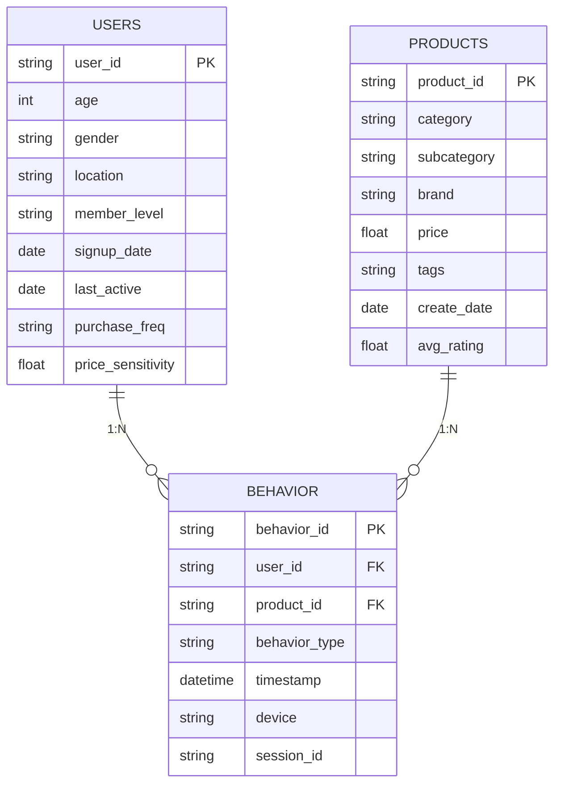
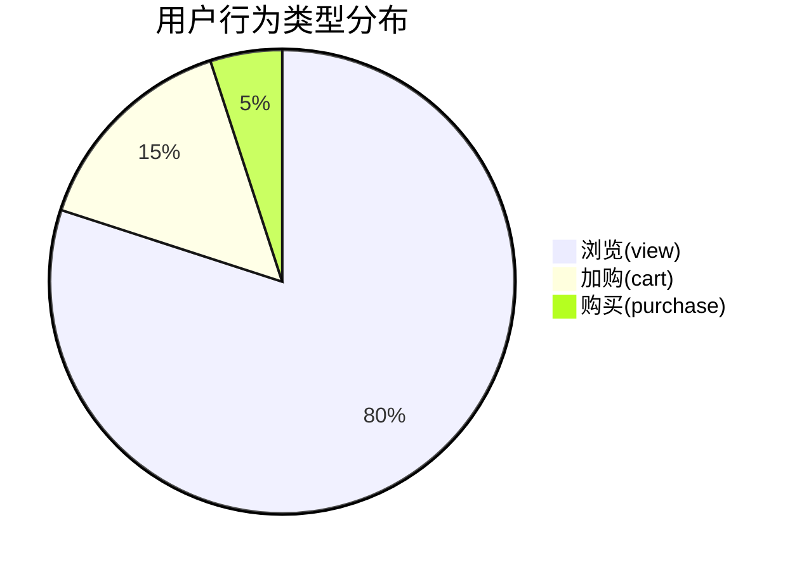
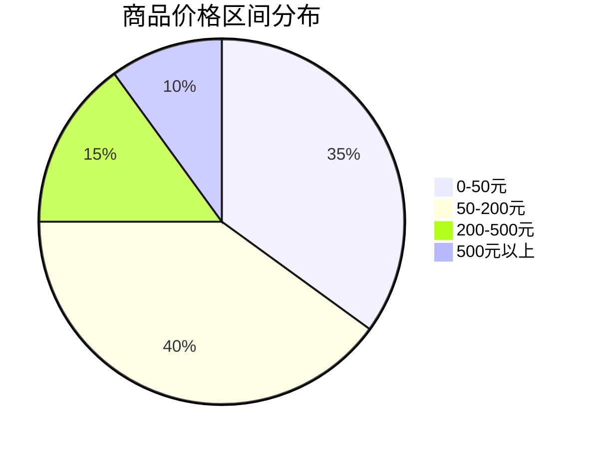

## 电商推荐系统数据集详细说明

### 数据集结构与内容

#### 1. 用户行为日志 (`user_behavior.csv`)
记录用户在电商平台上的所有交互行为

| 字段名         | 类型    | 描述                         | 示例值                     |
|----------------|---------|------------------------------|----------------------------|
| user_id        | string  | 用户唯一标识符               | "U10001"                   |
| product_id     | string  | 商品唯一标识符               | "P50042"                   |
| behavior_type  | string  | 行为类型                     | "view", "cart", "purchase" |
| timestamp      | datetime| 行为发生时间                 | "2023-08-15 14:23:45"      |
| device         | string  | 用户设备类型                 | "mobile", "desktop"        |
| session_id     | string  | 会话ID                       | "SESS_20230815_1423"       |

**示例数据**:
```csv
user_id,product_id,behavior_type,timestamp,device,session_id
U10001,P50042,view,2023-08-15 14:23:45,mobile,SESS_20230815_1423
U10001,P30015,cart,2023-08-15 14:25:10,mobile,SESS_20230815_1423
U10002,P70083,purchase,2023-08-15 09:12:30,desktop,SESS_20230815_0912
U10003,P20056,view,2023-08-14 19:45:22,mobile,SESS_20230814_1945
```

#### 2. 商品属性表 (`products.csv`)
包含所有商品的基本信息和属性

| 字段名         | 类型    | 描述                         | 示例值                     |
|----------------|---------|------------------------------|----------------------------|
| product_id     | string  | 商品唯一标识符               | "P50042"                   |
| category       | string  | 商品类别                     | "Electronics"              |
| subcategory    | string  | 商品子类                     | "Headphones"               |
| brand          | string  | 品牌                         | "Sony"                     |
| price          | float   | 价格                         | 199.99                     |
| tags           | string  | 商品标签（多值）             | "wireless|noise_cancelling" |
| create_date    | date    | 商品上架日期                 | "2023-06-01"               |
| avg_rating     | float   | 平均评分                     | 4.5                        |

**示例数据**:
```csv
product_id,category,subcategory,brand,price,tags,create_date,avg_rating
P50042,Electronics,Headphones,Sony,199.99,wireless|noise_cancelling,2023-06-01,4.5
P30015,Home,Kitchenware,OXO,39.99,non-stick|eco_friendly,2023-03-15,4.2
P70083,Clothing,Menswear,Nike,89.99,sportswear|limited_edition,2023-07-20,4.7
P20056,Books,Fiction,Penguin,15.99,bestseller|hardcover,2023-05-10,4.8
```

#### 3. 用户画像表 (`users.csv`)
包含用户的基本信息和画像标签

| 字段名         | 类型    | 描述                         | 示例值                     |
|----------------|---------|------------------------------|----------------------------|
| user_id        | string  | 用户唯一标识符               | "U10001"                   |
| age            | int     | 年龄                         | 32                         |
| gender         | string  | 性别                         | "M", "F", "O"              |
| location       | string  | 地理位置                     | "New York"                 |
| member_level   | string  | 会员等级                     | "gold", "silver"           |
| signup_date    | date    | 注册日期                     | "2022-05-12"               |
| last_active    | date    | 最后活跃日期                 | "2023-08-15"               |
| purchase_freq  | string  | 购买频率                     | "high", "medium", "low"    |
| price_sensitivity | float | 价格敏感度评分               | 0.75                       |

**示例数据**:
```csv
user_id,age,gender,location,member_level,signup_date,last_active,purchase_freq,price_sensitivity
U10001,32,M,New York,gold,2022-05-12,2023-08-15,high,0.75
U10002,28,F,San Francisco,silver,2023-01-20,2023-08-15,medium,0.92
U10003,45,M,Chicago,bronze,2021-11-05,2023-08-14,low,0.63
U10004,24,F,Boston,gold,2023-03-18,2023-08-15,high,0.81
```

### 数据集关系图



### 数据集生成代码

```python
import pandas as pd
import numpy as np
from datetime import datetime, timedelta
import random

# 生成用户数据
def generate_users(num_users=10000):
    user_ids = [f"U{10000+i}" for i in range(1, num_users+1)]
    ages = np.random.randint(18, 70, num_users)
    genders = np.random.choice(["M", "F", "O"], num_users, p=[0.49, 0.49, 0.02])
    locations = np.random.choice(["New York", "San Francisco", "Chicago", "Boston", "Los Angeles"], 
                               num_users, p=[0.3, 0.2, 0.15, 0.15, 0.2])
    member_levels = np.random.choice(["bronze", "silver", "gold"], num_users, p=[0.6, 0.3, 0.1])
    
    # 生成注册日期和最后活跃日期
    signup_dates = [datetime(2022, 1, 1) + timedelta(days=random.randint(0, 600)) 
                   for _ in range(num_users)]
    last_active_dates = [date + timedelta(days=random.randint(0, (datetime.now()-date).days))
                       for date in signup_dates]
    
    purchase_freqs = np.random.choice(["low", "medium", "high"], num_users, p=[0.4, 0.4, 0.2])
    price_sensitivities = np.round(np.random.beta(2, 5, num_users), 2)
    
    return pd.DataFrame({
        "user_id": user_ids,
        "age": ages,
        "gender": genders,
        "location": locations,
        "member_level": member_levels,
        "signup_date": [d.date() for d in signup_dates],
        "last_active": [d.date() for d in last_active_dates],
        "purchase_freq": purchase_freqs,
        "price_sensitivity": price_sensitivities
    })

# 生成商品数据
def generate_products(num_products=50000):
    categories = ["Electronics", "Clothing", "Home", "Beauty", "Sports", "Books"]
    subcategories = {
        "Electronics": ["Smartphones", "Laptops", "Headphones", "Cameras"],
        "Clothing": ["Menswear", "Womenswear", "Kids", "Accessories"],
        "Home": ["Furniture", "Kitchenware", "Decor", "Lighting"],
        "Beauty": ["Skincare", "Makeup", "Haircare", "Fragrance"],
        "Sports": ["Fitness", "Outdoor", "Team Sports", "Yoga"],
        "Books": ["Fiction", "Non-Fiction", "Children", "Business"]
    }
    brands = {
        "Electronics": ["Sony", "Samsung", "Apple", "LG", "Xiaomi"],
        "Clothing": ["Nike", "Adidas", "Zara", "Uniqlo", "H&M"],
        "Home": ["IKEA", "OXO", "Crate&Barrel", "Williams Sonoma"],
        "Beauty": ["L'Oreal", "Estee Lauder", "NARS", "MAC"],
        "Sports": ["Nike", "Adidas", "Under Armour", "Puma"],
        "Books": ["Penguin", "HarperCollins", "Simon & Schuster", "Random House"]
    }
    tags = ["eco_friendly", "new_arrival", "discount", "limited_edition", "bestseller", 
           "wireless", "organic", "handmade", "smart", "waterproof"]
    
    product_ids = [f"P{50000+i}" for i in range(1, num_products+1)]
    categories_list = np.random.choice(categories, num_products)
    subcategories_list = [np.random.choice(subcategories[c]) for c in categories_list]
    brands_list = [np.random.choice(brands[c]) for c in categories_list]
    
    # 生成价格（基于类别）
    prices = []
    for cat in categories_list:
        if cat == "Electronics":
            prices.append(round(np.random.uniform(100, 2000), 2))
        elif cat == "Clothing":
            prices.append(round(np.random.uniform(20, 500), 2))
        elif cat == "Home":
            prices.append(round(np.random.uniform(15, 1500), 2))
        elif cat == "Beauty":
            prices.append(round(np.random.uniform(10, 300), 2))
        elif cat == "Sports":
            prices.append(round(np.random.uniform(30, 800), 2))
        else:  # Books
            prices.append(round(np.random.uniform(5, 50), 2))
    
    # 生成标签（1-3个随机标签）
    tags_list = ["|".join(np.random.choice(tags, random.randint(1, 3), replace=False)) 
                for _ in range(num_products)]
    
    create_dates = [datetime(2022, 1, 1) + timedelta(days=random.randint(0, 600)) 
                   for _ in range(num_products)]
    avg_ratings = np.round(np.random.uniform(3.5, 5.0, num_products), 1)
    
    return pd.DataFrame({
        "product_id": product_ids,
        "category": categories_list,
        "subcategory": subcategories_list,
        "brand": brands_list,
        "price": prices,
        "tags": tags_list,
        "create_date": [d.date() for d in create_dates],
        "avg_rating": avg_ratings
    })

# 生成行为数据
def generate_behavior(users, products, num_records=500000):
    user_ids = users["user_id"].sample(min(len(users), num_records), replace=True).values
    product_ids = products["product_id"].sample(min(len(products), num_records), replace=True).values
    
    # 行为类型分布
    behavior_types = np.random.choice(["view", "cart", "purchase"], num_records, 
                                    p=[0.8, 0.15, 0.05])
    
    # 时间戳（过去30天内）
    end_time = datetime.now()
    start_time = end_time - timedelta(days=30)
    timestamps = [start_time + timedelta(seconds=random.randint(0, 30*24*3600)) 
                for _ in range(num_records)]
    
    devices = np.random.choice(["mobile", "desktop", "tablet"], num_records, 
                             p=[0.6, 0.3, 0.1])
    
    # 生成会话ID（相同用户连续行为共享会话）
    session_ids = []
    current_session = None
    last_user = None
    
    for i in range(num_records):
        user = user_ids[i]
        timestamp = timestamps[i]
        
        if user != last_user or random.random() < 0.3:  # 30%概率新会话
            session_id = f"SESS_{user}_{timestamp.strftime('%Y%m%d%H%M%S')}"
            current_session = session_id
            last_user = user
        
        session_ids.append(current_session)
    
    return pd.DataFrame({
        "user_id": user_ids,
        "product_id": product_ids,
        "behavior_type": behavior_types,
        "timestamp": timestamps,
        "device": devices,
        "session_id": session_ids
    })

# 生成所有数据集
users_df = generate_users(10000)
products_df = generate_products(50000)
behavior_df = generate_behavior(users_df, products_df, 500000)

# 保存到CSV
users_df.to_csv("users.csv", index=False)
products_df.to_csv("products.csv", index=False)
behavior_df.to_csv("user_behavior.csv", index=False)
```

### 数据集统计特征

#### 用户行为分布


#### 商品价格分布


#### 用户活跃度分布
```python
# 用户活跃度分析代码
active_users = behavior_df.groupby('user_id').size().reset_index(name='activity_count')
activity_stats = {
    "高活跃用户(>50次)": len(active_users[active_users['activity_count'] > 50]),
    "中活跃用户(10-50次)": len(active_users[(active_users['activity_count'] >= 10) & 
                                     (active_users['activity_count'] <= 50)]),
    "低活跃用户(<10次)": len(active_users[active_users['activity_count'] < 10])
}
```

### 数据集使用建议

1. **数据预处理**：
   - 时间特征工程：提取小时、星期几、是否周末等时间特征
   - 行为权重计算：`view=1, cart=3, purchase=5`的加权策略
   - 时间衰减：近期行为赋予更高权重，衰减因子为0.95/天

2. **特征工程**：
   ```python
   # 商品特征扩展
   products_df['price_level'] = pd.cut(products_df['price'], 
                                     bins=[0, 50, 200, 500, float('inf')],
                                     labels=['low', 'medium', 'high', 'premium'])
   
   # 用户特征扩展
   users_df['tenure_days'] = (datetime.now() - pd.to_datetime(users_df['signup_date'])).dt.days
   users_df['recency_days'] = (datetime.now() - pd.to_datetime(users_df['last_active'])).dt.days
   ```

3. **数据采样策略**：
   - 负采样：对未观测交互进行采样，比例1:3（正:负）
   - 时间窗口划分：按时间划分训练/验证/测试集（7:2:1）
   - 长尾处理：对低频商品进行上采样或嵌入共享

### 数据质量保障

1. **完整性检查**：
   ```python
   # 缺失值检查
   print(f"用户表缺失值: {users_df.isnull().sum().sum()}")
   print(f"商品表缺失值: {products_df.isnull().sum().sum()}")
   print(f"行为表缺失值: {behavior_df.isnull().sum().sum()}")
   
   # 外键一致性检查
   behavior_users = set(behavior_df['user_id'])
   all_users = set(users_df['user_id'])
   print(f"行为表中未知用户: {len(behavior_users - all_users)}")
   
   behavior_products = set(behavior_df['product_id'])
   all_products = set(products_df['product_id'])
   print(f"行为表中未知商品: {len(behavior_products - all_products)}")
   ```

2. **异常值处理**：
   - 价格异常：截断超出合理范围的商品价格
   - 时间异常：过滤未来时间戳的行为记录
   - 行为异常：识别并处理机器人行为（高频重复操作）

3. **数据分布监控**：
   ```python
   # 每日行为量监控
   daily_activity = behavior_df.set_index('timestamp').resample('D').size()
   plt.figure(figsize=(12, 6))
   daily_activity.plot(title='Daily User Activity')
   plt.xlabel('Date')
   plt.ylabel('Activity Count')
   plt.show()
   ```

此数据集设计充分考虑了电商推荐系统的实际需求，覆盖了用户行为、商品属性和用户画像三个核心维度，可直接用于矩阵分解推荐模型的训练和评估。
