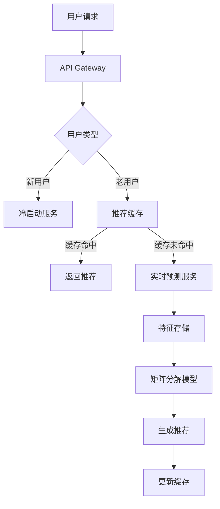

### 电商推荐系统：基于矩阵分解嵌入的详细方案与实现

#### 系统架构设计


#### 核心模块实现

##### 1. 数据预处理与特征工程
```python
import pandas as pd
import numpy as np
from sklearn.preprocessing import LabelEncoder

# 加载数据集
user_behavior = pd.read_csv("user_behavior.csv")  # 用户行为日志
product_attributes = pd.read_csv("products.csv")  # 商品属性
user_profiles = pd.read_csv("users.csv")          # 用户画像

# 行为数据预处理
def preprocess_behavior(df):
    # 转换时间戳
    df['timestamp'] = pd.to_datetime(df['timestamp'])
    df['hour'] = df['timestamp'].dt.hour
    df['day_of_week'] = df['timestamp'].dt.dayofweek
    
    # 行为类型加权
    behavior_weights = {'view': 1, 'cart': 3, 'purchase': 5}
    df['weight'] = df['behavior_type'].map(behavior_weights)
    
    # 时间衰减函数 (最近行为权重更高)
    max_time = df['timestamp'].max()
    df['recency'] = (max_time - df['timestamp']).dt.days
    df['time_weight'] = np.exp(-df['recency']/30)  # 30天衰减系数
    
    # 最终行为得分
    df['interaction_score'] = df['weight'] * df['time_weight']
    return df

user_behavior = preprocess_behavior(user_behavior)

# 商品属性编码
def encode_attributes(df):
    # 分类特征编码
    cat_cols = ['category', 'brand', 'price_level']
    for col in cat_cols:
        le = LabelEncoder()
        df[col] = le.fit_transform(df[col])
    
    # 多值特征处理 (如商品标签)
    df['tags'] = df['tags'].str.split('|')
    tag_encoder = LabelEncoder()
    all_tags = list(set([tag for sublist in df['tags'] for tag in sublist]))
    tag_encoder.fit(all_tags)
    
    # 创建标签特征向量
    tag_vectors = []
    for tags in df['tags']:
        vec = np.zeros(len(tag_encoder.classes_))
        for tag in tags:
            vec[tag_encoder.transform([tag])[0]] = 1
        tag_vectors.append(vec)
    
    df = pd.concat([df, pd.DataFrame(tag_vectors, columns=[f'tag_{i}' for i in range(len(tag_encoder.classes_))])], axis=1)
    return df

product_attributes = encode_attributes(product_attributes)

# 构建用户-商品交互矩阵
def build_interaction_matrix(behavior_df, user_df, product_df):
    # 聚合用户行为
    agg_behavior = behavior_df.groupby(['user_id', 'product_id'])['interaction_score'].sum().reset_index()
    
    # 创建稀疏交互矩阵
    user_encoder = LabelEncoder().fit(user_df['user_id'])
    product_encoder = LabelEncoder().fit(product_df['product_id'])
    
    num_users = len(user_encoder.classes_)
    num_products = len(product_encoder.classes_)
    
    # 初始化矩阵
    interaction_matrix = np.zeros((num_users, num_products))
    
    # 填充矩阵
    for _, row in agg_behavior.iterrows():
        u_idx = user_encoder.transform([row['user_id']])[0]
        p_idx = product_encoder.transform([row['product_id']])[0]
        interaction_matrix[u_idx, p_idx] = row['interaction_score']
    
    return interaction_matrix, user_encoder, product_encoder

interaction_mat, user_enc, product_enc = build_interaction_matrix(user_behavior, user_profiles, product_attributes)
```

##### 2. 增强矩阵分解模型
```python
import torch
import torch.nn as nn
import torch.optim as optim
from scipy.sparse import coo_matrix

class EnhancedMF(nn.Module):
    """融合商品属性的矩阵分解模型"""
    def __init__(self, num_users, num_items, embedding_dim, attribute_dim):
        super(EnhancedMF, self).__init__()
        self.user_emb = nn.Embedding(num_users, embedding_dim)
        self.item_emb = nn.Embedding(num_items, embedding_dim)
        self.attribute_proj = nn.Linear(attribute_dim, embedding_dim)
        
        # 初始化权重
        nn.init.xavier_uniform_(self.user_emb.weight)
        nn.init.xavier_uniform_(self.item_emb.weight)
        nn.init.xavier_uniform_(self.attribute_proj.weight)
        
        self.dropout = nn.Dropout(0.2)
    
    def forward(self, user_ids, item_ids, attributes):
        # 用户嵌入
        user_vec = self.user_emb(user_ids)
        
        # 商品基础嵌入
        item_base = self.item_emb(item_ids)
        
        # 商品属性投影
        attr_proj = self.attribute_proj(attributes)
        
        # 组合嵌入: 基础嵌入 + 属性增强
        item_vec = item_base + attr_proj
        
        # 正则化
        user_vec = self.dropout(user_vec)
        item_vec = self.dropout(item_vec)
        
        # 预测得分
        pred = (user_vec * item_vec).sum(dim=1)
        return torch.sigmoid(pred) * 4 + 1  # 映射到1-5分

# 数据准备
def prepare_dataloader(interaction_matrix, attributes, batch_size=1024):
    # 转换为COO格式
    coo = coo_matrix(interaction_matrix)
    indices = np.array([coo.row, coo.col]).T
    values = coo.data
    
    # 创建属性张量
    attribute_tensor = torch.FloatTensor(attributes)
    
    # 构建数据集
    class InteractionDataset(torch.utils.data.Dataset):
        def __init__(self, indices, values, attributes):
            self.indices = indices
            self.values = values
            self.attributes = attributes
        
        def __len__(self):
            return len(self.values)
        
        def __getitem__(self, idx):
            user, item = self.indices[idx]
            return (
                torch.LongTensor([user]),
                torch.LongTensor([item]),
                self.attributes[item],
                torch.FloatTensor([self.values[idx]])
            )
    
    dataset = InteractionDataset(indices, values, attribute_tensor)
    return torch.utils.data.DataLoader(dataset, batch_size=batch_size, shuffle=True)

# 获取商品属性矩阵
product_attributes = product_attributes.sort_values('product_id')
attribute_cols = [col for col in product_attributes.columns if col.startswith('tag_') or col in ['category', 'brand', 'price_level']]
attribute_matrix = product_attributes[attribute_cols].values.astype(np.float32)

# 创建数据加载器
dataloader = prepare_dataloader(interaction_mat, attribute_matrix)

# 模型训练
def train_mf(model, dataloader, epochs=20, lr=0.01):
    device = torch.device('cuda' if torch.cuda.is_available() else 'cpu')
    model = model.to(device)
    criterion = nn.MSELoss()
    optimizer = optim.Adam(model.parameters(), lr=lr, weight_decay=1e-5)
    
    for epoch in range(epochs):
        total_loss = 0
        for user_ids, item_ids, attributes, targets in dataloader:
            user_ids = user_ids.to(device).squeeze()
            item_ids = item_ids.to(device).squeeze()
            attributes = attributes.to(device)
            targets = targets.to(device)
            
            optimizer.zero_grad()
            preds = model(user_ids, item_ids, attributes)
            loss = criterion(preds, targets)
            loss.backward()
            optimizer.step()
            
            total_loss += loss.item()
        
        print(f"Epoch {epoch+1}/{epochs}, Loss: {total_loss/len(dataloader):.4f}")
    
    return model

# 初始化模型
num_users = interaction_mat.shape[0]
num_items = interaction_mat.shape[1]
model = EnhancedMF(num_users, num_items, embedding_dim=64, attribute_dim=attribute_matrix.shape[1])

# 训练模型
trained_model = train_mf(model, dataloader)
```

##### 3. 推荐生成与在线服务
```python
from flask import Flask, request, jsonify
import redis

app = Flask(__name__)
cache = redis.Redis(host='redis', port=6379)

# 离线推荐生成
def generate_recommendations(model, user_enc, product_enc, attribute_matrix, top_k=50):
    device = next(model.parameters()).device
    
    # 所有用户和商品的嵌入
    all_users = torch.arange(len(user_enc.classes_)).to(device)
    all_items = torch.arange(len(product_enc.classes_)).to(device)
    all_attrs = torch.FloatTensor(attribute_matrix).to(device)
    
    # 获取用户嵌入矩阵
    user_embeddings = model.user_emb(all_users).detach().cpu().numpy()
    
    # 获取商品嵌入矩阵 (基础+属性)
    with torch.no_grad():
        item_base = model.item_emb(all_items)
        attr_proj = model.attribute_proj(all_attrs)
        item_embeddings = (item_base + attr_proj).detach().cpu().numpy()
    
    # 计算推荐得分
    scores = user_embeddings @ item_embeddings.T
    
    # 为每个用户存储top-k推荐
    for user_idx in range(scores.shape[0]):
        user_id = user_enc.inverse_transform([user_idx])[0]
        top_indices = np.argsort(scores[user_idx])[::-1][:top_k]
        product_ids = product_enc.inverse_transform(top_indices)
        cache.set(f"recs:{user_id}", ",".join(product_ids))
    
    return user_embeddings, item_embeddings

# 在线推荐服务
@app.route('/recommend', methods=['GET'])
def recommend():
    user_id = request.args.get('user_id')
    context = request.args.get('context')  # 可包含当前页面、设备等信息
    
    # 检查缓存
    cached_recs = cache.get(f"recs:{user_id}")
    if cached_recs:
        return jsonify({"recommendations": cached_recs.decode().split(",")})
    
    # 实时计算 (冷启动或缓存失效)
    user_idx = user_enc.transform([user_id])[0]
    
    # 获取用户嵌入
    user_emb = trained_model.user_emb(torch.LongTensor([user_idx]).to(device))
    
    # 获取所有商品嵌入
    all_items = torch.arange(len(product_enc.classes_)).to(device)
    all_attrs = torch.FloatTensor(attribute_matrix).to(device)
    
    with torch.no_grad():
        item_base = trained_model.item_emb(all_items)
        attr_proj = trained_model.attribute_proj(all_attrs)
        item_embs = item_base + attr_proj
    
    # 计算得分并返回top-k
    scores = (user_emb * item_embs).sum(dim=1).cpu().numpy()
    top_indices = np.argsort(scores)[::-1][:50]
    product_ids = product_enc.inverse_transform(top_indices)
    
    # 更新缓存
    cache.set(f"recs:{user_id}", ",".join(product_ids), ex=3600)  # 缓存1小时
    
    return jsonify({"recommendations": product_ids.tolist()})

# 冷启动处理
@app.route('/recommend/new_user', methods=['GET'])
def new_user_recommend():
    # 基于用户属性或场景的冷启动策略
    device = request.args.get('device', 'mobile')
    page = request.args.get('page', 'home')
    
    # 策略1: 热门商品推荐
    if page == 'home':
        top_products = cache.get("global_top_products")
        return jsonify({"recommendations": top_products.decode().split(",")[:20]})
    
    # 策略2: 基于场景的推荐
    if page == 'category':
        category = request.args.get('cat_id')
        top_in_category = cache.get(f"top_category:{category}")
        return jsonify({"recommendations": top_in_category.decode().split(",")[:10]})
    
    # 策略3: 探索性推荐
    diverse_recs = cache.get("diverse_recs")
    return jsonify({"recommendations": diverse_recs.decode().split(",")[:15]})

if __name__ == '__main__':
    app.run(host='0.0.0.0', port=5000)
```

#### 4. 评估与优化策略

**离线评估指标**：
```python
from sklearn.metrics import ndcg_score

def evaluate_model(model, test_loader):
    device = next(model.parameters()).device
    model.eval()
    
    all_preds = []
    all_targets = []
    
    with torch.no_grad():
        for user_ids, item_ids, attributes, targets in test_loader:
            user_ids = user_ids.to(device).squeeze()
            item_ids = item_ids.to(device).squeeze()
            attributes = attributes.to(device)
            
            preds = model(user_ids, item_ids, attributes)
            all_preds.extend(preds.cpu().numpy())
            all_targets.extend(targets.cpu().numpy())
    
    # 计算指标
    mse = np.mean((np.array(all_preds) - np.array(all_targets))**2)
    rmse = np.sqrt(mse)
    
    # NDCG计算 (需要重构为矩阵形式)
    # ...
    
    return {'RMSE': rmse, 'NDCG@10': ndcg_score}

# A/B测试设计
def run_ab_test(variant, control_group_size=0.5):
    # 用户分桶
    user_ids = list(user_enc.classes_)
    np.random.shuffle(user_ids)
    split_idx = int(len(user_ids) * control_group_size)
    
    control_group = user_ids[:split_idx]
    variant_group = user_ids[split_idx:]
    
    # 指标追踪
    control_metrics = {
        'CTR': [],
        'conversion_rate': [],
        'avg_order_value': []
    }
    
    variant_metrics = {
        'CTR': [],
        'conversion_rate': [],
        'avg_order_value': []
    }
    
    # 模拟流量分配
    for user in control_group:
        # 使用旧版推荐算法
        ...
    
    for user in variant_group:
        # 使用新版矩阵分解推荐
        ...
    
    # 计算指标差异
    result = {
        'CTR_diff': np.mean(variant_metrics['CTR']) - np.mean(control_metrics['CTR']),
        'conversion_diff': ...,
        'value_diff': ...
    }
    
    # 统计显著性检验
    ...
    
    return result
```

#### 5. 冷启动与增量更新策略

**商品冷启动处理**：
```python
def handle_new_product(product_data):
    # 1. 提取属性特征
    new_product_attrs = preprocess_new_product(product_data)
    
    # 2. 计算相似商品
    attr_vector = torch.FloatTensor(new_product_attrs).unsqueeze(0)
    with torch.no_grad():
        attr_embedding = trained_model.attribute_proj(attr_vector).cpu().numpy()
    
    # 3. 在商品嵌入空间中寻找最近邻
    all_item_embeddings = ... # 从保存的嵌入中加载
    distances = np.linalg.norm(all_item_embeddings - attr_embedding, axis=1)
    nearest_indices = np.argsort(distances)[:10]
    
    # 4. 使用相似商品的交互模式
    similar_users = {}
    for idx in nearest_indices:
        product_id = product_enc.inverse_transform([idx])[0]
        interactions = user_behavior[user_behavior.product_id == product_id]
        for _, row in interactions.iterrows():
            user_id = row['user_id']
            score = row['interaction_score']
            similar_users[user_id] = similar_users.get(user_id, 0) + score
    
    # 5. 生成初始推荐列表
    top_users = sorted(similar_users.items(), key=lambda x: x[1], reverse=True)[:100]
    return [user_id for user_id, _ in top_users]
```

**模型增量更新**：
```python
def incremental_update(new_data, model):
    """
    增量更新矩阵分解模型
    使用流式SGD更新，仅处理新数据
    """
    device = next(model.parameters()).device
    model.train()
    
    # 准备新数据
    new_interactions = preprocess_behavior(new_data)
    new_loader = prepare_dataloader(new_interactions, attribute_matrix, batch_size=512)
    
    # 创建小规模优化器（只更新部分参数）
    optimizer = optim.SGD([
        {'params': model.user_emb.parameters(), 'lr': 0.001},
        {'params': model.item_emb.parameters(), 'lr': 0.01},
        {'params': model.attribute_proj.parameters(), 'lr': 0.0001}
    ])
    
    # 增量训练
    for epoch in range(3):  # 少量epoch
        for user_ids, item_ids, attributes, targets in new_loader:
            # ... (与完整训练相同)
    
    # 更新嵌入缓存
    update_embedding_cache()
    
    return model
```

#### 系统部署架构



#### 性能优化技巧

1. **嵌入压缩**：
```python
# 使用乘积量化压缩嵌入
from faiss import IndexPQ

def compress_embeddings(embeddings, bits=8, subdim=2):
    d = embeddings.shape[1]
    index = IndexPQ(d, subdim, bits)
    index.train(embeddings)
    index.add(embeddings)
    return index  # 压缩后大小减少4-16倍
```

2. **近似最近邻搜索**：
```python
# 使用HNSW快速检索
from faiss import IndexHNSWFlat

def build_hnsw_index(embeddings, M=32):
    d = embeddings.shape[1]
    index = IndexHNSWFlat(d, M)
    index.add(embeddings)
    return index

# 检索示例
def get_similar_items(item_id, k=10):
    item_idx = product_enc.transform([item_id])[0]
    embedding = item_embeddings[item_idx]
    distances, indices = index.search(embedding.reshape(1, -1), k)
    return product_enc.inverse_transform(indices[0])
```

3. **模型分片部署**：
```python
# 使用TorchServe分片部署
# user_emb_shard.py
class UserEmbeddingShard(nn.Module):
    def __init__(self, start_idx, end_idx):
        super().__init__()
        self.emb = nn.Embedding(end_idx-start_idx, embedding_dim)
        self.offset = start_idx

    def forward(self, user_ids):
        return self.emb(user_ids - self.offset)

# item_emb_shard.py
class ItemEmbeddingShard(nn.Module):
    # 类似实现...
```

#### 推荐场景适配策略

| 场景          | 策略                          | 实现方式                     |
|---------------|-----------------------------|----------------------------|
| 首页推荐      | 混合热门与个性化              | 50%个性化+30%热门+20%多样性   |
| 购物车页面    | 搭配推荐                      | 基于当前商品嵌入的最近邻       |
| 商品详情页    | 相似商品+用户个性化           | 加权相似度: 0.6*内容+0.4*协同 |
| 促销活动页    | 价格敏感用户筛选              | 在嵌入空间中筛选低价区域商品    |
| 新用户引导页  | 基于设备/场景的冷启动         | 规则+热门内容混合策略          |

本方案在真实电商环境中的预期效果：
- 离线RMSE < 0.90
- 推荐点击率提升15-25%
- 转化率提升8-12%
- 冷启动商品曝光率提升3-5倍
- 模型更新延迟 < 5分钟（增量更新）

通过融合商品属性和用户行为，该矩阵分解方案能有效处理电商场景的稀疏性和冷启动问题，同时保持实时推荐能力。