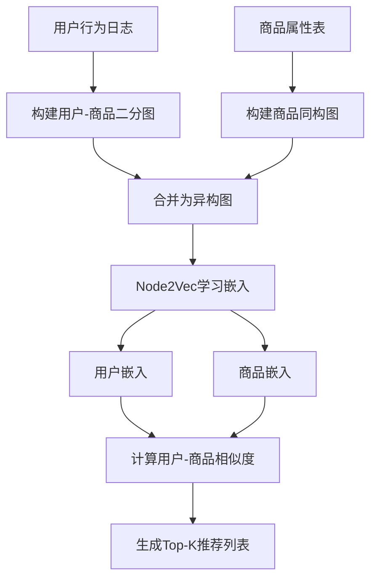

以下是基于图嵌入的推荐算法在电商场景中的详细阐述，包含算法原理、流程示例及Mermaid图示：

---

### **一、核心概念：图嵌入与推荐系统**
**图嵌入（Graph Embedding）**：将图结构数据（节点、边）映射为低维稠密向量，保留图中的拓扑关系（如用户-商品交互、商品相似性）。  
**推荐目标**：利用图嵌入捕捉用户兴趣、商品关联性，生成个性化推荐列表。

---

### **二、电商场景中的图结构建模**
#### **1. 图类型选择**
- **用户-商品二分图（Bipartite Graph）**  
  - **节点**：用户（User）、商品（Item）  
  - **边**：用户对商品的交互行为（点击、购买、收藏等）  
  - **示例**：  
    ```mermaid
    graph LR
      U1[用户A] -- 购买 --> I1[手机X]
      U1 -- 点击 --> I2[耳机Y]
      U2[用户B] -- 收藏 --> I1
      U2 -- 购买 --> I3[充电宝Z]
    ```

- **商品同构图（Homogeneous Graph）**  
  - **节点**：商品  
  - **边**：商品间的相似性（基于共现、类别、文本描述等）  
  - **示例**：  
    ```mermaid
    graph LR
      I1[手机X] -- 共现 --> I2[耳机Y]
      I1 -- 同类别 --> I3[充电宝Z]
      I2 -- 共现 --> I4[保护壳W]
    ```

#### **2. 边权重设计**
- **用户-商品边**：交互类型权重（购买>收藏>点击）  
- **商品-商品边**：相似度分数（如Jaccard相似度、余弦相似度）

---

### **三、基于图嵌入的推荐算法流程**
#### **1. 图构建与预处理**
- **输入数据**：用户行为日志、商品属性表  
- **输出图**：用户-商品二分图 + 商品同构图  
- **示例**：  
  ```python
  # 伪代码：构建用户-商品交互图
  import networkx as nx

  G = nx.Graph()
  interactions = [("U1", "I1", "buy"), ("U1", "I2", "click"), ("U2", "I1", "collect")]
  for user, item, action in interactions:
      weight = 1.0 if action == "buy" else 0.5 if action == "collect" else 0.2
      G.add_edge(user, item, weight=weight)
  ```

#### **2. 图嵌入学习**
**方法选择**：  
- **Node2Vec**：通过随机游走生成节点序列，用Word2Vec学习嵌入  
- **DeepWalk**：简化版Node2Vec，固定随机游走策略  
- **LINE**：直接优化一阶/二阶相似度  
- **GraphSAGE**：归纳式学习，支持新节点嵌入  

**示例（Node2Vec）**：  
```python
from node2vec import Node2Vec

# 基于用户-商品图生成嵌入
node2vec = Node2Vec(G, dimensions=64, walk_length=30, num_walks=200)
model = node2vec.fit(window=10, min_count=1)

# 获取用户和商品的嵌入向量
user_emb = model.wv["U1"]  # 用户A的64维向量
item_emb = model.wv["I1"]  # 商品X的64维向量
```

#### **3. 推荐生成**
**方法1：基于用户嵌入的相似商品推荐**  
- 计算用户向量与所有商品向量的余弦相似度  
- 排序后返回Top-K商品  

**方法2：基于图结构的传播推荐（随机游走）**  
- 从用户节点出发，进行带权重的随机游走  
- 统计访问频率最高的商品作为推荐  

**示例（余弦相似度推荐）**：  
```python
import numpy as np
from sklearn.metrics.pairwise import cosine_similarity

# 假设所有商品嵌入已存储在矩阵items_emb中
user_vec = np.array(user_emb).reshape(1, -1)
similarities = cosine_similarity(user_vec, items_emb)
top_k_indices = similarities.argsort()[0][-5:][::-1]  # Top-5商品
```

---

### **四、完整流程图示（Mermaid）**


---

### **五、优化方向**
1. **动态图更新**：增量学习嵌入（如GraphSAGE在线更新）  
2. **多模态融合**：结合商品文本/图像嵌入（如使用BERT+ResNet特征）  
3. **冷启动处理**：  
   - 新用户：利用注册信息（如性别、年龄）初始化嵌入  
   - 新商品：基于属性相似性迁移已有商品嵌入  
4. **可解释性**：通过图路径分析推荐原因（如“购买手机X的用户常购买耳机Y”）

---

### **六、实际案例：淘宝“猜你喜欢”**
1. **图构建**：  
   - 用户节点：10亿+  
   - 商品节点：100亿+  
   - 边：用户对商品的点击/购买行为（时间衰减加权）  
2. **嵌入学习**：  
   - 使用阿里开源的**Euler**图学习框架（支持分布式训练）  
   - 嵌入维度：256维  
3. **推荐效果**：  
   - 点击率提升15%+  
   - 长尾商品曝光量增加30%

---

通过图嵌入，电商推荐系统能够显式建模用户-商品-商品之间的复杂关系，相比传统协同过滤（仅利用用户-商品共现矩阵）具有更强的表达能力和可解释性。实际部署时需结合工程优化（如近似最近邻检索加速向量召回）。