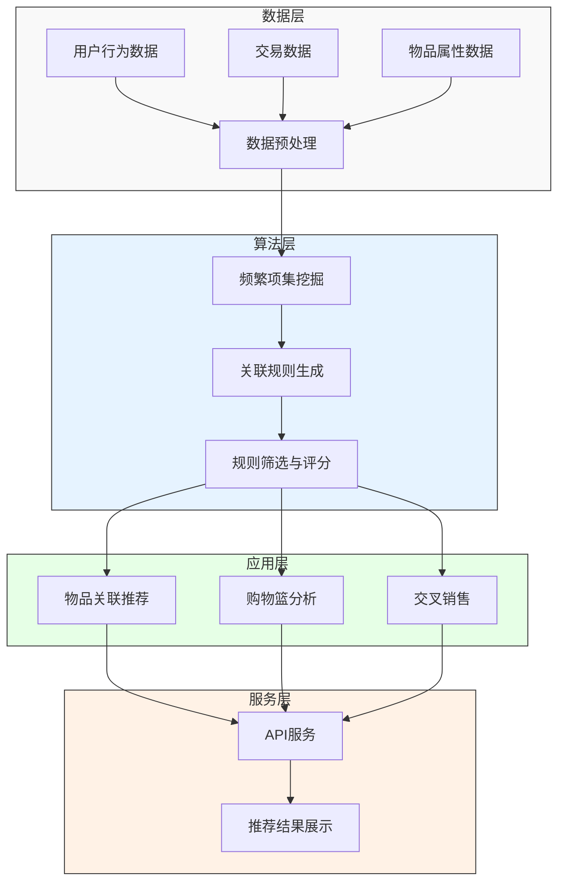
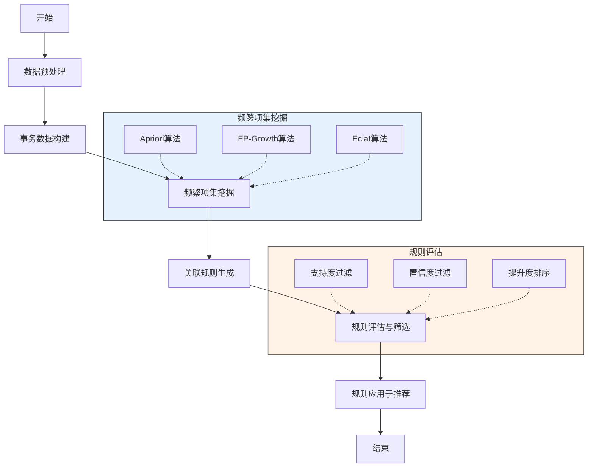
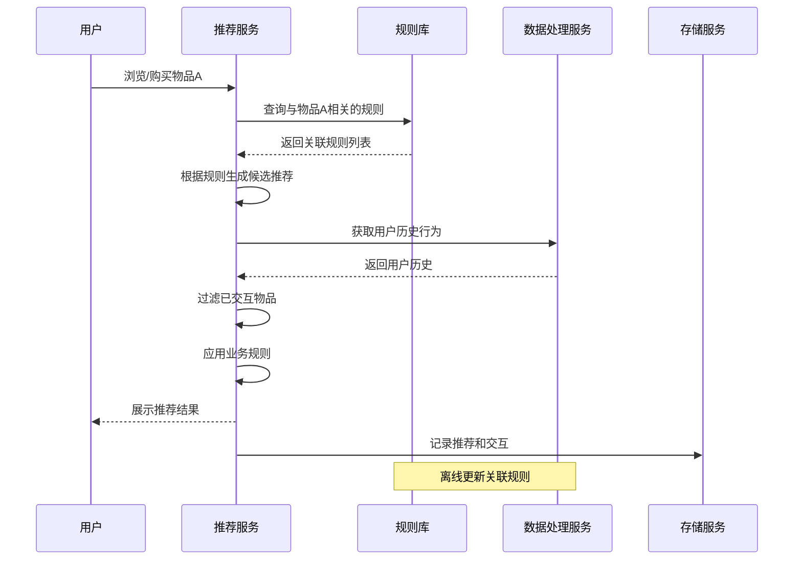
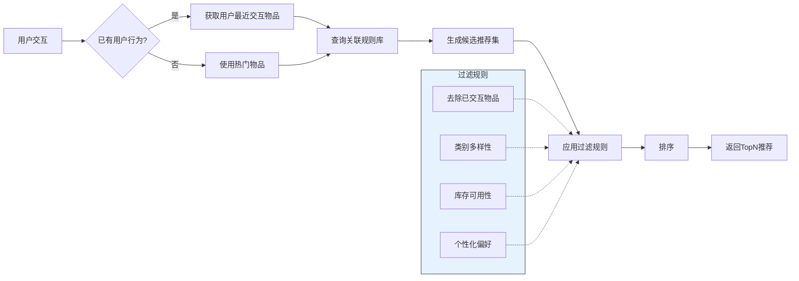
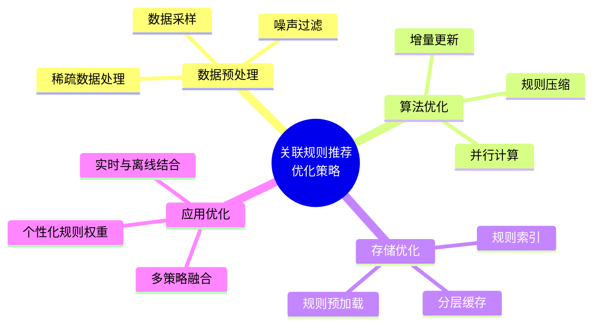

# 基于关联规则的推荐算法

关联规则挖掘是一种在大规模数据集中发现项目间关系的方法，广泛应用于推荐系统中。本文将详细介绍基于关联规则的推荐算法原理、实现方法及其在实际应用中的优化策略。

## 关联规则基本概念

关联规则是形如 X → Y 的规则，其中 X 和 Y 是不相交的项集。这种规则表示：如果一个事务包含 X 中的所有项，那么该事务也很可能包含 Y 中的所有项。

### 关键指标

- **支持度(Support)**：项集在所有事务中出现的频率
  - Support(X) = 包含X的事务数 / 总事务数
  - Support(X→Y) = Support(X∪Y)

- **置信度(Confidence)**：包含X的事务中同时包含Y的概率
  - Confidence(X→Y) = Support(X∪Y) / Support(X)

- **提升度(Lift)**：衡量规则的相关性
  - Lift(X→Y) = Confidence(X→Y) / Support(Y)

## 系统架构



## 算法实现流程

### 关联规则挖掘流程图



### 推荐生成时序图



## 算法实现

### 1. Apriori 算法

Apriori 算法是最经典的关联规则挖掘算法，基于"频繁项集的所有非空子集也是频繁的"这一原理。

```python
# 伪代码：Apriori算法实现
def apriori(transactions, min_support):
    # 生成1项频繁项集
    C1 = create_candidates_1(transactions)
    D = transactions
    L1 = [item for item in C1 if support(item, D) >= min_support]
    L = [L1]
    k = 2
    
    # 迭代生成k项频繁项集
    while len(L[k-2]) > 0:
        Ck = apriori_gen(L[k-2])  # 候选生成
        Lk = []
        # 计算候选项集的支持度
        for c in Ck:
            if support(c, D) >= min_support:
                Lk.append(c)
        L.append(Lk)
        k += 1
    
    return L

# 从频繁项集生成关联规则
def generate_rules(L, min_confidence):
    rules = []
    for k in range(2, len(L)):
        for itemset in L[k]:
            subsets = get_subsets(itemset)
            for subset in subsets:
                confidence = support(itemset) / support(subset)
                if confidence >= min_confidence:
                    rules.append((subset, itemset - subset, confidence))
    return rules
```

### 2. FP-Growth 算法

FP-Growth 算法通过构建 FP 树，避免了 Apriori 算法中的候选集生成和测试，提高了效率。

```python
# 伪代码：FP-Growth算法实现
def fp_growth(transactions, min_support):
    # 统计每个项的出现次数
    item_counts = {}
    for transaction in transactions:
        for item in transaction:
            item_counts[item] = item_counts.get(item, 0) + 1
    
    # 过滤非频繁项
    frequent_items = {k: v for k, v in item_counts.items() 
                     if v >= min_support * len(transactions)}
    
    # 构建FP树
    fp_tree, header_table = build_fp_tree(transactions, frequent_items)
    
    # 递归挖掘频繁项集
    frequent_patterns = {}
    mine_fp_tree(fp_tree, header_table, set(), frequent_patterns, min_support * len(transactions))
    
    return frequent_patterns
```

## 推荐系统实现

### 基于关联规则的推荐流程



## 工程实现优化

### 性能优化策略



## 应用场景

基于关联规则的推荐算法在以下场景中表现出色：

1. **电子商务**："购买了这个的人也购买了..."
2. **内容推荐**：相关文章、视频推荐
3. **交叉销售**：推荐互补产品
4. **购物篮分析**：优化商品布局和促销策略

## 优缺点分析

### 优点

- **可解释性强**：推荐结果有明确的关联关系
- **不需要用户特征**：仅基于行为数据即可生成推荐
- **计算效率高**：特别是使用优化算法如FP-Growth时
- **冷启动问题较小**：可以基于热门物品和全局规则生成推荐

### 缺点

- **无法捕捉用户个性化偏好**：规则对所有用户一致
- **稀疏数据下表现不佳**：需要足够的交互数据
- **难以发现长尾物品**：低频物品难以出现在规则中
- **规则爆炸问题**：大规模数据集可能产生海量规则

## 实践建议

1. **合理设置支持度和置信度阈值**：平衡规则数量和质量
2. **定期更新规则库**：反映最新的用户行为趋势
3. **与其他推荐算法结合**：弥补各自的不足
4. **加入业务规则**：结合业务需求进行规则过滤和排序
5. **关注规则的时效性**：考虑季节性和时间衰减因素

## 小结

基于关联规则的推荐算法是一种直观、高效且可解释性强的推荐方法。通过挖掘物品间的关联关系，可以为用户提供相关性高的推荐。在实际应用中，需要结合业务特点进行算法优化和规则管理，并与其他推荐策略结合，以提供更全面、精准的推荐服务。