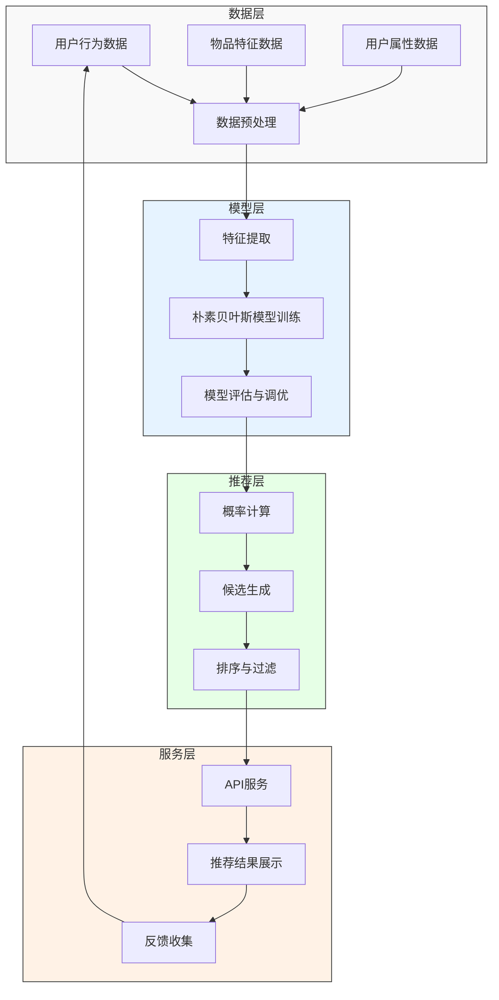
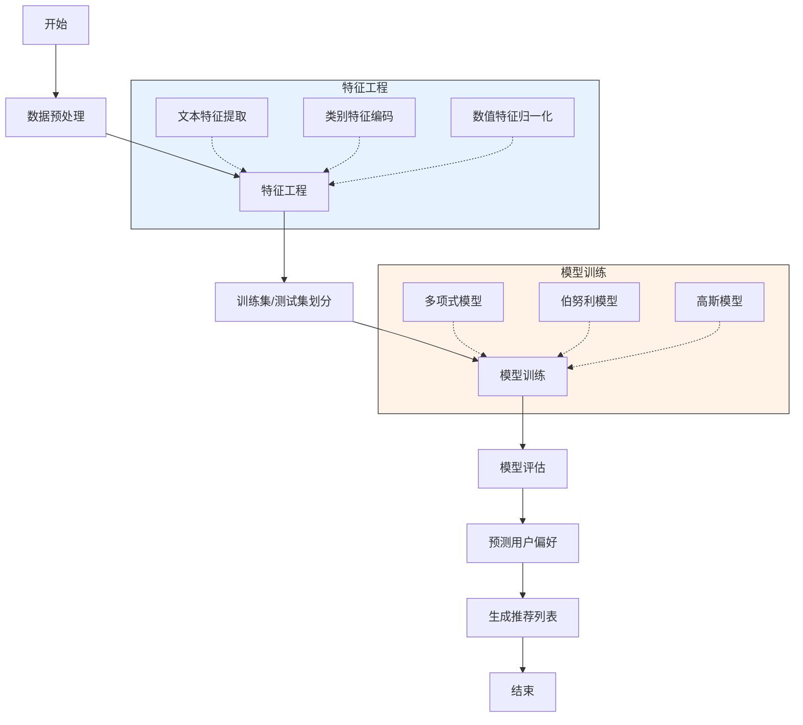
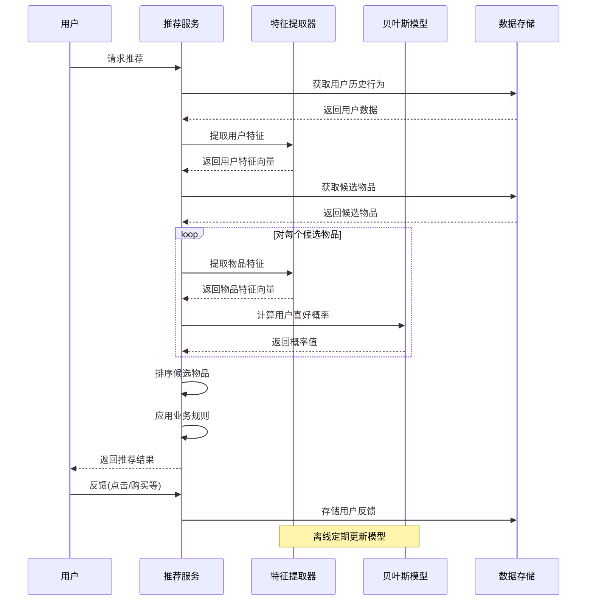
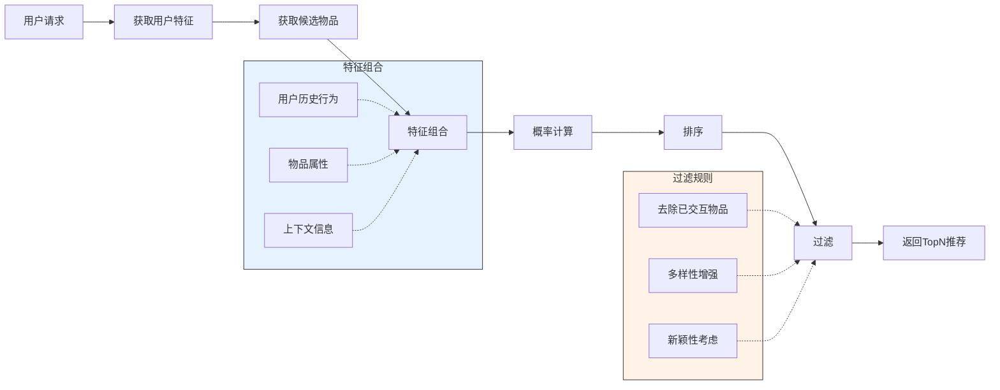
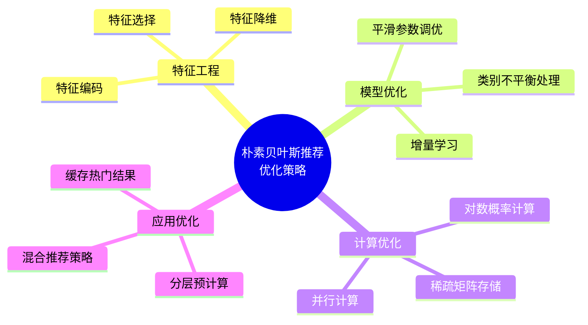

# 基于朴素贝叶斯的推荐算法

朴素贝叶斯是一种基于概率论的分类算法，在推荐系统中也有广泛应用。本文将详细介绍基于朴素贝叶斯的推荐算法原理、实现方法及其在实际应用中的优化策略。

## 朴素贝叶斯基本原理

朴素贝叶斯算法基于贝叶斯定理，并假设特征之间相互独立。在推荐系统中，可以将用户是否喜欢某物品视为分类问题，通过历史行为数据预测用户对新物品的偏好概率。

### 贝叶斯定理

贝叶斯定理描述了在已知条件下事件发生的概率：

$$P(A|B) = \frac{P(B|A) \times P(A)}{P(B)}$$

其中：
- $P(A|B)$ 是已知 B 发生后 A 发生的概率（后验概率）
- $P(B|A)$ 是已知 A 发生后 B 发生的概率（似然概率）
- $P(A)$ 是 A 发生的概率（先验概率）
- $P(B)$ 是 B 发生的概率（边缘概率）

### 朴素贝叶斯在推荐中的应用

在推荐系统中，我们可以将贝叶斯定理应用为：

$$P(like|features) = \frac{P(features|like) \times P(like)}{P(features)}$$

其中：
- $P(like|features)$ 是用户喜欢具有特定特征物品的概率
- $P(features|like)$ 是用户喜欢的物品具有这些特征的概率
- $P(like)$ 是用户喜欢物品的先验概率
- $P(features)$ 是物品具有这些特征的概率

## 系统架构



## 算法实现流程

### 朴素贝叶斯推荐流程图



### 推荐生成时序图



## 算法实现

### 1. 多项式朴素贝叶斯

适用于离散特征计数，如文本分类或物品特征是出现频率的场景。

```python
# 伪代码：多项式朴素贝叶斯实现
def train_multinomial_nb(X_train, y_train, alpha=1.0):
    # 计算先验概率 P(like) 和 P(dislike)
    n_samples, n_features = X_train.shape
    classes = np.unique(y_train)
    n_classes = len(classes)
    
    # 计算每个类别的先验概率
    class_prior = np.zeros(n_classes)
    for i, c in enumerate(classes):
        class_prior[i] = np.sum(y_train == c) / n_samples
    
    # 计算条件概率 P(feature|class)
    feature_prob = np.zeros((n_classes, n_features))
    for i, c in enumerate(classes):
        X_c = X_train[y_train == c]
        # 应用拉普拉斯平滑
        feature_count = np.sum(X_c, axis=0) + alpha
        total_count = np.sum(feature_count)
        feature_prob[i] = feature_count / total_count
    
    return classes, class_prior, feature_prob

def predict_multinomial_nb(X, classes, class_prior, feature_prob):
    # 计算后验概率 P(class|features)
    n_samples = X.shape[0]
    n_classes = len(classes)
    log_prob = np.zeros((n_samples, n_classes))
    
    for i in range(n_classes):
        # 对数概率避免数值下溢
        log_prior = np.log(class_prior[i])
        log_likelihood = np.sum(X * np.log(feature_prob[i]), axis=1)
        log_prob[:, i] = log_prior + log_likelihood
    
    # 返回最大概率的类别
    return classes[np.argmax(log_prob, axis=1)]
```

### 2. 伯努利朴素贝叶斯

适用于二元特征，如用户是否与某类物品交互过。

```python
# 伪代码：伯努利朴素贝叶斯实现
def train_bernoulli_nb(X_train, y_train, alpha=1.0):
    # 将特征二值化
    X_train_binary = (X_train > 0).astype(int)
    
    n_samples, n_features = X_train_binary.shape
    classes = np.unique(y_train)
    n_classes = len(classes)
    
    # 计算每个类别的先验概率
    class_prior = np.zeros(n_classes)
    for i, c in enumerate(classes):
        class_prior[i] = np.sum(y_train == c) / n_samples
    
    # 计算条件概率 P(feature=1|class)
    feature_prob = np.zeros((n_classes, n_features))
    for i, c in enumerate(classes):
        X_c = X_train_binary[y_train == c]
        n_c = X_c.shape[0]
        # 应用拉普拉斯平滑
        feature_prob[i] = (np.sum(X_c, axis=0) + alpha) / (n_c + 2 * alpha)
    
    return classes, class_prior, feature_prob
```

## 推荐系统实现

### 基于朴素贝叶斯的推荐流程



## 工程实现优化

### 性能优化策略



## 应用场景

基于朴素贝叶斯的推荐算法在以下场景中表现出色：

1. **内容推荐**：新闻、文章、博客等文本内容推荐
2. **电子邮件过滤**：识别用户感兴趣的邮件
3. **产品分类推荐**：基于用户历史偏好推荐产品类别
4. **情境化推荐**：结合上下文信息的推荐

## 优缺点分析

### 优点

- **计算效率高**：训练和预测速度快
- **对小规模数据有效**：即使训练数据有限也能工作
- **可解释性好**：概率模型易于理解和解释
- **增量更新简单**：可以方便地更新模型
- **处理高维特征能力强**：适合文本等高维特征场景

### 缺点

- **特征独立性假设**：现实中特征往往相关，影响精度
- **数据稀疏问题**：需要合理的平滑策略
- **对数值特征敏感**：需要合适的离散化或使用高斯模型
- **冷启动问题**：新用户或新物品缺乏特征信息

## 实践建议

1. **特征工程至关重要**：精心设计特征可显著提升性能
2. **合理设置平滑参数**：避免零概率问题
3. **结合上下文信息**：增强推荐的情境相关性
4. **混合推荐策略**：与协同过滤等方法结合使用
5. **定期更新模型**：反映用户偏好变化

## 小结

基于朴素贝叶斯的推荐算法是一种高效、可解释且易于实现的推荐方法。通过将推荐问题转化为分类问题，利用概率模型预测用户对物品的偏好。虽然存在特征独立性假设的局限，但在实际应用中，通过合理的特征工程和模型优化，可以构建出性能良好的推荐系统。在实践中，常将其作为混合推荐系统的组件之一，与其他算法互补，提供全面的推荐服务。