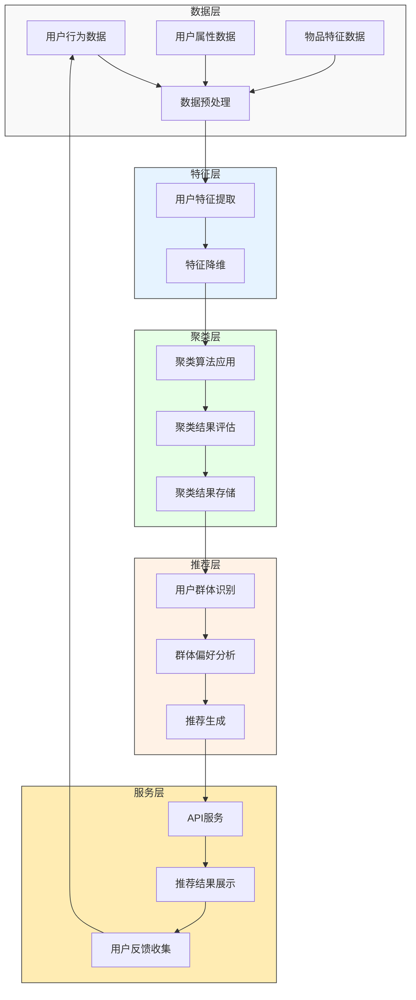
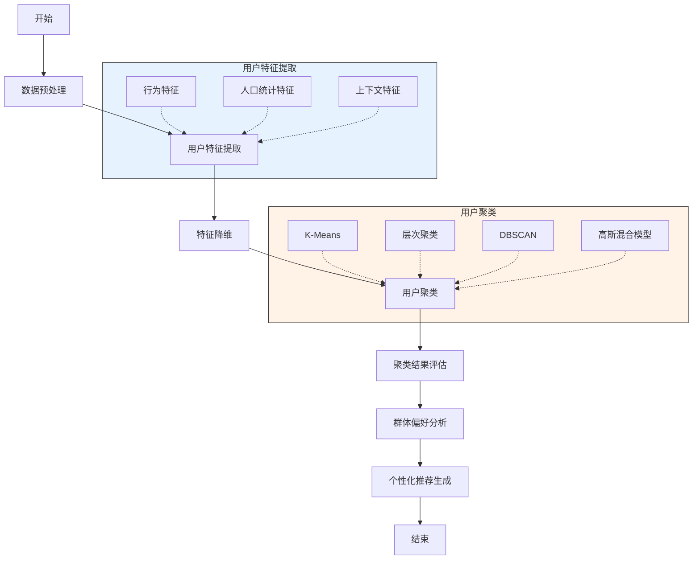
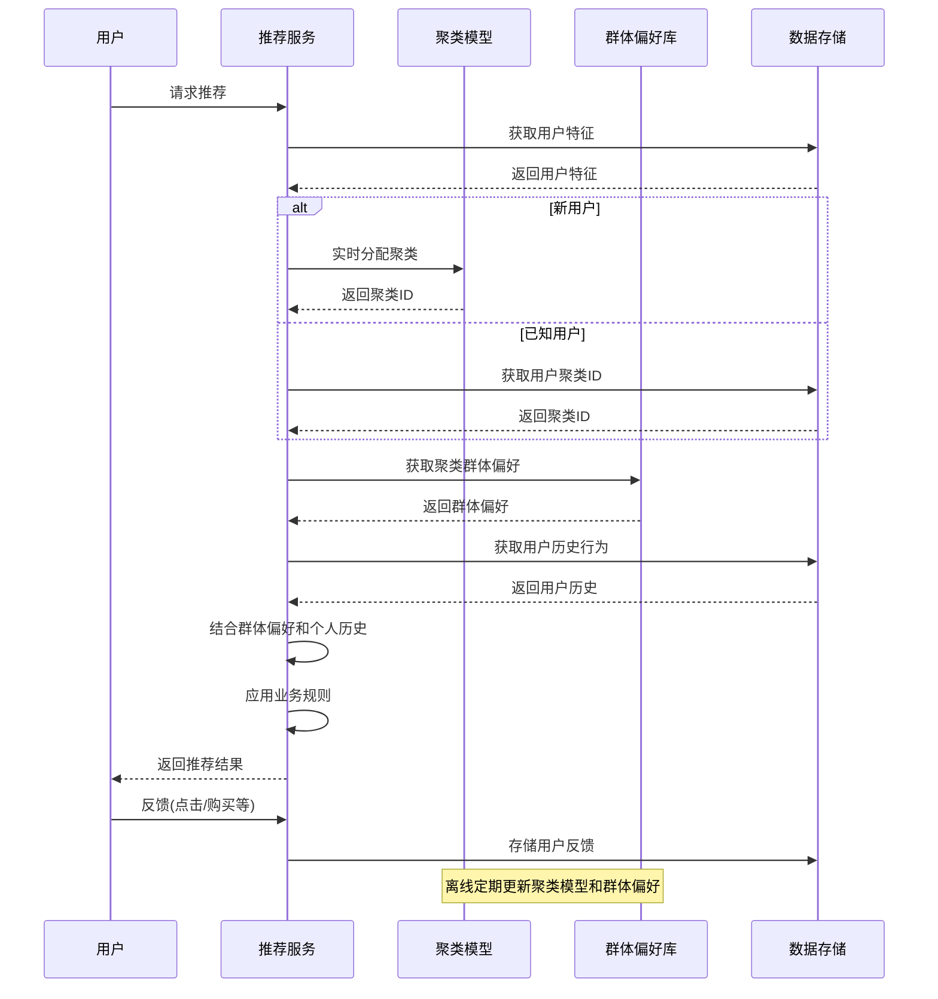
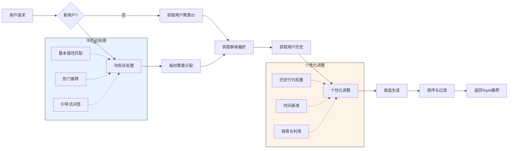
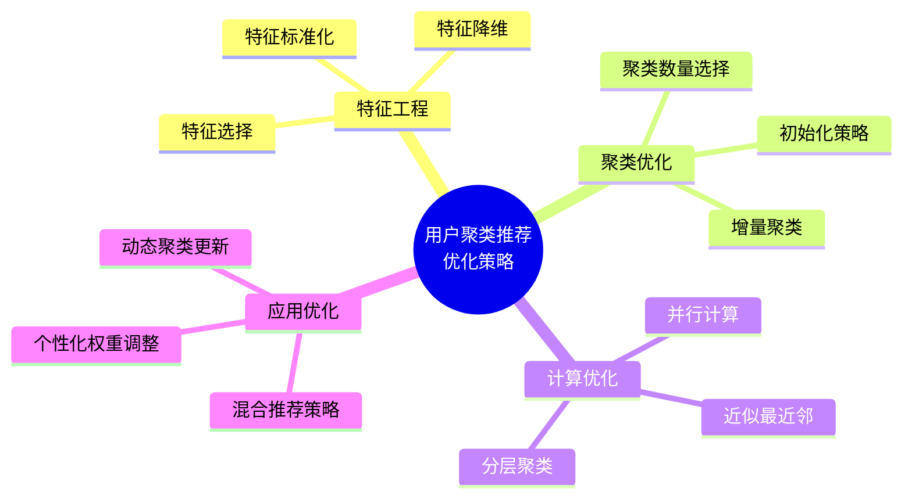

# 基于用户聚类的推荐算法

基于用户聚类的推荐是一种将相似用户分组，然后基于群体偏好生成推荐的方法。本文将详细介绍基于用户聚类的推荐算法原理、实现方法及其在实际应用中的优化策略。

## 用户聚类推荐基本原理

基于用户聚类的推荐算法核心思想是"物以类聚，人以群分"，通过将用户划分为不同的群体，利用群体的集体智慧为个体用户提供推荐。其基本假设是：相似的用户可能具有相似的偏好。

### 基本步骤

1. **用户特征提取**：从用户行为、属性等数据中提取特征
2. **聚类算法应用**：将用户划分为不同的群体
3. **群体偏好分析**：分析每个群体的共同偏好
4. **个性化推荐生成**：基于用户所属群体的偏好生成推荐

## 系统架构



## 算法实现流程

### 用户聚类推荐流程图



### 推荐生成时序图



## 算法实现

### 1. K-Means 聚类

K-Means 是最常用的聚类算法之一，通过迭代优化将数据点划分为 K 个簇。

```python
# 伪代码：K-Means聚类实现
def kmeans(X, k, max_iters=100, tol=1e-4):
    # 随机初始化k个中心点
    n_samples, n_features = X.shape
    centroids = X[np.random.choice(n_samples, k, replace=False)]
    
    for _ in range(max_iters):
        # 分配样本到最近的中心点
        distances = np.zeros((n_samples, k))
        for i in range(k):
            distances[:, i] = np.sum((X - centroids[i])**2, axis=1)
        
        labels = np.argmin(distances, axis=1)
        
        # 更新中心点
        new_centroids = np.zeros((k, n_features))
        for i in range(k):
            if np.sum(labels == i) > 0:
                new_centroids[i] = np.mean(X[labels == i], axis=0)
        
        # 检查收敛
        if np.sum((new_centroids - centroids)**2) < tol:
            break
            
        centroids = new_centroids
    
    return labels, centroids
```

### 2. 用户特征提取

用户特征是聚类的基础，可以从多个维度提取。

```python
# 伪代码：用户特征提取
def extract_user_features(user_data, item_data, interactions):
    # 提取用户行为特征
    user_features = {}
    
    # 1. 基于交互的特征
    for user_id in user_data:
        user_features[user_id] = {}
        # 用户交互物品的类别分布
        category_counts = {}
        # 用户交互时间分布
        time_pattern = [0] * 24  # 24小时
        
        user_interactions = interactions[interactions['user_id'] == user_id]
        
        for _, interaction in user_interactions.iterrows():
            item_id = interaction['item_id']
            category = item_data[item_id]['category']
            timestamp = interaction['timestamp']
            
            # 更新类别计数
            if category not in category_counts:
                category_counts[category] = 0
            category_counts[category] += 1
            
            # 更新时间模式
            hour = datetime.fromtimestamp(timestamp).hour
            time_pattern[hour] += 1
        
        # 归一化特征
        total_interactions = len(user_interactions)
        if total_interactions > 0:
            for category in category_counts:
                category_counts[category] /= total_interactions
            
            time_pattern = [count / total_interactions for count in time_pattern]
        
        # 存储特征
        user_features[user_id]['category_dist'] = category_counts
        user_features[user_id]['time_pattern'] = time_pattern
        
        # 2. 添加用户属性特征
        user_features[user_id]['age'] = user_data[user_id]['age']
        user_features[user_id]['gender'] = user_data[user_id]['gender']
        # ... 其他属性特征
    
    # 将特征转换为向量形式
    feature_vectors = []
    for user_id in user_features:
        # 将字典特征转换为向量
        vector = convert_to_vector(user_features[user_id])
        feature_vectors.append((user_id, vector))
    
    return feature_vectors
```

### 3. 群体偏好分析

对每个聚类群体的偏好进行分析，为推荐提供依据。

```python
# 伪代码：群体偏好分析
def analyze_cluster_preferences(cluster_labels, user_ids, interactions, item_data):
    cluster_preferences = {}
    
    # 为每个聚类创建偏好分析
    unique_clusters = np.unique(cluster_labels)
    for cluster_id in unique_clusters:
        # 获取该聚类的所有用户
        cluster_user_indices = np.where(cluster_labels == cluster_id)[0]
        cluster_users = [user_ids[i] for i in cluster_user_indices]
        
        # 收集该聚类用户的所有交互
        cluster_interactions = interactions[interactions['user_id'].isin(cluster_users)]
        
        # 分析物品偏好
        item_counts = {}
        category_counts = {}
        
        for _, interaction in cluster_interactions.iterrows():
            item_id = interaction['item_id']
            rating = interaction.get('rating', 1)  # 默认为1如果没有评分
            
            # 更新物品计数
            if item_id not in item_counts:
                item_counts[item_id] = {'count': 0, 'total_rating': 0}
            item_counts[item_id]['count'] += 1
            item_counts[item_id]['total_rating'] += rating
            
            # 更新类别计数
            category = item_data[item_id]['category']
            if category not in category_counts:
                category_counts[category] = {'count': 0, 'total_rating': 0}
            category_counts[category]['count'] += 1
            category_counts[category]['total_rating'] += rating
        
        # 计算平均评分
        for item_id in item_counts:
            item_counts[item_id]['avg_rating'] = (
                item_counts[item_id]['total_rating'] / item_counts[item_id]['count']
            )
        
        for category in category_counts:
            category_counts[category]['avg_rating'] = (
                category_counts[category]['total_rating'] / category_counts[category]['count']
            )
        
        # 存储聚类偏好
        cluster_preferences[cluster_id] = {
            'top_items': sorted(
                item_counts.items(), 
                key=lambda x: (x[1]['avg_rating'], x[1]['count']), 
                reverse=True
            ),
            'category_preferences': sorted(
                category_counts.items(), 
                key=lambda x: (x[1]['avg_rating'], x[1]['count']), 
                reverse=True
            )
        }
    
    return cluster_preferences
```

## 推荐系统实现

### 基于用户聚类的推荐流程



## 工程实现优化

### 性能优化策略



## 应用场景

基于用户聚类的推荐算法在以下场景中表现出色：

1. **电子商务**：识别用户购物模式，推荐相似用户喜欢的商品
2. **内容平台**：根据用户群体兴趣推荐文章、视频等内容
3. **金融服务**：基于用户风险偏好分组，推荐适合的金融产品
4. **旅游服务**：根据旅行者类型推荐目的地和行程
5. **教育平台**：根据学习风格和能力分组，推荐个性化学习内容

## 优缺点分析

### 优点

- **降低计算复杂度**：相比逐个计算用户相似度，聚类可以显著减少计算量
- **缓解数据稀疏问题**：通过群体偏好弥补个体数据不足
- **冷启动问题处理**：新用户可以基于有限特征快速分配到合适群体
- **可解释性**：推荐结果可以通过用户群体特征解释
- **发现潜在兴趣**：可以发现用户潜在但未明确表达的兴趣

### 缺点

- **聚类粒度问题**：聚类数量选择困难，影响推荐质量
- **个性化程度有限**：过度依赖群体偏好可能忽略个体差异
- **动态适应性差**：用户偏好变化可能导致聚类不准确
- **特征工程依赖**：聚类效果强烈依赖于特征选择和提取
- **评估复杂**：聚类质量和推荐效果的关系不易评估

## 实践建议

1. **特征工程至关重要**：精心设计特征可显著提升聚类质量
2. **动态更新聚类**：定期重新聚类以适应用户偏好变化
3. **混合推荐策略**：结合个性化推荐和群体推荐
4. **聚类数量选择**：使用轮廓系数、肘部法则等方法确定最佳聚类数
5. **增量聚类**：对于大规模系统，考虑使用增量聚类方法
6. **多层次聚类**：考虑使用层次聚类捕捉不同粒度的用户群体

## 小结

基于用户聚类的推荐算法通过将相似用户分组，利用群体智慧为个体用户提供推荐。这种方法在降低计算复杂度的同时，能够缓解数据稀疏和冷启动问题。在实际应用中，需要注意聚类粒度和个性化程度的平衡，通过动态更新和混合策略提升推荐质量。随着机器学习技术的发展，更先进的聚类算法和特征工程方法将进一步提升基于用户聚类的推荐系统性能。