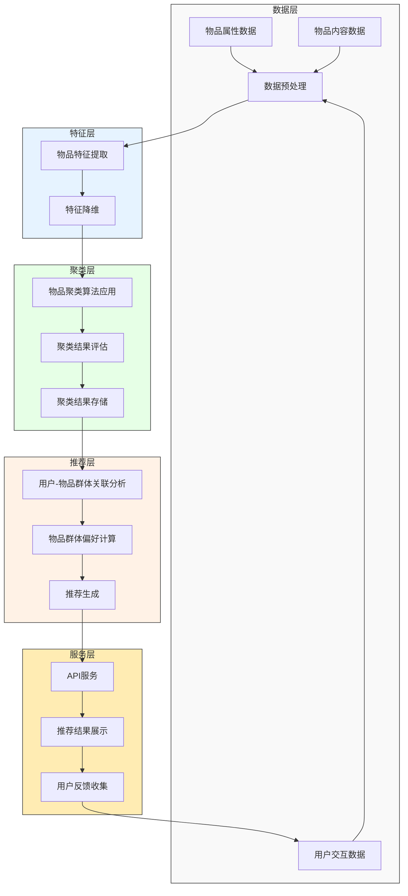
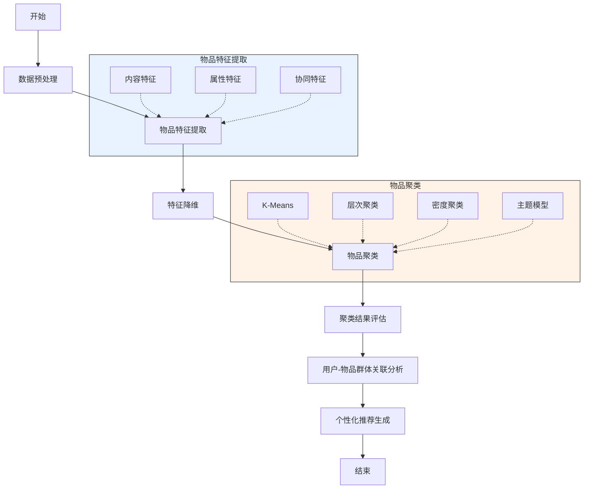
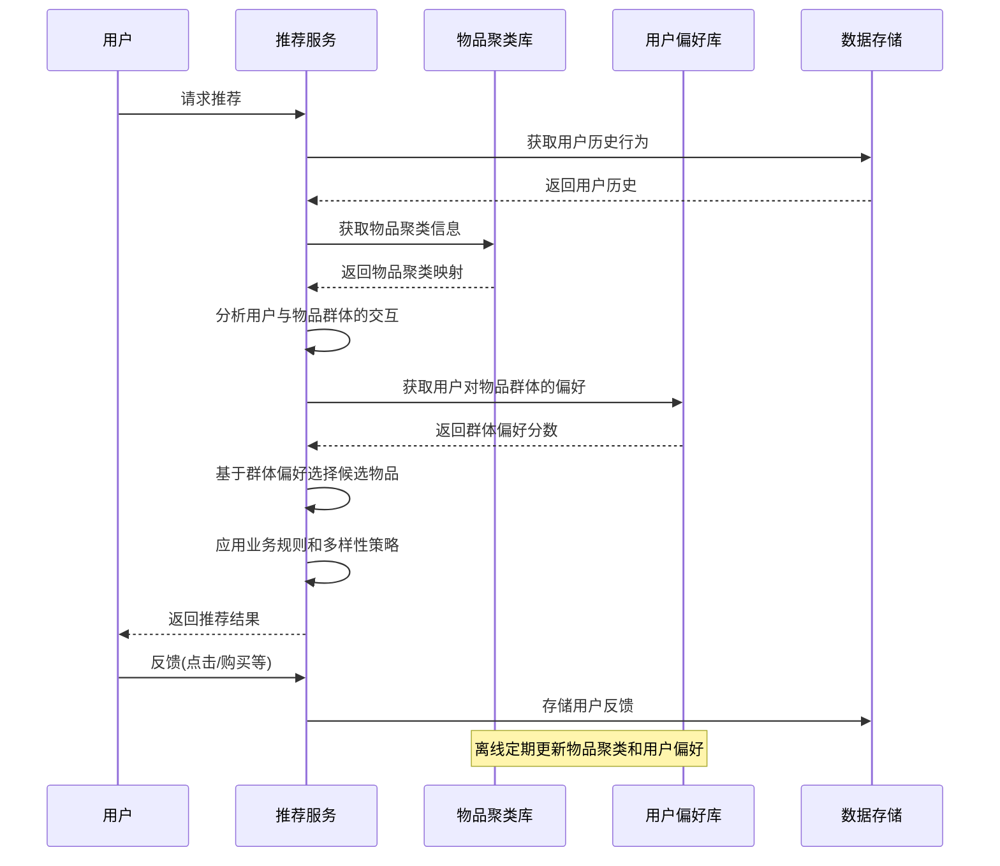
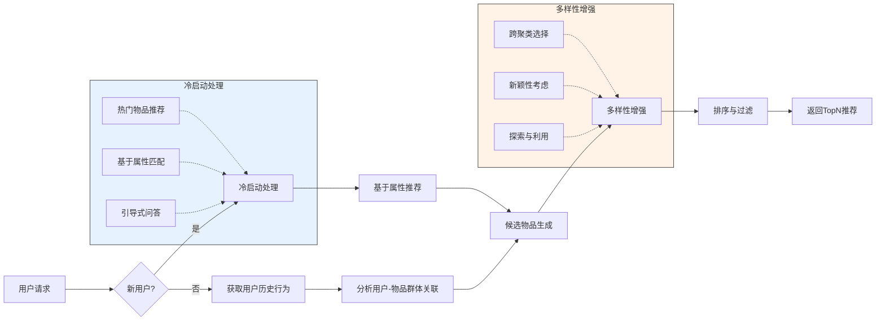
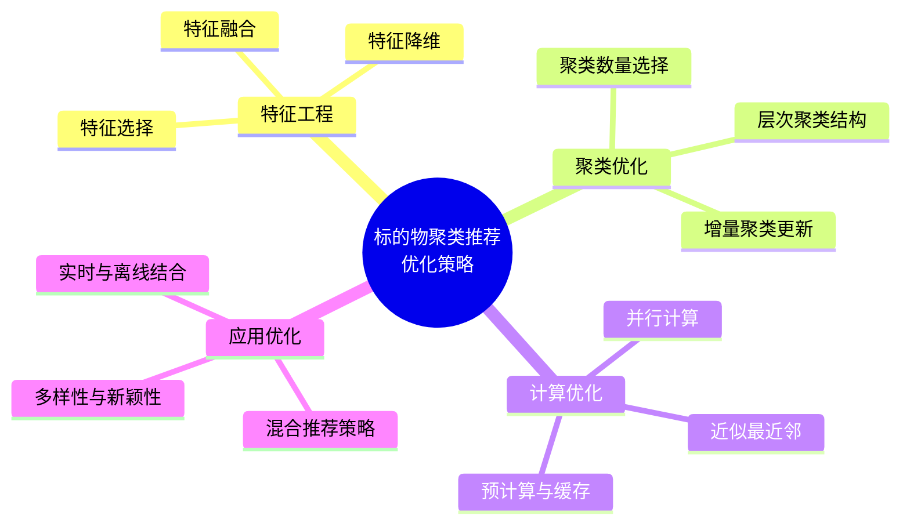

# 基于标的物聚类的推荐算法

基于标的物聚类的推荐算法是一种将相似物品分组，然后基于用户与物品群体的交互生成推荐的方法。本文将详细介绍基于标的物聚类的推荐算法原理、实现方法及其在实际应用中的优化策略。

## 标的物聚类推荐基本原理

基于标的物聚类的推荐算法核心思想是将具有相似特征或被相似用户群体喜爱的物品归为一类，通过用户与某一类物品的交互来推断用户对该类中其他物品的偏好。其基本假设是：相似的物品可能会受到相似用户群体的喜爱。

### 基本步骤

1. **物品特征提取**：从物品属性、内容特征、用户交互等数据中提取特征
2. **聚类算法应用**：将物品划分为不同的群体
3. **用户-物品群体关联分析**：分析用户与各物品群体的交互模式
4. **个性化推荐生成**：基于用户与物品群体的关联生成推荐

## 系统架构



## 算法实现流程

### 标的物聚类推荐流程图



### 推荐生成时序图



## 算法实现

### 1. 物品特征提取

物品特征是聚类的基础，可以从多个维度提取。

```python
# 伪代码：物品特征提取
def extract_item_features(items_data, user_interactions):
    item_features = {}
    
    # 处理每个物品
    for item_id, item_data in items_data.items():
        item_features[item_id] = {}
        
        # 1. 提取属性特征
        for attr in ['category', 'brand', 'price_range', 'release_date']:
            if attr in item_data:
                item_features[item_id][attr] = item_data[attr]
        
        # 2. 提取内容特征
        if 'description' in item_data:
            # 使用TF-IDF或词嵌入提取文本特征
            item_features[item_id]['text_features'] = extract_text_features(item_data['description'])
        
        if 'image_url' in item_data:
            # 使用预训练的图像模型提取图像特征
            item_features[item_id]['image_features'] = extract_image_features(item_data['image_url'])
        
        # 3. 提取协同特征（基于用户交互）
        item_interactions = user_interactions[user_interactions['item_id'] == item_id]
        
        # 用户人口统计特征分布
        age_groups = {'<18': 0, '18-24': 0, '25-34': 0, '35-44': 0, '45-54': 0, '55+': 0}
        gender_dist = {'male': 0, 'female': 0, 'other': 0}
        
        for _, interaction in item_interactions.iterrows():
            user_id = interaction['user_id']
            user_data = get_user_data(user_id)  # 假设有获取用户数据的函数
            
            if 'age_group' in user_data:
                age_groups[user_data['age_group']] += 1
            
            if 'gender' in user_data:
                gender_dist[user_data['gender']] += 1
        
        # 归一化
        total_interactions = len(item_interactions)
        if total_interactions > 0:
            for group in age_groups:
                age_groups[group] /= total_interactions
            
            for gender in gender_dist:
                gender_dist[gender] /= total_interactions
        
        item_features[item_id]['user_age_dist'] = age_groups
        item_features[item_id]['user_gender_dist'] = gender_dist
        
        # 4. 交互模式特征
        if total_interactions > 0:
            # 计算平均评分
            if 'rating' in item_interactions.columns:
                item_features[item_id]['avg_rating'] = item_interactions['rating'].mean()
            
            # 计算交互时间分布
            if 'timestamp' in item_interactions.columns:
                hour_dist = [0] * 24
                for _, interaction in item_interactions.iterrows():
                    hour = datetime.fromtimestamp(interaction['timestamp']).hour
                    hour_dist[hour] += 1
                
                # 归一化
                hour_dist = [count / total_interactions for count in hour_dist]
                item_features[item_id]['interaction_hour_dist'] = hour_dist
    
    # 将特征转换为向量形式
    feature_vectors = []
    for item_id in item_features:
        # 将字典特征转换为向量
        vector = convert_to_vector(item_features[item_id])
        feature_vectors.append((item_id, vector))
    
    return feature_vectors
```

### 2. 物品聚类算法

可以使用多种聚类算法对物品进行分组。

```python
# 伪代码：物品聚类
def cluster_items(item_features, method='kmeans', n_clusters=None):
    # 提取特征向量
    item_ids = [item_id for item_id, _ in item_features]
    vectors = np.array([vector for _, vector in item_features])
    
    # 标准化特征
    scaler = StandardScaler()
    scaled_vectors = scaler.fit_transform(vectors)
    
    # 如果没有指定聚类数，使用轮廓系数等方法确定最佳聚类数
    if n_clusters is None:
        n_clusters = determine_optimal_clusters(scaled_vectors)
    
    # 应用选定的聚类算法
    if method == 'kmeans':
        # K-Means聚类
        kmeans = KMeans(n_clusters=n_clusters, random_state=42)
        cluster_labels = kmeans.fit_predict(scaled_vectors)
        centroids = kmeans.cluster_centers_
        
    elif method == 'hierarchical':
        # 层次聚类
        hierarchical = AgglomerativeClustering(n_clusters=n_clusters)
        cluster_labels = hierarchical.fit_predict(scaled_vectors)
        centroids = None  # 层次聚类没有中心点概念
        
    elif method == 'dbscan':
        # 密度聚类
        dbscan = DBSCAN(eps=0.5, min_samples=5)
        cluster_labels = dbscan.fit_predict(scaled_vectors)
        centroids = None  # DBSCAN没有中心点概念
        
    elif method == 'gmm':
        # 高斯混合模型
        gmm = GaussianMixture(n_components=n_clusters, random_state=42)
        cluster_labels = gmm.fit_predict(scaled_vectors)
        centroids = gmm.means_
    
    # 创建物品到聚类的映射
    item_to_cluster = {}
    for i, item_id in enumerate(item_ids):
        item_to_cluster[item_id] = int(cluster_labels[i])
    
    # 创建聚类到物品的映射
    cluster_to_items = {}
    for i in range(max(cluster_labels) + 1):
        cluster_to_items[i] = []
    
    for i, cluster_id in enumerate(cluster_labels):
        if cluster_id >= 0:  # 排除噪声点（DBSCAN可能返回-1）
            cluster_to_items[cluster_id].append(item_ids[i])
    
    return {
        'item_to_cluster': item_to_cluster,
        'cluster_to_items': cluster_to_items,
        'centroids': centroids,
        'n_clusters': max(cluster_labels) + 1
    }
```

### 3. 用户-物品群体关联分析

分析用户与各物品群体的交互模式，为推荐提供依据。

```python
# 伪代码：用户-物品群体关联分析
def analyze_user_cluster_preferences(user_interactions, item_to_cluster):
    user_cluster_prefs = {}
    
    # 按用户ID分组处理交互数据
    user_groups = user_interactions.groupby('user_id')
    
    for user_id, interactions in user_groups:
        if user_id not in user_cluster_prefs:
            user_cluster_prefs[user_id] = {}
        
        # 统计用户与各聚类的交互次数和评分
        cluster_interactions = {}
        
        for _, interaction in interactions.iterrows():
            item_id = interaction['item_id']
            
            # 跳过未聚类的物品
            if item_id not in item_to_cluster:
                continue
                
            cluster_id = item_to_cluster[item_id]
            
            if cluster_id not in cluster_interactions:
                cluster_interactions[cluster_id] = {
                    'count': 0,
                    'total_rating': 0,
                    'items': set()
                }
            
            cluster_interactions[cluster_id]['count'] += 1
            cluster_interactions[cluster_id]['items'].add(item_id)
            
            # 如果有评分，累加评分
            if 'rating' in interaction:
                cluster_interactions[cluster_id]['total_rating'] += interaction['rating']
        
        # 计算平均评分和交互强度
        for cluster_id in cluster_interactions:
            count = cluster_interactions[cluster_id]['count']
            
            # 计算平均评分
            if 'total_rating' in cluster_interactions[cluster_id] and count > 0:
                avg_rating = cluster_interactions[cluster_id]['total_rating'] / count
            else:
                avg_rating = None
            
            # 计算交互强度（归一化）
            total_interactions = sum(c['count'] for c in cluster_interactions.values())
            interaction_strength = count / total_interactions if total_interactions > 0 else 0
            
            # 存储用户对该聚类的偏好
            user_cluster_prefs[user_id][cluster_id] = {
                'avg_rating': avg_rating,
                'interaction_strength': interaction_strength,
                'interaction_count': count,
                'interacted_items': list(cluster_interactions[cluster_id]['items'])
            }
    
    return user_cluster_prefs
```

## 推荐系统实现

### 基于标的物聚类的推荐流程



### 推荐生成算法

```python
# 伪代码：基于物品聚类的推荐生成
def generate_recommendations(user_id, user_cluster_prefs, cluster_to_items, 
                           item_data, user_history, n_recommendations=10):
    # 如果是新用户或没有足够的历史记录
    if user_id not in user_cluster_prefs or len(user_cluster_prefs[user_id]) == 0:
        return generate_cold_start_recommendations(user_id, item_data, n_recommendations)
    
    # 已有用户历史的情况
    user_prefs = user_cluster_prefs[user_id]
    
    # 按交互强度排序聚类
    sorted_clusters = sorted(
        user_prefs.items(),
        key=lambda x: x[1]['interaction_strength'],
        reverse=True
    )
    
    # 已交互物品集合（用于过滤）
    interacted_items = set(user_history)
    
    # 候选推荐物品及其分数
    candidate_items = {}
    
    # 从每个聚类中选择物品
    for cluster_id, pref_data in sorted_clusters:
        # 获取该聚类中的所有物品
        cluster_items = cluster_to_items[cluster_id]
        
        # 过滤掉已交互物品
        new_items = [item_id for item_id in cluster_items if item_id not in interacted_items]
        
        # 计算物品分数（可以基于多种因素）
        for item_id in new_items:
            # 基础分数 = 用户对该聚类的交互强度
            base_score = pref_data['interaction_strength']
            
            # 可以添加其他因素，如物品流行度、新颖性等
            popularity_score = calculate_popularity(item_id, item_data)
            recency_score = calculate_recency(item_id, item_data)
            
            # 综合分数（可以调整权重）
            final_score = (0.6 * base_score + 
                          0.3 * popularity_score + 
                          0.1 * recency_score)
            
            candidate_items[item_id] = final_score
    
    # 应用多样性策略（确保从不同聚类中选择物品）
    diverse_recommendations = apply_diversity_strategy(
        candidate_items, 
        item_to_cluster,
        n_recommendations
    )
    
    return diverse_recommendations
```

## 工程实现优化

### 性能优化策略



## 应用场景

基于标的物聚类的推荐算法在以下场景中表现出色：

1. **电子商务**：将商品按类别、风格、价格等特征聚类，推荐同类商品
2. **内容平台**：将文章、视频等内容按主题、风格聚类，推荐相似内容
3. **音乐推荐**：将音乐按流派、情绪、节奏等特征聚类，推荐相似音乐
4. **新闻推荐**：将新闻按主题、情感倾向等聚类，推荐相关新闻
5. **旅游推荐**：将旅游目的地按地理位置、气候、活动类型等聚类，推荐相似目的地

## 优缺点分析

### 优点

- **计算效率高**：预先聚类可以显著减少在线推荐时的计算量
- **冷启动问题处理**：新物品可以基于特征快速分配到合适群体
- **可解释性**：推荐结果可以通过物品群体特征解释
- **多样性控制**：可以通过跨聚类选择物品增强推荐多样性
- **适应内容变化**：能够处理物品内容和特征的变化

### 缺点

- **聚类质量依赖**：推荐效果强烈依赖于聚类质量
- **特征工程复杂**：需要精心设计物品特征以获得良好聚类
- **长尾物品处理**：不常见物品可能被错误聚类或形成孤立聚类
- **动态适应性**：需要定期更新聚类以适应新物品和变化的特征
- **个性化程度有限**：过度依赖群体特征可能忽略个体偏好差异

## 实践建议

1. **特征融合**：结合内容特征和协同特征获得更全面的物品表示
2. **层次聚类**：考虑使用层次聚类捕捉不同粒度的物品关系
3. **动态更新**：定期或增量更新聚类结果以适应新物品和变化
4. **混合推荐策略**：结合基于聚类的推荐和其他推荐方法
5. **多样性平衡**：在推荐中平衡相关性和多样性，避免推荐过于相似的物品
6. **评估指标多元化**：使用多种指标评估推荐效果，包括准确性、多样性、新颖性等

## 小结

基于标的物聚类的推荐算法通过将相似物品分组，利用用户与物品群体的交互模式生成推荐。这种方法在提高计算效率的同时，能够处理冷启动问题并提供可解释的推荐结果。在实际应用中，需要注意聚类质量和特征工程的重要性，通过动态更新和混合策略提升推荐质量。随着深度学习和表示学习技术的发展，物品特征提取和聚类方法将不断改进，进一步提升基于标的物聚类的推荐系统性能。