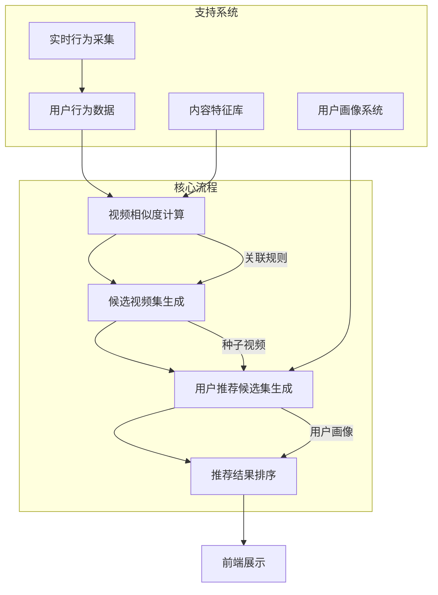
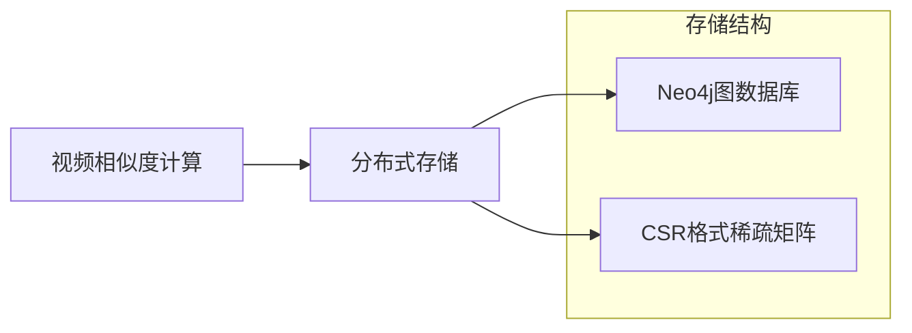
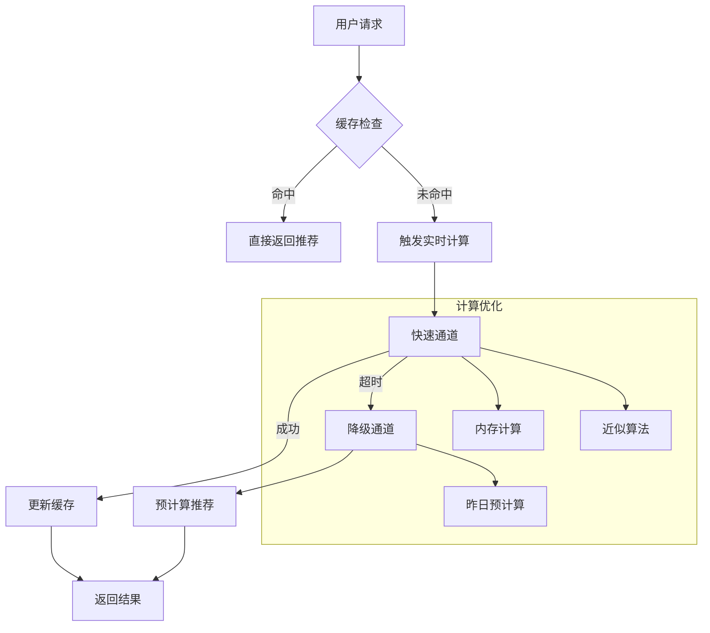

#  基于关联规则的视频推荐算法深度解析

下面我将详细阐述基于关联规则思路的视频推荐算法设计，包含四个核心部分：视频相似度计算、候选视频集生成、用户推荐候选集生成和推荐结果排序。

## 整体架构概览



## 1. 计算两个视频的相似度（关联度）

### 核心算法：基于用户行为的关联规则挖掘

```python
def calculate_video_similarity(video_i, video_j):
    """
    计算两个视频的相似度
    :param video_i: 视频ID i
    :param video_j: 视频ID j
    :return: 相似度分数 (0-1)
    """
    # 统计共同观看次数
    co_watch_count = get_co_watch_count(video_i, video_j)
    
    # 获取各自的总观看次数
    watch_count_i = get_watch_count(video_i)
    watch_count_j = get_watch_count(video_j)
    
    # 计算相似度 - 改进的Jaccard系数
    if watch_count_i + watch_count_j - co_watch_count == 0:
        return 0.0
    
    similarity = co_watch_count / math.sqrt(watch_count_i * watch_count_j)
    
    # 添加时间衰减因子
    last_co_watch_time = get_last_co_watch_time(video_i, video_j)
    time_decay = calculate_time_decay(last_co_watch_time)
    
    return similarity * time_decay
```

### 相似度计算优化技术

1. **行为加权策略**：
   - 完整观看：权重 1.0
   - 点赞/收藏：权重 1.2
   - 分享：权重 1.5
   - 跳过：权重 0.3

2. **时间衰减函数**：
   ```python
   def calculate_time_decay(event_time):
       """指数衰减函数"""
       current_time = time.time()
       hours_passed = (current_time - event_time) / 3600
       return math.exp(-0.1 * hours_passed)  # 半衰期约7小时
   ```

3. **内容特征增强**：
   ```python
   # 添加内容相似度作为补充
   content_sim = content_similarity(video_i, video_j)
   final_similarity = 0.7 * behavior_sim + 0.3 * content_sim
   ```

### 相似度矩阵存储



## 2. 基于单个种子视频生成候选视频集

### 候选集生成算法

```python
def generate_candidates_from_seed(seed_video, top_n=100):
    """
    基于单个种子视频生成候选视频集
    :param seed_video: 种子视频ID
    :param top_n: 返回候选数量
    :return: 候选视频列表
    """
    # 获取所有与种子视频相关的视频
    related_videos = get_related_videos(seed_video)
    
    # 过滤低相似度视频
    filtered = [v for v in related_videos if v.similarity > MIN_SIMILARITY]
    
    # 按相似度排序
    sorted_videos = sorted(filtered, key=lambda x: x.similarity, reverse=True)
    
    # 多样性增强：避免同一频道过度集中
    diversified = []
    channel_count = {}
    for video in sorted_videos:
        channel = get_channel(video.id)
        if channel not in channel_count:
            channel_count[channel] = 0
        
        # 同一频道最多取3个
        if channel_count[channel] < 3:
            diversified.append(video)
            channel_count[channel] += 1
        
        if len(diversified) >= top_n:
            break
    
    return diversified[:top_n]
```

### 候选集优化策略

1. **热度平衡机制**：
   - 避免推荐过于冷门的内容
   - 平衡公式：`score = similarity * (1 + log(popularity))`

2. **新鲜度注入**：
   ```python
   # 加入10%的新视频
   if len(diversified) > 10:
       new_videos = get_new_videos(seed_video.category, count=int(top_n*0.1))
       diversified = diversified[:-len(new_videos)] + new_videos
   ```

3. **地域适配**：
   ```python
   # 基于种子视频地域特征过滤
   seed_region = get_video_region(seed_video)
   diversified = [v for v in diversified if is_region_match(v.region, seed_region)]
   ```

## 3. 基于用户行为为用户生成推荐候选集

### 用户候选集生成算法

```python
def generate_user_candidates(user_id, top_n=200):
    """
    基于用户行为生成推荐候选集
    :param user_id: 用户ID
    :param top_n: 返回候选数量
    :return: 候选视频列表
    """
    # 获取用户最近行为
    recent_actions = get_recent_actions(user_id, limit=50)
    
    # 基于每个行为视频生成候选
    all_candidates = []
    for action in recent_actions:
        seed = action.video_id
        # 根据行为类型调整权重
        weight = ACTION_WEIGHTS[action.type]
        candidates = generate_candidates_from_seed(seed, top_n=20)
        
        # 加权候选视频
        for candidate in candidates:
            candidate.score *= weight
            all_candidates.append(candidate)
    
    # 合并重复候选
    candidate_map = {}
    for candidate in all_candidates:
        if candidate.id in candidate_map:
            # 取最大分数
            if candidate.score > candidate_map[candidate.id].score:
                candidate_map[candidate.id] = candidate
        else:
            candidate_map[candidate.id] = candidate
    
    # 过滤已观看视频
    watched = get_watched_videos(user_id)
    filtered = [c for c in candidate_map.values() if c.id not in watched]
    
    # 按分数排序
    sorted_candidates = sorted(filtered, key=lambda x: x.score, reverse=True)
    
    return sorted_candidates[:top_n]
```

### 用户行为建模关键技术

1. **时间衰减行为权重**：
   ```python
   # 时间衰减函数
   def calculate_action_weight(action_time):
       current_time = time.time()
       hours_passed = (current_time - action_time) / 3600
       return math.exp(-0.05 * hours_passed)  # 半衰期约14小时
   ```

2. **行为类型权重表**：
   | 行为类型 | 权重 | 说明 |
   |---------|------|------|
   | 完整观看 | 1.0 | 强正反馈 |
   | 点赞/收藏 | 1.2 | 主动认可 |
   | 分享 | 1.5 | 强烈推荐 |
   | 评论 | 1.1 | 深度参与 |
   | 跳过 | 0.3 | 负反馈 |

3. **长期兴趣融合**：
   ```python
   # 加入长期兴趣候选
   long_term_candidates = get_long_term_interests(user_id, count=20)
   all_candidates.extend(long_term_candidates)
   ```

## 4. 推荐结果排序

### 多因素排序模型

```python
def rank_recommendations(candidates, user_id):
    """
    推荐结果排序
    :param candidates: 候选视频列表
    :param user_id: 用户ID
    :return: 排序后的推荐列表
    """
    ranked = []
    for candidate in candidates:
        # 基础相似度分数
        base_score = candidate.score
        
        # 个性化因子
        user_vector = get_user_vector(user_id)
        item_vector = get_item_vector(candidate.id)
        personalization = cosine_similarity(user_vector, item_vector)
        
        # 多样性因子（避免同质化）
        diversity = calculate_diversity(user_id, candidate)
        
        # 新鲜度因子
        recency = calculate_recency(candidate.upload_time)
        
        # 综合评分
        final_score = (
            0.6 * base_score +
            0.3 * personalization +
            0.05 * diversity +
            0.05 * recency
        )
        
        # 业务规则调整
        if is_promoted_content(candidate):
            final_score *= 1.1  # 适当提升推广内容
        
        ranked.append((candidate, final_score))
    
    # 按最终得分排序
    ranked.sort(key=lambda x: x[1], reverse=True)
    
    # 多样性重排
    reranked = diversity_reranking(ranked)
    
    return reranked
```

### 排序模型关键技术

1. **多样性重排算法**：
   ```python
   def diversity_reranking(ranked_list, max_per_category=3):
       """确保推荐结果多样性"""
       final_list = []
       category_count = {}
       
       for item, score in ranked_list:
           cat = item.category
           if cat not in category_count:
               category_count[cat] = 0
           
           if category_count[cat] < max_per_category:
               final_list.append(item)
               category_count[cat] += 1
           
           if len(final_list) >= len(ranked_list):
               break
       
       # 填充剩余位置
       if len(final_list) < len(ranked_list):
           remaining = [item for item in ranked_list if item not in final_list]
           final_list.extend(remaining[:len(ranked_list)-len(final_list)])
       
       return final_list
   ```

2. **多维度特征融合**：
   | 特征类型 | 权重 | 说明 |
   |----------|------|------|
   | 行为相似度 | 0.6 | 核心关联指标 |
   | 个性化匹配 | 0.3 | 用户画像匹配度 |
   | 多样性 | 0.05 | 类别/频道分布 |
   | 新鲜度 | 0.05 | 内容时效性 |

3. **实时反馈调整**：
   ```python
   # 根据实时点击率动态调整
   ctr = get_realtime_ctr(candidate.id)
   final_score *= (1 + 0.5 * ctr)  # CTR每提升1%，分数增加0.5%
   ```

### 系统性能优化



## 系统挑战与解决方案

1. **冷启动问题**：
   - 新用户：基于地域/设备/时间推荐热门内容
   - 新视频：使用内容相似度匹配已有视频

2. **数据稀疏性**：
   - 使用矩阵分解补充关联规则
   - 引入内容特征作为辅助信息

3. **实时性要求**：
   ```python
   # 实时更新策略
   def update_recommendations(user_id, new_action):
       # 增量更新候选集
       new_candidates = generate_candidates_from_seed(new_action.video_id, top_n=10)
       
       # 获取现有推荐
       current_recs = get_cached_recommendations(user_id)
       
       # 融合新候选
       for candidate in new_candidates:
           if candidate not in current_recs:
               current_recs.insert(0, candidate)  # 新内容置顶
       
       # 截断并更新缓存
       update_cache(user_id, current_recs[:MAX_RECS])
   ```

4. **探索与利用平衡**：
   - 95% 基于关联规则（利用）
   - 5% 随机探索内容（探索）

## 系统评估指标

1. **核心指标**：
   - 点击率（CTR）
   - 观看时长（View Duration）
   - 互动率（Engagement Rate）

2. **多样性指标**：
   ```python
   def calculate_diversity(recommendations):
       """计算推荐列表的多样性"""
       categories = set()
       for item in recommendations:
           categories.add(item.category)
       return len(categories) / len(recommendations)
   ```

3. **新颖性指标**：
   ```python
   def calculate_novelty(user_id, recommendations):
       """计算推荐内容的新颖性"""
       watched = get_watched_videos(user_id)
       new_items = [item for item in recommendations if item not in watched]
       return len(new_items) / len(recommendations)
   ```

## 总结

基于关联规则的推荐系统核心优势在于：
1. **可解释性强**：基于"看过X的人也看过Y"的直观逻辑
2. **实时性好**：增量更新机制支持快速响应
3. **计算高效**：相比复杂模型，关联规则计算开销小

该系统的关键创新点包括：
- 动态加权的多行为关联模型
- 多样性保障的重排机制
- 实时反馈的增量更新策略
- 多级降级的服务保障机制

通过关联规则与其他技术的有机结合，能够在保证推荐相关性的同时，有效提升推荐多样性和新颖性，为用户提供更加丰富的内容发现体验。