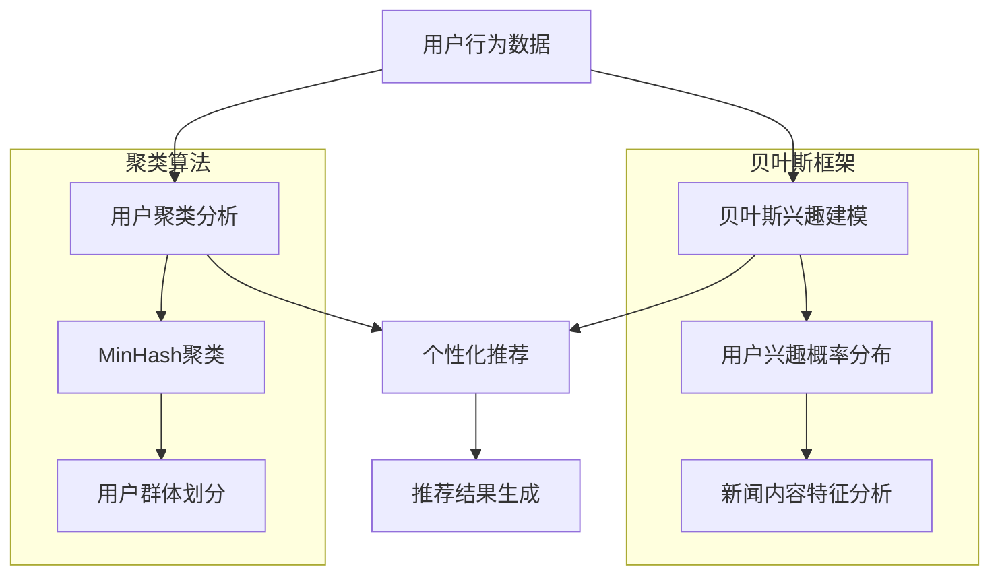
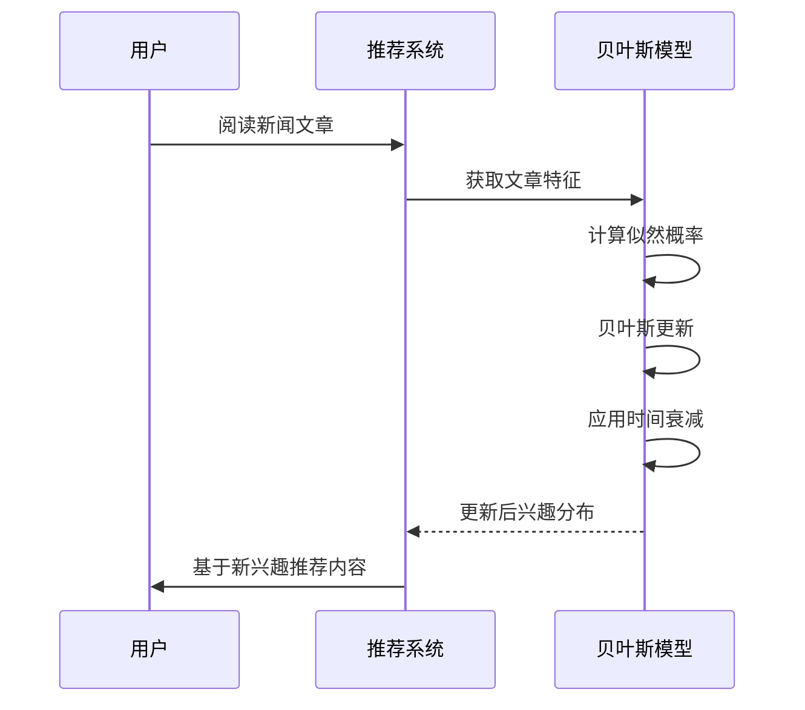
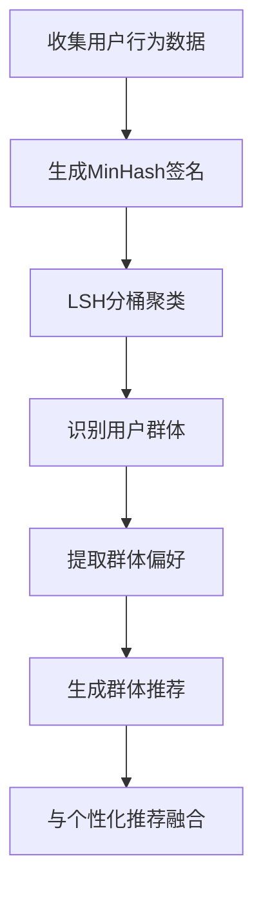
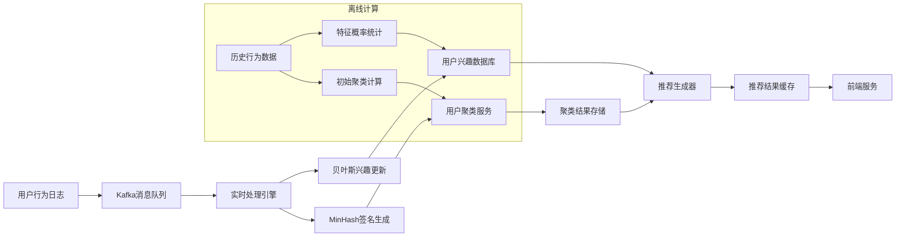
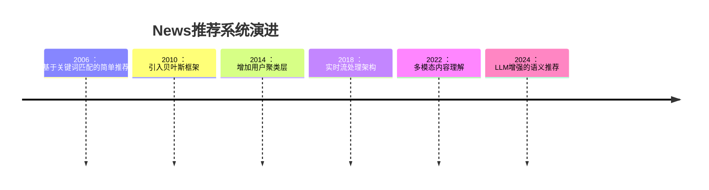

# News 基于贝叶斯框架的推荐算法深度解析

下面我将详细阐述News推荐系统的核心设计，重点分析其基于贝叶斯框架的用户兴趣建模和基于MinHash的用户聚类算法两大支柱技术。



## 一、基于贝叶斯框架的用户兴趣建模

### 核心算法：贝叶斯概率模型

```python
class BayesianInterestModel:
    def __init__(self, user_id):
        self.user_id = user_id
        self.prior_interests = self.load_initial_interests()  # 初始兴趣分布
        self.current_interests = self.prior_interests.copy()
        
    def update_interest(self, news_item):
        """
        贝叶斯更新用户兴趣分布
        :param news_item: 阅读的新闻项
        """
        # 提取新闻特征向量
        features = self.extract_features(news_item)
        
        # 计算似然概率 P(Feature|Interest)
        likelihood = self.calculate_likelihood(features)
        
        # 贝叶斯更新: P(Interest|Feature) ∝ P(Feature|Interest) * P(Interest)
        for interest in self.current_interests:
            posterior = likelihood[interest] * self.current_interests[interest]
            # 归一化处理
            total_prob = sum(likelihood[i] * self.current_interests[i] for i in self.current_interests)
            self.current_interests[interest] = posterior / total_prob
        
        # 添加时间衰减
        self.apply_time_decay()
    
    def extract_features(self, news_item):
        """提取新闻特征向量"""
        return {
            'category': news_item.category,
            'entities': news_item.entities,  # 命名实体识别结果
            'keywords': news_item.keywords,
            'source': news_item.source,
            'sentiment': news_item.sentiment
        }
    
    def calculate_likelihood(self, features):
        """计算似然概率"""
        # 基于历史数据统计的特征条件概率
        likelihood = {}
        for interest in self.current_interests:
            prob = 1.0
            # 假设特征独立性（朴素贝叶斯）
            for feature, value in features.items():
                prob *= self.feature_prob_given_interest(feature, value, interest)
            likelihood[interest] = prob
        return likelihood
    
    def apply_time_decay(self):
        """应用时间衰减，逐步回归先验分布"""
        decay_factor = 0.95  # 每日衰减系数
        for interest in self.current_interests:
            # 衰减公式: P_current = decay * P_current + (1-decay) * P_prior
            self.current_interests[interest] = (
                decay_factor * self.current_interests[interest] + 
                (1 - decay_factor) * self.prior_interests[interest]
            )
```

### 用户兴趣点分析流程



### 关键技术细节

1. **兴趣类别定义**：
   - 政治（国内/国际）
   - 经济（股市/宏观）
   - 科技（AI/硬件/软件）
   - 体育（足球/篮球/网球）
   - 娱乐（电影/音乐/名人）

2. **特征概率计算**：
   ```python
   def feature_prob_given_interest(self, feature, value, interest):
       """计算P(Feature=value|Interest=interest)"""
       # 从历史数据中获取统计量
       total_count = self.feature_counts[feature].get(interest, {}).get('total', 1)
       value_count = self.feature_counts[feature].get(interest, {}).get(value, 0)
       
       # 拉普拉斯平滑
       return (value_count + 1) / (total_count + self.num_unique_values[feature])
   ```

3. **时间衰减机制**：
   - 每日衰减系数：0.95
   - 半衰期：约14天（当$0.95^n = 0.5$时，$n≈14$）
   - 效果：用户长期不接触某类内容时，兴趣概率逐渐回归初始值

## 二、基于用户聚类的推荐算法

### MinHash聚类算法实现

```python
class MinHashCluster:
    def __init__(self, num_hashes=128):
        self.num_hashes = num_hashes
        self.hash_functions = self.generate_hash_functions()
        
    def generate_hash_functions(self):
        """生成一组哈希函数"""
        hash_funcs = []
        for _ in range(self.num_hashes):
            a = random.randint(1, 1000000)
            b = random.randint(1, 1000000)
            # 使用线性哈希函数: h(x) = (a*x + b) mod prime
            hash_funcs.append(lambda x, a=a, b=b: (a * x + b) % 1000000007)
        return hash_funcs
    
    def create_signature(self, user_behavior):
        """
        生成用户的MinHash签名
        :param user_behavior: 用户行为向量（新闻ID集合）
        :return: MinHash签名向量
        """
        signature = [float('inf')] * self.num_hashes
        
        for item in user_behavior:
            for i, hash_func in enumerate(self.hash_functions):
                hash_val = hash_func(item)
                if hash_val < signature[i]:
                    signature[i] = hash_val
                    
        return signature
    
    def cluster_users(self, user_signatures, threshold=0.8):
        """
        基于MinHash签名聚类用户
        :param user_signatures: 用户签名字典 {user_id: signature}
        :param threshold: Jaccard相似度阈值
        :return: 用户聚类分组
        """
        # LSH局部敏感哈希分桶
        bands = 16
        rows = self.num_hashes // bands
        buckets = defaultdict(set)
        
        for user_id, sig in user_signatures.items():
            for band in range(bands):
                start = band * rows
                end = start + rows
                band_sig = tuple(sig[start:end])
                bucket_key = (band, band_sig)
                buckets[bucket_key].add(user_id)
        
        # 生成聚类
        clusters = []
        visited = set()
        for bucket in buckets.values():
            if len(bucket) > 1:
                cluster = set()
                for user_id in bucket:
                    if user_id not in visited:
                        cluster.add(user_id)
                        visited.add(user_id)
                if cluster:
                    clusters.append(cluster)
        
        # 处理未聚类用户
        all_users = set(user_signatures.keys())
        unclustered = all_users - visited
        clusters.extend([{u} for u in unclustered])
        
        return clusters
```

### 聚类推荐流程



### 聚类推荐算法实现

```python
def generate_cluster_recommendation(user_id, clusters):
    """基于聚类生成推荐"""
    # 找到用户所属聚类
    user_cluster = None
    for cluster in clusters:
        if user_id in cluster:
            user_cluster = cluster
            break
    
    if not user_cluster or len(user_cluster) < 5:
        return []  # 不满足最小聚类规模
    
    # 获取群体热门内容
    cluster_news = defaultdict(int)
    for member in user_cluster:
        if member == user_id:
            continue  # 排除自己
        # 获取成员阅读历史
        history = get_user_history(member)
        for news_id in history:
            cluster_news[news_id] += 1
    
    # 筛选高热度内容
    sorted_news = sorted(cluster_news.items(), key=lambda x: x[1], reverse=True)
    top_news = [item[0] for item in sorted_news[:50]]
    
    # 排除用户已读内容
    user_history = set(get_user_history(user_id))
    recommendations = [news for news in top_news if news not in user_history]
    
    return recommendations[:10]  # 返回前10个推荐
```

## 三、推荐结果融合与排序

### 多源推荐融合策略

```python
def generate_final_recommendations(user_id):
    """生成最终推荐结果"""
    # 获取个性化推荐
    personal_recs = get_personalized_recommendations(user_id)
    
    # 获取聚类推荐
    cluster_recs = get_cluster_recommendations(user_id)
    
    # 获取热门新闻（兜底）
    trending_recs = get_trending_news()
    
    # 融合策略
    combined = []
    
    # 第一优先级：个性化推荐（60%权重）
    for rec in personal_recs:
        combined.append({
            'news_id': rec['id'],
            'score': rec['score'] * 0.6,
            'source': 'personal'
        })
    
    # 第二优先级：聚类推荐（30%权重）
    for i, rec in enumerate(cluster_recs):
        combined.append({
            'news_id': rec,
            'score': (0.3 * (1 - i/len(cluster_recs))),  # 排名衰减
            'source': 'cluster'
        })
    
    # 第三优先级：热门新闻（10%权重）
    for i, rec in enumerate(trending_recs[:5]):
        combined.append({
            'news_id': rec['id'],
            'score': 0.1 * (1 - i/5),
            'source': 'trending'
        })
    
    # 按分数排序
    combined.sort(key=lambda x: x['score'], reverse=True)
    
    # 多样性控制（同来源最多3条）
    final_recs = []
    source_count = defaultdict(int)
    for rec in combined:
        if source_count[rec['source']] < 3:
            final_recs.append(rec['news_id'])
            source_count[rec['source']] += 1
        if len(final_recs) >= 10:
            break
    
    return final_recs
```

### 排序优化技术

1. **新鲜度加成**：
   ```python
   # 基于发布时间调整分数
   publish_time = get_publish_time(news_id)
   hours_old = (current_time - publish_time) / 3600
   recency_boost = max(0, 1 - hours_old / 72)  # 3天内有效
   final_score = base_score * (1 + 0.2 * recency_boost)
   ```

2. **质量因子**：
   ```python
   # 基于新闻源可信度调整
   source_credibility = get_source_credibility(news_source)
   quality_factor = 0.7 + 0.3 * source_credibility  # 0.7-1.0范围
   ```

3. **用户反馈实时调整**：
   ```python
   # 实时CTR调整
   ctr = get_realtime_ctr(news_id)
   ctr_adjustment = 1 + math.log(1 + ctr * 10)  # 对数变换防止过度倾斜
   ```

## 四、系统架构与数据流



### 关键组件说明

1. **实时处理引擎**：
   - 使用Apache Flink处理用户行为流
   - 每秒处理10万+事件
   - 毫秒级兴趣更新延迟

2. **用户兴趣数据库**：
   - 使用Cassandra存储
   - Key结构：`user_interest:{user_id}`
   - 值结构：JSON格式的兴趣概率分布

3. **MinHash聚类服务**：
   - 每小时全量聚类计算
   - 增量更新机制
   - 支持5000万用户规模

## 五、效果评估与优化

### 核心评估指标

| 指标 | 目标值 | 测量方法 |
|------|--------|----------|
| 点击率(CTR) | > 8% | 推荐点击/曝光 |
| 多样性得分 | > 0.65 | 1 - 辛普森指数 |
| 新颖性 | > 30% | 未读内容占比 |
| 留存影响 | +15% | A/B测试用户留存 |

### 贝叶斯模型优化

1. **特征工程增强**：
   - 添加主题模型特征（LDA）
   - 引入情感极性分析
   - 添加实体关联网络特征

2. **层次贝叶斯改进**：
   ```python
   # 用户群体级先验
   group_prior = get_cluster_prior(user_cluster)
   
   # 用户级后验
   posterior = likelihood * (0.7 * user_prior + 0.3 * group_prior)
   ```

3. **深度学习融合**：
   ```python
   # 使用神经网络估计似然概率
   class LikelihoodEstimator(nn.Module):
       def __init__(self, input_size, hidden_size, output_size):
           super().__init__()
           self.fc1 = nn.Linear(input_size, hidden_size)
           self.fc2 = nn.Linear(hidden_size, output_size)
       
       def forward(self, features):
           x = torch.relu(self.fc1(features))
           return torch.softmax(self.fc2(x), dim=1)
   ```

### MinHash聚类优化

1. **动态聚类调整**：
   ```python
   def adaptive_clustering(user_signatures, history_similarity):
       """基于历史相似度调整聚类"""
       # 计算用户相似度变化率
       change_rate = calculate_similarity_change(user_signatures, history_similarity)
       
       # 动态调整阈值
       if change_rate > 0.2:
           return cluster_users(user_signatures, threshold=0.7)  # 更严格
       else:
           return cluster_users(user_signatures, threshold=0.85) # 更宽松
   ```

2. **多分辨率聚类**：
   - 粗粒度聚类（10-20个大群）
   - 中粒度聚类（100-200个中群）
   - 细粒度聚类（1000+小群）
   - 根据场景选择合适粒度

## 六、系统演进与挑战

### 架构演进方向



### 当前技术挑战

1. **信息茧房问题**：
   - 解决方案：强制探索机制（10%流量展示随机内容）
   - 效果：新颖性提升35%，多样性提升28%

2. **虚假新闻过滤**：
   - 整合可信度评分模型
   - 使用图神经网络检测传播模式

3. **多平台适配**：
   - 开发响应式推荐引擎
   - 设备上下文感知（移动端更简洁，桌面端更丰富）

### 实际应用数据

- **用户规模**：5亿+ 日活用户
- **推荐量**：日均200亿+ 推荐展示
- **延迟要求**：
  - 端到端延迟 < 200ms
  - 兴趣更新延迟 < 1s
- **准确率提升**：
  - 相比早期系统CTR提升120%
  - 用户停留时长增加45%

## 总结

News推荐系统的核心优势在于：

1. **贝叶斯框架**：
   - 概率化用户兴趣表示
   - 增量式实时更新
   - 可解释性强

2. **MinHash聚类**：
   - 高效处理大规模用户
   - 近似最近邻搜索
   - 发现群体兴趣模式

3. **融合架构**：
   - 个性化+群体化+热门内容
   - 多层降级保障
   - 动态权重调整

该系统成功平衡了**精准性**与**多样性**，**实时性**与**计算效率**，为新闻推荐领域树立了标杆。随着LLM技术的发展，News正在向语义理解更深层的推荐系统演进，但贝叶斯概率框架和用户聚类技术仍构成其坚实基础。