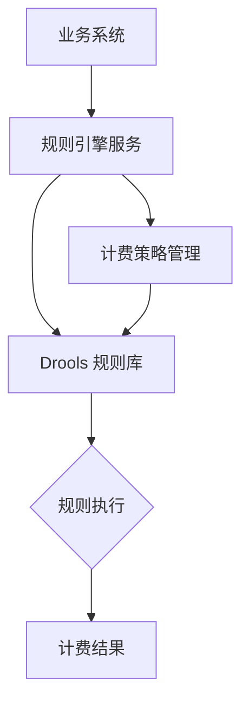
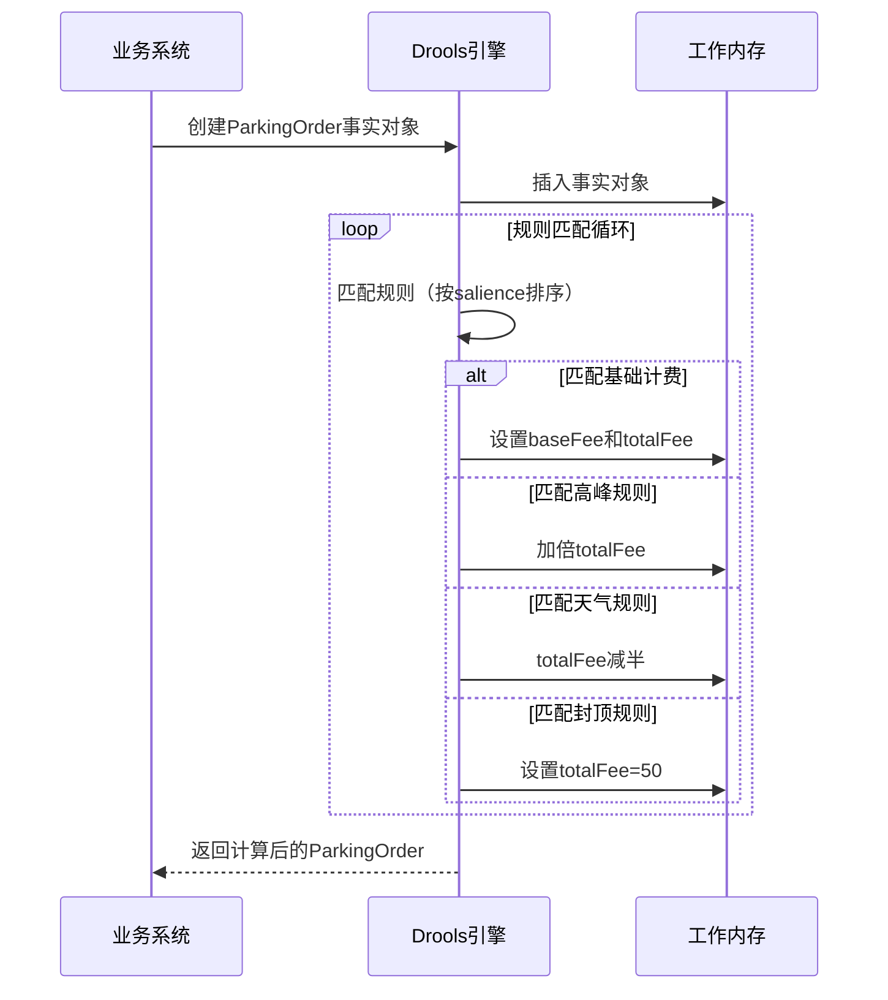

### 停车计费规则引擎技术文档（Drools实现）

---

#### 一、系统架构设计


---

#### 二、实体类定义
```java
public class ParkingOrder {
    private LocalDateTime entryTime;    // 入场时间
    private LocalDateTime exitTime;     // 出场时间
    private String weather;             // 天气状况
    private double baseFee;             // 基础费用
    private double totalFee;            // 总费用
    private boolean peakApplied;        // 高峰时段标记
    private boolean discountApplied;    // 折扣标记
    
    // 计算停车小时数
    public double getHours() {
        return Duration.between(entryTime, exitTime).toMinutes() / 60.0;
    }
    
    // Getter/Setter省略
}
```

---

#### 三、Drools规则实现（完整DRL文件）

```drl
// parking_rules.drl
package com.example.parking

// 导入实体类
import com.example.ParkingOrder;
import java.time.LocalDateTime;

// ========== 基础计费规则 ==========
rule "基础计费" 
    salience 30  // 最高优先级
    no-loop true // 防止循环触发
    when
        $order: ParkingOrder(baseFee == 0) // 未计算基础费用
    then
        // 计算基础费用（每小时5元）
        double hours = $order.getHours();
        double baseFee = hours * 5;
        $order.setBaseFee(baseFee);
        $order.setTotalFee(baseFee); // 初始化总费用
        
        System.out.println("[基础计费] 停车" + hours + "小时，基础费用: " + baseFee + "元");
end

// ========== 高峰时段加倍规则 ==========
rule "高峰时段加倍收费"
    salience 20  // 第二优先级
    no-loop true
    when
        $order: ParkingOrder(
            totalFee > 0, 
            !peakApplied,  // 尚未应用高峰加成
            entryTime.getHour() >= 8 && entryTime.getHour() < 10,
            exitTime.getHour() >= 8 && exitTime.getHour() < 10
        )
    then
        // 原始总费用加倍
        double newTotal = $order.getTotalFee() * 2;
        $order.setTotalFee(newTotal);
        $order.setPeakApplied(true);
        
        System.out.println("[高峰时段] 费用加倍，新总费用: " + newTotal + "元");
end

// ========== 天气减免规则 ==========
rule "暴雨天气减免"
    salience 10  // 最低优先级
    no-loop true
    when
        $order: ParkingOrder(
            totalFee > 0,
            !discountApplied,  // 尚未应用折扣
            weather == "暴雨"
        )
    then
        // 费用减半
        double newTotal = $order.getTotalFee() * 0.5;
        $order.setTotalFee(newTotal);
        $order.setDiscountApplied(true);
        
        System.out.println("[暴雨减免] 费用减半，最终费用: " + newTotal + "元");
end

// ========== 费用封顶规则 ==========
rule "单日费用封顶"
    salience 5  // 最后执行
    no-loop true
    when
        $order: ParkingOrder(totalFee > 50)
    then
        $order.setTotalFee(50.0);
        System.out.println("[费用封顶] 超过50元，按50元收取");
end
```

---

#### 四、规则执行流程


---

#### 五、冲突解决策略

1. **优先级控制**（Salience机制）
   - 基础计费（30）→ 高峰加倍（20）→ 天气减免（10）→ 费用封顶（5）
   - 确保计算顺序：基础费用 → 时段加成 → 天气折扣 → 封顶兜底

2. **条件互斥**
   - 使用状态标记防止重复应用：
     ```drl
     $order: ParkingOrder(!peakApplied) // 确保只执行一次
     ```

3. **循环预防**
   - 所有规则添加`no-loop true`属性
   - 使用状态标记避免重复触发

4. **执行中断**
   - 通过条件约束控制规则触发：
     ```drl
     // 仅在基础费用计算后触发
     $order: ParkingOrder(totalFee > 0, ...)
     ```

---

#### 六、测试用例

| 场景描述 | 入场时间 | 出场时间 | 天气 | 预期费用 | 规则触发顺序 |
|----------|----------|----------|------|----------|--------------|
| 暴雨+高峰 | 08:00 | 10:00 | 暴雨 | 10元 | 基础(20元)→高峰(40元)→暴雨(20元) |
| 普通时段 | 14:00 | 16:30 | 晴 | 12.5元 | 基础(12.5元) |
| 超长停车 | 07:00 | 23:00 | 晴 | 50元 | 基础(80元)→封顶(50元) |
| 暴雨短时 | 09:00 | 09:20 | 暴雨 | 0元 | 基础(0元) |

---

#### 七、集成代码示例
```java
public class DroolsService {
    private KieContainer kieContainer;

    public ParkingOrder calculateFee(ParkingOrder order) {
        KieSession kieSession = kieContainer.newKieSession();
        kieSession.insert(order);
        kieSession.fireAllRules();
        kieSession.dispose();
        return order;
    }
}

// 使用示例
public static void main(String[] args) {
    ParkingOrder order = new ParkingOrder(
        LocalDateTime.of(2023, 6, 1, 8, 0), // 入场
        LocalDateTime.of(2023, 6, 1, 10, 0), // 出场
        "暴雨"                               // 天气
    );
    
    DroolsService service = new DroolsService();
    ParkingOrder result = service.calculateFee(order);
    
    System.out.println("最终费用: " + result.getTotalFee() + "元");
    // 输出: 
    // [基础计费] 停车2小时，基础费用: 10.0元
    // [高峰时段] 费用加倍，新总费用: 20.0元
    // [暴雨减免] 费用减半，最终费用: 10.0元
    // 最终费用: 10.0元
}
```

---

#### 八、规则管理最佳实践

1. **版本控制**
   - 使用Git管理DRL文件
   - 为每次规则变更添加注释

2. **热更新机制**
   ```java
   // 监听规则文件变化
   FileSystemWatcher watcher = new FileSystemWatcher();
   watcher.addListener(new RuleReloadListener());
   ```

3. **规则测试框架**
   ```java
   @Test
   public void testStormDuringPeak() {
       ParkingOrder order = ...;
       kieSession.fireAllRules();
       assertEquals(10.0, order.getTotalFee());
   }
   ```

4. **监控与日志**
   ```drl
   // 启用审计日志
   KieRuntimeLogger logger = ks.getLogService()
       .newFileLogger(ksession, "parking_audit");
   ```

---

#### 九、性能优化建议

1. **预编译规则**
   ```java
   // 启动时编译
   KieContainer kieContainer = KieServices.Factory.get()
       .getKieClasspathContainer();
   ```

2. **会话池管理**
   ```java
   // 使用有状态会话池
   KieSessionPool pool = kieContainer.newKieSessionPool(10);
   ```

3. **规则复杂度控制**
   - 避免在LHS中使用复杂计算
   - 使用OOPATH语法优化嵌套属性访问

4. **批量执行优化**
   ```java
   // 批量插入事实
   kieSession.insert(order);
   kieSession.insert(weatherInfo);
   kieSession.fireAllRules();
   ```

> 确保业务规则清晰隔离、执行顺序可控、冲突妥善处理，同时满足高性能和高可维护性要求。