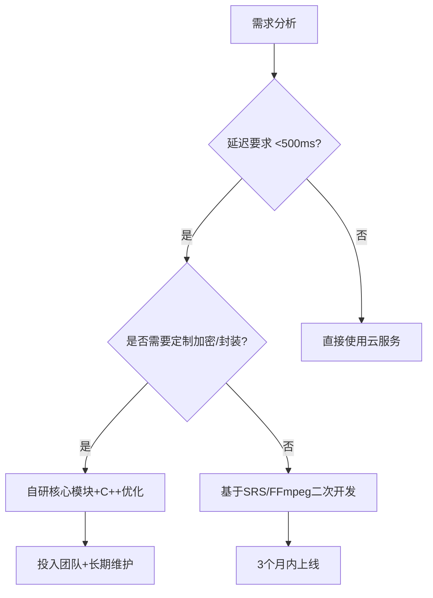

以下是关于使用C++自研直播系统的技术可行性与行业现状的分析，结合当前技术趋势和实际场景需求：

---

### **一、自研直播系统的现状与挑战**
#### **1. 行业趋势**
- **主流选择**：目前大多数企业更倾向于使用**云服务商方案**（如阿里云直播、腾讯云直播）或**开源框架**（如SRS、Nginx-rtmp-module），而非从零实现底层协议。
- **自研场景**：仅在以下情况会考虑自研：
  - 对性能/延迟有极端要求（如军工级实时直播）。
  - 需要深度定制协议或加密逻辑（如金融/医疗私有化部署）。
  - 技术栈必须完全自主可控（避免开源协议的法律风险）。

#### **2. 自研核心模块的复杂度**
- **RTMP协议栈**：
  - 需实现握手、分块（Chunking）、消息组装、AMF编解码等。
  - 难点：处理TCP粘包、时间戳同步、错误恢复逻辑。
- **GOP管理**：
  - 需维护关键帧（I帧）间隔，确保拉流端快速起播和随机seek。
  - 动态调整GOP长度以平衡延迟与容错能力。
- **实时流管理**：
  - 流状态跟踪（推流/断流）、多路流聚合、QoS监控。
- **包解析与封装**：
  - 支持FLV、HLS、DASH等格式，涉及音视频同步、时间戳对齐。

#### **3. 自研 vs 开源方案对比**
| **模块**       | **自研（C++）**                          | **开源方案（如SRS/OBS）**             |
|----------------|-----------------------------------------|--------------------------------------|
| RTMP协议栈      | 完全可控，可优化性能，但开发周期6个月+     | 直接集成，支持标准协议，1周内完成对接 |
| 流媒体服务器    | 需实现集群管理、CDN联动，代码量10万行+     | 开源服务器已支持分布式部署             |
| 运维成本        | 需专职团队维护，年成本$500k+              | 社区支持+商业托管，年成本$50k以下      |

---

### **二、自研直播系统的典型场景**
#### **1. 必须自研的场景**
- **超低延迟需求**：  
  - 例如远程手术直播（要求端到端延迟<200ms），需优化协议栈（如基于UDP的私有协议）。
- **特殊硬件适配**：  
  - 定制摄像头/传感器数据直传，需实现非标封装格式。
- **强安全要求**：  
  - 自研国密算法加密传输链路，替代标准RTMP/FLV。

#### **2. 无需自研的场景**
- **通用直播业务**：  
  - 使用FFmpeg+开源服务器（如SRS）即可满足99%需求。
- **快速上线**：  
  - 直接调用云服务API（如AWS MediaLive），无需关心底层协议。

---

### **三、自研实现的技术路线（C++为例）**
#### **1. 核心模块实现**
```cpp
// 示例：简化的RTMP握手逻辑（C++伪代码）
void RTMPHandshake(Socket& socket) {
    // 发送C0+C1数据
    uint8_t c0c1[1537];
    generate_c0c1(c0c1);
    socket.send(c0c1, sizeof(c0c1));

    // 接收S0+S1+S2
    uint8_t s0s1s2[1536*2 + 1];
    socket.receive(s0s1s2, sizeof(s0s1s2));

    // 发送C2并完成握手
    uint8_t c2[1536];
    generate_c2(s0s1s2, c2);
    socket.send(c2, sizeof(c2));
}

// 示例：GOP缓存管理
class GopCache {
public:
    void add_frame(const AVFrame& frame) {
        if (frame.is_keyframe()) {
            cache_.clear(); // 遇到关键帧重置缓存
        }
        cache_.push_back(frame);
    }
private:
    std::list<AVFrame> cache_;
};
```

#### **2. 性能优化方向**
- **零拷贝设计**：  
  - 使用内存池管理音视频数据包，避免频繁内存分配。
- **SIMD加速**：  
  - 对H.264/H.265编码使用Intel AVX2指令集优化。
- **异步IO模型**：  
  - 基于epoll（Linux）或IOCP（Windows）实现高并发网络层。

#### **3. 必要依赖库**
- **网络层**：Boost.Asio或libevent。
- **编码/封装**：x264/x265 + FFmpeg libavformat。
- **协议解析**：手动实现或部分参考librtmp。

---

### **四、成本与风险分析**
| **成本类型**   | **自研方案**                              | **开源/云方案**                     |
|----------------|------------------------------------------|------------------------------------|
| 开发成本        | 3-5名C++工程师，1-2年开发周期，$1M+       | 1-2名工程师，1个月内集成，$50k以下   |
| 硬件成本        | 需自建服务器集群，首年$500k+              | 按流量付费，首年$100k以内           |
| 长期维护成本    | 每年至少$300k（协议更新/漏洞修复）         | 云服务商承担更新，年费$50k-$200k    |

**风险提示**：
1. **技术债务风险**：自研协议可能导致后续兼容性问题（如浏览器/播放器不支持）。
2. **人才依赖**：核心开发人员离职可能导致项目停滞。
3. **法规风险**：自研协议可能违反音视频行业标准（如MPEG-LA专利问题）。

---

### **五、建议决策路径**


---

### **六、替代方案推荐**
1. **折中方案**：  
   - 基于**开源服务器（如SRS）** 二次开发，仅修改关键模块（如GOP管理）。
2. **混合架构**：  
   - 推流端使用OBS（开源），服务器端自研管理后台。
3. **云原生方案**：  
   - 使用AWS Elemental MediaLive + MediaPackage，完全避免底层开发。

---

若您的场景需要自研，建议从**RTMP协议栈**和**GOP缓存**模块开始验证可行性，同时评估团队技术储备。