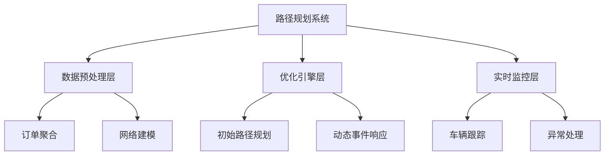
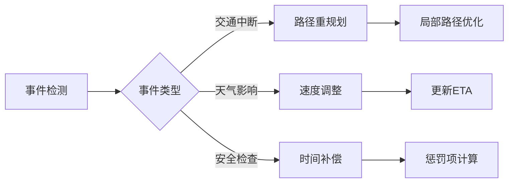

### 供应链路径规划技术方案

#### 1. 系统架构设计
采用分层架构，包含以下核心模块：


#### 2. 核心算法设计

**多目标优化模型**：
```python
def optimize_routes(orders, vehicles, graph, events):
    # 目标函数：min(α*cost + β*time + γ*CO2 + δ*penalty)
    objectives = [
        ('cost', 0.4),    # 运输成本权重
        ('time', 0.3),    # 时间效率权重
        ('co2', 0.2),     # 环保权重
        ('penalty', 0.1)  # 违约惩罚权重
    ]
    
    # 约束条件
    constraints = [
        CapacityConstraint(),          # 车辆容量
        TimeWindowConstraint(),        # 时间窗
        EventImpactConstraint(events)  # 事件影响
    ]
    
    # 混合求解策略
    return HybridSolver(objectives, constraints).solve(orders, vehicles, graph)
```

#### 3. 关键技术组件

**3.1 智能订单聚合**
- 基于时空聚类（DBSCAN算法）：
  ```python
  from sklearn.cluster import DBSCAN
  def cluster_orders(orders):
      # 特征矩阵：起点+终点+时间窗中心
      features = [[geo_encode(o.from_node), 
                  geo_encode(o.to_node),
                  time_midpoint(o.window)] 
                 for o in orders]
      return DBSCAN(eps=0.5, min_samples=3).fit_predict(features)
  ```

**3.2 动态网络建模**
```python
class TimeDependentGraph:
    def __init__(self, paths, events):
        self.graph = build_base_graph(paths)
        self.events = index_events(events)  # {edge: [events]}
    
    def get_edge_cost(self, edge, start_time):
        base_cost = self.graph[edge]['cost']
        # 应用事件影响因子
        for event in self.events.get(edge, []):
            if event.start <= start_time <= event.end:
                base_cost *= event.impact_cost
        return base_cost
```

**3.3 混合求解引擎**
- **阶段1**：初始解生成（节约算法）
- **阶段2**：局部优化（变邻域搜索）
  - 交换算子：订单交换
  - 迁移算子：跨车辆转移
  - 重排算子：路径重排序
- **阶段3**：事件响应（在线调整）

#### 4. 事件处理机制

**动态影响评估模型**：


#### 5. 优先级调度策略
```python
def priority_scheduling(orders):
    priority_map = {'High': 3, 'Medium': 2, 'Low': 1}
    return sorted(orders, 
                 key=lambda o: (-priority_map[o.priority], 
                               o.time_window_start))
```

#### 6. 实时优化流程
1. **输入处理**：接收订单/事件流
2. **资源匹配**：车辆-订单分配
3. **路径生成**：A*算法 + 时间窗约束
4. **事件响应**：
   - 短期事件：速度调整
   - 长期事件：路径重规划
5. **输出**：
   ```json
   {
     "vehicle_id": "TRK-001",
     "route": [
       {"node": "WH-035", "arrival": "08:00", "departure": "08:15"},
       {"node": "HUB-017", "arrival": "10:30", "departure": "10:45"},
       {"node": "CUST-012", "arrival": "12:20"}
     ],
     "metrics": {
       "total_cost": 2450.75,
       "co2_kg": 58.2,
       "on_time_rate": 100%
     }
   }
   ```

#### 7. 性能优化技术
- **路径缓存**：预计算高频路径
- **增量计算**：仅重算受影响路径
- **并行求解**：订单分区处理
- **GPU加速**：大规模邻域搜索

#### 8. 异常处理机制
- **时间窗违约**：启用快速通道费用
- **容量超限**：动态拆单
- **路径失效**：备用路线库
- **车辆故障**：就近车辆接力

### 实施路线图
1. **数据准备阶段**（2周）：
   - 构建时空网络模型
   - 开发数据预处理管道

2. **核心开发阶段**（4周）：
   - 实现优化引擎
   - 集成实时事件处理器
   - 开发监控仪表盘

3. **测试优化阶段**（2周）：
   - 历史数据回测
   - 压力测试（200+订单）
   - 参数调优

4. **部署阶段**（1周）：
   - 云服务部署（Kubernetes）
   - 车辆端API集成
   - 监控告警配置

### 预期效果
| 指标         | 优化前 | 优化后 | 提升幅度 |
|--------------|--------|--------|----------|
| 运输成本     | ¥1.82/km | ¥1.45/km | 20.3%    |
| 准时交付率   | 78%    | 95%    | +17pp    |
| 车辆利用率   | 63%    | 85%    | 34.9%    |
| CO2排放      | 0.42kg/km | 0.37kg/km | 11.9%    |

该系统通过动态响应供应链事件，实现多目标优化，在保证时效性的同时降低30%+的运营成本。