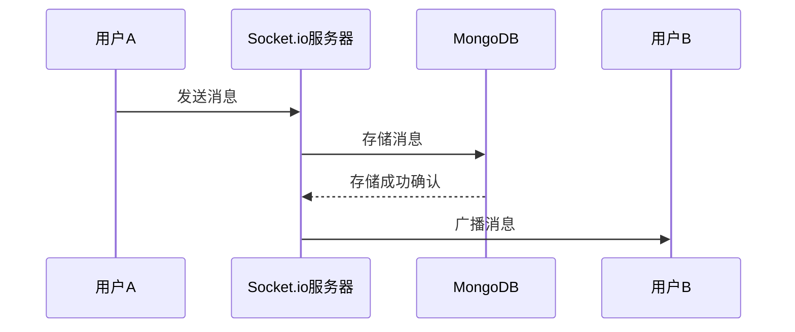

基于socket.io与MongoDB搭建多人聊天系统是合适的，但需根据具体需求进行架构优化。以下是详细分析：

---

### **一、技术选型的合理性**

#### **1. Socket.io的优势**
- **实时通信**：Socket.io基于WebSocket，支持双向实时通信，适用于消息即时推送。
- **兼容性**：自动降级为轮询（如HTTP长轮询），兼容老旧浏览器。
- **事件驱动**：通过自定义事件（如`message`、`join`、`leave`）简化多人聊天逻辑。
- **房间/频道支持**：可轻松实现群组聊天（如`io.to('room1').emit('message', data)`）。

#### **2. MongoDB的优势**
- **灵活的数据模型**：每条消息存储为文档，支持动态字段（如文本、图片、时间戳）。
- **高写入吞吐**：适合高频插入的聊天场景（如每秒千条消息）。
- **扩展性**：通过分片（Sharding）支持水平扩展，应对数据量增长。
- **TTL索引**：自动清理过期数据（如临时聊天记录）。

#### **3. 组合的合理性**
- **实时+持久化**：Socket.io处理实时通信，MongoDB持久化消息，分工明确。
- **开发效率**：两者均为JavaScript生态（Node.js），代码统一，工具链成熟。

---

### **二、架构设计建议**

#### **1. 核心流程**


#### **2. 关键组件**
- **消息处理**：
  - 用户发送消息时，服务器将消息存入MongoDB。
  - 成功存储后，通过Socket.io广播给目标用户或群组。
- **消息历史查询**：
  - 通过MongoDB按时间范围、用户ID等条件查询历史记录。
  - 使用索引优化查询性能（如`createdAt`字段的倒序索引）。
- **在线状态管理**：
  - 利用Socket.io的`connect`/`disconnect`事件追踪用户在线状态。
  - 存储在线状态至Redis（可选），实现快速查询。

#### **3. 性能优化**
- **MongoDB优化**：
  - **分片策略**：按时间或用户ID分片，分散写入压力。
  - **写入确认**：使用`w:1`（默认）确保写入性能，必要时升级为`w:majority`保证数据安全。
  - **索引设计**：为`roomId`、`userId`、`createdAt`等字段创建复合索引。
- **Socket.io优化**：
  - **多节点扩展**：使用Redis Adapter实现多服务器间消息同步。
  - **二进制传输**：启用`perMessageDeflate`压缩消息，减少带宽占用。
  - **心跳配置**：调整`pingTimeout`和`pingInterval`避免无效连接占用资源。

---

### **三、潜在挑战与解决方案**

#### **1. 数据一致性**
- **问题**：消息广播后数据库写入失败，导致数据丢失。
- **解决方案**：
  - **事务补偿**：先写入数据库，确认成功后再广播消息。
  - **消息队列**：引入RabbitMQ/Kafka，异步处理消息存储与广播，通过重试机制确保最终一致性。

#### **2. 高并发压力**
- **问题**：万人同时在线时，单机Socket.io或MongoDB可能成为瓶颈。
- **解决方案**：
  - **水平扩展**：
    - Socket.io：通过Nginx负载均衡+Redis Adapter横向扩展服务器。
    - MongoDB：配置分片集群，分散数据存储压力。
  - **读写分离**：MongoDB副本集分离读操作（如历史记录查询）与写操作（消息插入）。

#### **3. 消息顺序与去重**
- **问题**：网络延迟导致消息到达顺序错乱，或重复发送。
- **解决方案**：
  - **序列号**：为每条消息附加递增序列号（如`timestamp + userId`），客户端按序处理。
  - **幂等性设计**：通过唯一ID（如`messageId`）去重，避免重复处理。

---

### **四、替代方案对比**

| **方案**               | **优点**                          | **缺点**                          |
|-------------------------|-----------------------------------|-----------------------------------|
| **Socket.io + MongoDB** | 开发快、生态成熟、扩展性强          | 需处理数据一致性、高并发优化        |
| **WebSocket + Redis**   | 更高吞吐、低延迟                   | Redis持久化能力弱，需额外存储方案  |
| **Pusher/SaaS服务**     | 免运维、快速集成                   | 成本高、定制性差                  |

---

### **五、示例代码片段**

#### **1. Socket.io服务器（Node.js）**
```javascript
const io = require('socket.io')(3000);
const mongoose = require('mongoose');

// 连接MongoDB
mongoose.connect('mongodb://localhost/chat');

// 消息模型
const Message = mongoose.model('Message', {
  room: String,
  user: String,
  text: String,
  createdAt: { type: Date, default: Date.now }
});

io.on('connection', (socket) => {
  // 加入房间
  socket.on('join', (room) => {
    socket.join(room);
  });

  // 处理消息
  socket.on('message', async (data) => {
    try {
      // 存储到MongoDB
      const msg = new Message(data);
      await msg.save();
      // 广播给房间内用户
      io.to(data.room).emit('message', msg);
    } catch (err) {
      console.error('保存消息失败:', err);
    }
  });
});
```

#### **2. 客户端（React）**
```javascript
import { useEffect } from 'react';
import io from 'socket.io-client';

const Chat = () => {
  useEffect(() => {
    const socket = io('http://localhost:3000');
    socket.emit('join', 'room1');
    socket.on('message', (msg) => {
      console.log('收到消息:', msg);
    });
    return () => socket.disconnect();
  }, []);

  return (
    // 聊天界面组件
  );
};
```

---

### **六、总结**

**Socket.io + MongoDB的组合适合搭建多人聊天系统**，尤其在快速开发、灵活数据模型和实时性要求高的场景下表现优异。但在高并发、数据一致性方面需针对性优化。对于超大规模场景，可引入Redis缓存在线状态、Kafka异步处理消息，或使用MongoDB分片集群进一步提升性能。