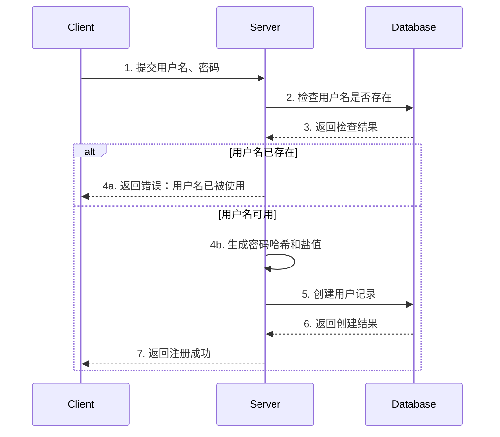
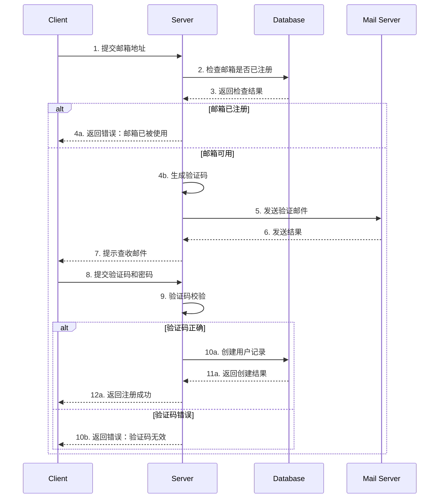
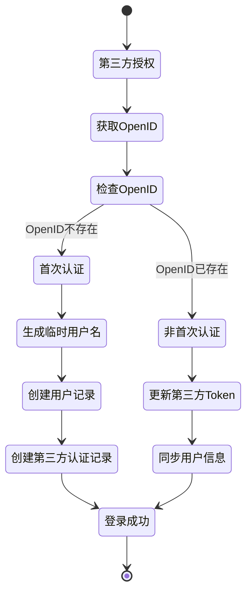

# 用户认证流程设计文档 V1

## 1. 注册流程设计

### 1.1 普通注册流程


### 1.2 邮箱注册流程


### 1.3 第三方注册/登录流程


## 2. 第三方登录实现细节

### 2.1 用户名生成规则
1. **临时用户名格式**：
   ```
   {platform}_{random_number}
   示例：wechat_38472、qq_95731
   ```

2. **生成算法**：
   ```python
   def generate_username(platform):
       while True:
           # 生成5位随机数
           random_num = random.randint(10000, 99999)
           username = f"{platform}_{random_num}"
           # 检查用户名是否已存在
           if not User.query.filter_by(username=username).first():
               return username
   ```

3. **用户名修改机制**：
   - 用户可在首次登录后修改用户名
   - 修改时需检查新用户名唯一性
   - 每个用户仅允许修改一次用户名

### 2.2 首次认证流程
1. **信息获取**：
   - 获取平台返回的OpenID和用户基础信息
   - 记录原始昵称(nickname)用于显示
   - 获取头像URL并下载保存

2. **账号创建**：
   ```sql
   -- 1. 创建用户记录
   INSERT INTO users (
       username,
       avatar_path,
       register_source
   ) VALUES (
       'wechat_38472',  -- 生成的临时用户名
       '/uploads/avatars/wechat_38472.jpg',
       'wechat'
   );

   -- 2. 创建第三方认证记录
   INSERT INTO third_party_auths (
       user_id,
       platform,
       open_id,
       nickname,
       avatar_url,
       access_token
   ) VALUES (
       1,  -- 用户ID
       'wechat',
       'wx_openid_123',
       '微信昵称',
       'http://xxx/avatar.jpg',
       'access_token_xxx'
   );
   ```

### 2.3 非首次认证流程
1. **Token更新**：
   ```sql
   UPDATE third_party_auths
   SET access_token = 'new_token',
       refresh_token = 'new_refresh_token',
       token_expires_at = datetime('now', '+2 hours'),
       updated_at = datetime('now')
   WHERE platform = 'wechat' AND open_id = 'wx_openid_123';
   ```

2. **信息同步**：
   - 同步用户昵称到nickname字段
   - 可选更新头像URL
   - 记录最后登录时间

### 2.4 nickname字段说明
1. **保留原因**：
   - 保存平台原始昵称，用于用户信息展示
   - 便于后续同步更新用户信息
   - 作为生成临时用户名的备选方案
   - **注意**：nickname和platform的组合不保证唯一性，因为第三方平台可能允许用户重名

2. **使用场景**：
   - 用户资料页显示"第三方账号昵称"
   - 未设置自定义用户名时的显示名称
   - 数据分析和用户行为追踪

3. **数据同步策略**：
   ```sql
   -- 每次登录更新nickname
   UPDATE third_party_auths
   SET nickname = '新的微信昵称',
       updated_at = datetime('now')
   WHERE platform = 'wechat' AND open_id = 'wx_openid_123';
   ```

## 3. 安全考虑

### 3.1 用户名安全
1. **限制规则**：
   - 长度：4-20个字符
   - 允许字符：字母、数字、下划线
   - 禁止纯数字
   - 保留用户名列表
   - 系统生成的临时用户名（格式为{platform}_{random_number}）禁止用于密码登录

2. **第三方注册用户特殊处理**：
   - 第三方注册的用户records中password_hash为空
   - 禁止使用系统生成的临时用户名进行密码登录
   - 用户使用临时用户名尝试密码登录时，返回提示信息："该账号为第三方平台注册，请使用对应的第三方平台登录"
   - 第三方注册用户必须通过对应的第三方平台或其他非密码方式（如手机号、邮箱）进行登录

2. **防重复机制**：
   - 数据库唯一索引
   - 临时用户名生成重试机制

### 3.2 第三方认证安全
1. **Token管理**：
   - access_token加密存储
   - 定期刷新机制
   - 失效处理

2. **账号绑定保护**：
   - 防止重复绑定
   - 解绑确认机制
   - 操作日志记录