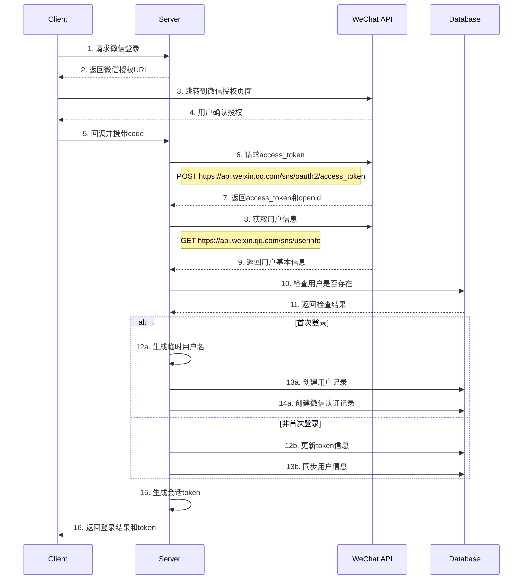
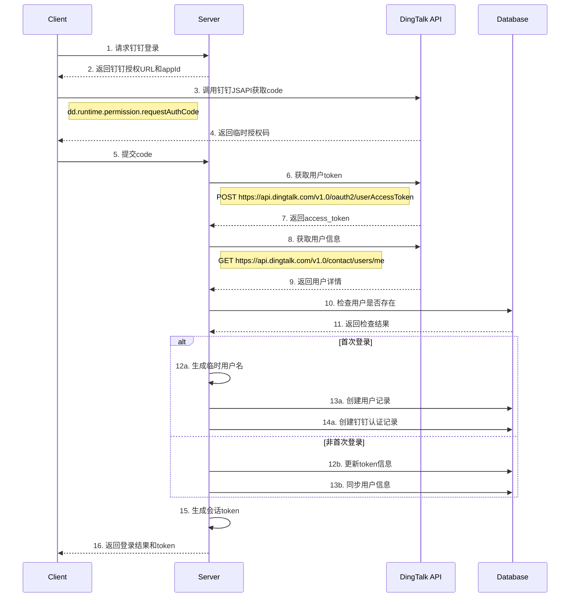

# 第三方登录流程详细设计文档 V2

## 1. 微信登录流程

### 1.1 授权流程


### 1.2 数据结构
```sql
-- 微信认证记录表
CREATE TABLE wechat_auths (
    id BIGINT PRIMARY KEY AUTO_INCREMENT,
    user_id BIGINT NOT NULL,
    open_id VARCHAR(64) NOT NULL UNIQUE,
    union_id VARCHAR(64),
    access_token VARCHAR(512) NOT NULL,
    refresh_token VARCHAR(512) NOT NULL,
    token_expires_at TIMESTAMP NOT NULL,
    scope VARCHAR(128),
    nickname VARCHAR(64),
    sex TINYINT,
    province VARCHAR(32),
    city VARCHAR(32),
    country VARCHAR(32),
    headimgurl VARCHAR(256),
    created_at TIMESTAMP NOT NULL DEFAULT CURRENT_TIMESTAMP,
    updated_at TIMESTAMP NOT NULL DEFAULT CURRENT_TIMESTAMP ON UPDATE CURRENT_TIMESTAMP,
    FOREIGN KEY (user_id) REFERENCES users(id)
);
```

### 1.3 接口说明

1. **获取access_token**
```typescript
interface WechatTokenResponse {
    access_token: string;    // 接口调用凭证
    expires_in: number;      // 凭证有效期，单位：秒
    refresh_token: string;   // 用户刷新access_token
    openid: string;         // 授权用户唯一标识
    scope: string;          // 用户授权的作用域
    unionid?: string;       // 用户在开放平台的唯一标识符
}

async function getWechatAccessToken(code: string): Promise<WechatTokenResponse> {
    const response = await axios.get('https://api.weixin.qq.com/sns/oauth2/access_token', {
        params: {
            appid: WECHAT_APP_ID,
            secret: WECHAT_APP_SECRET,
            code: code,
            grant_type: 'authorization_code'
        }
    });
    return response.data;
}
```

2. **获取用户信息**
```typescript
interface WechatUserInfo {
    openid: string;         // 用户的唯一标识
    nickname: string;       // 用户昵称
    sex: number;           // 用户的性别，值为1时是男性，值为2时是女性，值为0时是未知
    province: string;      // 用户个人资料填写的省份
    city: string;          // 普通用户个人资料填写的城市
    country: string;       // 国家，如中国为CN
    headimgurl: string;    // 用户头像
    privilege: string[];   // 用户特权信息
    unionid?: string;      // 只有在用户将公众号绑定到微信开放平台帐号后，才会出现该字段
}

async function getWechatUserInfo(accessToken: string, openid: string): Promise<WechatUserInfo> {
    const response = await axios.get('https://api.weixin.qq.com/sns/userinfo', {
        params: {
            access_token: accessToken,
            openid: openid,
            lang: 'zh_CN'
        }
    });
    return response.data;
}
```

## 2. 钉钉登录流程

### 2.1 授权流程


### 2.2 数据结构
```sql
-- 钉钉认证记录表
CREATE TABLE dingtalk_auths (
    id BIGINT PRIMARY KEY AUTO_INCREMENT,
    user_id BIGINT NOT NULL,
    unionid VARCHAR(64) NOT NULL UNIQUE,
    openid VARCHAR(64) NOT NULL UNIQUE,
    access_token VARCHAR(512) NOT NULL,
    refresh_token VARCHAR(512) NOT NULL,
    token_expires_at TIMESTAMP NOT NULL,
    nick VARCHAR(64),
    avatar_url VARCHAR(256),
    email VARCHAR(128),
    mobile VARCHAR(32),
    state_code VARCHAR(8),
    created_at TIMESTAMP NOT NULL DEFAULT CURRENT_TIMESTAMP,
    updated_at TIMESTAMP NOT NULL DEFAULT CURRENT_TIMESTAMP ON UPDATE CURRENT_TIMESTAMP,
    FOREIGN KEY (user_id) REFERENCES users(id)
);
```

### 2.3 接口说明

1. **获取access_token**
```typescript
interface DingTalkTokenResponse {
    accessToken: string;     // 用户访问令牌
    refreshToken: string;    // 刷新令牌
    expireIn: number;        // 过期时间，单位：秒
    corpId?: string;        // 企业ID（如果是企业内部应用）
}

async function getDingTalkAccessToken(code: string): Promise<DingTalkTokenResponse> {
    const response = await axios.post('https://api.dingtalk.com/v1.0/oauth2/userAccessToken', {
        clientId: DINGTALK_APP_KEY,
        clientSecret: DINGTALK_APP_SECRET,
        code: code,
        grantType: 'authorization_code'
    });
    return response.data;
}
```

2. **获取用户信息**
```typescript
interface DingTalkUserInfo {
    nick: string;           // 用户昵称
    avatarUrl: string;      // 头像URL
    openId: string;         // 用户在当前开放应用内的唯一标识
    unionId: string;        // 用户在当前开放平台账号范围内的唯一标识
    email?: string;         // 邮箱
    mobile?: string;        // 手机号
    stateCode?: string;     // 手机号对应的国家号
}

async function getDingTalkUserInfo(accessToken: string): Promise<DingTalkUserInfo> {
    const response = await axios.get('https://api.dingtalk.com/v1.0/contact/users/me', {
        headers: {
            'x-acs-dingtalk-access-token': accessToken
        }
    });
    return response.data;
}
```

## 3. Token管理策略

### 3.1 Token刷新机制
```typescript
interface TokenInfo {
    accessToken: string;
    refreshToken: string;
    expiresAt: Date;
}

class TokenManager {
    // 提前5分钟刷新token
    private static REFRESH_THRESHOLD = 5 * 60 * 1000;
    
    async shouldRefreshToken(tokenInfo: TokenInfo): boolean {
        const now = new Date();
        return tokenInfo.expiresAt.getTime() - now.getTime() < TokenManager.REFRESH_THRESHOLD;
    }
    
    async refreshWechatToken(refreshToken: string): Promise<TokenInfo> {
        const response = await axios.get('https://api.weixin.qq.com/sns/oauth2/refresh_token', {
            params: {
                appid: WECHAT_APP_ID,
                grant_type: 'refresh_token',
                refresh_token: refreshToken
            }
        });
        
        return {
            accessToken: response.data.access_token,
            refreshToken: response.data.refresh_token,
            expiresAt: new Date(Date.now() + response.data.expires_in * 1000)
        };
    }
    
    async refreshDingTalkToken(refreshToken: string): Promise<TokenInfo> {
        const response = await axios.post('https://api.dingtalk.com/v1.0/oauth2/refreshToken', {
            clientId: DINGTALK_APP_KEY,
            refreshToken: refreshToken,
            grantType: 'refresh_token'
        });
        
        return {
            accessToken: response.data.accessToken,
            refreshToken: response.data.refreshToken,
            expiresAt: new Date(Date.now() + response.data.expireIn * 1000)
        };
    }
}
```

### 3.2 Token存储安全
1. **加密存储**
```typescript
class TokenEncryption {
    private static readonly ALGORITHM = 'aes-256-gcm';
    private static readonly KEY_LENGTH = 32;
    private static readonly IV_LENGTH = 12;
    private static readonly AUTH_TAG_LENGTH = 16;
    
    private readonly key: Buffer;
    
    constructor(encryptionKey: string) {
        this.key = crypto.scryptSync(encryptionKey, 'salt', TokenEncryption.KEY_LENGTH);
    }
    
    encrypt(token: string): string {
        const iv = crypto.randomBytes(TokenEncryption.IV_LENGTH);
        const cipher = crypto.createCipheriv(
            TokenEncryption.ALGORITHM,
            this.key,
            iv,
            { authTagLength: TokenEncryption.AUTH_TAG_LENGTH }
        );
        
        const encrypted = Buffer.concat([
            cipher.update(token, 'utf8'),
            cipher.final()
        ]);
        
        const authTag = cipher.getAuthTag();
        
        return Buffer.concat([iv, authTag, encrypted]).toString('base64');
    }
    
    decrypt(encryptedToken: string): string {
        const data = Buffer.from(encryptedToken, 'base64');
        const iv = data.slice(0, TokenEncryption.IV_LENGTH);
        const authTag = data.slice(
            TokenEncryption.IV_LENGTH,
            TokenEncryption.IV_LENGTH + TokenEncryption.AUTH_TAG_LENGTH
        );
        const encrypted = data.slice(TokenEncryption.IV_LENGTH + TokenEncryption.AUTH_TAG_LENGTH);
        
        const decipher = crypto.createDecipheriv(
            TokenEncryption.ALGORITHM,
            this.key,
            iv,
            { authTagLength: TokenEncryption.AUTH_TAG_LENGTH }
        );
        decipher.setAuthTag(authTag);
        
        return (
            decipher.update(encrypted) +
            decipher.final('utf8')
        );
    }
}
```

2. **数据库字段加密**
```sql
-- 更新表结构，添加加密相关字段
ALTER TABLE wechat_auths
ADD COLUMN access_token_iv VARCHAR(24),
ADD COLUMN access_token_tag VARCHAR(32);

ALTER TABLE dingtalk_auths
ADD COLUMN access_token_iv VARCHAR(24),
ADD COLUMN access_token_tag VARCHAR(32);
```

## 4. 会话管理

### 4.1 会话Token生成