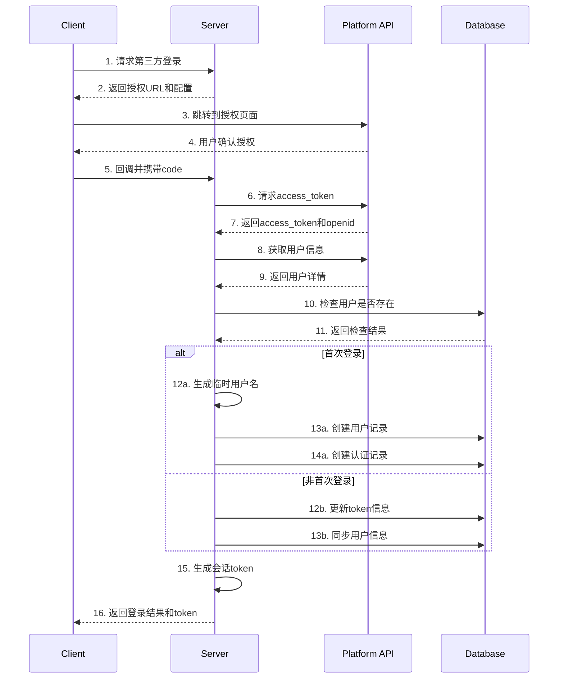

# 第三方登录流程详细设计文档 V3

## 1. 数据结构设计

### 1.1 统一认证表设计
```sql
-- 第三方认证记录表
CREATE TABLE third_party_auths (
    id BIGINT PRIMARY KEY AUTO_INCREMENT,
    user_id BIGINT NOT NULL,
    platform VARCHAR(32) NOT NULL,  -- 平台标识：wechat/dingtalk等
    open_id VARCHAR(64) NOT NULL,
    union_id VARCHAR(64),
    access_token VARCHAR(512) NOT NULL,
    refresh_token VARCHAR(512) NOT NULL,
    token_expires_at TIMESTAMP NOT NULL,
    scope VARCHAR(128),
    
    -- 用户基本信息
    nickname VARCHAR(64),
    avatar_url VARCHAR(256),
    gender TINYINT,  -- 0:未知 1:男 2:女
    
    -- 扩展信息
    province VARCHAR(32),
    city VARCHAR(32),
    country VARCHAR(32),
    email VARCHAR(128),
    mobile VARCHAR(32),
    state_code VARCHAR(8),  -- 手机号国家代码
    
    -- 安全相关
    access_token_iv VARCHAR(24),
    access_token_tag VARCHAR(32),
    
    created_at TIMESTAMP NOT NULL DEFAULT CURRENT_TIMESTAMP,
    updated_at TIMESTAMP NOT NULL DEFAULT CURRENT_TIMESTAMP ON UPDATE CURRENT_TIMESTAMP,
    
    FOREIGN KEY (user_id) REFERENCES users(id),
    UNIQUE KEY uk_platform_openid (platform, open_id)
);
```

### 1.2 字段说明
1. **基础字段**
   - `platform`: 平台标识，如'wechat'、'dingtalk'等
   - `open_id`: 用户在特定应用下的唯一标识
   - `union_id`: 用户在开放平台下的唯一标识
   - `access_token`: 访问令牌
   - `refresh_token`: 刷新令牌
   - `token_expires_at`: 令牌过期时间
   - `scope`: 授权范围

2. **用户信息字段**
   - `nickname`: 用户昵称
   - `avatar_url`: 头像地址
   - `gender`: 性别（0:未知 1:男 2:女）

3. **扩展信息字段**
   - `province`/`city`/`country`: 地理位置信息
   - `email`: 邮箱（部分平台可用）
   - `mobile`: 手机号（部分平台可用）
   - `state_code`: 手机号国家代码

4. **安全字段**
   - `access_token_iv`: 令牌加密向量
   - `access_token_tag`: 令牌认证标签

## 2. 认证流程

### 2.1 通用认证流程


### 2.2 平台适配器
```typescript
interface ThirdPartyPlatformAdapter {
    // 获取授权URL
    getAuthUrl(): string;
    
    // 获取访问令牌
    getAccessToken(code: string): Promise<{
        accessToken: string;
        refreshToken: string;
        openId: string;
        unionId?: string;
        expiresIn: number;
    }>;
    
    // 获取用户信息
    getUserInfo(accessToken: string, openId: string): Promise<{
        nickname: string;
        avatarUrl: string;
        gender: number;
        province?: string;
        city?: string;
        country?: string;
        email?: string;
        mobile?: string;
        stateCode?: string;
    }>;
    
    // 刷新访问令牌
    refreshToken(refreshToken: string): Promise<{
        accessToken: string;
        refreshToken: string;
        expiresIn: number;
    }>;
}

// 微信平台适配器
class WechatAdapter implements ThirdPartyPlatformAdapter {
    async getAccessToken(code: string) {
        const response = await axios.get('https://api.weixin.qq.com/sns/oauth2/access_token', {
            params: {
                appid: WECHAT_APP_ID,
                secret: WECHAT_APP_SECRET,
                code: code,
                grant_type: 'authorization_code'
            }
        });
        
        return {
            accessToken: response.data.access_token,
            refreshToken: response.data.refresh_token,
            openId: response.data.openid,
            unionId: response.data.unionid,
            expiresIn: response.data.expires_in
        };
    }
    
    // ... 其他方法实现
}

// 钉钉平台适配器
class DingTalkAdapter implements ThirdPartyPlatformAdapter {
    async getAccessToken(code: string) {
        const response = await axios.post('https://api.dingtalk.com/v1.0/oauth2/userAccessToken', {
            clientId: DINGTALK_APP_KEY,
            clientSecret: DINGTALK_APP_SECRET,
            code: code,
            grantType: 'authorization_code'
        });
        
        return {
            accessToken: response.data.accessToken,
            refreshToken: response.data.refreshToken,
            openId: response.data.openId,
            unionId: response.data.unionId,
            expiresIn: response.data.expireIn
        };
    }
    
    // ... 其他方法实现
}
```

## 3. 安全性考虑

### 3.1 Token加密存储
```typescript
class TokenEncryption {
    private static readonly ALGORITHM = 'aes-256-gcm';
    private static readonly KEY_LENGTH = 32;
    private static readonly IV_LENGTH = 12;
    private static readonly AUTH_TAG_LENGTH = 16;
    
    private readonly key: Buffer;
    
    constructor(encryptionKey: string) {
        this.key = crypto.scryptSync(encryptionKey, 'salt', TokenEncryption.KEY_LENGTH);
    }
    
    encrypt(token: string): {
        encryptedToken: string;
        iv: string;
        authTag: string;
    } {
        const iv = crypto.randomBytes(TokenEncryption.IV_LENGTH);
        const cipher = crypto.createCipheriv(
            TokenEncryption.ALGORITHM,
            this.key,
            iv,
            { authTagLength: TokenEncryption.AUTH_TAG_LENGTH }
        );
        
        const encrypted = Buffer.concat([
            cipher.update(token, 'utf8'),
            cipher.final()
        ]);
        
        const authTag = cipher.getAuthTag();
        
        return {
            encryptedToken: encrypted.toString('base64'),
            iv: iv.toString('base64'),
            authTag: authTag.toString('base64')
        };
    }
    
    decrypt(params: {
        encryptedToken: string;
        iv: string;
        authTag: string;
    }): string {
        const iv = Buffer.from(params.iv, 'base64');
        const authTag = Buffer.from(params.authTag, 'base64');
        const encrypted = Buffer.from(params.encryptedToken, 'base64');
        
        const decipher = crypto.createDecipheriv(
            TokenEncryption.ALGORITHM,
            this.key,
            iv,
            { authTagLength: TokenEncryption.AUTH_TAG_LENGTH }
        );
        decipher.setAuthTag(authTag);
        
        return (
            decipher.update(encrypted) +
            decipher.final('utf8')
        );
    }
}
```

### 3.2 Token管理
```typescript
class TokenManager {
    private static readonly REFRESH_THRESHOLD = 5 * 60 * 1000; // 5分钟
    private readonly encryption: TokenEncryption;
    
    constructor(encryptionKey: string) {
        this.encryption = new TokenEncryption(encryptionKey);
    }
    
    async storeToken(params: {
        userId: number;
        platform: string;
        accessToken: string;
        refreshToken: string;
        expiresIn: number;
    }) {
        const encrypted = this.encryption.encrypt(params.accessToken);
        
        await db.query(`
            UPDATE third_party_auths
            SET access_token = ?,
                refresh_token = ?,
                token_expires_at = ?,
                access_token_iv = ?,
                access_token_tag = ?
            WHERE user_id = ? AND platform = ?
        `, [
            encrypted.encryptedToken,
            params.refreshToken,
            new Date(Date.now() + params.expiresIn * 1000),
            encrypted.iv,
            encrypted.authTag,
            params.userId,
            params.platform
        ]);
    }
    
    async getToken(userId: number, platform: string): Promise<string> {
        const result = await db.query(`
            SELECT access_token, access_token_iv, access_token_tag
            FROM third_party_auths
            WHERE user_id = ? AND platform = ?
        `, [userId, platform]);
        
        if (!result.length) {
            throw new Error('Token not found');
        }
        
        return this.encryption.decrypt({
            encryptedToken: result[0].access_token,
            iv: result[0].access_token_iv,
            authTag: result[0].access_token_tag
        });
    }
    
    async shouldRefreshToken(userId: number, platform: string): boolean {
        const result = await db.query(`
            SELECT token_expires_at
            FROM third_party_auths
            WHERE user_id = ? AND platform = ?
        `, [userId, platform]);
        
        if (!result.length) {
            return false;
        }
        
        const expiresAt = new Date(result[0].token_expires_at);
        return expiresAt.getTime() - Date.now() < TokenManager.REFRESH_THRESHOLD;
    }
}
```