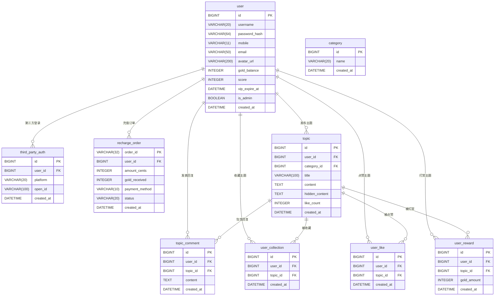

以下为基于需求的 **ER模型设计** 及 **SQLite初始化脚本**，涵盖核心数据表与约束关系：

---

## **一、ER模型设计**
### **核心实体关系图**


---

## **二、关键设计说明**
### **1. 用户表（`user`）**
- **核心字段**：  
  - `password_hash`：SHA-256 + 盐值加密后的密码  
  - `mobile`/`email`：唯一索引，允许为空（第三方登录用户可能不绑定）  
  - `vip_expire_at`：VIP到期时间，`NULL`表示非VIP  
  - `is_admin`：标记管理员身份  

### **2. 第三方登录表（`third_party_auth`）**
- **联合唯一索引**：`(platform, open_id)`，确保同一平台同一用户只能绑定一次  
- **平台类型**：`platform` 字段存储如 `wechat`/`qq`/`weibo`  

### **3. 充值订单表（`recharge_order`）**
- **金额存储**：`amount_cents` 以分为单位存储（避免浮点精度问题）  
- **金币计算**：`gold_received` 根据阶梯比例计算后实际发放的金币数  

### **4. 主题与互动表**
- **隐藏内容加密**：`topic.hidden_content` 建议服务端加密存储（如AES-256）  
- **点赞去重**：`user_like` 表通过 `(user_id, topic_id)` 唯一索引防止重复点赞  

---

## **三、SQLite初始化脚本**
```sql
-- 启用外键约束
PRAGMA foreign_keys = ON;

-- 用户表
CREATE TABLE user (
    id INTEGER PRIMARY KEY AUTOINCREMENT,
    username VARCHAR(20) NOT NULL UNIQUE,
    password_hash VARCHAR(64) NOT NULL,
    mobile VARCHAR(11) UNIQUE,
    email VARCHAR(50) UNIQUE,
    avatar_url VARCHAR(200) DEFAULT 'default_avatar.png',
    gold_balance INTEGER NOT NULL DEFAULT 0,
    score INTEGER NOT NULL DEFAULT 0,
    vip_expire_at DATETIME,
    is_admin BOOLEAN NOT NULL DEFAULT 0,
    created_at DATETIME NOT NULL DEFAULT CURRENT_TIMESTAMP
);

-- 第三方登录表
CREATE TABLE third_party_auth (
    id INTEGER PRIMARY KEY AUTOINCREMENT,
    user_id INTEGER NOT NULL,
    platform VARCHAR(20) NOT NULL,
    open_id VARCHAR(100) NOT NULL,
    created_at DATETIME NOT NULL DEFAULT CURRENT_TIMESTAMP,
    FOREIGN KEY (user_id) REFERENCES user(id),
    UNIQUE (platform, open_id)
);

-- 充值订单表
CREATE TABLE recharge_order (
    order_id VARCHAR(32) PRIMARY KEY,
    user_id INTEGER NOT NULL,
    amount_cents INTEGER NOT NULL,
    gold_received INTEGER NOT NULL,
    payment_method VARCHAR(10) NOT NULL CHECK(payment_method IN ('alipay', 'wechat')),
    status VARCHAR(20) NOT NULL DEFAULT 'pending' CHECK(status IN ('pending', 'success', 'failed')),
    created_at DATETIME NOT NULL DEFAULT CURRENT_TIMESTAMP,
    FOREIGN KEY (user_id) REFERENCES user(id)
);

-- 分类表
CREATE TABLE category (
    id INTEGER PRIMARY KEY AUTOINCREMENT,
    name VARCHAR(20) NOT NULL UNIQUE,
    created_at DATETIME NOT NULL DEFAULT CURRENT_TIMESTAMP
);

-- 主题表
CREATE TABLE topic (
    id INTEGER PRIMARY KEY AUTOINCREMENT,
    user_id INTEGER NOT NULL,
    category_id INTEGER NOT NULL,
    title VARCHAR(100) NOT NULL,
    content TEXT NOT NULL,
    hidden_content TEXT,
    like_count INTEGER NOT NULL DEFAULT 0,
    created_at DATETIME NOT NULL DEFAULT CURRENT_TIMESTAMP,
    FOREIGN KEY (user_id) REFERENCES user(id),
    FOREIGN KEY (category_id) REFERENCES category(id)
);

-- 主题回复表
CREATE TABLE topic_comment (
    id INTEGER PRIMARY KEY AUTOINCREMENT,
    user_id INTEGER NOT NULL,
    topic_id INTEGER NOT NULL,
    content TEXT NOT NULL,
    created_at DATETIME NOT NULL DEFAULT CURRENT_TIMESTAMP,
    FOREIGN KEY (user_id) REFERENCES user(id),
    FOREIGN KEY (topic_id) REFERENCES topic(id)
);

-- 用户收藏表
CREATE TABLE user_collection (
    id INTEGER PRIMARY KEY AUTOINCREMENT,
    user_id INTEGER NOT NULL,
    topic_id INTEGER NOT NULL,
    created_at DATETIME NOT NULL DEFAULT CURRENT_TIMESTAMP,
    FOREIGN KEY (user_id) REFERENCES user(id),
    FOREIGN KEY (topic_id) REFERENCES topic(id),
    UNIQUE (user_id, topic_id)
);

-- 用户点赞表
CREATE TABLE user_like (
    id INTEGER PRIMARY KEY AUTOINCREMENT,
    user_id INTEGER NOT NULL,
    topic_id INTEGER NOT NULL,
    created_at DATETIME NOT NULL DEFAULT CURRENT_TIMESTAMP,
    FOREIGN KEY (user_id) REFERENCES user(id),
    FOREIGN KEY (topic_id) REFERENCES topic(id),
    UNIQUE (user_id, topic_id)
);

-- 用户打赏表
CREATE TABLE user_reward (
    id INTEGER PRIMARY KEY AUTOINCREMENT,
    user_id INTEGER NOT NULL,
    topic_id INTEGER NOT NULL,
    gold_amount INTEGER NOT NULL,
    created_at DATETIME NOT NULL DEFAULT CURRENT_TIMESTAMP,
    FOREIGN KEY (user_id) REFERENCES user(id),
    FOREIGN KEY (topic_id) REFERENCES topic(id)
);

-- 初始化分类数据
INSERT INTO category (name) VALUES
    ('流行音乐'),
    ('古典音乐'),
    ('摇滚音乐'),
    ('电子音乐');
```

---

## **四、关键约束说明**
1. **唯一性约束**  
   - 用户表的 `username`、`mobile`、`email` 字段唯一  
   - 第三方登录的 `(platform, open_id)` 组合唯一  

2. **外键级联删除**  
   - 用户删除时，其关联的第三方登录、主题、回复等数据自动删除（需SQLite启用外键）  

3. **数据校验**  
   - 充值订单的 `payment_method` 仅允许 `alipay` 或 `wechat`  
   - 订单状态 `status` 仅允许 `pending`/`success`/`failed`  

4. **索引优化**  
   - 在以下字段添加索引以提高查询效率：  
     ```sql
     CREATE INDEX idx_topic_user ON topic(user_id);
     CREATE INDEX idx_comment_topic ON topic_comment(topic_id);
     ```
